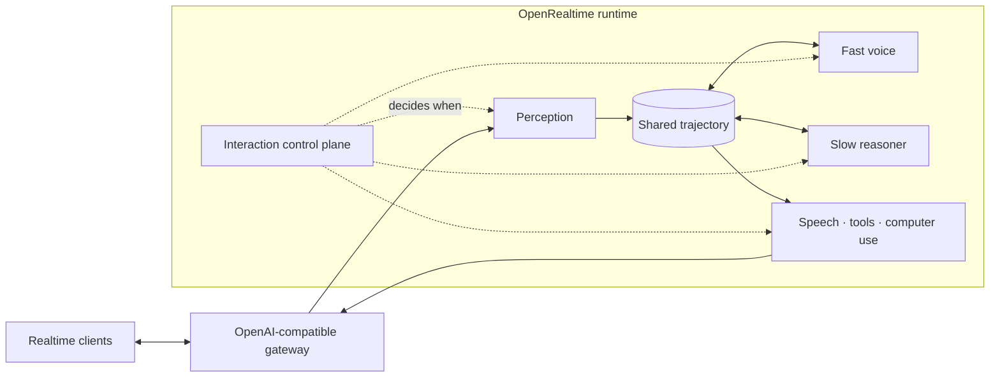

<p align="center">
  <picture>
    <source media="(prefers-color-scheme: dark)" srcset="assets/brand/openrealtime-mark-reverse.svg">
    <source media="(prefers-color-scheme: light)" srcset="assets/brand/openrealtime-mark.svg">
    
  </picture>
</p>

<h1 align="center">OpenRealtime</h1>

<p align="center">
  <strong>The open runtime for AI that listens, speaks, sees, reasons, and acts.</strong>
</p>

<p align="center">
  OpenAI Realtime-compatible at the edge. Composable all the way down.
  Run it locally, bring your own models, or connect the providers you already use.
</p>

<p align="center">
  <a href="docs/quickstart.md"><strong>Get started</strong></a>
  · <a href="docs/README.md">Documentation</a>
  · <a href="docs/protocol/openrealtime-1.md">Protocol</a>
  · <a href="examples/README.md">Examples</a>
</p>

<p align="center">
  <a href="https://github.com/bojieli/OpenRealtime/actions/workflows/ci.yml"></a>
  <a href="LICENSE"></a>
  <a href="go.mod"></a>
  <a href="docs/protocol/openrealtime-1.md"></a>
</p>

---

Most realtime AI systems make you choose between a closed voice stack and a
pile of components you have to orchestrate yourself. OpenRealtime gives you a
third option: one inspectable runtime, one Realtime API, and complete freedom
behind the endpoint.

- **Keep your clients.** Official OpenAI Realtime clients connect unchanged;
  WebSocket and WebRTC compatibility are exercised in CI.
- **Choose the whole stack.** Compose local or hosted speech recognition,
  language models, speech synthesis, speech-to-speech models, and policy
  models without changing the client protocol.
- **Respond now, reason in parallel.** A fast foreground keeps the
  conversation moving while a separate reasoner works over the same trajectory
  and uses tools.
- **Go beyond voice.** OpenRealtime Protocol v1 adds live video, observations,
  and bounded computer use as a backward-compatible extension.
- **See what is real.** Wire events are validated, architectures are versioned,
  effects are audited, and performance claims are tied to reproducible
  evidence.

Use it to build meeting copilots that keep working while people talk, support
agents that can consult tools without freezing the conversation, screen-aware
assistants with bounded action authority, or a realtime research platform where
one model can be replaced without rebuilding the product around it.

## Start in five minutes

The fastest live-turn-verified path uses Gemini for the realtime voice and
background reasoner. It needs Go 1.25+ and an API key:

```bash
git clone https://github.com/bojieli/OpenRealtime.git
cd OpenRealtime
go build -o openrealtime ./cmd/openrealtime

export GEMINI_API_KEY="your-key"
./openrealtime companion -- \
  -binding upstream \
  -upstream-provider google \
  -slow-provider google
```

`companion` starts the Realtime server, its WebRTC adapter, and the standalone
browser client. It then opens `http://127.0.0.1:8767`. Allow microphone access
and start talking.

Already running local models? The default `cascade` binding connects a
recogniser, an LLM, and a speech synthesiser on your machine:

```bash
./openrealtime companion
```

The default background reasoner remains Gemini; the local guide shows how to
bring that role onto your machine too. Every service and model choice is
explicit—there are no bundled weights or hidden downloads. Follow the
[local stack guide](docs/guides/local-stack.md) for endpoints, all-local
reasoning, and voice + vision setup, or use the [full
quickstart](docs/quickstart.md) for provider alternatives and connection checks.

## One protocol, many architectures

The API boundary stays stable while the runtime behind it changes. Use a
classic cascade, a speech-to-speech model, a native duplex model, a remote
Realtime endpoint, or your own sidecar.

| Binding | Voice path | Reach for it when… |
| --- | --- | --- |
| [`cascade`](docs/bindings/cascade.md) | ASR → LLM → TTS | you want every model and interaction policy under your control |
| [`upstream`](docs/bindings/upstream.md) | remote Realtime endpoint | you want the shortest path to a hosted voice stack or have no GPU |
| [`omni`](docs/bindings/omni.md) | speech-to-speech model | you want native audio generation with an engine-owned floor |
| [`duplex`](docs/bindings/duplex.md) | full-duplex model | the model natively owns concurrent I/O, floor, and interaction |
| `sidecar` | any external runtime | you are integrating a model or stack that does not run in Go |

Bindings are concrete adapters, not permanent model categories. For a durable
deployment, the [architecture catalog](docs/architecture.md) pins ownership,
capabilities, interaction evidence, controllers, and arbitration to an exact
revision.

## A voice with a second brain

OpenRealtime separates the conversational reflex from deliberation. Both read
and extend one canonical trajectory, but their authority is intentionally
different:

> **Fast cognition speaks but is proposal-only by default. Slow cognition can
> reason and use tools, but it never speaks directly.**

The foreground answers the person in front of it. The background reasoner can
keep working, call a tool, and place the result back into the shared
conversation for the voice to present naturally.



That interaction control plane is where turn-taking, preparation, barge-in,
commitment, repair, and fast/slow rollout live. They are named policies that
can be inspected and measured—not prompt folklore hidden inside a model.

## See it. Act on it. Keep it bounded.

OpenRealtime Protocol v1 extends the Realtime session with three events and two
object extensions for video, durable observations, and computer use. A client
that never negotiates the extension sees an ordinary Realtime API.

Computer use is designed around authority, not optimism:

- observed screen text remains untrusted data;
- fast model calls cannot execute by default;
- every effect is constrained to a declared target and coordinate space;
- confirmation requirements are declared by the tool, not guessed by a model;
- committed actions pass through one audited effect boundary.

Read the [protocol specification](docs/protocol/openrealtime-1.md) and
[safety model](docs/safety.md) before enabling effects.

## Compatibility you can verify

“Compatible” is a testable claim here:

- every client and server event is checked against a pinned schema in every
  session by default;
- the published `@openai/agents-realtime` SDK completes a tool-using session
  over WebSocket and WebRTC in the release gate;
- protocol extensions are negotiated and never leak into a base-only session;
- the stable Go component contract lives at `api/v1`;
- release binaries are reproducible and report their source revision.

See the [compatibility report](docs/openai-realtime-compatibility.md),
[stable API contract](docs/api-v1.md), and [release validation
matrix](docs/release-validation.md).

## Built to be measured

OpenRealtime ships the harness used to evaluate it. Benchmark cells record the
architecture, models, prompts, configuration, executable identity, timing, and
negative results. Support claims and comparative claims are kept separate: a
configuration can be production-capable without pretending it has already won
a benchmark.

```bash
./openrealtime bench realtime-cu -out results/realtime-cu.json
```

Start with the [benchmark guide](docs/benchmarks.md). The longer
[measurement record](docs/measurement.md) is deliberately preserved as a
research log, not presented as onboarding documentation.

## Find your path

| I want to… | Start here |
| --- | --- |
| run my first conversation | [Quickstart](docs/quickstart.md) |
| use local or hosted models | [Providers](docs/providers.md) · [Local stack](docs/guides/local-stack.md) |
| understand the runtime | [Architecture](docs/architecture.md) · [Bindings](docs/bindings/README.md) |
| connect a client | [Transports](docs/transports.md) · [Official SDK example](examples/sdk-client/README.md) |
| add a model integration | [Component API v1](docs/api-v1.md) · [Sidecar protocol](docs/sidecar-protocol-1.md) |
| deploy safely | [Operations](docs/operations.md) · [Deployment](deploy/README.md) · [Security](SECURITY.md) |
| build a multimodal agent | [Protocol v1](docs/protocol/openrealtime-1.md) · [macOS client](macos/README.md) |
| understand the evidence | [Benchmarks](docs/benchmarks.md) · [Measurement](docs/measurement.md) |

The [documentation home](docs/README.md) separates guides, current reference,
evidence, proposals, and historical design records so you always know what kind
of document you are reading.

## Join the project

OpenRealtime is Apache 2.0 software, built in the open. Contributions are
welcome across the runtime, model adapters, clients, benchmarks, documentation,
and examples.

Before opening a pull request, read [CONTRIBUTING.md](CONTRIBUTING.md). Please
use [GitHub Security Advisories](SECURITY.md) for vulnerabilities and follow
the [Code of Conduct](CODE_OF_CONDUCT.md) in project spaces.

Current release: **v1.0.0**. See the [changelog](CHANGELOG.md) for shipped and
unreleased work.

## License

Apache License 2.0. See [LICENSE](LICENSE) and the third-party provenance in
[LICENSES.md](LICENSES.md).
