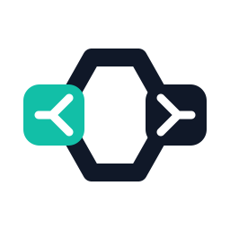
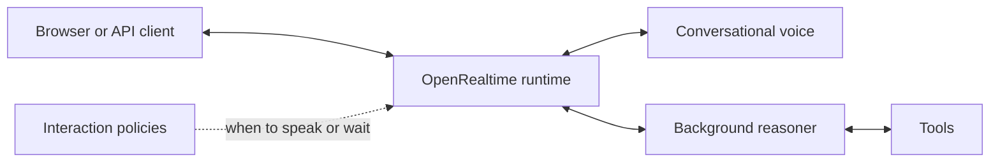

<p align="center">
  <picture>
    <source media="(prefers-color-scheme: dark)" srcset="assets/brand/openrealtime-mark-reverse.svg">
    <source media="(prefers-color-scheme: light)" srcset="assets/brand/openrealtime-mark.svg">
    
  </picture>
</p>

<h1 align="center">OpenRealtime</h1>

<p align="center">
  <strong>Realtime AI that keeps talking while it works.</strong>
</p>

<p align="center">
  An open-source runtime for voice and multimodal agents.
  Choose local or hosted models and connect through an OpenAI Realtime-compatible API.
</p>

<p align="center">
  <a href="docs/quickstart.md"><strong>Get started</strong></a>
  · <a href="docs/demos.md">Demos</a>
  · <a href="docs/README.md">Documentation</a>
  · <a href="docs/protocol/openrealtime-1.md">Protocol</a>
  · <a href="examples/README.md">Examples</a>
</p>

<p align="center">
  <a href="https://github.com/bojieli/OpenRealtime/actions/workflows/ci.yml"></a>
  <a href="LICENSE"></a>
  <a href="go.mod"></a>
  <a href="docs/protocol/openrealtime-1.md"></a>
</p>

---

> **Demo videos coming soon — 12 realtime scenarios.**
> Planned featured clip: interrupt the assistant, then hear it pick up where
> it was cut off. [Explore the demo gallery](docs/demos.md) for live translation,
> screen awareness, acknowledgements, and knowing when to stay quiet.

OpenRealtime brings conversation, background reasoning, and model integrations
into one inspectable runtime. Use it to build voice assistants, meeting
copilots, or agents that respond to changing screens.

- **Keep the conversation moving.** Pair a conversational voice with a
  background reasoner that can use tools and return results for the voice to
  present. Interaction policies decide when to speak, wait, or interrupt.
- **Choose your models.** Combine speech recognition, language models, and
  speech synthesis, or connect a speech-to-speech model or hosted Realtime
  endpoint. Model services can run locally or remotely.
- **Build on a familiar API.** The official `@openai/agents-realtime` SDK is
  tested over WebSocket and WebRTC. Negotiated OpenRealtime extensions add
  video, observations, and bounded computer use.

## Run your first conversation

The conference room uses the project’s twelve-scenario pipeline. It needs
**Linux, Go 1.25+, Git, a Chromium-based browser, Deepgram and Gemini
credentials**, and the local services listed in
[Conversation room](docs/room.md). The Linux bound is the room's, not the
project's: the room freezes a launch profile and reads it back through a
hardened open implemented for Linux only. macOS runs an explicitly composed
cascade instead — see [Use local models](docs/guides/local-stack.md).

```bash
git clone https://github.com/bojieli/OpenRealtime.git
cd OpenRealtime
go build -o openrealtime ./cmd/openrealtime

export GEMINI_API_KEY="your-key"
export DEEPGRAM_API_KEY="your-key"
./openrealtime companion
```

The command starts the server and browser client, then opens
`http://127.0.0.1:8767`. Allow microphone access, connect, and ask a question.
Keep the terminal running; press **Ctrl+C** to stop.

For a first interaction, ask the assistant to explain a topic, then interrupt
with a shorter follow-up. Listen for when it stops and how it responds. This
checks the configured conversation path; the [12 demo scenarios](docs/demos.md)
will include their own configurations and reproduction instructions.

See the [quickstart](docs/quickstart.md) for expected output, troubleshooting,
and other hosted providers. To connect your own application, start with the
[SDK tool-use walkthrough](examples/sdk-client/README.md).

### Use local models

OpenRealtime connects to model servers you run; it does not bundle weights or
start those services automatically. The default cascade uses local speech
recognition, a local language model, and local speech synthesis, with Gemini
as the background reasoner. The [local stack guide](docs/guides/local-stack.md)
explains the endpoints and how to make the reasoner local too.

## How it works

A session shares conversation history across perception, reasoning, and action.
Interaction policies decide when work should run and when output can reach the
user. In the default voice arrangement, the foreground speaks and the
background reasoner returns information and tool results for it to present.



Choose an adapter for the voice path:

| Binding | Voice path | Use it when |
| --- | --- | --- |
| [`upstream`](docs/bindings/upstream.md) | hosted Realtime endpoint | you want a first conversation without local model services |
| [`cascade`](docs/bindings/cascade.md) | speech recognition → language model → speech synthesis | you want to select each component |
| [`omni`](docs/bindings/omni.md) | speech-to-speech model | you want native audio generation with runtime turn control |
| [`duplex`](docs/bindings/duplex.md) | model with concurrent audio input and output | you want the model's native interaction and turn control |

The graph runtime supports additional compositions, including alternative
speech roles and silent computer use. See [Architecture](docs/architecture.md)
for the relationship between graphs and the existing binding launch paths,
including work still in progress.

## Compatibility and current scope

OpenRealtime implements a **tested subset** of the OpenAI Realtime API.
Compatibility checks cover schema validation and tool-using sessions with the
published SDK on both transports. Some events and session settings are
unsupported; see the [compatibility reference](docs/openai-realtime-compatibility.md)
before migrating an application.

Video and computer use require a capable deployment and explicit extension
negotiation. The hosted `upstream` binding does not expose those capabilities.
Actions also require declared tools, targets, and authority; see the
[protocol](docs/protocol/openrealtime-1.md) and [safety model](docs/safety.md).

The source version is recorded in [VERSION](VERSION). Run
`./openrealtime version` to identify a built binary. The
[changelog](CHANGELOG.md) records changes, and the
[release validation matrix](docs/release-validation.md) describes the checks
behind release claims.

## Documentation

| Goal | Start here |
| --- | --- |
| Try a conversation | [Quickstart](docs/quickstart.md) · [Demo gallery](docs/demos.md) |
| Select models | [Providers](docs/providers.md) · [Local setup](docs/guides/local-stack.md) |
| Connect an application | [SDK example](examples/sdk-client/README.md) · [Transports](docs/transports.md) |
| Understand or extend the runtime | [Architecture](docs/architecture.md) · [Component API](docs/api-v1.md) · [Sidecars](docs/sidecars.md) |
| Deploy | [Deployment](deploy/README.md) · [Operations](docs/operations.md) |
| Explore the research | [Research overview](docs/research.md) · [Benchmarks](docs/benchmarks.md) |

The [documentation index](docs/README.md) links to the full reference,
application guides, and design records.

## Contribute

Useful contributions include model adapters, runnable examples, interaction
bug reports, and improvements to setup and error messages. See
[CONTRIBUTING.md](CONTRIBUTING.md) for starter tasks, development checks, and
the pull request workflow.

Follow the [Code of Conduct](CODE_OF_CONDUCT.md) in project spaces. Report
vulnerabilities through the private process in [SECURITY.md](SECURITY.md).

## License

Software is licensed under [Apache 2.0](LICENSE); documentation is CC BY 4.0.
See [LICENSES.md](LICENSES.md) for original fixtures, third-party provenance,
and license exceptions. Model weights and external services have their own
licenses and terms.
