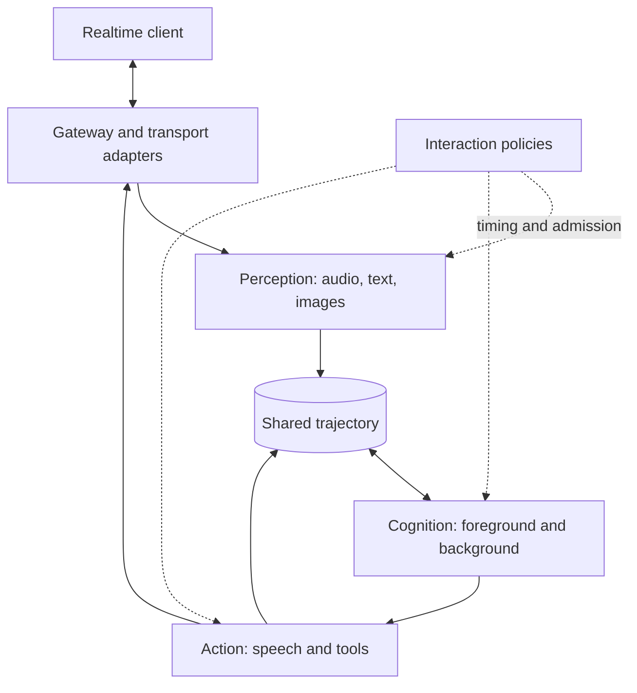

# Architecture

OpenRealtime coordinates perception, model generation, conversation timing,
and actions within a session. Its public boundary is a Realtime-compatible
API; the model stack behind that boundary can change independently.

Read [Core concepts](concepts.md) for terminology. This page explains the
runtime's main responsibilities, its two assembly paths, and the extension
points. For startup commands, use the [quickstart](quickstart.md).

## Graph composition

The typed graph runtime composes processing elements through declared input and
output ports. It runs the Scenario Conversation, Meeting Assistant,
Realtime-CU, adaptive-video, and conversational/external-model reference
compositions. The [implementation tracker](composable-agent-graph.md#living-implementation-tracker)
records remaining launch, authoring, and lifecycle work.

Graph configuration separates four concerns:

| Artifact | Purpose |
| --- | --- |
| `.ortg` topology and descriptor lock | Define connected elements and pin their contracts. |
| Values | Configure the selected elements. |
| Deployment and service declarations | Select implementations and dependencies. |
| Launch profile | Select the application and prepared composition to mount. |

The compiler produces immutable Graph IR. Preparation validates the selected
configuration and dependencies before resources are acquired. Inspection
identifies the prepared plan and live component implementations. See
[Graph assembly](graph-native-assembly.md) for commands and current limits.

Speech is a graph connection, not a fixed property of a cognition role. The
[fast-only](../graphs/components/conversational-fast-only/agent.ortg),
[slow-only](../graphs/components/conversational-slow-only/agent.ortg), and
[both-speaking](../graphs/components/conversational-both/agent.ortg) reference
graphs connect speech differently. Text/file cognition and
[silent computer use](realtime-computer-use-graph.md) can omit speech.

Every composition still needs explicit history, cancellation, bounded queues,
and action authority. Connecting a model to an action path does not by itself
authorize an external effect.

## Existing binding-based voice configurations

The default CLI and explicit `-binding` paths still use the earlier voice
assembly. Their foreground/background roles, event loop, and policy defaults
are described below. These defaults do not restrict arbitrary graph
compositions.



## Perception and action are duals

Perception converts continuous input into observations the session can use.
Recognition may revise a transcript as more audio arrives; visual gating
selects frames worth processing. Accepted observations enter the trajectory.

Cognition reads a valid history prefix and proposes new content or tool calls.
Action checks that output is still valid and authorized, then emits it. Speech
is paced for playback; tools pass through confirmation and target checks.
This separates generating a result from committing it to the outside world.

## Interaction in the binding reference

Interaction policies decide **when** work happens. They use evidence such as
speech activity, silence, transcript revisions, conversation state, and tool
results. A deployment can use rules, an external policy model, or a model's
native interaction capabilities.

| Policy | Decision | Reference default |
| --- | --- | --- |
| Trigger | When to reconsider the input | 200 ms cadence |
| Preparation | Whether to generate speculatively before endpoint | Off; enable with `-preparation continuous` |
| Rollout | Which cognition roles to run | Foreground followed by background on an observation |
| Floor | When the utterance ends | Engine, 500 ms acoustic silence; projection may extend the turn |
| Barge-in | Whether overlapping user speech cancels output | Immediate |
| Commitment | When generated output can be emitted | At complete safe points |
| Repair | How to address already-heard output invalidated by later input | Record an obligation for an audible correction |
| Backchannel | Whether to acknowledge while listening | Off |
| Turn projection | Whether to anticipate or hold an endpoint | Silence-based unless configured |
| Deferral | Whether accepted work can run now | Based on user and assistant speaking state |
| Overlap | How to classify speech during assistant output | Unclassified unless configured |

Preparation can reduce waiting time by starting work while the user speaks.
Its results remain private until the committed observation matches; otherwise
they are discarded. It increases provider work and may save no latency when
input changes frequently.

`stable-partial` observation policy permits early admission of a provider's
stable transcript prefix. It must be paired with a compatible deferral policy;
waiting for final silence would defeat the early-admission behavior. The
runtime rejects conflicting selections.

For the related timing settings, see
[Operations](operations.md#the-silence-thresholds-and-how-they-compose).

## The session core

The binding-based session has three shared structures:

| Structure | Responsibility |
| --- | --- |
| Trajectory | Append-only typed history, causal relationships, and revisions |
| Event loop | Order commits, defer work when needed, and wake deferred work |
| Duplex state | Track whether the user and assistant are audibly speaking |

Providers generate from a particular trajectory version. Commit checks that
version rather than accepting a stale result against a changed conversation.
The history distinguishes observations, assistant content, background state,
non-executable tool proposals, executable calls, and results.

Accepted work may wait while speech is playing or another condition holds.
Every deferral needs a wake-up, including playback completion and tool-result
arrival. Otherwise a quiet session could leave committed work unprocessed.

Assistant-speaking state refers to playback, not merely generation or queued
audio. The [spoken boundary](spoken-boundary.md) explains how an interruption
splits an utterance into heard and pending words. In Scenario Conversation,
playback receipts are committed and published before the turn is released, so
a following explicit response can read the updated history.

## Cognition roles and boundaries

The default voice arrangement uses two cognition roles over the same history:

- **Foreground:** produces speech. Tool requests are proposals by default.
- **Background:** reasons and uses authorized tools. Its results enter the
  history as background state for the foreground to present.

The reference `fast+slow` rollout schedules background reasoning on an
observation; it does not require the foreground to request escalation first.
A background call with nothing to add can return silently. Separate
`fast-only` and `endpointed-slow-only` rollouts support other arrangements.

The distinction between background state and spoken content matters after an
interruption: writing a result does not mean the user heard it. Providers see
that distinction in their context. It helps maintain continuity but does not
guarantee that model-generated answers will never repeat or contradict.

The optional `voice+vision` profile adds a silent visual reflex. It receives a
compact task, recent images, and a filtered set of direct-action tools. It
returns `act`, `wait`, or `abstain` under a deadline. Timeout or malformed output
falls back to the normal slow path. The older `-fast-computer-use` option opens
a similarly bounded lane on the voice model.

Both lanes require independent execution authority. Exact tool filtering,
confirmation, target checks, and the action ledger apply to local and
client-executed effects. General business tools and multi-step work remain in
the background role. See [Safety](safety.md) for the full contract.

## Bindings compose ownership and capabilities

A binding reports both what a stack **can do** and which component **owns a
role** in the selected configuration. A model can support native interaction
while a particular deployment selects engine interaction instead.

| Preset | Perception | Foreground | Background | Action | Interaction | Floor |
| --- | --- | --- | --- | --- | --- | --- |
| `cascade` | engine | engine | engine | engine | engine | engine |
| `omni` | model | model | engine | model | engine | engine |
| `omni+text-policy` | model | model | engine | model | engine | engine |
| `duplex` | model | model | engine | model | model | model |
| `upstream` | remote | remote | engine | remote | remote | remote or engine |

Action ownership in this table describes the voice adapter; it does not grant
unrestricted tool execution. Background reasoning remains engine-managed in
these presets. General graph compositions select their own connections.

Capabilities include transcription, audio input/output, explicit turn
generation, concurrent I/O, native floor, native interaction, typed interaction
acts, and text injection. `sidecarbinding.Spec` supports combinations beyond
the named presets. See [Bindings](bindings/README.md) for selection guidance.

## Architecture definitions evolve above bindings

The `architecture` catalog pins structural choices as `id@revision`, such as
`cascade.controlled@3`. A definition records ownership, required capabilities,
selected interaction evidence, controllers, arbitration, and lineage.
Provider flags separately select model endpoints and credentials.

```bash
openrealtime architectures list
openrealtime architectures show cascade.controlled@3
```

A changed definition requires a new revision. After provider negotiation, the
runtime checks live capabilities and selected policies against the definition.
Inspection reports its fingerprint so an experiment can identify what ran.

Controller composition must name an arbitration rule. For example,
`cascade.composed-policy@1` uses `predicate-floor`: predicates retain endpoint
and overlap decisions, while a text policy handles the other acts. Installing
two controllers alone does not define which one decides.

Interaction evidence is also explicit: transcript, acoustic activity, silence,
conversation/tool state, speaker identity, addressing, visual descriptions,
direct pixels, and native model state are separate channels. Extra selected
evidence changes the architecture being measured. See
[Architecture experiments](architecture-experiments.md) for the comparisons.

## Where things live

| Package | Responsibility |
| --- | --- |
| `graph`, `elements`, `graphs` | Graph execution, element implementations, application compositions |
| `trajectory` | Shared history and causal invariants |
| `eventloop`, `session` | Binding session scheduling, duplex state, and media storage |
| `perception` | Observers, gates, and narrators |
| `continuation`, `cognition` | Provider generation and cognition roles |
| `interaction` | Timing and admission policies |
| `action`, `computeruse` | Speech pacing, tools, targets, and effect checks |
| `binding` | Voice adapter contracts and implementations |
| `gateway` | Protocol sessions and event rendering |
| `protocol/openai`, `protocol/openrealtime` | Base schema validation and negotiated extensions |
| `sidecar` | External model process protocols |
| `transport/webrtc` | WebRTC-to-protocol adaptation |
| `presentation`, `macos` | Browser presentation host and native client |

## Extension points

Use [API v1](api-v1.md) for stable Go provider contracts and
[Sidecars](sidecars.md) for external models. Versions 1–3 serve binding-based
audio integrations; v4 serves graph-native elements. The documented `Binding`,
`Observer`, `Narrator`, `Vision`, `Decider`, and `computeruse.Surface` interfaces
provide additional extension points.

Start graph development with [assembly](graph-native-assembly.md), then consult
the [design and implementation tracker](composable-agent-graph.md) for detailed
element, lifecycle, and configuration contracts.
