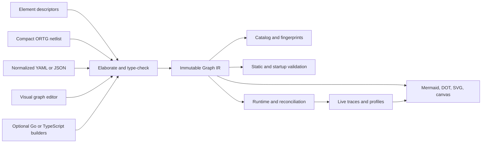

# Composable Real-Time Agent Element Graph

- **Status:** proposed architecture and refactoring plan
- **Scope:** the OpenRealtime runtime, component API, architecture catalog,
  configuration, inspection, and migration path
- **Audience:** runtime authors, element and model-adapter authors, deployment
  authors, benchmark authors, and UI/tooling authors

This document proposes a thorough refactoring of OpenRealtime from a set of
binding-shaped realtime voice architectures into a typed, inspectable element
graph for general real-time agents. It is intentionally broader than audio. A
graph may observe and act through text, audio, cameras, screen or computer-use
video, still images, files, tool streams, user-interface state, and future
modalities without changing the kernel's model taxonomy.

The proposal preserves the strongest parts of the existing system: protocol
compatibility, the canonical trajectory, safe-point commits, asynchronous
event handling, interaction policies, duplex evidence, explicit authority,
the irreversibility ledger, sidecar isolation, provider adapters, and the
measurement discipline. It changes how those parts are assembled.

This is a design proposal, not a description of behavior already implemented.
Existing APIs and configurations remain authoritative until the migration
stages in this document are completed.

## Executive summary

The central decision is:

> Make a small ClickNP/Verilog-inspired element-netlist language (`.ortg`) the
> default hand-authored topology format; type-check it against
> machine-readable element descriptors into an immutable Graph IR; and
> execute, validate, visualize, version, and reconcile that IR. Normalized
> YAML/JSON, visual editing, and optional code builders elaborate through the
> same compiler.

The design borrows the useful semantic ideas of Click Modular Router and
ClickNP—small stateful elements, multiple ports, explicit channels, bounded
depth, explicit `Tee` and `Mux`, reusable groups, and a separate management
plane. Its default syntax adopts the concise node-and-edge feel of ClickNP and
Verilog without copying ClickNP's fixed data type, positional assumptions, or
combined element-configuration language. It borrows from n8n the visual
workflow and per-node execution-inspection experience. It borrows from
DeepSeek Harness (`dsh`) and Cordis the plugin discipline, reactive dependency
management, reversible lifecycle effects, and safe dynamic composition.

The result is not a fixed ASR-to-LLM-to-TTS pipeline and not a prescribed
fast/slow architecture. A model, policy, context engine, codec, timer, state
store, authority check, media adapter, or ordinary computation is an element
with typed ports. A reusable policy is an element or a typed subgraph. “Fast,”
“slow,” “foreground,” “background,” “reasoning,” “non-reasoning,” “Omni,” and
“interactive” describe selected deployments or capabilities; they are not
kernel element species.

In particular:

- real-time behavior is achieved by explicit triggers, bounded channels,
  concurrency, deadlines, interruption, and interaction policy; it does not
  require one full-duplex end-to-end model;
- a full-duplex or speech-to-speech model is nevertheless a valid element and
  can run under native interaction, external interaction, or a composition of
  controllers;
- interaction policy is first-class because deciding *whether and when* to
  listen, speak, wait, interrupt, act silently, or yield is independent of the
  model that generates content;
- observation and action spaces are formal typed port signatures, including
  their temporal protocols, rather than lists of modality strings;
- trigger conditions are visible as connections to trigger ports; context
  arriving on a state port need not invoke a model;
- latency and price are evidence profiles attached to an exact element,
  configuration, hardware, and load condition, not promises encoded as port
  types;
- an output may have only one channel unless an explicit `Tee` copies it, and
  an input may have only one writer unless an explicit `Mux`, `Merge`, mixer,
  or arbiter defines how writers combine;
- a slow or deliberative model may feed context, TTS, native audio, tools, a
  feedback loop, or several of those through a `Tee`; no mandatory
  slow-to-fast handoff exists;
- configuration, topology, deployment placement, empirical profiles, and
  secrets remain separate concerns;
- Mermaid is an export format, not the semantic source of truth;
- the compiler and inspector make omitted interrupt, failure, timeout,
  authority, and output paths visible without dictating which valid choice a
  developer must make.

The design flow is:



This diagram describes the toolchain rather than an agent topology. Agent
diagrams are generated from their Graph IR.

## 1. Problem statement

OpenRealtime already supports several important arrangements: componentized
ASR/LLM/TTS, speech-to-speech sidecars, external and native interaction,
background reasoning, visual observation, a bounded visual reflex, computer
use, and upstream Realtime endpoints. The existing abstractions made those
arrangements possible, but topology is still distributed across constructors,
large binding runtimes, architecture ownership vectors, command-line flags,
and prose invariants.

The consequences are structural:

1. Adding a new composition often means adding a binding branch or editing a
   large runtime rather than connecting existing parts.
2. The architecture catalog currently derives one of a few provider
   topologies and requires audio input, audio output, and turn generation. It
   cannot naturally identify a text-and-files agent, a silent visual actor, or
   an agent whose speech and computer-use paths use different cognition and
   interaction policies.
3. “Slow cognition is always the engine's” and “slow cannot speak” are enforced
   as global assumptions even though they are only choices of the current
   reference architecture.
4. The statement that interaction “carries no data” usefully separates content
   generation from control, but it hides the fact that interaction decisions,
   interrupts, deadlines, and acknowledgements must themselves travel through
   explicit, inspectable, typed control channels.
5. Configuration is a flattened view of a very large flag set. It records
   settings but cannot declare arbitrary topology, per-edge queueing, or a new
   reusable policy graph.
6. Capabilities are represented mainly as broad booleans and ownership
   columns. Those fields do not express the complete observation space,
   action space, temporal protocol, trigger relation, state, or effect
   authority of an arbitrary component.
7. Timing is partly embedded in control flow. It is difficult to inspect which
   event wakes which model, how a completed slow result reaches output, which
   work a barge-in cancels, or how channel depth contributes to latency.
8. The visual shape of a running architecture must be reconstructed from code
   and status fields. There is no single graph that can be type-checked,
   rendered, diffed, replayed, and observed live.

The refactoring must solve these problems without discarding the safety and
correctness properties already earned by the project.

## 2. Scope and non-goals

### 2.1 In scope

The element graph must represent agents using any combination of:

- typed user and system text, including partial and revised text;
- microphone or other continuous audio;
- synthesized, model-native, recorded, or mixed audio output;
- physical-camera video;
- screen, browser, virtual-display, mobile-device, and computer-use video;
- still images attached to a turn or generated by a tool;
- files and multimodal attachments represented by durable handles and typed
  metadata rather than copied blindly through every channel;
- model-native latent or interaction state where a provider exposes only an
  opaque capability boundary;
- tool calls, tool results, jobs, timers, schedules, and environmental events;
- computer, browser, device, API, and message actions;
- streaming, non-streaming, revising, stateful, request/reply, and segmented
  protocols;
- model and non-model computation;
- local, sidecar, remote, and distributed elements.

### 2.2 Non-goals

This proposal does not:

- select one universally best agent graph;
- require every model to support every modality;
- equate real-time with audio, streaming tokens, or full duplex;
- make latency statically provable through the graph type system;
- automatically insert semantic adapters whose choice changes behavior;
- make irreversible real-world actions reversible;
- replace the OpenRealtime/OpenAI-compatible wire protocol with the internal
  graph protocol;
- require live topology editing in the first migration stage;
- expose model-private reasoning text to other elements unless a provider
  explicitly offers a safe, typed output for it;
- remove named reference architectures or benchmark identities; it makes
  those identities graph-based rather than binding-species-based.

## 3. What “real-time agent” means

Real-time is a relationship between an observation, a decision opportunity,
and a deadline after which an action is stale or disruptive. It is not a model
family.

Examples include:

- starting an answer soon enough to preserve conversational rhythm;
- deciding that no answer is appropriate while someone else is speaking;
- cancelling or redirecting speech when the user corrects the premise;
- clicking a transient interface control before it disappears;
- warning about a camera event before it is no longer actionable;
- incorporating a tool result without waiting for another user turn;
- updating a text UI incrementally while a deeper answer continues;
- declining to act because evidence or authority did not arrive before a
  deadline.

A componentized system can meet these requirements. For example, audio input,
ASR, an interaction model, a small response model, TTS, and a background
reasoner can all run concurrently on bounded channels. The agent can continue
observing while audio is playing, and an external interaction policy can
cancel or defer output. None of those properties requires the content model
itself to be full duplex.

A full-duplex multimodal model can reduce boundaries and preserve native
audio information, so it remains an important option. It does not remove the
need for explicit authority, tool execution, audit, state, background work,
external policies, or measured latency. The graph must let a developer select
native interaction, external interaction, or a deliberate composition over
the same foreground model.

## 4. Design principles

### 4.1 Composition, not taxonomy

The kernel knows elements, ports, channels, state, lifecycle, and effects. It
does not switch on names such as `cascade`, `omni`, `duplex`, `fast`, or
`slow`. Those remain library graphs, deployment roles, or evidence labels.

### 4.2 Observation and action spaces are typed

An element's input ports form its observation space. Its output ports form its
action space. The types include temporal protocol and provenance, not only a
modality label. A graph's external ports define the observation and action
spaces of the composite graph.

### 4.3 Triggering is explicit

Receiving context and being invoked are different operations. Trigger,
interrupt, deadline, and acknowledgement ports make activation and
cancellation paths visible. An element may also declare that a stream port is
intrinsically reactive, but that fact remains in its contract.

### 4.4 Timing is operational evidence

Queue depth, delivery mode, deadlines, and trigger relations are graph
semantics. Provider latency, cancellation latency, throughput, and cost are
empirical profiles. Static checks may reject an impossible hard contract or
warn about an unsupported SLO, but must not present a measured distribution as
a type-level guarantee.

### 4.5 No implicit branching or merging

Fan-out requires `Tee`. Multiple writers require a `Mux`, `Merge`, `Join`,
mixer, arbiter, or another element with defined semantics. The graph never
silently copies, interleaves, or chooses outputs.

### 4.6 Policy is ordinary computation

An interaction policy, endpoint detector, rollout selector, commitment rule,
tool policy, computer-use arbiter, or latency race is an element or subgraph.
It can be implemented by rules, code, a small model, a native model head, or a
composition. “Policy” conveys purpose, not a privileged runtime mechanism.

### 4.7 Choices must be visible, not prescribed

The compiler enforces mechanical correctness. Lint profiles expose omitted
design obligations. They do not require slow output to pass through fast
cognition, require a particular barge-in behavior, or prevent a deliberative
model from speaking. An intentional omission is represented by an explicit
`Ignore`, `Drop`, `Reject`, or terminal sink.

### 4.8 One semantic representation

The default `.ortg` source, normalized YAML/JSON, a visual editor, and optional
code builders elaborate the same Graph IR through one type checker. Runtime
execution, rendering, architecture fingerprints, validation, traces, and
benchmarks use that IR. Mermaid and DOT are generated views and cannot drift
into competing definitions.

### 4.9 Configuration is owned locally

Each element owns a typed configuration schema. The graph connects instances.
Deployment config selects implementations and resources. Performance profiles
record evidence. Secrets are resolved at mount time and never enter graph
fingerprints or exported diagrams.

### 4.10 Lifecycle is compositional

Elements declare dependencies and acquire resources inside a scoped lifecycle.
Removing or replacing an element cancels work and reverses its runtime
registrations. Real-world effects that already crossed the action boundary are
recorded and repaired where possible, never described as reversible.

### 4.11 Compatibility remains a boundary

The gateway continues to translate external protocol events into internal
typed messages and typed graph output into protocol events. External protocol
compatibility must not constrain every internal element to wire-level event
shapes.

## 5. Foundations and related work

### 5.1 Click Modular Router and ClickNP

Click's durable contribution is the element graph: small modules with ports,
explicit wiring, reusable compound elements, and connector elements whose
semantics are visible. ClickNP extends the idea to a hardware-oriented data
plane with persistent element state, a data handler, a signal handler, bounded
channels, host control, and graph-level port counts.

OpenClickNP's topology makes several useful choices:

- `A -> B` is lossless and backpressures the producer when the channel is
  full;
- `A => B` is lossy and drops when the channel is full;
- source and destination ports can be addressed explicitly;
- channel depth can be overridden in topology;
- a `Tee` performs one-to-many copying;
- a `Mux` performs many-to-one arbitration;
- reusable element groups encapsulate subgraphs.

OpenRealtime should adopt those semantics and the source language's compact
netlist style where they fit, but not the language wholesale. ClickNP's fixed
flit type, positional conventions, and element configuration model do not fit
a general agent. OpenRealtime messages require strict payload and
temporal-protocol types, richer lifecycle, run correlation, cancellation,
authority, and empirically measured timing.

### 5.2 Verilog-style elaboration

Verilog source describes modules, ports, and nets, then an elaborator produces
the concrete design. The useful lesson is not to reproduce Verilog syntax; it
is that graph construction must be pure and separate from execution. No
OpenRealtime frontend may start goroutines, load models, open devices, or dial
services. It produces an immutable graph definition that is validated before
mounting.

### 5.3 n8n and visual workflow systems

n8n demonstrates discoverable node configuration, visual branching, explicit
switch and merge nodes, reusable sub-workflows, and per-node execution
inspection. Those affordances are valuable. A production realtime-agent graph
additionally requires strict pre-mount port types, temporal protocols, bounded
queue semantics, causal identities, cancellation, effect authority, clock
domains, safe feedback, and latency evidence.

### 5.4 DeepSeek Harness and Cordis

DeepSeek Harness (`dsh`) uses an everything-is-a-plugin architecture powered
by Cordis. The Cordis paper, *A Programming Paradigm for Spatiotemporal
Composability*, separates two concerns:

- **spatial composability:** components declare dependencies and react to
  dependencies appearing, disappearing, or changing;
- **temporal composability:** a component's tracked runtime effects can be
  unwound when the component is removed.

Cordis models these as reactive coeffects and revertible effects mediated
through a context. OpenRealtime should apply the principles to graph element
lifecycle: declared services activate elements, scoped effects own their
disposers, and graph reconciliation mounts and unmounts components safely.
The data/control graph and the dependency/lifecycle graph are related but not
identical and should be inspectable as separate layers.

## 6. Core terminology

| Term | Meaning |
| --- | --- |
| element | A stateful or stateless computation with typed input and output ports and a lifecycle contract. |
| instance | One named occurrence of an element definition with one configuration. |
| port | A directional, typed endpoint with a temporal protocol and cardinality. |
| channel | A bounded connection from one output port to one input port. |
| observation space | The product of the input-port types visible to an element or composite graph. |
| action space | The tagged product/sum of output-port types an element or composite graph may produce. |
| trigger | An input whose arrival creates a reaction or run rather than merely updating state. |
| interrupt | A run-scoped control message requesting cancellation, preemption, truncation, or another defined transition. |
| reaction | The contract relating a trigger to sampled inputs, state transitions, outputs, and terminal outcomes. |
| policy | An element or subgraph whose outputs select or constrain behavior. |
| subgraph | A graph exported as an element with typed boundary ports. |
| capability | Something an implementation can support, independent of whether a graph selects it. |
| Graph IR | The immutable, language-neutral, fully elaborated graph consumed by the runtime and tooling. |
| profile | Versioned empirical evidence about timing, capacity, reliability, or cost under stated conditions. |

## 7. Formal element contract

An element definition is modeled as:

$$
E = (\mathcal{O}, \mathcal{A}, \mathcal{R}, S, D, F, Q)
$$

where:

- \(\mathcal{O}\) is the typed observation space: input ports and their
  protocols;
- \(\mathcal{A}\) is the typed action space: output ports and their protocols;
- \(\mathcal{R}\) is the reaction relation: triggering inputs, state sampled
  atomically for each trigger, concurrency, interruption, and terminal
  outcomes;
- \(S\) is persistent internal state together with snapshot, compatibility,
  and optional migration schemas;
- \(D\) is the dependency or coeffect declaration: services, devices,
  providers, clocks, secrets, schemas, and authority the element requires;
- \(F\) is the effect declaration: registrations and resources that must be
  disposed, plus any external effect authority the element may request;
- \(Q\) is a set of empirical profiles keyed by exact implementation,
  configuration, placement, hardware, load, and measurement revision.

Models are not a separate formal category. A model element typically has a
larger \(\mathcal{O}\), a probabilistic \(\mathcal{A}\), and profiles sensitive
to reasoning configuration. A code context engine, timer, ASR adapter, media
resampler, or policy has the same contract shape.

### 7.1 Composite contracts

After internal edges are connected, the unbound exported inputs and outputs
form the composite graph's observation and action spaces. Dependencies and
effects are the checked composition of its elements. A subgraph may rename or
intentionally hide internal ports, but it cannot claim an external type or
authority its contents do not supply.

The runtime may estimate a composite performance envelope from channel bounds
and element profiles. That estimate is evidence, not part of type
assignability. The composite must be measured directly before production SLO
claims are made.

## 8. Port and protocol type system

Payload type alone is insufficient. These are different types even when all
carry strings:

```text
Event<UserUtterance>
Stream<TextDelta>
Segmented<TextDelta, RunID>
Revisions<Transcript, RevisionID>
State<ContextSnapshot>
Trigger<GenerateRequest>
Interrupt<RunID>
```

The initial protocol families should be small and explicit:

| Protocol | Semantics |
| --- | --- |
| `Event<T>` | One immutable occurrence, ordered within its channel. |
| `Stream<T>` | An ordered sequence of independently meaningful items. |
| `Segmented<T, K>` | Begin/delta/end or equivalent framed stream correlated by key `K`. |
| `Revisions<T, K>` | Successive replacements or refinements with explicit stability/finality. |
| `State<T>` | Latest-value state sampled by reactions; arrival does not imply a run. |
| `Trigger<T>` | Arrival opens a reaction with a run identity. |
| `Interrupt<K>` | A control request addressed to an active run or scope. |
| `Request<T, K>` / `Reply<T, K>` | Correlated request/reply without hiding the two channels. |

Types should also carry important media and authority distinctions:

- audio sample format, sample rate, channel count, framing, and clock domain;
- image/video encoding, dimensions or negotiated constraints, source, capture
  time, coordinate space, and grounding mode;
- text provenance, participant, stability, language, and visibility where
  semantically required;
- attachment handle, MIME type, content hash, retention scope, and access
  capability;
- tool proposal versus executable call;
- unconfirmed versus authorized action;
- prepared versus committed output;
- private model state versus user-visible content.

Common correlation metadata belongs in runtime envelopes rather than being
redeclared by every payload: session ID, source ID, turn or opportunity ID,
run ID, sequence, capture and receive timestamps, causal parents, trace ID,
and cancellation scope.

### 8.1 Assignability and adapters

All graph frontends use invariant, exact protocol types by default. Graph
source does not repeat those types: the elaborator resolves them from the
versioned element descriptors and reports errors at the relevant node, port,
or edge source location. If an output does not match an input, the developer
inserts an explicit adapter:

- `Resample` changes audio format;
- `Decode` changes media encoding;
- `Stabilize` turns ASR revisions into committed utterance events;
- `Collect` turns a segmented stream into a completed value;
- `Segment` turns completed text into safe speech units;
- `Describe` turns visual frames into text observations;
- `ResolveAttachment` provides bounded access to file contents;
- `Authorize` turns a validated proposal into an authorized action;
- `Commit` moves prepared output across the action boundary.

The compiler may suggest compatible adapters. It must not silently insert one
when the choice changes information, timing, authority, or failure behavior.

### 8.2 Runtime-negotiated types

Some formats and capabilities are known only after a provider or sidecar
handshake. A port then declares a bounded type constraint rather than an
untyped value. Startup resolves the constraint, records the selected concrete
type in the live graph, and refuses incompatible edges before the session is
made available. Negotiation never silently inserts a lossy conversion.

### 8.3 Degrees of composability

The compiler reports one of three outcomes rather than treating every mismatch
as equivalent:

- **directly composable:** output and input protocol types, constraints,
  cardinality, and authority match;
- **adaptably composable:** a registered adapter can bridge the types, but the
  author must select it because it changes representation, timing, stability,
  or authority;
- **not composable:** no sound adapter exists, the protocols conflict, the
  effect authority cannot be supplied, or a required temporal/placement
  contract cannot be met.

Timing SLOs do not change type assignability. A directly typed path may still
be unsuitable for a deadline, which is reported by profile validation.

## 9. Element families

Element families are library organization, not closed kernel enums:

- **sources and sinks:** gateways, microphones, cameras, screen capture,
  clients, files, schedules, speakers, displays, tool executors;
- **media transforms:** codec, resample, VAD, keyframe selection, chunking,
  segmentation, mixing;
- **perception:** ASR, OCR, speaker identity, visual description, object/event
  detection, document parsing;
- **state and context:** trajectory, latest state, windows, retrieval,
  multimodal context construction, memory projections;
- **cognition:** text LLMs, VLMs, speech-to-speech models, end-to-end
  multimodal models, planners, reasoners, classifiers, code logic;
- **interaction and control:** endpoint, floor, opportunity, barge-in,
  commitment, preparation, cadence, deadlines, gates, races, arbiters;
- **connectors:** `Tee`, `Mux`, `Switch`, `Merge`, `Join`, `Latest`, `Delay`,
  `Race`, media-specific mixers;
- **action and authority:** proposal validation, policy, confirmation,
  authorization, commitment, pacing, dispatch, audit, repair;
- **supervision:** timeout, retry, circuit breaker, health, fallback, restart,
  and terminal error routing;
- **adapters:** explicit bridges between otherwise incompatible types or
  external protocols.

An implementation can belong to several descriptive families. The runtime
cares only about its contract.

### 9.1 Composition dimensions the graph must cover

The first production catalog should exercise the following dimensions rather
than merely declare that the generic graph could support them:

| Area | Representative alternatives | Composition concern made explicit |
| --- | --- | --- |
| speech recognition | batch ASR, simulated partials, native streaming ASR, model-native transcription, no ASR | revisions versus committed utterances, endpoint ownership, cadence, audio format |
| text cognition | small non-reasoning model, low-latency reasoning model, slow deliberative model, code/rules | trigger, sampled context, reasoning configuration, authority, latency profile |
| multimodal cognition | VLM, speech-to-speech, end-to-end audio/video model, separate modality encoders | direct versus derived evidence, native state, streaming and interrupt support |
| speech output | non-streaming TTS, streaming TTS, model-native audio, recorded clips, no speech | safe segmentation, first-audio latency, pacing, truncation, mux versus mixer |
| visual observation | physical camera, screen stream, still attachment, keyframes, OCR, narration, direct pixels | source identity, capture time, coordinate space, latest-value/drop policy |
| computer use | direct visual reflex, deliberative planner, code automation, human control | action arbitration, stale-frame detection, target fence, confirmation, serialized device access |
| context | append-only trajectory, latest state, window, retrieval, per-model projection | update versus trigger, snapshot consistency, media handles, feedback |
| interaction | acoustic rules, transcript model, multimodal model, native head, human override | evidence selection, floor, deadline, act arbitration, cancel scope |
| files and attachments | eager parser, lazy resolver, retrieval index, multimodal model attachment | retention, access capability, content hash, size bound, untrusted provenance |
| execution | in-process code, sidecar, remote API, persistent job | placement, transport guarantee, retry/idempotency, cancellation, lifecycle |

This table is not a Cartesian-product test requirement. It is a review
checklist ensuring that interfaces are derived from real variations already
present or anticipated in the repository rather than from an audio pipeline.

## 10. Authoring model: concise netlist first, multiple frontends

No single authoring experience is best for element implementers, application
developers, operators, and visual-tool users. The project should standardize
one semantic compiler and offer several thin frontends. For checked-in graphs,
the default should match the thing being authored: a compact declarative
netlist, not a verbose object tree and not executable Go.

| Representation | Strength | Cost or limitation | Recommended role |
| --- | --- | --- | --- |
| `.ortg` element netlist | direct node/port/edge notation, concise diffs, easy visual correspondence | requires a small parser, formatter, and editor support | default hand-authored and documented topology |
| strict YAML/JSON graph form | generic parsers, schema tooling, easy for controllers to emit | repeats edge field names and obscures connection-heavy graphs | normalized interchange and GitOps/API form |
| visual editor | discoverable ports, immediate shape, live diagnostics | poor for bulk generation and text review | first-class frontend over the same graph model |
| Go builder | strong IDE support for built-ins and natural for repository tests | recompilation, Go-only audience, no faithful visual round-trip | optional internal SDK and graph generator |
| TypeScript builder | broad application-developer familiarity and UI ecosystem | executable build step and another toolchain | likely first external code SDK if demanded |
| Mermaid | excellent documentation rendering | lacks executable port, type, lifecycle, and channel semantics | generated view only |

### 10.1 Why the netlist should be the default

Most topology lines describe a connection. YAML expands one connection into
`id`, `from`, `to`, and `channel` fields, so the syntax becomes more prominent
than the graph. A Click-like line maps directly to the visual relation and is
easier to scan, review, and rearrange:

```text
deliberative.text -> deliberative_fork.in;
```

This does require project-owned syntax tooling. The cost is justified only if
the language stays deliberately small. OpenRealtime Graph (`.ortg`) is a
declarative netlist, not a general programming or configuration language. It
has node declarations, explicit edges, imports, subgraph boundaries, and
comments. It has no loops, conditionals, variables, arbitrary expressions,
provider settings, secrets, or runtime effects. Ordinary edges have exactly
one visible choice: `->` is lossless and backpressured; `=>` is lossy and
best-effort.

The hard part—the descriptor resolver, type checker, lifecycle validator, and
Graph IR compiler—is required for every frontend anyway. The `.ortg`-specific
work is consequently bounded to parsing, formatting, source mapping, syntax
highlighting, completion, and refactoring. A parser, canonical `ort graph fmt`,
and precise diagnostics are release requirements for making it the default;
a half-supported DSL would be worse than YAML.

The syntax should be inspired by Click/ClickNP rather than source-compatible
with it. OpenRealtime needs named typed ports, temporal protocols, trigger and
interrupt paths, versioned descriptors, authority types, and richer channel
semantics. Reusing ClickNP's entire grammar would import assumptions that do
not fit a general agent graph.

### 10.2 Why Go should not be the default

Go remains an excellent language for implementing in-process elements and
generated graph libraries. It is not the most developer-friendly deployment
format:

- changing a queue or model connection should not require rebuilding the
  server;
- application and model developers may use Python, TypeScript, Rust, or a
  sidecar rather than Go;
- a visual editor cannot reliably rewrite arbitrary Go while preserving its
  abstractions and comments;
- loading executable authoring code complicates sandboxing and reproducible
  deployment;
- Go compile-time types cover only linked native elements, while configured
  plugins, remote implementations, and negotiated sidecars must still use the
  language-neutral descriptor type checker.

The formal guarantee belongs to element descriptors, the graph elaborator,
and Graph IR. A typed Go SDK can catch some mistakes earlier, but it is a
convenience frontend rather than the foundation of soundness.

### 10.3 Element definitions and descriptors

An element implementation is code, but its composition surface is a
language-neutral, immutable descriptor. Go elements should derive or register
that descriptor from typed declarations; sidecars and remote plugins publish
the same descriptor during packaging and confirm it during handshake. Graph
authors should not copy port types into every graph.

An illustrative descriptor fragment is:

```yaml
type: cognition.TextModel
ports:
  context:
    direction: input
    protocol: State
    payload: context.Snapshot
  trigger:
    direction: input
    protocol: Trigger
    payload: cognition.Generate
  cancel:
    direction: input
    protocol: Interrupt
    key: flow.RunID
  text:
    direction: output
    protocol: Segmented
    payload: text.Delta
    key: flow.RunID
reaction: cognition/model-generation
configSchema: cognition/text-model-config
```

The complete descriptor also carries cardinality, state, dependency, effect,
authority, lifecycle, and negotiation declarations. A graph can reference a
contract descriptor while deployment selects any implementation that proves
it satisfies that contract. Implementation-specific values extend the
contract's configuration schema and are resolved before mount; they cannot
silently change the node's declared ports.

Human graph source uses stable symbolic element names, with no `@1` or `@2`
suffixes. Exact descriptor revisions and content digests belong in a generated
lockfile and the elaborated Graph IR. This keeps source readable while
preserving reproducibility: normal builds consume the lock, and an explicit
`ort graph update` operation changes locked element revisions.

### 10.4 Default `.ortg` topology syntax

The graph source contains only topology: stable node instances, symbolic
element or subgraph references, exported boundary ports, explicit edges, and
lossless/lossy arrows. It does not contain provider credentials, prompts,
placement, empirical measurements, type annotations, connector counts, or
element revision suffixes.

For example:

```text
graph fast_and_deliberative_voice {
    interaction.Opportunity      :: opportunity;
    flow.Tee                     :: trigger_fork;
    cognition.TextModel          :: fast;
    cognition.TextModel          :: deliberative;
    flow.Tee                     :: deliberative_fork;
    context.TrajectoryProjection :: context;
    speech.UtteranceMux          :: speech_arbiter;
    speech.TTS                   :: tts;

    opportunity.generate     -> trigger_fork.in;
    trigger_fork.out         -> fast.trigger;
    trigger_fork.out         -> deliberative.trigger;
    fast.text                -> speech_arbiter.in;
    deliberative.text        -> deliberative_fork.in;
    deliberative_fork.out    -> context.background;
    deliberative_fork.out    -> speech_arbiter.in;
    speech_arbiter.out       -> tts.text;
}
```

The initial grammar can remain approximately this small:

```text
graph    := "graph" name "{" { node | edge | boundary } "}"
node     := element_reference "::" name ";"
edge     := [ "edge" name "=" ] endpoint arrow endpoint ";"
arrow    := "->" | "=>"
endpoint := node "." port
```

The full grammar also needs imports, exports, comments, and optional explicit
edge names, but no general expression evaluator. Edge IDs are derived
deterministically from endpoints unless `edge name =` is supplied for a
configuration overlay or stable telemetry. The arrow's delivery semantics are
stored on the IR edge and shown by the inspector.

Port types are absent because repeating them would permit drift. The compiler
resolves `fast.text`, `speech_arbiter.in`, and every other port from locked
element descriptors. Explicit `Tee` and arbiter nodes preserve the fan-out and
multi-writer rules.

`Tee.out` and `UtteranceMux.in` are homogeneous variadic port groups. Each
edge reference materializes one lane, so the compiler infers their exact arity
and unifies their generic payload/protocol type from neighboring ports. There
is no `outputs = 2`, `inputs = 2`, or numeric lane index in normal source. If
inputs have different meanings—such as `primary` and `fallback`—the element
descriptor declares different named ports instead of relying on positions.

### 10.5 Use YAML for values and interchange, not primary topology

YAML is a good fit for hierarchical configuration values and deployment
overlays. It is less effective as the primary surface for an edge-heavy graph.
The compiler should nevertheless accept and emit a normalized strict YAML 1.2
graph form, with equivalent JSON, for controllers, APIs, generated workflows,
and teams that standardize on generic data formats. Duplicate keys, custom
tags, merge keys, and ambiguous implicit scalar conversions are rejected.

The topology above is reusable across models and environments. Runtime values
are a separate, schema-checked artifact keyed by stable node ID:

```yaml
apiVersion: openrealtime.ai/config/v1alpha1
graph: fast_and_deliberative_voice
nodes:
  fast:
    model: deepseek-chat
    reasoning: none
  deliberative:
    model: deepseek-reasoner
    reasoning:
      effort: high
  speech_arbiter:
    policy: segment-lock
  tts:
    voice: alloy
```

Deployment binds implementations, placement, resources, and secret
references without changing functional topology:

```yaml
apiVersion: openrealtime.ai/deployment/v1alpha1
graph: fast_and_deliberative_voice
nodes:
  fast:
    implementation: providers.deepseek.text
    placement: llm-pool
    secrets:
      apiKey: secret://deepseek/api-key
  tts:
    implementation: providers.openai.tts
    placement: media-pool
```

Queue depth is not repeated on every connection. Each protocol/port contract
has a bounded default. An author who has measured a reason to override it may
use a separate channel overlay keyed by an explicit or endpoint-derived edge
ID:

```yaml
graph: fast_and_deliberative_voice
edges:
  deliberative.text->deliberative_fork.in:
    depth: 8
```

The compiler resolves this overlay before validation and records the effective
bound in Graph IR and its deployment fingerprint. Strong typing can infer the
channel's data type and connector arity; it cannot infer the operationally
correct queue depth under a particular load, so a bounded default plus an
exception-only override is the honest abstraction.

The boundaries are deliberate:

- **connector arity and channel type** are inferred from connections and
  descriptors, so they are not configuration;
- **element values** such as model, prompt, reasoning effort, voice, endpoint
  threshold, or arbitration policy belong in an element-owned config schema;
- **delivery** is expressed directly by `->` or `=>`; exceptional channel
  depth overrides live in the channel overlay because depth affects timing
  and liveness but normally uses a bounded default;
- **implementation, placement, transport, resource limits, and secret
  references** belong to deployment;
- **latency, capacity, reliability, and cost** belong to immutable evidence
  profiles.

Element config is data, not arbitrary executable code. If a behavior requires
code, it should be an element or reusable subgraph with a typed contract.
Builder SDKs may construct typed config values, but the result is validated
against the same schema and recorded as data.

### 10.6 Elaboration provides the type guarantee

The compiler performs these steps before any resource is acquired:

1. parse `.ortg`, normalized YAML/JSON, or a builder AST with precise source
   locations;
2. resolve locked element and subgraph descriptors;
3. infer generic types and materialize variadic connector lanes from edges;
4. resolve channel defaults, overrides, and exported boundaries;
5. type-check direction, protocol, payload, cardinality, authority, and
   negotiated constraints;
6. validate cycles, reactions, required ports, configuration schemas, and
   selected lint obligations;
7. freeze immutable Graph IR and its deterministic fingerprint.

An error should read, for example, “`deliberative.text` produces
`Segmented<TextDelta, RunID>` but `tts.audio` accepts
`Stream<AudioFrame>`; insert a TTS element,” and point to the edge. This is a
formal pre-mount type check, not duck typing. It is performed by the graph
compiler rather than depending on a particular frontend language.

### 10.7 Optional programmatic builders

Programmatic builders remain useful for parameterized graph libraries, tests,
and large generated topologies. The first can be a Go SDK because the runtime
is written in Go; a generated TypeScript SDK may be more approachable for
external application developers. Both use descriptors to expose typed port
handles and emit the same Graph IR.

Wiring must use an explicit operation such as
`graph.Connect(g, output, input, options...)`. Raw assignment cannot capture
edge identity, depth, delivery, diagnostics, or provenance. Builder execution
is pure elaboration: it does not start goroutines, load models, open devices,
or dial providers. The emitted `.ortg`, normalized YAML/JSON, or IR—not the
builder process—is what deployment reviews, signs, and mounts.

### 10.8 Visual editing and subgraphs

The visual editor uses element descriptors for its node and port palette and
invokes the same compiler on every edit. It can save canonical `.ortg` through
the formatter or normalized YAML/JSON. Non-semantic node positions and
collapsed groups live in a separate layout artifact or excluded annotation so
they do not change graph identity. Mermaid, DOT, and SVG remain generated
views.

A versioned subgraph is instantiated exactly like an element. Its descriptor
exposes typed boundary ports and structural/config parameters. The IR retains
hierarchy so an inspector can collapse or expand it. Language macros, YAML
anchors, and a general template evaluator are not the composition mechanism.
Reference architectures, interaction policies, computer-use lanes, and
provider stacks should be reusable subgraphs. Algorithmic generation remains
available through an SDK that emits a concrete graph for review.

## 11. Graph IR

Graph IR is the canonical executable and inspectable representation. It is
versioned independently of any authoring frontend.

At minimum it contains:

```text
GraphDefinition
  format version
  graph ID, revision, lineage, and content fingerprint
  exported boundary ports
  nodes
    stable instance ID
    element type URI and immutable revision
    implementation reference
    typed ports and reaction contract reference
    configuration reference and non-secret digest
    state schema and lifecycle contract
    dependency/effect declarations
  edges
    stable edge ID
    source and destination port IDs
    concrete or constrained protocol type
    delivery and ordering semantics
    bounded depth
    transport/placement reference
  nested graph boundaries
  validation profile references
  empirical profile references
```

Graph IR must not contain credentials, bearer tokens, raw private prompts, or
large media. It records references and digests sufficient for reproducibility
and evidence.

The same IR powers:

- runtime construction;
- static and startup validation;
- architecture catalog fingerprints and lineage;
- Mermaid, DOT, SVG, and interactive-canvas rendering;
- live graph inspection;
- trace replay and deterministic simulation;
- benchmark identity and comparison;
- graph diff and future hot reconciliation;
- descriptor and schema generation for `.ortg`, normalized, visual, and code
  frontends.

## 12. Channel and connector semantics

### 12.1 Bounded channels

Every data or control channel is bounded. Unbounded buffering converts
temporary overload into unbounded memory and stale action.

The normal connection syntax is intentionally only the two ClickNP arrows:

```text
producer.out -> consumer.in;  // lossless; backpressure on full
producer.out => observer.in;  // lossy; drop on full
```

- `->` applies backpressure and is the normal default;
- `=>` implements ClickNP-like best effort with a precisely documented
  dropped-item rule;
- the payload and temporal-protocol type are inferred from the endpoints and
  checked for exact compatibility;
- an explicit edge name is needed only when the endpoint-derived identity is
  insufficient for an override or stable telemetry.

`=>` is syntax, not permission to discard anything. The resolved protocol
contract declares whether loss is legal and what unit may be dropped. The
compiler should normally reject lossy trigger, interrupt, authority,
commitment, and effect-result paths, and reject dropping individual deltas when
that would corrupt segmented framing. Lossy delivery is natural for replaceable
camera frames or telemetry, but remains a checked semantic choice.

Depth is measured in protocol items. Every edge receives a bounded default
from its resolved port/protocol contract; inspection may translate it to media
time or estimated bytes where the item type permits it. An exceptional depth
override is separate channel configuration and does not require giving every
edge a profile name. The effective depth is part of the elaborated IR and is
therefore available to liveness validation, fingerprints, and traces.

Behavior such as latest-value coalescing, sampling, debouncing, batching, or
drop-oldest should normally be represented by an explicit element. This keeps
semantically important behavior visible and testable.

An external source may be physically unable to backpressure. Its element must
declare how capture overflow is handled. The compiler rejects a supposedly
lossless path if neither the source nor the path can honor backpressure within
its bound.

`Lossless` describes a live graph's bounded handoff, not magical exactly-once
delivery across process crashes. A persistent or replayable edge uses an
explicit journal/log element and stable item identities. Retried effectful
work requires an idempotency contract; the runtime must never infer that a
physical action is safe to repeat.

### 12.2 `Tee`

`Tee<T>` performs logical copying from one input to a variadic group of
outputs. The elaborator creates one output lane for every edge leaving
`tee.out` and infers `T` from the neighboring ports. For immutable envelopes
and large media, copying should use reference counting or copy-on-write rather
than deep copying. A strict lossless tee consumes an input only when every
lossless branch accepts it. A best-effort branch may use `=>` so an observer or
telemetry tap cannot stall the main path.

An ordinary singular output may not connect directly to several inputs.
Repeated connections from the declared variadic `Tee.out` group are distinct
inferred lanes, not implicit fan-out. Requiring the visible `Tee` forces the
author to confront backpressure and branch lifetime without making the author
count its outputs.

### 12.3 `Mux`, `Merge`, `Join`, and mixers

These are not interchangeable:

- `Mux<Event<T>>` selects one complete event from several inputs according to
  an explicit arbitration policy;
- `SegmentMux<T>` or `UtteranceMux<T>` locks or preempts at defined segment
  boundaries so token or audio fragments do not interleave accidentally;
- `Merge<T>` combines values only when an associative/commutative or otherwise
  declared merge law exists;
- `Join` waits for correlated inputs and defines timeout and partial-result
  behavior;
- `Race` selects a winner and defines what happens to losers;
- `AudioMixer` combines simultaneous samples rather than merely interleaving
  frames;
- `Switch` or `Demux` routes an item to selected outputs without copying it to
  every output.

An ordinary singular input may not have several direct writers. A connector
such as `Mux` declares a homogeneous variadic input group, and each incoming
edge materializes a distinct inferred lane. The connector documents ordering,
fairness, preemption, and cancellation without an `inputs = N` declaration.

### 12.4 Feedback and cycles

A cycle must contain an explicit causal break such as `State`, `Delay`, a
seeded queue, or an element whose reaction can proceed without consuming the
cycle. Queue depth alone does not prove liveness. The graph validator analyzes
cycles for missing initial state, unbounded amplification, and cancellation
scope. Stateful feedback is legal and visible; accidental combinational or
deadlocked feedback is rejected.

## 13. Triggers, timing, and interruption

### 13.1 Reaction contracts

A text model might expose:

```go
type TextModelPorts struct {
    Context In[flow.State[context.Snapshot]]
    Trigger In[flow.Trigger[cognition.Generate]]
    Cancel  In[flow.Interrupt[flow.RunID]]

    Text    Out[flow.Segmented[text.Delta, flow.RunID]]
    Final   Out[flow.Event[cognition.Response]]
    Tools   Out[flow.Stream[tool.Proposal]]
    Outcome Out[flow.Event[cognition.Outcome]]
}
```

Updating `Context` does not run the model. A `Trigger` opens a run and samples
the declared state consistently. `Cancel` is addressed to a run or scope.
`Outcome` reports success, cancellation, timeout, refusal, and failure as a
closed typed result.

A native multimodal model may instead declare audio or event streams as
reactive inputs, plus explicit commit and interrupt ports. The contract—not a
global `omni` switch—states its behavior.

### 13.2 Timing elements

The standard library should include visible elements for:

- periodic cadence and clock ticks;
- debounce, throttle, and sampling;
- acoustic and semantic endpoints;
- inactivity and quiet deadlines;
- turn projection;
- absolute and relative deadlines;
- timeout fallback;
- speculative races and adoption;
- safe-point commitment;
- playback pacing;
- scheduled and delayed jobs.

A deadline cannot make a model faster. It can bound how long the graph waits,
select a fallback, cancel stale work, and produce evidence about the miss.

### 13.3 Time model

Every runtime uses a monotonic clock for durations and deadlines. Wall-clock
time is metadata for audit and cross-system correlation, never the source for
an in-process timeout. Media and external events retain both capture/event time
and runtime receive time. Queue and service latency are measured from the
appropriate pair rather than conflated.

Ports and elements declare clock-domain constraints where they matter. A
join across microphone audio, camera frames, screen capture, and remote tool
events defines synchronization tolerance, lateness, watermark, and missing
input behavior. The runtime does not assume that the newest-arriving item is
the newest-captured item.

Staleness is a policy over event time, source revision, and target state. A
computer click planned from an old frame, an answer derived from superseded
speech, and a delayed notification may be type-correct but no longer valid.
`FreshnessGate`, source-revision checks, deadlines, and safe-point comparison
make those decisions visible.

### 13.4 Interrupt propagation

Interrupts are graph messages, not hidden global calls. A cancellable element
declares which scopes it accepts and how quickly it acknowledges. Connector
and subgraph boundaries declare whether an interrupt is forwarded,
translated, absorbed, or split.

The compiler and inspector should be able to answer:

- Which event triggered this run?
- Which state revision did it sample?
- Which active runs does this barge-in target?
- Does cancellation reach the model, TTS, queued speech, and playback?
- Which component acknowledged it, and after how long?
- Which output had already crossed an irreversible boundary?
- What fallback or repair path follows timeout or partial cancellation?

If a developer intentionally allows a model or tool to finish, an explicit
`IgnoreInterrupt`, detached cancellation scope, or background-job boundary
records that choice.

### 13.5 Management is a separate plane

Realtime trigger and interrupt ports are part of the typed graph. Management
operations—configuration reconciliation, health, state snapshot, metrics,
drain, and lifecycle—use a standard management interface attached to every
element. They must not be confused with conversational control. ClickNP's
host-signal idea informs this separation, but OpenRealtime need not use a
special topology sigil for ordinary inspection.

## 14. Interaction as a first-class control graph

Interaction is the set of decisions about when and whether other behavior is
appropriate. It includes more than endpointing:

- listen or continue listening;
- acknowledge without taking the floor;
- answer now, prepare, defer, or abstain;
- speak through overlap, yield, or interrupt;
- cancel, truncate, or repair output;
- act silently;
- ask for clarification or confirmation;
- wait for visual, tool, identity, or timing evidence;
- choose among competing speakers or action producers.

An interaction element consumes typed evidence and emits typed acts or control
messages. Its implementation may be predicates, an external model, a native
model head, or a composite. It does not generate the substantive answer unless
the developer deliberately combines those responsibilities in one element.

Floor ownership remains distinct. A component may detect a likely turn
boundary while another decides whether that opportunity should cause speech.
Likewise, concurrent input/output capability does not imply native
interaction, and native interaction capability does not force its selection.

When multiple controllers can emit the same act, an explicit arbiter is
required. Examples include predicate priority for emergency barge-in, a text
policy for semantic decisions, a native model head for prosodic overlap, or a
human override. Arbitration is topology, not a merged boolean vector.

The current named policies remain valuable but become elements or subgraphs:
trigger, preparation, rollout, floor, barge-in, commitment, repair,
backchannel, turn projection, deferral, overlap classification, and
interaction-act selection. Reference graphs choose and connect them. The
kernel does not keep a hard-coded master policy struct.

## 15. Model descriptors and selection

For each model implementation and exact configuration, a descriptor records:

1. **Observation space:** accepted typed modalities, protocols, context limits,
   attachment access, and whether inputs are incremental, stateful, or
   committed.
2. **Action space:** text, revisions, segmented text, native audio, images,
   video, tool proposals, interaction acts, state updates, or other outputs.
3. **Reaction contract:** trigger ports, continuously reactive streams,
   sampled context, maximum concurrency, interrupt support, and terminal
   outcomes.
4. **Reasoning capability:** supported modes such as none, hidden reasoning,
   effort levels, token budgets, or provider-specific controls. The instance
   configuration selects a supported mode.
5. **Authority ceiling:** which proposal types it may produce and whether an
   external authority element may ever promote them. A descriptor never grants
   effect authority merely because the provider can format a tool call.
6. **Empirical profiles:** cold and warm latency, first output, completion,
   cancellation acknowledgement, throughput, failure rate, concurrency,
   token/media rates, and cost.

Capabilities describe what is available. Connections and element
configuration describe what is selected. A model capable of direct vision may
receive only narrated vision in one graph; a native interaction model may be
controlled externally in another. Live status records both capability and
selection.

“Reasoning” is not a universal output modality. Hidden chain-of-thought stays
inside the provider. A model that exposes structured plans, confidence,
citations, or safe summaries does so through separately typed ports.

## 16. Latency, capacity, and cost

### 16.1 Temporal profiles

Latency belongs in versioned evidence profiles, not in type assignability. A
profile is keyed by:

- element implementation and adapter revision;
- exact model and provider endpoint;
- configuration digest, including reasoning mode and output policy;
- warm/cold state and cache condition;
- hardware and placement;
- offered concurrency and load;
- input shape and size distribution;
- measurement date, sample count, and uncertainty.

Useful measurements include:

- input-arrival to trigger;
- trigger to first accepted output;
- trigger to first committable output;
- inter-output cadence;
- completion latency;
- interrupt to acknowledgement and quiescence;
- queue wait and service time separately;
- cold start and recovery;
- deadline success, error, and stale-result rate;
- cost per trigger, unit time, token, media unit, or action.

### 16.2 Graph-level analysis

The compiler identifies causal critical paths, parallel branches, queue bounds,
and deadline elements. It can estimate distributions through trace replay or
simulation and flag a profile that cannot plausibly meet an SLO. It must not
naively add p95 values and call the result a p95. Correlation, queueing, races,
and cold starts matter.

Runtime traces are authoritative. Every item should retain capture, enqueue,
dequeue, trigger, first-output, commit, emission, cancellation, and completion
timestamps where applicable. The live inspector overlays measured values and
queue occupancy on the exact graph that produced them.

### 16.3 Real-time without full duplex

Several graphs can meet the same latency goal:

- a small non-reasoning text model triggered from partial ASR, with streamed
  TTS and external barge-in;
- a reasoning model speculatively started before an endpoint and adopted only
  if its source revision remains valid;
- a speech-to-speech model under an external interaction controller;
- a fast visual reflex racing a slower planner;
- a full-duplex native-interaction model;
- fast and deliberative models both connected to an utterance arbiter;
- cached or code-based responses for narrow high-deadline actions, with a
  model fallback.

The graph exposes the trade: information loss, latency, cost, incorrect early
commitment, authority, and implementation complexity. It does not declare one
arrangement intrinsically “realtime.”

## 17. Configuration and deployment planes

The design separates seven artifacts, two of which—the lock and channel
override—are generated or exceptional rather than everyday authoring:

| Artifact | Owns |
| --- | --- |
| element code and descriptor | ports, protocols, reactions, state, dependencies, effects, config schema |
| `.ortg` source or normalized graph form | symbolic instances, topology, `->`/`=>` delivery, exported boundaries |
| resolution lock | exact element/subgraph descriptor revisions and content digests |
| element values | model IDs, provider options, prompts, reasoning settings, voices, policy-specific parameters |
| optional channel overrides | exceptional queue depths keyed by stable edge identity |
| deployment configuration | placement, transport, resource pools, replicas, credentials references, admission limits |
| evidence profiles | measured latency, capacity, reliability, cost, and provenance |

A repository layout might be:

```text
graphs/
  assistant.ortg
  policies/
    voice.ortg
    computer.ortg
  openrealtime.lock
config/
  assistant.values.yaml
channels/
  assistant.yaml
deploy/
  workstation.yaml
profiles/
  measured-a100.json
```

Stable node IDs bind entries in the values artifact to element-owned schemas.
Loss is visible directly in `.ortg` as `=>`; lossless `->` is the normal case.
Depth uses a bounded port/protocol default unless the optional channel overlay
changes it. Exact element resolution lives in the generated lock. Transport
and placement settings use stable node and edge IDs in deployment config. A
repository may split values or overrides into per-element files without
changing this semantic separation.

The current flattened flag file remains a compatibility frontend during
migration. It should eventually select a reference graph and populate typed
element configs rather than encode the topology indirectly.

## 18. Dynamic composition and lifecycle

### 18.1 Dependency context

Each graph, session, and nested subgraph has a scoped service context. Elements
declare required and optional dependencies—clock, provider client, media
store, tool registry, authorization service, GPU pool, target surface,
telemetry, or another named service. The runtime activates an element only
when required dependencies are satisfied and deactivates or replaces it when
they are withdrawn or changed according to policy.

These dependency edges are coeffects and form a separate inspectable overlay.
They are not ordinary observation channels: a model client being available is
not a user observation.

### 18.2 Reversible lifecycle effects

During mount, an element may register handlers, subscribe to events, allocate
queues, start supervised workers, reserve devices, or publish services. Every
such registration belongs to its lifecycle scope and has an inverse or
disposer. Unmount cancels work, waits within a bound, unwinds effects in the
declared order, and reports leaks.

This is the Cordis temporal-composability discipline applied to runtime
resources. It does not claim to reverse bytes already played to a speaker, a
click already delivered, or a message already sent. Those cross the existing
commitment and irreversibility boundary.

### 18.3 Reconciliation protocol

Future live graph replacement follows a transaction-like sequence:

1. elaborate and validate the candidate graph without acquiring resources;
2. diff stable node, port, edge, config, state, and dependency identities;
3. resolve and pre-mount new dependencies and resources where safe;
4. identify affected cancellation scopes and irreversible in-flight actions;
5. quiesce, drain, cancel, or detach affected channels according to explicit
   policy;
6. reach a graph safe point and atomically publish the new routing table;
7. migrate state only through a compatible schema and explicit migrator;
8. activate new elements and resume admitted work;
9. dispose removed effects in reverse ownership order;
10. record the transition, losses, retained state, and new graph fingerprint.

If safe migration is impossible, the runtime refuses the live update or
requires a session restart. It never guesses how to preserve opaque model
state.

## 19. Runtime execution model

### 19.1 Preserve the current invariants

The existing event-loop invariant remains fundamental:

> Commit is unconditional; acting is conditional; every deferral has a
> wake-up. Committed work is never silently dropped.

In the graph design, the invariant is implemented through typed trajectory
append, trigger, deferral, and wake channels plus validator obligations. A
deferring element must declare the event that can release its condition. A
terminal `Drop` is an explicit action with a reason, not silent disappearance.

Safe-point compare-and-append, source revisions, cancellation of stale work,
and the single external action boundary remain reusable kernel services and
elements.

### 19.2 Scheduling

The runtime scheduler manages bounded channels and reaction tasks. It must
support:

- independent concurrency across elements and runs;
- per-element and per-resource concurrency limits;
- fair or explicitly prioritized channel service;
- run and cancellation scopes;
- virtual clocks for deterministic tests;
- deadlines without one goroutine or timer per tiny event where avoidable;
- backpressure propagation;
- supervised workers and bounded shutdown;
- deterministic ordering where the contract promises it;
- trace context across local, sidecar, and remote boundaries.

The scheduler should not centralize every policy decision. Policy elements
produce control messages; the scheduler provides mechanics.

### 19.3 State and trajectory

The canonical trajectory remains an append-only causal record, but it becomes
an explicit service/element rather than an implicit shared assumption of every
possible graph. Some small graphs may use a different typed state element;
reference agent graphs use the trajectory for user observations, model
outputs, tool proposals, authoritative calls, results, visibility, repairs,
and audit.

Context engines are ordinary stateful transforms over trajectory and media
handles. Several context engines may serve different models in one graph—for
example, a low-latency compact audio context, a deliberative multimodal
context, and a computer-use context with only the current target and frame.

### 19.4 Placement

Placement is independent of functional topology. An edge may compile to an
in-process queue, shared memory, sidecar stream, or remote transport while
retaining its logical type, depth, ordering, and trace identity. A transport
adapter must report which delivery guarantees it can actually honor. Crossing
a process or machine boundary never silently weakens the channel contract.

### 19.5 Failure and supervision

Failure is part of an element's terminal contract, not an out-of-band log line.
Elements publish typed failure outcomes with run identity and retryability
evidence. Supervisors select restart, retry, fallback, circuit-open, detach,
session-fail, or explicit degradation behavior.

Retries are permitted only when the operation's idempotency and source
revision make them safe. A model read may often retry; a click, payment,
message send, or partly played utterance may not. Panics and sidecar exits are
contained to their lifecycle scope, all affected runs receive terminal
outcomes, and bounded cleanup precedes restart. Health affects dependency
activation and admission rather than silently routing to an unverified
implementation.

### 19.6 Admission and resource isolation

Profiles and deployment declarations name concurrency, memory, queue, GPU,
bandwidth, and external-rate limits. Admission occurs before a graph accepts a
session or creates work it cannot bound. Limits can be scoped by deployment,
tenant, session, element, model pool, or effect target. Overload is surfaced as
backpressure or a typed refusal that policy can handle; it is never converted
into unlimited buffering.

## 20. Authority, effects, and safety

The element graph must make authority at least as strong as the current
action boundary.

Recommended distinct types include:

```text
Proposal<ComputerAction>
Validated<ComputerAction>
Authorized<ComputerAction>
Committed<ComputerAction>
Result<ComputerAction>
```

A model output cannot connect directly to an effectful sink that accepts only
`Authorized<T>`. Validation, target fencing, confirmation, policy, commitment,
dispatch, and audit are visible elements or a reviewed composite. Tool schema
visibility is not execution authority.

The same rule applies beyond computer use: speech, external text, messages,
files written, API calls, device actions, and future effect types cross an
explicit commitment boundary. Prepared work remains cancellable. Once emitted,
the ledger records what crossed and any repair obligation.

Provenance remains typed. Text read from a screen or file cannot silently
become a user instruction. A trusted transformation may summarize or classify
it, but the origin and trust boundary stay present. Attachment handles carry
access scope and retention; an element receives only the file capabilities its
port and dependency contract grant.

## 21. Visualization and live inspection

Graph IR makes the architecture visually inspectable without maintaining a
second hand-authored diagram.

### 21.1 Static view

The renderer shows:

- node instance and element revision;
- named ports and compact protocol/payload types;
- channel direction, delivery, and depth;
- connector and arbitration semantics;
- trigger, interrupt, state, data, and effect paths with distinct styles;
- subgraph hierarchy and exported boundaries;
- required services and placement as optional overlays;
- unresolved or explicitly ignored obligations;
- graph fingerprint and configuration revisions.

Mermaid is suitable for documentation export. DOT/SVG can provide more exact
layout. The interactive canvas is the complete view and may use n8n-like node
configuration and execution inspection. None is the semantic source.

### 21.2 Live view

For a selected session or run, the UI overlays:

- active triggers and run IDs;
- last item and causal path;
- queue occupancy, high-water mark, drops, and backpressure;
- state revision sampled by each run;
- first-output, completion, and cancellation latency;
- deadlines and misses;
- model reasoning configuration without exposing private reasoning content;
- effect authority, confirmation, commitment, and execution status;
- failures, retries, fallbacks, and circuit state;
- element health, resource placement, and dependency activation;
- configuration and graph changes over time.

Trace replay animates the same graph and permits inspection of historical
runs. A developer should be able to select an audible word or computer click
and trace backward to the observation, policy decision, model run, state
revision, authority decision, and queue delays that caused it.

## 22. Validation and design completeness

The framework cannot prevent every poor policy, but it can make missing design
choices difficult to overlook.

### 22.1 Four validation layers

| Layer | Checks |
| --- | --- |
| authoring frontend | `.ortg` or normalized-form syntax and source locations; optional SDK compile-time checks |
| graph elaborator | port direction, payload and temporal protocol, IDs, cardinality, required ports, fan-out/merge, cycles, reaction reachability, channel bounds, authority paths, config schemas |
| startup resolver | dynamic plugins, negotiated formats and capabilities, dependencies, placement and transport guarantees |
| runtime verifier | observed latency/cost, queue bounds, cancellation, lifecycle leaks, SLO and safety invariants |

The elaborator is the normative static type checker. Dynamic plugins selected
by configuration still require runtime descriptors and startup resolution.
Native, sidecar, and remote elements use the same canonical type IDs and
validator; an optional SDK compiler only moves some diagnostics earlier.

### 22.2 Errors

The core compiler should reject:

- input/output or protocol type mismatch;
- two direct writers to one input;
- one output wired to several inputs without a `Tee`;
- incompatible or undefined merge/arbitration semantics;
- an unconnected required port;
- duplicate unstable IDs;
- a causal cycle without a valid break or initial state;
- a lossless promise that the selected source/transport cannot honor;
- a proposal connected around the required authority boundary;
- state migration without compatible schemas;
- missing required dependency or transport guarantee;
- an architecture whose exported contract claims unavailable capabilities.

### 22.3 Lint obligations

Profile-specific lint can require an explicit decision for:

- trigger source and trigger reachability;
- timeout and failure handling;
- interruption and acknowledgement paths;
- stale result handling;
- unconsumed model outcomes or tool results;
- user-speech overlap while output is active;
- queue overflow at non-backpressurable media sources;
- stream framing and safe preemption boundaries;
- unhandled partial, final, cancelled, refused, and failed outcomes;
- executable action confirmation, target, and audit;
- dependency loss and restart behavior;
- latency budget and queue contribution;
- retention and access of media and files.

Different validation profiles may suit conversational voice, silent computer
use, meeting observation, or offline file work. A developer may satisfy a
non-applicable obligation with an explicit `Ignore`, `Drop`, `Detach`, or
`Reject` element carrying a reason. The graph then documents the decision.

## 23. Reference compositions

Reference graphs are useful defaults, examples, benchmark identities, and
tested bundles. They are not privileged runtime species.

### 23.1 Componentized conversational agent

```text
microphone -> Tee -> ASR -> Context -> TextModel -> TTS -> speaker
                \-> Endpoint -> InteractionPolicy -> trigger/cancel
camera -> Latest -> VisionModel ---------------------> Context
```

This graph can observe while speaking and can be externally interrupted. It
can meet realtime goals without a full-duplex model.

### 23.2 Speech-to-speech foreground with external interaction

```text
microphone -> Tee -------------------------> SpeechModel -> audio arbiter
                \-> PolicyASR -> InteractionModel ------> act adapter

trajectory -> BackgroundReasoner -> context injection --^
```

The speech model retains native audio generation while an independently
measurable controller decides opportunities and overlap. If supported, another
reference graph selects the model's native interaction head over the same
foreground.

### 23.3 Fast and deliberative models both able to speak

```text
                    +-> fast model -------------------+
turn/context -> Tee |                                  |-> UtteranceMux -> TTS
                    +-> deliberative model -> Tee -----+
                                             \-> Context
```

The deliberative output can go directly to speech and context. Replacing the
`UtteranceMux` with a priority mux, race, or audio mixer changes visible
composition semantics. Routing deliberative output only to context recovers
the current “fast speaks last” reference pattern without making it a kernel
rule.

### 23.4 Independent voice and computer-use policies

```text
microphone -> ASR -> voice interaction -> voice cognition -> speech action

screen -> Latest -> visual reflex ----+
       \-> visual planner ------------+-> ActionArbiter -> Authority -> computer
                          tool result ---------------------> planner/context
```

Voice may use transcript-based interaction while computer use races a bounded
visual reflex against a slower planner. Both can share trajectory and tool
results without sharing trigger, latency, or arbitration policy.

### 23.5 Text, files, and multimodal attachments

```text
text event -----------------------+
file handle -> parser/retriever --+-> ContextJoin -> reasoning model -> outputs
image attachment -> vision -------+
timer/tool result ----------------+
```

No audio ports or duplex state are required. The same kernel supports the
agent because realtime concerns still include trigger timing, background jobs,
deadlines, tool results, interruption, and user-visible commitment.

## 24. Refactoring the current repository

The refactoring should be incremental and should reuse behavior proven by the
existing test suite.

| Current area | Target responsibility |
| --- | --- |
| `gateway` and transports | Protocol source/sink elements around an unchanged compatibility boundary. |
| `api/v1` | Keep the stable component API; add a versioned element/graph API rather than breaking v1 in place. |
| `architecture` | Catalog immutable Graph IR identities, exported contracts, requirements, lineage, and evidence profiles instead of deriving one of three binding topologies. |
| `binding` | Transitional compatibility layer; ultimately replaced by element factories and reference graph builders. |
| `binding/cascade` | Decompose the large runtime into perception, state, policy, cognition, action, and connector elements. |
| `binding/sidecarbinding` | Split into a sidecar model element, native media/control ports, trajectory adapters, and reference graphs. |
| `binding/omni`, `binding/duplex`, `binding/upstream` | Become reference graph constructors and provider/transport adapters, not distinct runtime species. |
| `eventloop` | Preserve safe-point and eventual-wake invariants while evolving into graph scheduling, trigger, supervision, and trace services. |
| `trajectory` | Preserve the causal append-only store and expose it as a typed state/log service and elements. |
| `continuation` | Split provider-neutral invocation/result contracts from graph model-element ports; retain adapters and safe-point runner logic. |
| `interaction` | Wrap existing policies as typed elements/subgraphs; replace one master policy assembly with explicit graph connections and arbiters. |
| `perception` | Turn gates, observers, ASR, video selection, narration, and identity into independent typed elements. |
| `cognition` | Turn context construction, fast/deliberative runs, visual reflex, and projections into elements; remove fixed role assumptions. |
| `action` | Preserve the ledger, confirmation, authorization, speech pacing, dispatch, and repair as typed authority/commit/action elements. |
| `computeruse` | Preserve target fencing and dispatcher; expose proposals, authorization, serialized target execution, and visual consequence as explicit ports. |
| `sidecar` | Generalize handshake and transport descriptors for arbitrary typed model elements while retaining protocol-version conformance. |
| `providers` and `adapters` | Register implementation factories and descriptors; do not own topology. |
| `session` | Supply scoped duplex/media/session services where selected by a graph; text-only graphs need not instantiate audio state. |
| `cmd/openrealtime` | Select graph, typed configs, deployment, and overrides; retain legacy flags as a compatibility frontend during migration. |
| `surface`, `console`, and macOS tools | Become the first static/live graph inspector and visual editor clients. |
| `bench` and measurement | Record Graph IR fingerprint, element/config revisions, live resolution, traces, and exact selected paths. |

### 24.1 Invariants to demote from the kernel

The following current statements become properties of named reference graphs:

- slow cognition is always engine-owned;
- slow cannot speak;
- fast is always the last writer before audio;
- every architecture has audio input, audio output, and turn generation;
- perception, fast cognition, and action must share one of three owner
  topologies;
- a sidecar-backed graph always requires a slow continuation provider;
- interaction selection is completely described by a fixed controller vector
  and one catalog arbitration enum.

The safety principle “model output is not effect authority” remains a kernel
invariant. So do bounded channels, explicit merge/fan-out, causal commits,
irreversibility accounting, and protocol validation.

### 24.2 Target package shape

Names are provisional, but responsibilities should separate roughly as:

```text
graph/
  ir/          versioned Graph IR and canonical encoding
  syntax/      `.ortg` parser, formatter, source maps, and editor services
  manifest/    normalized strict YAML/JSON interchange
  resolve/     symbolic-name resolution and lockfiles
  sdk/         optional Go and generated external builders
  validate/    core and profile-specific validation
  runtime/     mounting, scheduler, channels, scopes, supervision
  reconcile/   graph diff and lifecycle transition
  inspect/     snapshots, traces, render models

flow/          Tee, Mux, Join, Switch, State, Latest, Race, Delay
element/       descriptors, factories, ports, reactions, lifecycle
elements/
  gateway/
  media/
  perception/
  cognition/
  interaction/
  action/
  authority/
  sidecar/

graphs/        shipped reference `.ortg` files and optional generators
catalog/       graph, element, config, deployment, and profile catalogs
```

Existing packages can migrate into this structure gradually; a mass rename is
not required before the contracts exist.

## 25. Migration plan

### Living implementation tracker

Last reconciled with the repository on **2026-08-29**. This is the progress
source of truth for the refactor. It must be updated in the same commit that
closes or materially advances a migration item.

A checked box means the implementation and the evidence required by that item
are both present. Partially implemented work stays unchecked and names what is
already available. A phase is not complete until its exit gate is checked.

| Phase | Current state | What exists now | Principal remaining work |
| --- | --- | --- | --- |
| 0 — contracts | Complete | Accepted design, terminology, authoring decisions, and migration oracle | Keep decisions and superseded ADRs synchronized as implementation lands |
| 1 — graph foundation | Exit evidence pending | Typed descriptors/runtime, `.ortg`, strict YAML/JSON interchange, Go SDK, lockfiles, Graph IR, validation, connectors, rendering, and coarse legacy mounting | Full reference-architecture regression and benchmark equivalence evidence |
| 2 — component/cascade | In progress | Acoustic admission/endpointing, ASR, observation commit, trajectory, activation policy, cognition, interaction/result commit, speech, tools, explicit `Tee`/`Mux`, and focused component graphs | Complete conversational reference graphs, gateway integration, and safe-point trace parity |
| 3 — sidecar/end-to-end | In progress | Typed v1-v4 sidecar negotiation, graph-native external-model element, and locked omni, duplex, and upstream topologies | Mount/dial conformance for every media format, native/external interaction parity, and removal of binding switches |
| 4 — modalities/authority | In progress | Typed visual observation, multimodal text/image/file/attachment ingress and retention, plus proposal, confirmation, target-fence, ledger, and dispatch elements | Streaming camera/screen cadence, complete silent computer-use and independent voice/CU reference agents |
| 5 — config/catalog | In progress | Resolution locks, strict node-ID-keyed values, exact live resolution evidence, authenticated benchmark/gateway inspection, and reviewed graph-path attestation | Deployment/secrets/evidence catalogs, legacy translation, normal graph-native launch, and executed parity artifacts |
| 6 — inspection/authoring | In progress | Static rendering, live graph/node/queue/flow evidence, deterministic semantic graph diff, bounded payload-free trace artifacts, and exact replay | Runtime recording integration, trigger/cancel/authority views, editor UI/LSP/schema work, and output-to-cause operator workflow |
| 7 — reconciliation | Foundation only | Mount-scoped services, lifecycle disposal, and reversible-effect declarations | Candidate validation, safe-point swap, state migration, rollback, and leak-proof topology updates |
| 8 — legacy removal | Not started | Compatibility behavior is isolated behind a coarse element | Migrate every production/evaluation launch path, then remove obsolete flags, switches, and binding constraints |

Current checkpoint notes:

- `origin/main` remains at the design checkpoint `1bf1de5`; local `main` is 22
  verified commits ahead through `b7ce51a`.
- The committed graph-native slice now extends from acoustic and multimodal
  ingress through state, independently triggered cognition, explicit
  interaction/speech routing, tool authority, and external-model topologies.
- Deterministic graph diff and replayable, payload-free trace artifact
  contracts are committed. Runtime recording, editor services, adaptive video,
  and sidecar media-format hardening remain unchecked until their independent
  worktree slices are reviewed and committed.
- No item in the twelve-point definition of done is yet proven end to end.
  Several have foundation-level support, but benchmark migration, production
  inspection, reconciliation, and legacy removal are still outstanding.

Integrated checkpoint ledger:

- [x] Typed `.ortg`/YAML/JSON/Go authoring, immutable Graph IR, lockfiles,
  validation, bounded runtime, rendering, and coarse compatibility mounting.
- [x] Graph-native ASR, observation commit, compare-and-append trajectory,
  provider-neutral cognition, TTS, playback, and exact live resolution.
- [x] Explicit acoustic admission/endpoint policies with visible tick, commit,
  verdict, cancellation, flush, state, and terminal paths.
- [x] Independent fast/deliberative activation policies joined to the exact
  committed trajectory State envelope, with bounded cancellation memory.
- [x] Explicit fast-only, slow-only, and both-speaking interaction components;
  no kernel-owned slow-to-fast handoff or model-to-model edge.
- [x] Typed tool proposal admission, confirmation, target fencing, idempotent
  ledger commit, dispatch, and release/audit outcomes.
- [x] Typed audio-free text/image/file/attachment ingress, bounded retention,
  revocable leases, resolution, cancellation, and release paths.
- [x] Graph-native external-model contract and locked omni, duplex, and
  upstream topology variants over shared element contracts.
- [x] Authenticated benchmark and gateway evidence bound to exact Graph IR,
  configuration, selected paths, runtime, and capability identities.
- [x] Deterministic semantic graph diff plus bounded, fingerprinted,
  payload-free trace artifact and exact replay validation.
- [ ] Full componentized conversational reference graphs and safe-point parity.
- [ ] Production runtime recording, complete authoring UI/LSP, reconciliation,
  benchmark execution parity, and legacy launch-path removal.

Reference-agent tracker:

- [ ] Componentized conversational voice agent with separate ASR, interaction,
  fast cognition, deliberative cognition, TTS, pacing, playback, and state.
- [x] Focused fast-only, slow-only, and both-speaking interaction graphs prove
  that either cognition stream can speak through explicit segmentation and
  arbitration topology.
- [x] Deliberative prepared output can route directly toward speech
  segmentation while result and tool paths remain independent; reusable
  `Tee`/`Mux` connectors require no kernel-owned slow-to-fast handoff. A
  complete foreground-context feedback variant remains part of the full agent.
- [x] Locked full-duplex/end-to-end external-model topology with native
  interaction ports.
- [x] Locked external-interaction topology over the same `model.External`
  contract; executed native/external parity remains open.
- [ ] Live meeting assistant combining speech, screen control, concurrent slow
  document work, corrections, and output arbitration.
- [ ] Adaptive-observation video/YouTube watcher with explicit cadence,
  change detection, visual memory, and time-triggered policy.
- [ ] Vision-language and silent computer-use agent with typed authority,
  target fencing, confirmation, execution, and visual feedback.
- [ ] Independent voice and computer-use policies composed in one graph.
- [x] Audio-free typed text, image, file, and multimodal-attachment ingress,
  retention, and resolution component. A complete cognition/action agent over
  that component remains open.
- [x] Locked sidecar omni, duplex, and upstream topology graphs built over the
  shared `model.External` element rather than separate binding species.

Evaluation and parity tracker (the existing suites remain the migration
oracle; a box closes only when the suite selects and attests the new graph
artifacts rather than legacy architecture/config switches):

- [x] Migrate the shared benchmark/session evidence path to bind exact Graph IR,
  element/config/deployment identities, selected edges, authenticated live
  resolutions, and capability evidence. Executed before/after parity remains
  tracked by the suite-specific boxes below.
- [ ] Re-run and compare all eleven interaction scenarios:
  - [ ] `count-as-they-go`
  - [ ] `asked not to be interrupted`
  - [ ] `a recorded menu`
  - [ ] `cutting in on something wrong`
  - [ ] `ordering from a waiter`
  - [ ] `translating as they speak`
  - [ ] `waiting out a silence they asked for`
  - [ ] `somebody else's conversation`
  - [ ] `an acknowledgement is not an interruption`
  - [ ] `telling them what it saw`
  - [ ] `an ordinary question`
- [ ] Migrate and run OpenRealtime Meeting Assistant v1 (four tasks).
- [ ] Migrate and run OpenRealtime Realtime-CU v1 (sixteen declared cases).
- [ ] Migrate and run FDB v1.5 and FDB v3.
- [ ] Migrate and run FD-Bench with comparable endpointing, overlap, answer,
  and latency distributions.
- [ ] Migrate and run tau2-bench/τ-Voice control and regular conditions with
  task and interaction metrics.
- [ ] Preserve the DynaCU-Bench runner as independent optional validation.
- [ ] Produce clean-worktree before/after parity artifacts for every required
  suite; investigate differences instead of accepting a merely runnable graph.

### Phase 0: accept contracts and terminology

- [x] Review this design against current ADRs and measurement requirements.
- [x] Decide `.ortg`, normalized graph, and Graph IR versioning; the initial
  grammar; the strict YAML subset; and stable type-identity rules.
- [x] Mark current audio/topology and slow-speech restrictions as compatibility
  behavior rather than future kernel invariants.
- [x] Add architecture tests that preserve current behavior as a migration oracle.

### Phase 1: build the graph foundation without changing behavior

- [x] Implement element descriptors, the `.ortg` parser and formatter, normalized
  YAML/JSON loader, shared graph elaborator, Graph IR, bounded edge
  declarations, source-mapped diagnostics, and deterministic fingerprints.
- [x] Implement symbolic element resolution, generated lockfiles, generic type
  unification, and inferred variadic lanes for `Tee`, `Mux`, and arbiters.
- [x] Add an optional typed Go builder for repository tests and generated graphs;
  make it call the same elaboration and validation path.
- [x] Implement `Tee`, backward-compatible event `Mux`, protocol-generic typed
  `Mux`, state, explicit sinks, and core validation.
- [x] Implement Mermaid/DOT export and static inspection.
- [x] Wrap an entire existing binding runtime as one coarse legacy element so the
  gateway can mount a graph without behavioral change.

- [ ] **Exit gate:** the current reference architectures run through Graph IR
  with identical protocol conformance and regression results. Protocol sessions
  now cross Graph IR through the compatibility element; complete benchmark and
  reference-architecture parity evidence remains to be recorded.

### Phase 2: decompose the component/cascade path

- [x] Extract acoustic admission/endpointing, ASR, observation commit,
  trajectory context, explicit generation activation, fast/deliberative text
  cognition, model-result commit, interaction/segmentation, TTS, playback,
  tool authority, and typed outcomes into independently registered elements.
- [ ] Extract the remaining gateway/session adapters and any pacing/timing
  adapters required by the complete reference without falling back to a
  binding-owned event loop.
- [x] Preserve trajectory compare-and-append and event-loop wake invariants in
  the graph-native store/commit feedback loop and migration-oracle tests.
- [ ] Reproduce current behavior as a reference graph and compare traces at
  every safe point. Checked-in acoustic, ASR/trajectory, activation, and
  interaction components cover the parts, but the complete conversational
  composition and parity artifact are not committed yet.
- [x] Add alternative tests where deliberative output speaks directly or fast
  and deliberative streams meet at an explicit stream-aware arbiter.

- [ ] **Exit gate:** no binding-specific control flow is necessary to express
  the componentized reference graph.

### Phase 3: decompose sidecar, end-to-end, and upstream paths

- [x] Generalize the sidecar capability/type handshake through the versioned
  element-graph protocol while preserving frozen legacy negotiation.
- [x] Expose native audio, transcription, interaction acts, model state, text
  injection, tools, and cancellation as independent ports/capabilities.
- [x] Check in locked `omni`, `duplex`, and upstream topologies over the shared
  `model.External` element. Full mount/dial and benchmark parity is still open.
- [x] Express native and external interaction as topology changes over the same
  foreground element contract. Executed behavior parity remains open.

- [ ] **Exit gate:** adding a new capability combination does not require a new
  binding package or runtime switch.

### Phase 4: generalize modalities and authority

- [x] Extract typed visual observation plus still-image, attachment, file, and
  multimodal-content ingress/retention/resolution elements.
- [ ] Complete streaming camera/screen frame ingress, explicit observation
  cadence, change detection, and visual-memory composition.
- [x] Extract action proposal admission, confirmation, target fencing, tool
  lookup, idempotent ledger commit, dispatch, and release/audit outcomes.
- [ ] Compose visual reflex, slow planner, action arbitration, authority,
  execution, and visual feedback into complete computer-use reference graphs.
- [x] Add an audio-free text/image/file/attachment component graph with typed
  exported contracts.
- [ ] Add the complete text-and-files cognition agent and silent computer-use
  agent with no audio requirement.
- [x] Preserve injection checks, confirmation, idempotency, target identity,
  and ledger release gates in decomposed action elements and adversarial tests.

- [ ] **Exit gate:** the architecture catalog accepts graphs whose exported
  contracts contain no audio ports.

### Phase 5: replace configuration and catalog assembly

- [ ] Catalog graph definitions and immutable element/config/profile revisions.
  Immutable element resolution and one reference graph exist; the production
  graph/config/profile catalog does not.
- [ ] Replace topology-derived ownership validation with graph contract and live
  capability validation.
- [ ] Load separate `.ortg` or normalized graph artifacts, typed element values,
  deployment bindings, secret references, and evidence profiles.
  Topology, lock, and strict values artifacts exist; deployment, secret, and
  evidence artifacts remain.
- [ ] Translate legacy flags/config into a legacy reference graph with explicit
  deprecation diagnostics.
- [x] Update benchmark architecture cells and gateway inspection to attest exact
  graph/config fingerprints, reviewed selected edges, live runtime identities,
  and capability evidence before credential access.

- [ ] **Exit gate:** normal new deployments do not configure topology through
  the ninety-plus serve flags.

### Phase 6: production inspection and authoring

- [x] Add live graph identity, exact node resolution, queue occupancy/counters,
  bounded flow histories, and queue-wait telemetry contracts.
- [ ] Add complete trigger, cancellation, authority, and per-stage latency
  operator views over those contracts.
- [x] Add deterministic semantic graph diff plus bounded, fingerprinted,
  payload-free trace artifacts and exact Graph IR replay validation.
- [ ] Add a visual editor that reads and writes canonical `.ortg` or normalized
  YAML/JSON using the same descriptors and validator.
- [ ] Generate syntax completion, JSON Schema, and editor metadata from element
  descriptors.
- [ ] Add graph-aware rename, port completion, formatting, and go-to-definition
  for the default `.ortg` authoring path.

- [ ] **Exit gate:** an operator can understand a running graph and trace an
  output to its causes without reading binding source.

### Phase 7: dynamic reconciliation

- [ ] Implement scoped dependencies and reversible lifecycle effects. Initial
  mount-scoped services, dependency lookup, disposal, and reversible-effect
  declarations exist; reconciliation-scoped ownership is incomplete.
- [ ] Add candidate validation, pre-mount, safe-point swap, state migration,
  rollback/refusal, and leak detection.
- [ ] Begin with leaf config/implementation swaps, then expand to bounded topology
  changes.

- [ ] **Exit gate:** supported updates have deterministic lifecycle behavior
  and leave no workers, subscriptions, queues, or authority registrations behind.

### Phase 8: remove obsolete constraints

- [ ] Retire legacy binding-only launch paths after a documented compatibility
  window.
- [ ] Remove kernel assumptions about slow ownership/speech and mandatory audio.
- [ ] Reduce the architecture catalog and status model to graph-derived facts.
- [ ] Amend or supersede ADRs whose statements became reference-graph choices.

## 26. Testing and production gates

### 26.1 Graph and type tests

- Parse/format/reparse and source-location tests for `.ortg`.
- Golden equivalence among `.ortg`, normalized YAML/JSON, visual-editor AST,
  and SDK output.
- Lockfile determinism, deliberate-update, stale-lock, and descriptor-digest
  verification tests.
- Type-unification and inferred-arity tests for variadic connector ports.
- Positive fixtures for valid native, sidecar, and remote compositions.
- Negative fixtures for syntax, port direction, protocol, and payload type
  mismatch, with stable diagnostics.
- Optional SDK compile-negative fixtures for errors its host type system can
  catch earlier.
- Graph-build failures for implicit fan-out, multiple writers, missing ports,
  invalid cycles, incompatible transports, and authority bypass.
- Canonical encoding, fingerprint, lineage, and config-redaction tests.
- Golden diagrams generated from IR.

### 26.2 Runtime tests

- Deterministic virtual-clock tests for cadence, deadline, retry, and wake-up.
- Property and fuzz tests for channel ordering, depth, drop, `Tee`, `Mux`, and
  cancellation races.
- Race-detector and leak tests for mount/unmount and graph replacement.
- Crash, timeout, malformed output, slow consumer, missing dependency, and
  sidecar reconnect tests.
- Trace replay equivalence for current reference behavior.
- State migration compatibility and refusal tests.

### 26.3 Safety and protocol gates

- Preserve OpenAI/OpenRealtime protocol conformance at the gateway.
- Preserve prompt-injection, target-fence, confirmation, idempotency, and
  irreversibility tests.
- Prove that no proposal reaches an effect sink without the typed authority
  path.
- Test cancellation before and after the irreversible boundary.
- Verify secrets and private payloads are absent from Graph IR, diagrams, and
  default telemetry.

### 26.4 Performance gates

- Measure per-edge enqueue/dequeue overhead and memory.
- Measure scheduler throughput and fairness under mixed media/control load.
- Compare end-to-first-action and deadline success against current baselines.
- Measure cancellation propagation and graph shutdown.
- Verify inspection can be sampled or disabled without changing semantics.
- Run complete system benchmarks using immutable graph/config/profile
  identities rather than model-family labels.

## 27. Compatibility and versioning

- The external Realtime protocol remains backward compatible.
- `api/v1` remains stable; graph APIs begin under a new version or package.
- Graph IR, element descriptors, state schemas, and sidecar graph protocol are
  independently versioned.
- `.ortg` uses symbolic names without inline version suffixes. A generated,
  reviewable lockfile pins exact descriptor and subgraph digests; Graph IR
  records those resolved identities.
- An element revision is immutable. Compatible configuration additions do not
  change port identity; semantic port or reaction changes do.
- Architecture references continue to be exact and immutable, but their
  fingerprint is derived from Graph IR plus non-secret config/deployment
  evidence selected by the catalog.
- Legacy flags and named bindings map to pinned compatibility graphs during a
  deprecation period.
- Benchmarks retain old graph artifacts so historical comparisons never
  reinterpret a topology through newer defaults.

## 28. Risks and mitigations

| Risk | Mitigation |
| --- | --- |
| Too many tiny elements make graphs unreadable or slow. | Use measured granularity, typed subgraphs, collapse in the UI, and avoid splitting code that has no useful replacement boundary. |
| A project-owned graph language creates tooling burden. | Keep `.ortg` to netlist constructs, forbid embedded configuration and general evaluation, and ship parsing, canonical formatting, source maps, completion, and golden diagnostics as part of the first release. |
| Several authoring forms develop different semantics. | Lower `.ortg`, normalized YAML/JSON, the visual editor, and SDKs into one frontend-neutral AST and run one elaborator; maintain cross-frontend golden-equivalence tests. |
| YAML interchange has surprising syntax. | Use a strict YAML 1.2 subset, reject ambiguous features, generate JSON Schema, and offer equivalent JSON. |
| Declarative graph source is mistaken for weak or duck typing. | Make the language-neutral elaborator the normative pre-mount type checker and publish precise port-level diagnostics. |
| Code builders and declarative sources diverge. | Treat builders as pure frontends to the same descriptors, elaborator, and Graph IR; deployment signs the emitted artifact rather than source code. |
| Graph validation becomes another policy engine. | Keep core errors mechanical and put opinionated completeness checks in named lint profiles. |
| Dynamic rewiring corrupts state or duplicates effects. | Defer it until static graphs are mature; require safe points, explicit migration, scoped disposers, and refusal when uncertain. |
| Queue settings hide large latency. | Show depth and estimated media time on every edge; trace queue wait separately. |
| A generic mux corrupts segmented output. | Restrict generic mux to atomic events and provide stream-aware arbiters with explicit boundaries. |
| Capability descriptors drift from providers. | Resolve at startup, record live concrete types/capabilities, and test handshakes. |
| Visual editing destroys hand-authored structure. | Use the canonical `.ortg` formatter or normalized graph model, keep non-semantic layout separate, preserve stable IDs, and never try to rewrite arbitrary builder source. |
| Cordis terminology is copied without its guarantee. | Track dependencies and disposers concretely, test unload/reconciliation, and never call physical actions reversible. |

## 29. Settled decisions and open questions

### 29.1 Settled by this proposal

- The target is a general multimodal real-time agent runtime.
- A small ClickNP/Verilog-inspired `.ortg` netlist is the default
  hand-authored and documented graph format.
- Strict normalized YAML/JSON remains a supported interchange and GitOps/API
  representation.
- Human graph source contains no port types, connector arities, channel-profile
  names, or inline element versions.
- Element values, channel-depth overrides, deployment bindings, secrets,
  resolution locks, and evidence are separate artifacts; topology retains
  only symbolic instances, edges, boundaries, and `->`/`=>` delivery.
- The language-neutral graph elaborator is the normative type checker.
- Go and future TypeScript builders are optional pure frontends, not the
  source of runtime soundness.
- Graph IR is the canonical runtime and inspection representation.
- Programmatic wiring uses explicit `Connect`; raw assignment is not graph
  wiring.
- Port types include temporal protocol, not only payload modality.
- Trigger and interrupt paths are explicit.
- `Tee` and merge/arbitration elements are explicit.
- `Tee` outputs and homogeneous `Mux`/arbiter inputs are variadic; the
  elaborator infers their lane counts and generic types from connections.
- `->` means lossless/backpressured and `=>` means lossy/drop-on-full.
- Every channel has a bounded default depth; rare overrides are separate
  edge-keyed configuration and the effective depth is frozen into Graph IR.
- Latency and cost are empirical profiles, not static type promises.
- Fast/slow and native/external roles are graph choices.
- A deliberative model may speak or act if the graph routes it through the
  required policy and authority boundaries.
- Mermaid is generated, not canonical.
- Dynamic lifecycle follows declared dependencies and scoped reversible
  runtime effects.

### 29.2 Open implementation questions

- The exact canonical encoding and type-ID scheme for Graph IR.
- The exact `.ortg` grammar details, including import syntax, explicit edge
  naming, boundary declarations, and formatter stability rules.
- The exact normalized graph schema, strict YAML feature set, and source
  preservation rules.
- The bounded-depth defaults for each protocol family and the channel-override
  schema.
- The smallest initial protocol-type set and how negotiated media constraints
  are represented in descriptors and optional SDKs.
- Whether TypeScript is the first supported external builder SDK and how its
  generated port handles are versioned.
- Scheduler implementation and whether it initially wraps the existing event
  loop or replaces its queue incrementally.
- The exact boundary between an element and a subgraph for trajectory,
  interaction, and action composites.
- How much topology editing the first visual UI supports versus read-only
  inspection.
- Whether visual layout is a sidecar artifact or a non-semantic graph
  annotation.
- Which live changes are supported before full graph reconciliation.
- The compatibility lifetime of legacy flags and binding packages.

These questions affect implementation shape, not the architectural separation
between typed authoring, Graph IR, execution, configuration, and evidence.

## 30. Definition of done

The refactoring is complete when all of the following are checked. None is
checked from foundation work alone; each requires end-to-end release evidence.

- [ ] A developer can construct and type-check a graph from arbitrary native,
   sidecar, and remote elements through `.ortg`, normalized YAML/JSON, a
   visual editor, or an optional SDK without adding a binding species or
   rebuilding the runtime.
- [ ] The graph can expose any supported combination of text, audio, video,
   images, files, tools, computer use, and control ports; audio is optional.
- [ ] Trigger, interrupt, timeout, failure, arbitration, authority, and terminal
   paths are statically inspectable.
- [ ] Slow/deliberative and fast/foreground roles can be rewired, forked, merged,
   or removed without kernel changes.
- [ ] The same full-duplex foreground can be run with native or external
   interaction as a graph change.
- [ ] Channel depth, loss, queue occupancy, and latency contribution are visible.
- [ ] Every running session reports an immutable Graph IR fingerprint and exact
   live-resolved element/config/capability identities.
- [ ] Mermaid/DOT and the live canvas are generated from that exact graph.
- [ ] The action authority, target, confirmation, audit, and irreversibility
   guarantees remain intact or become stronger through typing.
- [ ] Static reference graphs match current protocol and benchmark behavior, and
    new non-audio and alternative speech compositions are covered by release
    tests.
- [ ] Supported graph changes mount and unmount without leaked resources or
    silently lost committed work.
- [ ] Operators can trace an externally visible action back through its policy,
    trigger, observation, state revision, model run, queues, and authority
    decision.

## References

- Eddie Kohler et al., [The Click Modular Router](https://pdos.csail.mit.edu/papers/click:tocs00/paper.pdf).
- Bojie Li et al., [ClickNP: Highly Flexible and High Performance Network Processing with Reconfigurable Hardware](https://www.microsoft.com/en-us/research/publication/clicknp-highly-flexible-high-performance-network-processing-reconfigurable-hardware/), ACM SIGCOMM 2016.
- [OpenClickNP language reference](https://github.com/bojieli/OpenClickNP/blob/main/docs/language.md).
- [n8n workflow connections](https://docs.n8n.io/workflows/components/connections/), [splitting](https://docs.n8n.io/flow-logic/splitting/), [merging](https://docs.n8n.io/flow-logic/merging/), and [sub-workflows](https://docs.n8n.io/flow-logic/subworkflows/).
- [DeepSeek Harness](https://github.com/deepseek-ai/deepseek-harness).
- Yifan Shi, Wei Zhang, and Tianyi Cui, [A Programming Paradigm for Spatiotemporal Composability](https://arxiv.org/abs/2608.25512).
- [YAML 1.2.2 specification](https://yaml.org/spec/1.2.2/).
- [JSON Schema 2020-12 specification](https://json-schema.org/draft/2020-12).
