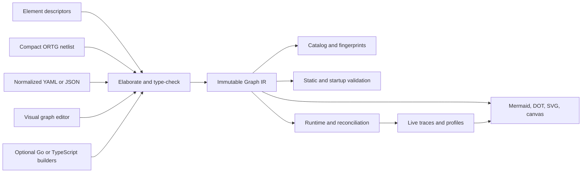

# Composable Real-Time Agent Element Graph

- **Status:** implementation in progress; unchecked validation gates remain open
- **Scope:** the OpenRealtime runtime, component API, architecture catalog,
  configuration, inspection, benchmark, server, and client composition paths
- **Audience:** runtime authors, element and model-adapter authors, deployment
  authors, benchmark authors, and UI/tooling authors

> [!IMPORTANT]
> This is an accepted design proposal and living implementation tracker. It may
> describe target behavior ahead of the current release. New users should read
> the [current architecture](architecture.md) and
> [graph-native assembly guide](graph-native-assembly.md) first.

This document proposes a thorough refactoring of OpenRealtime from a set of
binding-shaped realtime voice architectures into a typed, inspectable element
graph for general real-time agents. It is intentionally broader than audio. A
graph may observe and act through text, audio, cameras, screen or computer-use
video, still images, files, tool streams, user-interface state, and future
modalities without changing the kernel's model taxonomy.

The proposal preserves the strongest parts of the existing system: protocol
compatibility, the canonical trajectory, safe-point commits, asynchronous
event handling, interaction policies, duplex evidence, explicit authority,
the irreversibility ledger, sidecar isolation, provider adapters, and the
measurement discipline. It changes how those parts are assembled.

This document is both the accepted design and its implementation tracker. The
external Realtime API remains authoritative. Old internal implementations and
configuration switches are reference material only; production paths must use
the new graph, plug-in, and profile contracts, and unchecked boxes must not be
reported as complete.

## Executive summary

The central decision is:

> Make a small ClickNP/Verilog-inspired element-netlist language (`.ortg`) the
> default hand-authored topology format; type-check it against
> machine-readable element descriptors into an immutable Graph IR; and
> execute, validate, visualize, version, and reconcile that IR. Normalized
> YAML/JSON, visual editing, and optional code builders elaborate through the
> same compiler.

The design borrows the useful semantic ideas of Click Modular Router and
ClickNP—small stateful elements, multiple ports, explicit channels, bounded
depth, explicit `Tee` and `Mux`, reusable groups, and a separate management
plane. Its default syntax adopts the concise node-and-edge feel of ClickNP and
Verilog without copying ClickNP's fixed data type, positional assumptions, or
combined element-configuration language. It borrows from n8n the visual
workflow and per-node execution-inspection experience. It borrows from
DeepSeek Harness (`dsh`) and Cordis the plugin discipline, reactive dependency
management, reversible lifecycle effects, and safe dynamic composition.

The result is not a fixed ASR-to-LLM-to-TTS pipeline and not a prescribed
fast/slow architecture. A model, policy, context engine, codec, timer, state
store, authority check, media adapter, or ordinary computation is an element
with typed ports. A reusable policy is an element or a typed subgraph. “Fast,”
“slow,” “foreground,” “background,” “reasoning,” “non-reasoning,” “Omni,” and
“interactive” describe selected deployments or capabilities; they are not
kernel element species.

In particular:

- real-time behavior is achieved by explicit triggers, bounded channels,
  concurrency, deadlines, interruption, and interaction policy; it does not
  require one full-duplex end-to-end model;
- a full-duplex or speech-to-speech model is nevertheless a valid element and
  can run under native interaction, external interaction, or a composition of
  controllers;
- interaction policy is first-class because deciding *whether and when* to
  listen, speak, wait, interrupt, act silently, or yield is independent of the
  model that generates content;
- observation and action spaces are formal typed port signatures, including
  their temporal protocols, rather than lists of modality strings;
- trigger conditions are visible as connections to trigger ports; context
  arriving on a state port need not invoke a model;
- latency and price are evidence profiles attached to an exact element,
  configuration, hardware, and load condition, not promises encoded as port
  types;
- an output may have only one channel unless an explicit `Tee` copies it, and
  an input may have only one writer unless an explicit `Mux`, `Merge`, mixer,
  or arbiter defines how writers combine;
- a slow or deliberative model may feed context, TTS, native audio, tools, a
  feedback loop, or several of those through a `Tee`; no mandatory
  slow-to-fast handoff exists;
- configuration, topology, deployment placement, empirical profiles, and
  secrets remain separate concerns;
- Mermaid is an export format, not the semantic source of truth;
- the compiler and inspector make omitted interrupt, failure, timeout,
  authority, and output paths visible without dictating which valid choice a
  developer must make.

The design flow is:



This diagram describes the toolchain rather than an agent topology. Agent
diagrams are generated from their Graph IR.

## 1. Problem statement

OpenRealtime already supports several important arrangements: componentized
ASR/LLM/TTS, speech-to-speech sidecars, external and native interaction,
background reasoning, visual observation, a bounded visual reflex, computer
use, and upstream Realtime endpoints. The existing abstractions made those
arrangements possible, but topology is still distributed across constructors,
large binding runtimes, architecture ownership vectors, command-line flags,
and prose invariants.

The consequences are structural:

1. Adding a new composition often means adding a binding branch or editing a
   large runtime rather than connecting existing parts.
2. The architecture catalog currently derives one of a few provider
   topologies and requires audio input, audio output, and turn generation. It
   cannot naturally identify a text-and-files agent, a silent visual actor, or
   an agent whose speech and computer-use paths use different cognition and
   interaction policies.
3. “Slow cognition is always the engine's” and “slow cannot speak” are enforced
   as global assumptions even though they are only choices of the current
   reference architecture.
4. The statement that interaction “carries no data” usefully separates content
   generation from control, but it hides the fact that interaction decisions,
   interrupts, deadlines, and acknowledgements must themselves travel through
   explicit, inspectable, typed control channels.
5. Configuration is a flattened view of a very large flag set. It records
   settings but cannot declare arbitrary topology, per-edge queueing, or a new
   reusable policy graph.
6. Capabilities are represented mainly as broad booleans and ownership
   columns. Those fields do not express the complete observation space,
   action space, temporal protocol, trigger relation, state, or effect
   authority of an arbitrary component.
7. Timing is partly embedded in control flow. It is difficult to inspect which
   event wakes which model, how a completed slow result reaches output, which
   work a barge-in cancels, or how channel depth contributes to latency.
8. The visual shape of a running architecture must be reconstructed from code
   and status fields. There is no single graph that can be type-checked,
   rendered, diffed, replayed, and observed live.

The refactoring must solve these problems without discarding the safety and
correctness properties already earned by the project.

## 2. Scope and non-goals

### 2.1 In scope

The element graph must represent agents using any combination of:

- typed user and system text, including partial and revised text;
- microphone or other continuous audio;
- synthesized, model-native, recorded, or mixed audio output;
- physical-camera video;
- screen, browser, virtual-display, mobile-device, and computer-use video;
- still images attached to a turn or generated by a tool;
- files and multimodal attachments represented by durable handles and typed
  metadata rather than copied blindly through every channel;
- model-native latent or interaction state where a provider exposes only an
  opaque capability boundary;
- tool calls, tool results, jobs, timers, schedules, and environmental events;
- computer, browser, device, API, and message actions;
- streaming, non-streaming, revising, stateful, request/reply, and segmented
  protocols;
- model and non-model computation;
- local, sidecar, remote, and distributed elements.

### 2.2 Non-goals

This proposal does not:

- select one universally best agent graph;
- require every model to support every modality;
- equate real-time with audio, streaming tokens, or full duplex;
- make latency statically provable through the graph type system;
- automatically insert semantic adapters whose choice changes behavior;
- make irreversible real-world actions reversible;
- replace the OpenRealtime/OpenAI-compatible wire protocol with the internal
  graph protocol;
- require live topology editing in the initial implementation stage;
- expose model-private reasoning text to other elements unless a provider
  explicitly offers a safe, typed output for it;
- remove named reference architectures or benchmark identities; it makes
  those identities graph-based rather than binding-species-based.

## 3. What “real-time agent” means

Real-time is a relationship between an observation, a decision opportunity,
and a deadline after which an action is stale or disruptive. It is not a model
family.

Examples include:

- starting an answer soon enough to preserve conversational rhythm;
- deciding that no answer is appropriate while someone else is speaking;
- cancelling or redirecting speech when the user corrects the premise;
- clicking a transient interface control before it disappears;
- warning about a camera event before it is no longer actionable;
- incorporating a tool result without waiting for another user turn;
- updating a text UI incrementally while a deeper answer continues;
- declining to act because evidence or authority did not arrive before a
  deadline.

A componentized system can meet these requirements. For example, audio input,
ASR, an interaction model, a small response model, TTS, and a background
reasoner can all run concurrently on bounded channels. The agent can continue
observing while audio is playing, and an external interaction policy can
cancel or defer output. None of those properties requires the content model
itself to be full duplex.

A full-duplex multimodal model can reduce boundaries and preserve native
audio information, so it remains an important option. It does not remove the
need for explicit authority, tool execution, audit, state, background work,
external policies, or measured latency. The graph must let a developer select
native interaction, external interaction, or a deliberate composition over
the same foreground model.

## 4. Design principles

### 4.1 Composition, not taxonomy

The kernel knows elements, ports, channels, state, lifecycle, and effects. It
does not switch on names such as `cascade`, `omni`, `duplex`, `fast`, or
`slow`. Those remain library graphs, deployment roles, or evidence labels.

### 4.2 Observation and action spaces are typed

An element's input ports form its observation space. Its output ports form its
action space. The types include temporal protocol and provenance, not only a
modality label. A graph's external ports define the observation and action
spaces of the composite graph.

### 4.3 Triggering is explicit

Receiving context and being invoked are different operations. Trigger,
interrupt, deadline, and acknowledgement ports make activation and
cancellation paths visible. An element may also declare that a stream port is
intrinsically reactive, but that fact remains in its contract.

### 4.4 Timing is operational evidence

Queue depth, delivery mode, deadlines, and trigger relations are graph
semantics. Provider latency, cancellation latency, throughput, and cost are
empirical profiles. Static checks may reject an impossible hard contract or
warn about an unsupported SLO, but must not present a measured distribution as
a type-level guarantee.

### 4.5 No implicit branching or merging

Fan-out requires `Tee`. Multiple writers require a `Mux`, `Merge`, `Join`,
mixer, arbiter, or another element with defined semantics. The graph never
silently copies, interleaves, or chooses outputs.

### 4.6 Policy is ordinary computation

An interaction policy, endpoint detector, rollout selector, commitment rule,
tool policy, computer-use arbiter, or latency race is an element or subgraph.
It can be implemented by rules, code, a small model, a native model head, or a
composition. “Policy” conveys purpose, not a privileged runtime mechanism.

### 4.7 Choices must be visible, not prescribed

The compiler enforces mechanical correctness. Lint profiles expose omitted
design obligations. They do not require slow output to pass through fast
cognition, require a particular barge-in behavior, or prevent a deliberative
model from speaking. An intentional omission is represented by an explicit
`Ignore`, `Drop`, `Reject`, or terminal sink.

### 4.8 One semantic representation

The default `.ortg` source, normalized YAML/JSON, a visual editor, and optional
code builders elaborate the same Graph IR through one type checker. Runtime
execution, rendering, architecture fingerprints, validation, traces, and
benchmarks use that IR. Mermaid and DOT are generated views and cannot drift
into competing definitions.

### 4.9 Configuration is owned locally

Each element owns a typed configuration schema. The graph connects instances.
Deployment config selects implementations and resources. Performance profiles
record evidence. Secrets are resolved at mount time and never enter graph
fingerprints or exported diagrams.

### 4.10 Lifecycle is compositional

Elements declare dependencies and acquire resources inside a scoped lifecycle.
Removing or replacing an element cancels work and reverses its runtime
registrations. Real-world effects that already crossed the action boundary are
recorded and repaired where possible, never described as reversible.

### 4.11 Compatibility remains a boundary

The gateway continues to translate external protocol events into internal
typed messages and typed graph output into protocol events. External protocol
compatibility must not constrain every internal element to wire-level event
shapes.

## 5. Foundations and related work

### 5.1 Click Modular Router and ClickNP

Click's durable contribution is the element graph: small modules with ports,
explicit wiring, reusable compound elements, and connector elements whose
semantics are visible. ClickNP extends the idea to a hardware-oriented data
plane with persistent element state, a data handler, a signal handler, bounded
channels, host control, and graph-level port counts.

OpenClickNP's topology makes several useful choices:

- `A -> B` is lossless and backpressures the producer when the channel is
  full;
- `A => B` is lossy and drops when the channel is full;
- source and destination ports can be addressed explicitly;
- channel depth can be overridden in topology;
- a `Tee` performs one-to-many copying;
- a `Mux` performs many-to-one arbitration;
- reusable element groups encapsulate subgraphs.

OpenRealtime should adopt those semantics and the source language's compact
netlist style where they fit, but not the language wholesale. ClickNP's fixed
flit type, positional conventions, and element configuration model do not fit
a general agent. OpenRealtime messages require strict payload and
temporal-protocol types, richer lifecycle, run correlation, cancellation,
authority, and empirically measured timing.

### 5.2 Verilog-style elaboration

Verilog source describes modules, ports, and nets, then an elaborator produces
the concrete design. The useful lesson is not to reproduce Verilog syntax; it
is that graph construction must be pure and separate from execution. No
OpenRealtime frontend may start goroutines, load models, open devices, or dial
services. It produces an immutable graph definition that is validated before
mounting.

### 5.3 n8n and visual workflow systems

n8n demonstrates discoverable node configuration, visual branching, explicit
switch and merge nodes, reusable sub-workflows, and per-node execution
inspection. Those affordances are valuable. A production realtime-agent graph
additionally requires strict pre-mount port types, temporal protocols, bounded
queue semantics, causal identities, cancellation, effect authority, clock
domains, safe feedback, and latency evidence.

### 5.4 DeepSeek Harness and Cordis

DeepSeek Harness (`dsh`) uses an everything-is-a-plugin architecture powered
by Cordis. The Cordis paper, *A Programming Paradigm for Spatiotemporal
Composability*, separates two concerns:

- **spatial composability:** components declare dependencies and react to
  dependencies appearing, disappearing, or changing;
- **temporal composability:** a component's tracked runtime effects can be
  unwound when the component is removed.

Cordis models these as reactive coeffects and revertible effects mediated
through a context. OpenRealtime should apply the principles to graph element
lifecycle: declared services activate elements, scoped effects own their
disposers, and graph reconciliation mounts and unmounts components safely.
The data/control graph and the dependency/lifecycle graph are related but not
identical and should be inspectable as separate layers.

## 6. Core terminology

| Term | Meaning |
| --- | --- |
| element | A stateful or stateless computation with typed input and output ports and a lifecycle contract. |
| instance | One named occurrence of an element definition with one configuration. |
| port | A directional, typed endpoint with a temporal protocol and cardinality. |
| channel | A bounded connection from one output port to one input port. |
| observation space | The product of the input-port types visible to an element or composite graph. |
| action space | The tagged product/sum of output-port types an element or composite graph may produce. |
| trigger | An input whose arrival creates a reaction or run rather than merely updating state. |
| interrupt | A run-scoped control message requesting cancellation, preemption, truncation, or another defined transition. |
| reaction | The contract relating a trigger to sampled inputs, state transitions, outputs, and terminal outcomes. |
| policy | An element or subgraph whose outputs select or constrain behavior. |
| subgraph | A graph exported as an element with typed boundary ports. |
| capability | Something an implementation can support, independent of whether a graph selects it. |
| Graph IR | The immutable, language-neutral, fully elaborated graph consumed by the runtime and tooling. |
| profile | Versioned empirical evidence about timing, capacity, reliability, or cost under stated conditions. |

## 7. Formal element contract

An element definition is modeled as:

$$
E = (\mathcal{O}, \mathcal{A}, \mathcal{R}, S, D, F, Q)
$$

where:

- \(\mathcal{O}\) is the typed observation space: input ports and their
  protocols;
- \(\mathcal{A}\) is the typed action space: output ports and their protocols;
- \(\mathcal{R}\) is the reaction relation: triggering inputs, state sampled
  atomically for each trigger, concurrency, interruption, and terminal
  outcomes;
- \(S\) is persistent internal state together with snapshot, compatibility,
  and optional migration schemas;
- \(D\) is the dependency or coeffect declaration: services, devices,
  providers, clocks, secrets, schemas, and authority the element requires;
- \(F\) is the effect declaration: registrations and resources that must be
  disposed, plus any external effect authority the element may request;
- \(Q\) is a set of empirical profiles keyed by exact implementation,
  configuration, placement, hardware, load, and measurement revision.

Models are not a separate formal category. A model element typically has a
larger \(\mathcal{O}\), a probabilistic \(\mathcal{A}\), and profiles sensitive
to reasoning configuration. A code context engine, timer, ASR adapter, media
resampler, or policy has the same contract shape.

### 7.1 Composite contracts

After internal edges are connected, the unbound exported inputs and outputs
form the composite graph's observation and action spaces. Dependencies and
effects are the checked composition of its elements. A subgraph may rename or
intentionally hide internal ports, but it cannot claim an external type or
authority its contents do not supply.

The runtime may estimate a composite performance envelope from channel bounds
and element profiles. That estimate is evidence, not part of type
assignability. The composite must be measured directly before production SLO
claims are made.

## 8. Port and protocol type system

Payload type alone is insufficient. These are different types even when all
carry strings:

```text
Event<UserUtterance>
Stream<TextDelta>
Segmented<TextDelta, RunID>
Revisions<Transcript, RevisionID>
State<ContextSnapshot>
Trigger<GenerateRequest>
Interrupt<RunID>
```

The initial protocol families should be small and explicit:

| Protocol | Semantics |
| --- | --- |
| `Event<T>` | One immutable occurrence, ordered within its channel. |
| `Stream<T>` | An ordered sequence of independently meaningful items. |
| `Segmented<T, K>` | Begin/delta/end or equivalent framed stream correlated by key `K`. |
| `Revisions<T, K>` | Successive replacements or refinements with explicit stability/finality. |
| `State<T>` | Latest-value state sampled by reactions; arrival does not imply a run. |
| `Trigger<T>` | Arrival opens a reaction with a run identity. |
| `Interrupt<K>` | A control request addressed to an active run or scope. |
| `Request<T, K>` / `Reply<T, K>` | Correlated request/reply without hiding the two channels. |

Types should also carry important media and authority distinctions:

- audio sample format, sample rate, channel count, framing, and clock domain;
- image/video encoding, dimensions or negotiated constraints, source, capture
  time, coordinate space, and grounding mode;
- text provenance, participant, stability, language, and visibility where
  semantically required;
- attachment handle, MIME type, content hash, retention scope, and access
  capability;
- tool proposal versus executable call;
- unconfirmed versus authorized action;
- prepared versus committed output;
- private model state versus user-visible content.

Common correlation metadata belongs in runtime envelopes rather than being
redeclared by every payload: session ID, source ID, turn or opportunity ID,
run ID, sequence, capture and receive timestamps, causal parents, trace ID,
and cancellation scope.

### 8.1 Assignability and adapters

All graph frontends use invariant, exact protocol types by default. Graph
source does not repeat those types: the elaborator resolves them from the
versioned element descriptors and reports errors at the relevant node, port,
or edge source location. If an output does not match an input, the developer
inserts an explicit adapter:

- `Resample` changes audio format;
- `Decode` changes media encoding;
- `Stabilize` turns ASR revisions into committed utterance events;
- `Collect` turns a segmented stream into a completed value;
- `Segment` turns completed text into safe speech units;
- `Describe` turns visual frames into text observations;
- `ResolveAttachment` provides bounded access to file contents;
- `Authorize` turns a validated proposal into an authorized action;
- `Commit` moves prepared output across the action boundary.

The compiler may suggest compatible adapters. It must not silently insert one
when the choice changes information, timing, authority, or failure behavior.

### 8.2 Runtime-negotiated types

Some formats and capabilities are known only after a provider or sidecar
handshake. A port then declares a bounded type constraint rather than an
untyped value. Startup resolves the constraint, records the selected concrete
type in the live graph, and refuses incompatible edges before the session is
made available. Negotiation never silently inserts a lossy conversion.

### 8.3 Degrees of composability

The compiler reports one of three outcomes rather than treating every mismatch
as equivalent:

- **directly composable:** output and input protocol types, constraints,
  cardinality, and authority match;
- **adaptably composable:** a registered adapter can bridge the types, but the
  author must select it because it changes representation, timing, stability,
  or authority;
- **not composable:** no sound adapter exists, the protocols conflict, the
  effect authority cannot be supplied, or a required temporal/placement
  contract cannot be met.

Timing SLOs do not change type assignability. A directly typed path may still
be unsuitable for a deadline, which is reported by profile validation.

## 9. Element families

Element families are library organization, not closed kernel enums:

- **sources and sinks:** gateways, microphones, cameras, screen capture,
  clients, files, schedules, speakers, displays, tool executors;
- **media transforms:** codec, resample, VAD, keyframe selection, chunking,
  segmentation, mixing;
- **perception:** ASR, OCR, speaker identity, visual description, object/event
  detection, document parsing;
- **state and context:** trajectory, latest state, windows, retrieval,
  multimodal context construction, memory projections;
- **cognition:** text LLMs, VLMs, speech-to-speech models, end-to-end
  multimodal models, planners, reasoners, classifiers, code logic;
- **interaction and control:** endpoint, floor, opportunity, barge-in,
  commitment, preparation, cadence, deadlines, gates, races, arbiters;
- **connectors:** `Tee`, `Mux`, `Switch`, `Merge`, `Join`, `Latest`, `Delay`,
  `Race`, media-specific mixers;
- **action and authority:** proposal validation, policy, confirmation,
  authorization, commitment, pacing, dispatch, audit, repair;
- **supervision:** timeout, retry, circuit breaker, health, fallback, restart,
  and terminal error routing;
- **adapters:** explicit bridges between otherwise incompatible types or
  external protocols.

An implementation can belong to several descriptive families. The runtime
cares only about its contract.

### 9.1 Composition dimensions the graph must cover

The first production catalog should exercise the following dimensions rather
than merely declare that the generic graph could support them:

| Area | Representative alternatives | Composition concern made explicit |
| --- | --- | --- |
| speech recognition | batch ASR, simulated partials, native streaming ASR, model-native transcription, no ASR | revisions versus committed utterances, endpoint ownership, cadence, audio format |
| text cognition | small non-reasoning model, low-latency reasoning model, slow deliberative model, code/rules | trigger, sampled context, reasoning configuration, authority, latency profile |
| multimodal cognition | VLM, speech-to-speech, end-to-end audio/video model, separate modality encoders | direct versus derived evidence, native state, streaming and interrupt support |
| speech output | non-streaming TTS, streaming TTS, model-native audio, recorded clips, no speech | safe segmentation, first-audio latency, pacing, truncation, mux versus mixer |
| visual observation | physical camera, screen stream, still attachment, keyframes, OCR, narration, direct pixels | source identity, capture time, coordinate space, latest-value/drop policy |
| computer use | direct visual reflex, deliberative planner, code automation, human control | action arbitration, stale-frame detection, target fence, confirmation, serialized device access |
| context | append-only trajectory, latest state, window, retrieval, per-model projection | update versus trigger, snapshot consistency, media handles, feedback |
| interaction | acoustic rules, transcript model, multimodal model, native head, human override | evidence selection, floor, deadline, act arbitration, cancel scope |
| files and attachments | eager parser, lazy resolver, retrieval index, multimodal model attachment | retention, access capability, content hash, size bound, untrusted provenance |
| execution | in-process code, sidecar, remote API, persistent job | placement, transport guarantee, retry/idempotency, cancellation, lifecycle |

This table is not a Cartesian-product test requirement. It is a review
checklist ensuring that interfaces are derived from real variations already
present or anticipated in the repository rather than from an audio pipeline.

## 10. Authoring model: concise netlist first, multiple frontends

No single authoring experience is best for element implementers, application
developers, operators, and visual-tool users. The project should standardize
one semantic compiler and offer several thin frontends. For checked-in graphs,
the default should match the thing being authored: a compact declarative
netlist, not a verbose object tree and not executable Go.

| Representation | Strength | Cost or limitation | Recommended role |
| --- | --- | --- | --- |
| `.ortg` element netlist | direct node/port/edge notation, concise diffs, easy visual correspondence | requires a small parser, formatter, and editor support | default hand-authored and documented topology |
| strict YAML/JSON graph form | generic parsers, schema tooling, easy for controllers to emit | repeats edge field names and obscures connection-heavy graphs | normalized interchange and GitOps/API form |
| visual editor | discoverable ports, immediate shape, live diagnostics | poor for bulk generation and text review | first-class frontend over the same graph model |
| Go builder | strong IDE support for built-ins and natural for repository tests | recompilation, Go-only audience, no faithful visual round-trip | optional internal SDK and graph generator |
| TypeScript builder | broad application-developer familiarity and UI ecosystem | executable build step and another toolchain | likely first external code SDK if demanded |
| Mermaid | excellent documentation rendering | lacks executable port, type, lifecycle, and channel semantics | generated view only |

### 10.1 Why the netlist should be the default

Most topology lines describe a connection. YAML expands one connection into
`id`, `from`, `to`, and `channel` fields, so the syntax becomes more prominent
than the graph. A Click-like line maps directly to the visual relation and is
easier to scan, review, and rearrange:

```text
deliberative.text -> deliberative_fork.in;
```

This does require project-owned syntax tooling. The cost is justified only if
the language stays deliberately small. OpenRealtime Graph (`.ortg`) is a
declarative netlist, not a general programming or configuration language. It
has node declarations, explicit edges, imports, subgraph boundaries, and
comments. It has no loops, conditionals, variables, arbitrary expressions,
provider settings, secrets, or runtime effects. Ordinary edges have exactly
one visible choice: `->` is lossless and backpressured; `=>` is lossy and
best-effort.

The hard part—the descriptor resolver, type checker, lifecycle validator, and
Graph IR compiler—is required for every frontend anyway. The `.ortg`-specific
work is consequently bounded to parsing, formatting, source mapping, syntax
highlighting, completion, and refactoring. A parser, canonical `ort graph fmt`,
and precise diagnostics are release requirements for making it the default;
a half-supported DSL would be worse than YAML.

The syntax should be inspired by Click/ClickNP rather than source-compatible
with it. OpenRealtime needs named typed ports, temporal protocols, trigger and
interrupt paths, versioned descriptors, authority types, and richer channel
semantics. Reusing ClickNP's entire grammar would import assumptions that do
not fit a general agent graph.

### 10.2 Why Go should not be the default

Go remains an excellent language for implementing in-process elements and
generated graph libraries. It is not the most developer-friendly deployment
format:

- changing a queue or model connection should not require rebuilding the
  server;
- application and model developers may use Python, TypeScript, Rust, or a
  sidecar rather than Go;
- a visual editor cannot reliably rewrite arbitrary Go while preserving its
  abstractions and comments;
- loading executable authoring code complicates sandboxing and reproducible
  deployment;
- Go compile-time types cover only linked native elements, while configured
  plugins, remote implementations, and negotiated sidecars must still use the
  language-neutral descriptor type checker.

The formal guarantee belongs to element descriptors, the graph elaborator,
and Graph IR. A typed Go SDK can catch some mistakes earlier, but it is a
convenience frontend rather than the foundation of soundness.

### 10.3 Element definitions and descriptors

An element implementation is code, but its composition surface is a
language-neutral, immutable descriptor. Go elements should derive or register
that descriptor from typed declarations; sidecars and remote plugins publish
the same descriptor during packaging and confirm it during handshake. Graph
authors should not copy port types into every graph.

An illustrative descriptor fragment is:

```yaml
type: cognition.TextModel
ports:
  context:
    direction: input
    protocol: State
    payload: context.Snapshot
  trigger:
    direction: input
    protocol: Trigger
    payload: cognition.Generate
  cancel:
    direction: input
    protocol: Interrupt
    key: flow.RunID
  text:
    direction: output
    protocol: Segmented
    payload: text.Delta
    key: flow.RunID
reaction: cognition/model-generation
configSchema: cognition/text-model-config
```

The complete descriptor also carries cardinality, state, dependency, effect,
authority, lifecycle, and negotiation declarations. A graph can reference a
contract descriptor while deployment selects any implementation that proves
it satisfies that contract. Implementation-specific values extend the
contract's configuration schema and are resolved before mount; they cannot
silently change the node's declared ports.

Human graph source uses stable symbolic element names, with no `@1` or `@2`
suffixes. Exact descriptor revisions and content digests belong in a generated
lockfile and the elaborated Graph IR. This keeps source readable while
preserving reproducibility: normal builds consume the lock, and an explicit
`ort graph update` operation changes locked element revisions.

### 10.4 Default `.ortg` topology syntax

The graph source contains only topology: stable node instances, symbolic
element or subgraph references, exported boundary ports, explicit edges, and
lossless/lossy arrows. It does not contain provider credentials, prompts,
placement, empirical measurements, type annotations, connector counts, or
element revision suffixes.

For example:

```text
graph fast_and_deliberative_voice {
    interaction.Opportunity      :: opportunity;
    flow.Tee                     :: trigger_fork;
    cognition.TextModel          :: fast;
    cognition.TextModel          :: deliberative;
    flow.Tee                     :: deliberative_fork;
    context.TrajectoryProjection :: context;
    speech.UtteranceMux          :: speech_arbiter;
    speech.TTS                   :: tts;

    opportunity.generate     -> trigger_fork.in;
    trigger_fork.out         -> fast.trigger;
    trigger_fork.out         -> deliberative.trigger;
    fast.text                -> speech_arbiter.in;
    deliberative.text        -> deliberative_fork.in;
    deliberative_fork.out    -> context.background;
    deliberative_fork.out    -> speech_arbiter.in;
    speech_arbiter.out       -> tts.text;
}
```

The initial grammar can remain approximately this small:

```text
graph    := "graph" name "{" { node | edge | boundary } "}"
node     := element_reference "::" name ";"
edge     := [ "edge" name "=" ] endpoint arrow endpoint ";"
arrow    := "->" | "=>"
endpoint := node "." port
```

The full grammar also needs imports, exports, comments, and optional explicit
edge names, but no general expression evaluator. Edge IDs are derived
deterministically from endpoints unless `edge name =` is supplied for a
configuration overlay or stable telemetry. The arrow's delivery semantics are
stored on the IR edge and shown by the inspector.

Port types are absent because repeating them would permit drift. The compiler
resolves `fast.text`, `speech_arbiter.in`, and every other port from locked
element descriptors. Explicit `Tee` and arbiter nodes preserve the fan-out and
multi-writer rules.

`Tee.out` and `UtteranceMux.in` are homogeneous variadic port groups. Each
edge reference materializes one lane, so the compiler infers their exact arity
and unifies their generic payload/protocol type from neighboring ports. There
is no `outputs = 2`, `inputs = 2`, or numeric lane index in normal source. If
inputs have different meanings—such as `primary` and `fallback`—the element
descriptor declares different named ports instead of relying on positions.

### 10.5 Use YAML for values and interchange, not primary topology

YAML is a good fit for hierarchical configuration values and deployment
overlays. It is less effective as the primary surface for an edge-heavy graph.
The compiler should nevertheless accept and emit a normalized strict YAML 1.2
graph form, with equivalent JSON, for controllers, APIs, generated workflows,
and teams that standardize on generic data formats. Duplicate keys, custom
tags, merge keys, and ambiguous implicit scalar conversions are rejected.

The topology above is reusable across models and environments. Runtime values
are a separate, schema-checked artifact keyed by stable node ID:

```yaml
apiVersion: openrealtime.ai/config/v1alpha1
graph: fast_and_deliberative_voice
nodes:
  fast:
    model: deepseek-chat
    reasoning: none
  deliberative:
    model: deepseek-reasoner
    reasoning:
      effort: high
  speech_arbiter:
    policy: segment-lock
  tts:
    voice: alloy
```

Deployment binds implementations, placement, resources, and secret
references without changing functional topology:

```yaml
apiVersion: openrealtime.ai/deployment/v1alpha1
graph: fast_and_deliberative_voice
nodes:
  fast:
    implementation: providers.deepseek.text
    placement: llm-pool
    secrets:
      apiKey: secret://deepseek/api-key
  tts:
    implementation: providers.openai.tts
    placement: media-pool
```

Queue depth is not repeated on every connection. Each protocol/port contract
has a bounded default. An author who has measured a reason to override it may
use a separate channel overlay keyed by an explicit or endpoint-derived edge
ID:

```yaml
graph: fast_and_deliberative_voice
edges:
  deliberative.text->deliberative_fork.in:
    depth: 8
```

The compiler resolves this overlay before validation and records the effective
bound in Graph IR and its deployment fingerprint. Strong typing can infer the
channel's data type and connector arity; it cannot infer the operationally
correct queue depth under a particular load, so a bounded default plus an
exception-only override is the honest abstraction.

The boundaries are deliberate:

- **connector arity and channel type** are inferred from connections and
  descriptors, so they are not configuration;
- **element values** such as model, prompt, reasoning effort, voice, endpoint
  threshold, or arbitration policy belong in an element-owned config schema;
- **delivery** is expressed directly by `->` or `=>`; exceptional channel
  depth overrides live in the channel overlay because depth affects timing
  and liveness but normally uses a bounded default;
- **implementation, placement, transport, resource limits, and secret
  references** belong to deployment;
- **latency, capacity, reliability, and cost** belong to immutable evidence
  profiles.

Element config is data, not arbitrary executable code. If a behavior requires
code, it should be an element or reusable subgraph with a typed contract.
Builder SDKs may construct typed config values, but the result is validated
against the same schema and recorded as data.

### 10.6 Elaboration provides the type guarantee

The compiler performs these steps before any resource is acquired:

1. parse `.ortg`, normalized YAML/JSON, or a builder AST with precise source
   locations;
2. resolve locked element and subgraph descriptors;
3. infer generic types and materialize variadic connector lanes from edges;
4. resolve channel defaults, overrides, and exported boundaries;
5. type-check direction, protocol, payload, cardinality, authority, and
   negotiated constraints;
6. validate cycles, reactions, required ports, configuration schemas, and
   selected lint obligations;
7. freeze immutable Graph IR and its deterministic fingerprint.

An error should read, for example, “`deliberative.text` produces
`Segmented<TextDelta, RunID>` but `tts.audio` accepts
`Stream<AudioFrame>`; insert a TTS element,” and point to the edge. This is a
formal pre-mount type check, not duck typing. It is performed by the graph
compiler rather than depending on a particular frontend language.

### 10.7 Optional programmatic builders

Programmatic builders remain useful for parameterized graph libraries, tests,
and large generated topologies. The first can be a Go SDK because the runtime
is written in Go; a generated TypeScript SDK may be more approachable for
external application developers. Both use descriptors to expose typed port
handles and emit the same Graph IR.

Wiring must use an explicit operation such as
`graph.Connect(g, output, input, options...)`. Raw assignment cannot capture
edge identity, depth, delivery, diagnostics, or provenance. Builder execution
is pure elaboration: it does not start goroutines, load models, open devices,
or dial providers. The emitted `.ortg`, normalized YAML/JSON, or IR—not the
builder process—is what deployment reviews, signs, and mounts.

### 10.8 Visual editing and subgraphs

The visual editor uses element descriptors for its node and port palette and
invokes the same compiler on every edit. It can save canonical `.ortg` through
the formatter or normalized YAML/JSON. Non-semantic node positions and
collapsed groups live in a separate layout artifact or excluded annotation so
they do not change graph identity. Mermaid, DOT, and SVG remain generated
views.

A versioned subgraph is instantiated exactly like an element. Its descriptor
exposes typed boundary ports and structural/config parameters. The IR retains
hierarchy so an inspector can collapse or expand it. Language macros, YAML
anchors, and a general template evaluator are not the composition mechanism.
Reference architectures, interaction policies, computer-use lanes, and
provider stacks should be reusable subgraphs. Algorithmic generation remains
available through an SDK that emits a concrete graph for review.

### 10.9 Immutable authoring snapshots and recovery boundary

Interactive authoring uses the UI-independent management Authoring API rather
than granting a renderer filesystem or compiler authority. Each analysis
response is bound to the exact input bytes by a SHA-256 source digest and owns
independent copies of its diagnostics, catalog metadata, resolved values
properties, and text edits. Results are deterministically ordered and bounded;
the server and client validate the complete response envelope before admitting
it as an authoring snapshot.

The strict parser remains the only path to compilation. When an in-memory
`.ortg` buffer is incomplete, a separately bounded recovery parser synchronizes
only at statement terminators and the graph boundary and retains only complete
declarations. It may support explicit descriptor-derived completions, but it
cannot produce Graph IR, a resolution lock, a formatter rewrite, reconciliation
input, or any runtime effect. A formatter edit exists only for a buffer accepted
by the strict parser; it is an atomic edit set bound to the original path,
source digest, exact source range, and old text, so applying it to a stale buffer
fails closed.

Element configuration remains a separate values artifact. When a deployment
provides a bounded schema resolver, analysis validates the complete
self-contained Draft 2020-12 object schema before exposing directly declared
root-property metadata, canonical property subschemas, defaults, enums,
requiredness, schema identity, and content digest. External references and
invalid schemas admit no property metadata and produce diagnostics. Composition
is never flattened speculatively: the projection is marked incomplete and the
exact property subschemas remain authoritative. An absent resolver is reported
truthfully as unresolved rather than inventing fields.

The browser configuration editor, language-service LSP hover projection, and
native SwiftUI editor render the complete contract. The LSP form uses the
protocol's zero-based UTF-16 positions and deterministic plaintext so
descriptor-supplied markup is data, preserves absent versus explicit `null`
JSON, and fails closed on a split surrogate, malformed retained schema, or
oversized projection. A closed in-memory workspace index now resolves imports,
import aliases, nested graph declarations, and subgraph boundary definitions
against exact version/source-digest identities without discovering or opening
paths. Remaining work includes broader visual editing and mediation of actual
file writes. None of that may weaken the strict compile/reconcile boundary
above.

## 11. Graph IR

Graph IR is the canonical executable and inspectable representation. It is
versioned independently of any authoring frontend.

At minimum it contains:

```text
GraphDefinition
  format version
  graph ID, revision, lineage, and content fingerprint
  exported boundary ports
  nodes
    stable instance ID
    element type URI and immutable revision
    implementation reference
    typed ports and reaction contract reference
    configuration reference and non-secret digest
    state schema and lifecycle contract
    dependency/effect declarations
  edges
    stable edge ID
    source and destination port IDs
    concrete or constrained protocol type
    delivery and ordering semantics
    bounded depth
    transport/placement reference
  nested graph boundaries
  validation profile references
  empirical profile references
```

Graph IR must not contain credentials, bearer tokens, raw private prompts, or
large media. It records references and digests sufficient for reproducibility
and evidence.

The same IR powers:

- runtime construction;
- static and startup validation;
- architecture catalog fingerprints and lineage;
- Mermaid, DOT, SVG, and interactive-canvas rendering;
- live graph inspection;
- trace replay and deterministic simulation;
- benchmark identity and comparison;
- graph diff and future hot reconciliation;
- descriptor and schema generation for `.ortg`, normalized, visual, and code
  frontends.

## 12. Channel and connector semantics

### 12.1 Bounded channels

Every data or control channel is bounded. Unbounded buffering converts
temporary overload into unbounded memory and stale action.

The normal connection syntax is intentionally only the two ClickNP arrows:

```text
producer.out -> consumer.in;  // lossless; backpressure on full
producer.out => observer.in;  // lossy; drop on full
```

- `->` applies backpressure and is the normal default;
- `=>` implements ClickNP-like best effort with a precisely documented
  dropped-item rule;
- the payload and temporal-protocol type are inferred from the endpoints and
  checked for exact compatibility;
- an explicit edge name is needed only when the endpoint-derived identity is
  insufficient for an override or stable telemetry.

`=>` is syntax, not permission to discard anything. The resolved protocol
contract declares whether loss is legal and what unit may be dropped. The
compiler should normally reject lossy trigger, interrupt, authority,
commitment, and effect-result paths, and reject dropping individual deltas when
that would corrupt segmented framing. Lossy delivery is natural for replaceable
camera frames or telemetry, but remains a checked semantic choice.

Depth is measured in protocol items. Every edge receives a bounded default
from its resolved port/protocol contract; inspection may translate it to media
time or estimated bytes where the item type permits it. An exceptional depth
override is separate channel configuration and does not require giving every
edge a profile name. The effective depth is part of the elaborated IR and is
therefore available to liveness validation, fingerprints, and traces.

Behavior such as latest-value coalescing, sampling, debouncing, batching, or
drop-oldest should normally be represented by an explicit element. This keeps
semantically important behavior visible and testable.

An external source may be physically unable to backpressure. Its element must
declare how capture overflow is handled. The compiler rejects a supposedly
lossless path if neither the source nor the path can honor backpressure within
its bound.

`Lossless` describes a live graph's bounded handoff, not magical exactly-once
delivery across process crashes. A persistent or replayable edge uses an
explicit journal/log element and stable item identities. Retried effectful
work requires an idempotency contract; the runtime must never infer that a
physical action is safe to repeat.

### 12.2 `Tee`

`Tee<T>` performs logical copying from one input to a variadic group of
outputs. The elaborator creates one output lane for every edge leaving
`tee.out` and infers `T` from the neighboring ports. For immutable envelopes
and large media, copying should use reference counting or copy-on-write rather
than deep copying. A strict lossless tee consumes an input only when every
lossless branch accepts it. A best-effort branch may use `=>` so an observer or
telemetry tap cannot stall the main path.

An ordinary singular output may not connect directly to several inputs.
Repeated connections from the declared variadic `Tee.out` group are distinct
inferred lanes, not implicit fan-out. Requiring the visible `Tee` forces the
author to confront backpressure and branch lifetime without making the author
count its outputs.

### 12.3 `Mux`, `Merge`, `Join`, and mixers

These are not interchangeable:

- `Mux<Event<T>>` selects one complete event from several inputs according to
  an explicit arbitration policy;
- `SegmentMux<T>` or `UtteranceMux<T>` locks or preempts at defined segment
  boundaries so token or audio fragments do not interleave accidentally;
- `Merge<T>` combines values only when an associative/commutative or otherwise
  declared merge law exists;
- `Join` waits for correlated inputs and defines timeout and partial-result
  behavior;
- `Race` selects a winner and defines what happens to losers;
- `AudioMixer` combines simultaneous samples rather than merely interleaving
  frames;
- `Switch` or `Demux` routes an item to selected outputs without copying it to
  every output.

An ordinary singular input may not have several direct writers. A connector
such as `Mux` declares a homogeneous variadic input group, and each incoming
edge materializes a distinct inferred lane. The connector documents ordering,
fairness, preemption, and cancellation without an `inputs = N` declaration.

### 12.4 Feedback and cycles

A cycle must contain an explicit causal break such as `State`, `Delay`, a
seeded queue, or an element whose reaction can proceed without consuming the
cycle. Queue depth alone does not prove liveness. The graph validator analyzes
cycles for missing initial state, unbounded amplification, and cancellation
scope. Stateful feedback is legal and visible; accidental combinational or
deadlocked feedback is rejected.

## 13. Triggers, timing, and interruption

### 13.1 Reaction contracts

A text model might expose:

```go
type TextModelPorts struct {
    Context In[flow.State[context.Snapshot]]
    Trigger In[flow.Trigger[cognition.Generate]]
    Cancel  In[flow.Interrupt[flow.RunID]]

    Text    Out[flow.Segmented[text.Delta, flow.RunID]]
    Final   Out[flow.Event[cognition.Response]]
    Tools   Out[flow.Stream[tool.Proposal]]
    Outcome Out[flow.Event[cognition.Outcome]]
}
```

Updating `Context` does not run the model. A `Trigger` opens a run and samples
the declared state consistently. `Cancel` is addressed to a run or scope.
`Outcome` reports success, cancellation, timeout, refusal, and failure as a
closed typed result.

A native multimodal model may instead declare audio or event streams as
reactive inputs, plus explicit commit and interrupt ports. The contract—not a
global `omni` switch—states its behavior.

### 13.2 Timing elements

The standard library should include visible elements for:

- periodic cadence and clock ticks;
- debounce, throttle, and sampling;
- acoustic and semantic endpoints;
- inactivity and quiet deadlines;
- turn projection;
- absolute and relative deadlines;
- timeout fallback;
- speculative races and adoption;
- safe-point commitment;
- playback pacing;
- scheduled and delayed jobs.

A deadline cannot make a model faster. It can bound how long the graph waits,
select a fallback, cancel stale work, and produce evidence about the miss.

### 13.3 Time model

Every runtime uses a monotonic clock for durations and deadlines. Wall-clock
time is metadata for audit and cross-system correlation, never the source for
an in-process timeout. Media and external events retain both capture/event time
and runtime receive time. Queue and service latency are measured from the
appropriate pair rather than conflated.

Ports and elements declare clock-domain constraints where they matter. A
join across microphone audio, camera frames, screen capture, and remote tool
events defines synchronization tolerance, lateness, watermark, and missing
input behavior. The runtime does not assume that the newest-arriving item is
the newest-captured item.

Staleness is a policy over event time, source revision, and target state. A
computer click planned from an old frame, an answer derived from superseded
speech, and a delayed notification may be type-correct but no longer valid.
`FreshnessGate`, source-revision checks, deadlines, and safe-point comparison
make those decisions visible.

### 13.4 Interrupt propagation

Interrupts are graph messages, not hidden global calls. A cancellable element
declares which scopes it accepts and how quickly it acknowledges. Connector
and subgraph boundaries declare whether an interrupt is forwarded,
translated, absorbed, or split.

The compiler and inspector should be able to answer:

- Which event triggered this run?
- Which state revision did it sample?
- Which active runs does this barge-in target?
- Does cancellation reach the model, TTS, queued speech, and playback?
- Which component acknowledged it, and after how long?
- Which output had already crossed an irreversible boundary?
- What fallback or repair path follows timeout or partial cancellation?

If a developer intentionally allows a model or tool to finish, an explicit
`IgnoreInterrupt`, detached cancellation scope, or background-job boundary
records that choice.

### 13.5 Management is a separate plane

Realtime trigger and interrupt ports are part of the typed graph. Management
operations—configuration reconciliation, health, state snapshot, metrics,
drain, and lifecycle—use a standard management interface attached to every
element. They must not be confused with conversational control. ClickNP's
host-signal idea informs this separation, but OpenRealtime need not use a
special topology sigil for ordinary inspection.

## 14. Interaction as a first-class control graph

Interaction is the set of decisions about when and whether other behavior is
appropriate. It includes more than endpointing:

- listen or continue listening;
- acknowledge without taking the floor;
- answer now, prepare, defer, or abstain;
- speak through overlap, yield, or interrupt;
- cancel, truncate, or repair output;
- act silently;
- ask for clarification or confirmation;
- wait for visual, tool, identity, or timing evidence;
- choose among competing speakers or action producers.

An interaction element consumes typed evidence and emits typed acts or control
messages. Its implementation may be predicates, an external model, a native
model head, or a composite. It does not generate the substantive answer unless
the developer deliberately combines those responsibilities in one element.

Floor ownership remains distinct. A component may detect a likely turn
boundary while another decides whether that opportunity should cause speech.
Likewise, concurrent input/output capability does not imply native
interaction, and native interaction capability does not force its selection.

When multiple controllers can emit the same act, an explicit arbiter is
required. Examples include predicate priority for emergency barge-in, a text
policy for semantic decisions, a native model head for prosodic overlap, or a
human override. Arbitration is topology, not a merged boolean vector.

The current named policies remain valuable but become elements or subgraphs:
trigger, preparation, rollout, floor, barge-in, commitment, repair,
backchannel, turn projection, deferral, overlap classification, and
interaction-act selection. Reference graphs choose and connect them. The
kernel does not keep a hard-coded master policy struct.

## 15. Model descriptors and selection

For each model implementation and exact configuration, a descriptor records:

1. **Observation space:** accepted typed modalities, protocols, context limits,
   attachment access, and whether inputs are incremental, stateful, or
   committed.
2. **Action space:** text, revisions, segmented text, native audio, images,
   video, tool proposals, interaction acts, state updates, or other outputs.
3. **Reaction contract:** trigger ports, continuously reactive streams,
   sampled context, maximum concurrency, interrupt support, and terminal
   outcomes.
4. **Reasoning capability:** supported modes such as none, hidden reasoning,
   effort levels, token budgets, or provider-specific controls. The instance
   configuration selects a supported mode.
5. **Authority ceiling:** which proposal types it may produce and whether an
   external authority element may ever promote them. A descriptor never grants
   effect authority merely because the provider can format a tool call.
6. **Empirical profiles:** cold and warm latency, first output, completion,
   cancellation acknowledgement, throughput, failure rate, concurrency,
   token/media rates, and cost.

Capabilities describe what is available. Connections and element
configuration describe what is selected. A model capable of direct vision may
receive only narrated vision in one graph; a native interaction model may be
controlled externally in another. Live status records both capability and
selection.

“Reasoning” is not a universal output modality. Hidden chain-of-thought stays
inside the provider. A model that exposes structured plans, confidence,
citations, or safe summaries does so through separately typed ports.

## 16. Latency, capacity, and cost

### 16.1 Temporal profiles

Latency belongs in versioned evidence profiles, not in type assignability. A
profile is keyed by:

- element implementation and adapter revision;
- exact model and provider endpoint;
- configuration digest, including reasoning mode and output policy;
- warm/cold state and cache condition;
- hardware and placement;
- offered concurrency and load;
- input shape and size distribution;
- measurement date, sample count, and uncertainty.

Useful measurements include:

- input-arrival to trigger;
- trigger to first accepted output;
- trigger to first committable output;
- inter-output cadence;
- completion latency;
- interrupt to acknowledgement and quiescence;
- queue wait and service time separately;
- cold start and recovery;
- deadline success, error, and stale-result rate;
- cost per trigger, unit time, token, media unit, or action.

### 16.2 Graph-level analysis

The compiler identifies causal critical paths, parallel branches, queue bounds,
and deadline elements. It can estimate distributions through trace replay or
simulation and flag a profile that cannot plausibly meet an SLO. It must not
naively add p95 values and call the result a p95. Correlation, queueing, races,
and cold starts matter.

Runtime traces are authoritative. Every item should retain capture, enqueue,
dequeue, trigger, first-output, commit, emission, cancellation, and completion
timestamps where applicable. The live inspector overlays measured values and
queue occupancy on the exact graph that produced them.

### 16.3 Real-time without full duplex

Several graphs can meet the same latency goal:

- a small non-reasoning text model triggered from partial ASR, with streamed
  TTS and external barge-in;
- a reasoning model speculatively started before an endpoint and adopted only
  if its source revision remains valid;
- a speech-to-speech model under an external interaction controller;
- a fast visual reflex racing a slower planner;
- a full-duplex native-interaction model;
- fast and deliberative models both connected to an utterance arbiter;
- cached or code-based responses for narrow high-deadline actions, with a
  model fallback.

The graph exposes the trade: information loss, latency, cost, incorrect early
commitment, authority, and implementation complexity. It does not declare one
arrangement intrinsically “realtime.”

## 17. Configuration and deployment planes

The design separates seven artifacts, two of which—the lock and channel
override—are generated or exceptional rather than everyday authoring:

| Artifact | Owns |
| --- | --- |
| element code and descriptor | ports, protocols, reactions, state, dependencies, effects, config schema |
| `.ortg` source or normalized graph form | symbolic instances, topology, `->`/`=>` delivery, exported boundaries |
| resolution lock | exact element/subgraph descriptor revisions and content digests |
| element values | model IDs, provider options, prompts, reasoning settings, voices, policy-specific parameters |
| optional channel overrides | exceptional queue depths keyed by stable edge identity |
| deployment configuration | placement, transport, resource pools, replicas, credentials references, admission limits |
| evidence profiles | measured latency, capacity, reliability, cost, and provenance |

A repository layout might be:

```text
graphs/
  assistant.ortg
  policies/
    voice.ortg
    computer.ortg
  openrealtime.lock
config/
  assistant.values.yaml
channels/
  assistant.yaml
deploy/
  workstation.yaml
profiles/
  measured-a100.json
```

Stable node IDs bind entries in the values artifact to element-owned schemas.
Loss is visible directly in `.ortg` as `=>`; lossless `->` is the normal case.
Depth uses a bounded port/protocol default unless the optional channel overlay
changes it. Exact element resolution lives in the generated lock. Transport
and placement settings use stable node and edge IDs in deployment config. A
repository may split values or overrides into per-element files without
changing this semantic separation.

The old flattened flag file is reference material, not a supported production
frontend. New launches select a profile and populate typed element configs;
remaining topology flags are deletion work, not an API that the graph runtime
must preserve.

## 18. Dynamic composition and lifecycle

### 18.1 Dependency context

Each graph, session, and nested subgraph has a scoped service context. Elements
declare required and optional dependencies—clock, provider client, media
store, tool registry, authorization service, GPU pool, target surface,
telemetry, or another named service. The runtime activates an element only
when required dependencies are satisfied and deactivates or replaces it when
they are withdrawn or changed according to policy.

These dependency edges are coeffects and form a separate inspectable overlay.
They are not ordinary observation channels: a model client being available is
not a user observation.

### 18.2 Reversible lifecycle effects

During mount, an element may register handlers, subscribe to events, allocate
queues, start supervised workers, reserve devices, or publish services. Every
such registration belongs to its lifecycle scope and has an inverse or
disposer. Unmount cancels work, waits within a bound, unwinds effects in the
declared order, and reports leaks.

This is the Cordis temporal-composability discipline applied to runtime
resources. It does not claim to reverse bytes already played to a speaker, a
click already delivered, or a message already sent. Those cross the existing
commitment and irreversibility boundary.

### 18.3 Reconciliation protocol

Future live graph replacement follows a transaction-like sequence:

1. elaborate and validate the candidate graph without acquiring resources;
2. diff stable node, port, edge, config, state, and dependency identities;
3. resolve and pre-mount new dependencies and resources where safe;
4. identify affected cancellation scopes and irreversible in-flight actions;
5. quiesce, drain, cancel, or detach affected channels according to explicit
   policy;
6. reach a graph safe point and atomically publish the new routing table;
7. migrate state only through a compatible schema and explicit migrator;
8. activate new elements and resume admitted work;
9. dispose removed effects in reverse ownership order;
10. record the transition, losses, retained state, and new graph fingerprint.

If safe migration is impossible, the runtime refuses the live update or
requires a session restart. It never guesses how to preserve opaque model
state.

## 19. Runtime execution model

### 19.1 Preserve the current invariants

The existing event-loop invariant remains fundamental:

> Commit is unconditional; acting is conditional; every deferral has a
> wake-up. Committed work is never silently dropped.

In the graph design, the invariant is implemented through typed trajectory
append, trigger, deferral, and wake channels plus validator obligations. A
deferring element must declare the event that can release its condition. A
terminal `Drop` is an explicit action with a reason, not silent disappearance.

Safe-point compare-and-append, source revisions, cancellation of stale work,
and the single external action boundary remain reusable kernel services and
elements.

### 19.2 Scheduling

The runtime scheduler manages bounded channels and reaction tasks. It must
support:

- independent concurrency across elements and runs;
- per-element and per-resource concurrency limits;
- fair or explicitly prioritized channel service;
- run and cancellation scopes;
- virtual clocks for deterministic tests;
- deadlines without one goroutine or timer per tiny event where avoidable;
- backpressure propagation;
- supervised workers and bounded shutdown;
- deterministic ordering where the contract promises it;
- trace context across local, sidecar, and remote boundaries.

The scheduler should not centralize every policy decision. Policy elements
produce control messages; the scheduler provides mechanics.

### 19.3 State and trajectory

The canonical trajectory remains an append-only causal record, but it becomes
an explicit service/element rather than an implicit shared assumption of every
possible graph. Some small graphs may use a different typed state element;
reference agent graphs use the trajectory for user observations, model
outputs, tool proposals, authoritative calls, results, visibility, repairs,
and audit.

Context engines are ordinary stateful transforms over trajectory and media
handles. Several context engines may serve different models in one graph—for
example, a low-latency compact audio context, a deliberative multimodal
context, and a computer-use context with only the current target and frame.

### 19.4 Placement

Placement is independent of functional topology. An edge may compile to an
in-process queue, shared memory, sidecar stream, or remote transport while
retaining its logical type, depth, ordering, and trace identity. A transport
adapter must report which delivery guarantees it can actually honor. Crossing
a process or machine boundary never silently weakens the channel contract.

### 19.5 Failure and supervision

Failure is part of an element's terminal contract, not an out-of-band log line.
Elements publish typed failure outcomes with run identity and retryability
evidence. Supervisors select restart, retry, fallback, circuit-open, detach,
session-fail, or explicit degradation behavior.

Retries are permitted only when the operation's idempotency and source
revision make them safe. A model read may often retry; a click, payment,
message send, or partly played utterance may not. Panics and sidecar exits are
contained to their lifecycle scope, all affected runs receive terminal
outcomes, and bounded cleanup precedes restart. Health affects dependency
activation and admission rather than silently routing to an unverified
implementation.

### 19.6 Admission and resource isolation

Profiles and deployment declarations name concurrency, memory, queue, GPU,
bandwidth, and external-rate limits. Admission occurs before a graph accepts a
session or creates work it cannot bound. Limits can be scoped by deployment,
tenant, session, element, model pool, or effect target. Overload is surfaced as
backpressure or a typed refusal that policy can handle; it is never converted
into unlimited buffering.

## 20. Authority, effects, and safety

The element graph must make authority at least as strong as the current
action boundary.

Recommended distinct types include:

```text
Proposal<ComputerAction>
Validated<ComputerAction>
Authorized<ComputerAction>
Committed<ComputerAction>
Result<ComputerAction>
```

A model output cannot connect directly to an effectful sink that accepts only
`Authorized<T>`. Validation, target fencing, confirmation, policy, commitment,
dispatch, and audit are visible elements or a reviewed composite. Tool schema
visibility is not execution authority.

The same rule applies beyond computer use: speech, external text, messages,
files written, API calls, device actions, and future effect types cross an
explicit commitment boundary. Prepared work remains cancellable. Once emitted,
the ledger records what crossed and any repair obligation.

Provenance remains typed. Text read from a screen or file cannot silently
become a user instruction. A trusted transformation may summarize or classify
it, but the origin and trust boundary stay present. Attachment handles carry
access scope and retention; an element receives only the file capabilities its
port and dependency contract grant.

## 21. Visualization and live inspection

Graph IR makes the architecture visually inspectable without maintaining a
second hand-authored diagram.

### 21.1 Static view

The renderer shows:

- node instance and element revision;
- named ports and compact protocol/payload types;
- channel direction, delivery, and depth;
- connector and arbitration semantics;
- trigger, interrupt, state, data, and effect paths with distinct styles;
- subgraph hierarchy and exported boundaries;
- required services and placement as optional overlays;
- unresolved or explicitly ignored obligations;
- graph fingerprint and configuration revisions.

Mermaid is suitable for documentation export. DOT/SVG can provide more exact
layout. The interactive canvas is the complete view and may use n8n-like node
configuration and execution inspection. None is the semantic source.

### 21.2 Live view

For a selected session or run, the UI overlays:

- active triggers and run IDs;
- last item and causal path;
- queue occupancy, high-water mark, drops, and backpressure;
- state revision sampled by each run;
- first-output, completion, and cancellation latency;
- deadlines and misses;
- model reasoning configuration without exposing private reasoning content;
- effect authority, confirmation, commitment, and execution status;
- failures, retries, fallbacks, and circuit state;
- element health, resource placement, and dependency activation;
- configuration and graph changes over time.

The runtime now derives a first live reaction-evidence layer from the frozen
reaction contract rather than guessing from payloads. Successful consumption
on declared trigger and interrupt ports and successful emission on declared
output and outcome ports populate the node overlay. Repeated trigger envelopes
with the same non-empty run ID count as one active run, while the first
nonzero first-output, completion, and cancellation times remain stable for the
life of the mount and through shutdown. Raw trigger and outcome item IDs stay
inside the in-process view: management snapshots redact them and payload-free
recordings omit them while retaining the counters and timing evidence.

The session-scoped inspection API also exposes the exact source-free static
model at `/openrealtime/v1/sessions/{session}/model` under the same narrow
capability as the live snapshot. The server revalidates graph fingerprint,
revision, node set, and element identities before returning it. The browser
operator panel then joins that model to the redacted live view and renders one
text-only node card with declared triggers, sampled state, interrupts,
outcomes, concurrency, causal breaks, effects, reversibility, and authority
beside observed active-run and timing evidence. It labels declared effect
authority separately from observed timing; it does not invent a live
authorization decision or a trigger-relative latency that the current schema
does not contain. A missing legacy static model leaves a visibly live-only
view, while identity drift or unredacted identifiers fail the join closed.

Trace replay animates the same graph and permits inspection of historical
runs. A developer should be able to select an audible word or computer click
and trace backward to the observation, policy decision, model run, state
revision, authority decision, and queue delays that caused it.

## 22. Validation and design completeness

The framework cannot prevent every poor policy, but it can make missing design
choices difficult to overlook.

### 22.1 Four validation layers

| Layer | Checks |
| --- | --- |
| authoring frontend | `.ortg` or normalized-form syntax and source locations; optional SDK compile-time checks |
| graph elaborator | port direction, payload and temporal protocol, IDs, cardinality, required ports, fan-out/merge, cycles, reaction reachability, channel bounds, authority paths, config schemas |
| startup resolver | dynamic plugins, negotiated formats and capabilities, dependencies, placement and transport guarantees |
| runtime verifier | observed latency/cost, queue bounds, cancellation, lifecycle leaks, SLO and safety invariants |

The elaborator is the normative static type checker. Dynamic plugins selected
by configuration still require runtime descriptors and startup resolution.
Native, sidecar, and remote elements use the same canonical type IDs and
validator; an optional SDK compiler only moves some diagnostics earlier.

### 22.2 Errors

The core compiler should reject:

- input/output or protocol type mismatch;
- two direct writers to one input;
- one output wired to several inputs without a `Tee`;
- incompatible or undefined merge/arbitration semantics;
- an unconnected required port;
- duplicate unstable IDs;
- a causal cycle without a valid break or initial state;
- a lossless promise that the selected source/transport cannot honor;
- a proposal connected around the required authority boundary;
- state migration without compatible schemas;
- missing required dependency or transport guarantee;
- an architecture whose exported contract claims unavailable capabilities.

### 22.3 Lint obligations

Profile-specific lint can require an explicit decision for:

- trigger source and trigger reachability;
- timeout and failure handling;
- interruption and acknowledgement paths;
- stale result handling;
- unconsumed model outcomes or tool results;
- user-speech overlap while output is active;
- queue overflow at non-backpressurable media sources;
- stream framing and safe preemption boundaries;
- unhandled partial, final, cancelled, refused, and failed outcomes;
- executable action confirmation, target, and audit;
- dependency loss and restart behavior;
- latency budget and queue contribution;
- retention and access of media and files.

Different validation profiles may suit conversational voice, silent computer
use, meeting observation, or offline file work. A developer may satisfy a
non-applicable obligation with an explicit `Ignore`, `Drop`, `Detach`, or
`Reject` element carrying a reason. The graph then documents the decision.

## 23. Reference compositions

Reference graphs are useful defaults, examples, benchmark identities, and
tested bundles. They are not privileged runtime species.

### 23.1 Componentized conversational agent

```text
microphone -> Tee -> ASR -> Context -> TextModel -> TTS -> speaker
                \-> Endpoint -> InteractionPolicy -> trigger/cancel
camera -> Latest -> VisionModel ---------------------> Context
```

This graph can observe while speaking and can be externally interrupted. It
can meet realtime goals without a full-duplex model.

### 23.2 Speech-to-speech foreground with external interaction

```text
microphone -> Tee -------------------------> SpeechModel -> audio arbiter
                \-> PolicyASR -> InteractionModel ------> act adapter

trajectory -> BackgroundReasoner -> context injection --^
```

The speech model retains native audio generation while an independently
measurable controller decides opportunities and overlap. If supported, another
reference graph selects the model's native interaction head over the same
foreground.

### 23.3 Fast and deliberative models both able to speak

```text
                    +-> fast model -------------------+
turn/context -> Tee |                                  |-> UtteranceMux -> TTS
                    +-> deliberative model -> Tee -----+
                                             \-> Context
```

The deliberative output can go directly to speech and context. Replacing the
`UtteranceMux` with a priority mux, race, or audio mixer changes visible
composition semantics. Routing deliberative output only to context recovers
the current “fast speaks last” reference pattern without making it a kernel
rule.

### 23.4 Independent voice and computer-use policies

```text
microphone -> ASR -> voice interaction -> voice cognition -> speech action

screen -> Latest -> visual reflex ----+
       \-> visual planner ------------+-> ActionArbiter -> Authority -> computer
                          tool result ---------------------> planner/context
```

Voice may use transcript-based interaction while computer use races a bounded
visual reflex against a slower planner. Both can share trajectory and tool
results without sharing trigger, latency, or arbitration policy.

### 23.5 Text, files, and multimodal attachments

```text
text event -----------------------+
file handle -> parser/retriever --+-> ContextJoin -> reasoning model -> outputs
image attachment -> vision -------+
timer/tool result ----------------+
```

No audio ports or duplex state are required. The same kernel supports the
agent because realtime concerns still include trigger timing, background jobs,
deadlines, tool results, interruption, and user-visible commitment.

## 24. Refactoring the current repository

The refactoring should be incremental and should reuse behavior proven by the
existing test suite.

| Current area | Target responsibility |
| --- | --- |
| `gateway` and transports | Protocol source/sink elements around an unchanged compatibility boundary. |
| `api/v1` | Keep the stable component API; add a versioned element/graph API rather than breaking v1 in place. |
| `architecture` | Catalog immutable Graph IR identities, exported contracts, requirements, lineage, and evidence profiles instead of deriving one of three binding topologies. |
| `binding` | Transitional compatibility layer; ultimately replaced by element factories and reference graph builders. |
| `binding/cascade` | Decompose the large runtime into perception, state, policy, cognition, action, and connector elements. |
| `binding/sidecarbinding` | Split into a sidecar model element, native media/control ports, trajectory adapters, and reference graphs. |
| `binding/omni`, `binding/duplex`, `binding/upstream` | Become reference graph constructors and provider/transport adapters, not distinct runtime species. |
| `eventloop` | Preserve safe-point and eventual-wake invariants while evolving into graph scheduling, trigger, supervision, and trace services. |
| `trajectory` | Preserve the causal append-only store and expose it as a typed state/log service and elements. |
| `continuation` | Split provider-neutral invocation/result contracts from graph model-element ports; retain adapters and safe-point runner logic. |
| `interaction` | Wrap existing policies as typed elements/subgraphs; replace one master policy assembly with explicit graph connections and arbiters. |
| `perception` | Turn gates, observers, ASR, video selection, narration, and identity into independent typed elements. |
| `cognition` | Turn context construction, fast/deliberative runs, visual reflex, and projections into elements; remove fixed role assumptions. |
| `action` | Preserve the ledger, confirmation, authorization, speech pacing, dispatch, and repair as typed authority/commit/action elements. |
| `computeruse` | Preserve target fencing and dispatcher; expose proposals, authorization, serialized target execution, and visual consequence as explicit ports. |
| `sidecar` | Generalize handshake and transport descriptors for arbitrary typed model elements while retaining protocol-version conformance. |
| `providers` and `adapters` | Register implementation factories and descriptors; do not own topology. |
| `session` | Supply scoped duplex/media/session services where selected by a graph; text-only graphs need not instantiate audio state. |
| `cmd/openrealtime` | Select graph, typed configs, deployment, and overrides through the new profile APIs; remove obsolete production flags rather than making them a second architecture. |
| `presentation/host`, `presentation/browser`, and `macos` | Remain descriptor-locked profiles over the shared plugin/client contracts in [Composable Presentation and Observability](composable-presentation.md); the retired standalone presentation forks are not compatibility paths, and the gateway owns no UI. |
| `bench` and measurement | Record Graph IR fingerprint, element/config revisions, live resolution, traces, and exact selected paths. |

### 24.1 Invariants to demote from the kernel

The following current statements become properties of named reference graphs:

- slow cognition is always engine-owned;
- slow cannot speak;
- fast is always the last writer before audio;
- every architecture has audio input, audio output, and turn generation;
- perception, fast cognition, and action must share one of three owner
  topologies;
- a sidecar-backed graph always requires a slow continuation provider;
- interaction selection is completely described by a fixed controller vector
  and one catalog arbitration enum.

The safety principle “model output is not effect authority” remains a kernel
invariant. So do bounded channels, explicit merge/fan-out, causal commits,
irreversibility accounting, and protocol validation.

### 24.2 Target package shape

Names are provisional, but responsibilities should separate roughly as:

```text
graph/
  ir/          versioned Graph IR and canonical encoding
  syntax/      `.ortg` parser, formatter, source maps, and editor services
  manifest/    normalized strict YAML/JSON interchange
  resolve/     symbolic-name resolution and lockfiles
  sdk/         optional Go and generated external builders
  validate/    core and profile-specific validation
  runtime/     mounting, scheduler, channels, scopes, supervision
  reconcile/   graph diff and lifecycle transition
  inspect/     snapshots, traces, render models

flow/          Tee, Mux, Join, Switch, State, Latest, Race, Delay
element/       descriptors, factories, ports, reactions, lifecycle
elements/
  gateway/
  media/
  perception/
  cognition/
  interaction/
  action/
  authority/
  sidecar/

graphs/        shipped reference `.ortg` files and optional generators
catalog/       graph, element, config, deployment, and profile catalogs
```

New production and benchmark paths are implemented directly in this structure.
The old implementation is reference material only: it may be deleted, and it
does not justify a migration layer, compatibility runner, historical-attempt
reconstruction, or alternate benchmark path.

## 25. Implementation plan

### Living implementation tracker

Current development priority, clarified on **2026-09-05**: use existing benchmark
results to identify failures and make principled improvements to agent behavior.
Historical runs are valid diagnostic data. Reproducing and testing the affected
behavior is sufficient for a focused repair; fresh full benchmark populations,
reportability, new evidence archives, score publication, and the measurement
program are not prerequisites for repairs, project completion, or publication.
Earlier campaign and reporting requirements below are retired planning history.
They must not be used as phase-exit or publication gates.

Last reconciled with the repository on **2026-09-05**. This is the progress
source of truth for the refactor. It must be updated in the same commit that
closes or materially advances an implementation item. The checked implementation
ledger and the reconciled commits already present in branch history identify
accepted checkpoints without relying on a self-referential “latest commit”
marker. Remote divergence and worktree state are transport and editing facts,
not completion oracles.

A checked box means the implementation and the evidence required by that item
are both present. Partially implemented work stays unchecked and names what is
already available. A phase is not complete until its exit gate is checked.
Broad objectives must be split into independently reviewable boxes as work
lands so that a remaining end-to-end gate does not hide completed primitives,
reference graphs, or conformance evidence.

Completion is assessed through implemented behavior and checks that exercise
that behavior at the relevant boundary. Historical benchmark failures are valid
inputs for choosing repairs. An affected-case regression can close the defect it
reproduces; it does not prove that unrelated cases or all live providers work.
Broad implementation outcomes remain open when their named behavior is missing.

The earlier checkbox percentages and 7,501-attempt final-candidate ledger are
retired. They mixed implementation work with an optional measurement program.
Current behavior work includes:

| Area | Existing diagnosis and implementation | Remaining useful work |
| --- | --- | --- |
| Conversation history and counting | Historical repeated counts exposed lost assistant history on model freshness rejection and unpublished played state. Original-prefix speech retention and graph-published playback now have mounted and mutation regressions, including explicit response creation after speech | Use the old audible failures to investigate remaining synthesis and short-word recognition uncertainty; verify any further repair on the affected count |
| Acknowledgements | Existing recordings exposed unwanted cancellation and a separate omitted purchase confirmation; cancellation repairs have focused coverage | Attribute the content omission at the model, synthesis, or evaluator boundary and repair a reproduced cause |
| Computer use | Historical camera cases acted before fresh hazard evidence; moving-target and transient tasks continued after success. Temporal admission, result settlement, retry, and cancellation repairs have mounted coverage. Replayed consequences now cannot reclassify a result that already released continuation; distinct later results still settle | Altered probe/disposition/terminal values, delayed terminal delivery, and terminal-before-model-result have production-graph checks. Finish failed-result interpretation and remaining cross-boundary ordering cases; use affected camera and terminal-loop cases for live checks where needed |
| Full-duplex interaction | Existing FDB cases expose interruption latency and incorrect handling of background or third-party speech | Diagnose the affected hold/yield cases and check policy repairs against both relevant speech and silence controls |
| Tool use | FDB v3 exposed extra effects and spoken-ID normalization; scorer and mounted normalization repairs exist | Reuse the failed tool cases to check remaining action/result behavior |
| Broader scenario coverage | Historical FD-Bench and tau-Voice runs remain useful despite incomplete populations or older revisions | Select concrete failures that reveal missing behavior; unrun populations alone are not bugs or publication blockers |

The architecture phases below still identify unfinished design work. Platform,
remote-element, authoring, and lifecycle checks remain meaningful independently
of benchmark campaigns. Historical evaluation notes preserve their original
run scope without contributing a separate completion quota.

| Phase | Current state | What exists now | Principal remaining work |
| --- | --- | --- | --- |
| 0 — contracts | Complete | Accepted design, terminology, authoring decisions, and historical quality targets | Keep decisions and superseded ADRs synchronized as implementation lands |
| 1 — graph foundation | Exit evidence pending | Typed descriptors/runtime, `.ortg`, strict YAML/JSON interchange, Go SDK, lockfiles, Graph IR, validation, connectors, rendering, and a coarse reference mount kept outside the production profile | Direct integration coverage for the remaining production launch paths |
| 2 — component/cascade | In progress | Acoustic admission/endpointing, ASR, commit-bound trajectory-prefix activation, generic typed temporal-evidence admission, the producer-neutral typed and bounded intent-settlement gate, a profile-bound lifecycle-owned reference disposition producer, explicit graph-owned bounded disposition retry, the connected activation settlement/ack handshake, and exact session cancellation across retry, settlement, producer, activation, model/result commit, and all selected action stages. The locked production Realtime-CU graph has no temporal-admission bypass and its stable shared-server endpoint exercises cancellation ordering. Cognition, control-serialization quarantine, interaction/result commit, overlap/barge-in policy, graph-authorized playback release, speech, tools, explicit `Tee`/`Mux`, full locked fast-only/slow-only/both-speaking reference graphs, executed-turn regression, and retained safe-point comparison also exist | Complete the remaining mounted Realtime-CU adversarial cases and diagnose unresolved live behavior |
| 3 — sidecar/end-to-end | Complete | Typed v1-v4 sidecar negotiation, one graph-native external-model element, locked omni/duplex/upstream topologies, exact protocol-v4 mount/dial/media conformance, and executed native/external interaction parity | Use provider failures for focused diagnostics; this architecture gate is complete |
| 4 — modalities/authority | Complete | Typed visual observation, multimodal text/image/file/attachment ingress and retention, explicit streaming camera/screen/video cadence, complete audio-free text/file cognition, complete silent Realtime-CU, independent voiced/silent action composition, explicit dual-lane visual-reflex/slow-planner arbitration and feedback, plus proposal, confirmation, target-fence, ledger, and dispatch elements | Keep locked reference graphs and adversarial authority evidence synchronized with contract revisions |
| 5 — config/catalog | In progress | Resolution locks, strict node-ID-keyed values, separate deployment, secret-reference, and evidence-profile artifacts, exact plan-bound graph-native launch, immutable production graph/config/profile catalog entries, mount-time secret assembly, exact redacted deployment evidence through live inspection/trace/replay/benchmarks, graph-contract-owned session-adapter capability validation, authenticated benchmark/gateway inspection, and reviewed graph-path attestation | Legacy serve-flag removal and direct deployment integration |
| 6 — inspection/authoring | In progress | Static rendering, reaction-contract-driven live trigger/run/cancel/outcome timing evidence, first-trigger-relative node latency, closed payload-free live authority outcomes, exact session-scoped static/live browser joins, explicit channel depth/delivery/occupancy/loss/queue-wait views, pseudonymous cross-node flow-stage routes with per-stage timing, direct-parent lineage, and closed observation/state-revision/policy/model-run classification, live graph/node/queue/flow evidence, deterministic semantic graph diff, session-keyed bounded runtime recording, payload-free trace artifacts, exact replay, bounded `.ortg` recovery, strict formatter edits with browser application, compiled-fingerprint-bound canonical `.ortg` and normalized YAML/JSON canvas node rename plus edge removal and creation, resolved values-property metadata, complete browser, LSP plaintext, and native SwiftUI values-contract projections, standards-shaped LSP diagnostics, completions, definition links, and versioned rename/format edits, bounded full-text document synchronization, a transport-neutral strict JSON-RPC/LSP adapter, digest-bound in-memory multi-file/subgraph indexing and navigation, separately authorized rooted source-read/publication boundaries with browser load/create/update controls, source-mapped text-only browser diagnostics, a compiler-backed language-service core exposed through the UI-independent management API, and authenticated rollback-safe stateless, multi-row, and stateful browser implementation replacement | Complete signed-native, topology-changing, and remaining capability-specific presentation replacement gates |
| 7 — reconciliation | In progress | Compiled scoped dependencies, lifecycle-owned services/workers/disposers, bounded dependency-closure quiescence, and immutable-plan implementation/config/permission/state reconciliation with effect-restricted candidate pre-mount, exact state migration, exact retired-ownership audits, refusal, and rollback | Graph-routing safe points, state-schema-changing and bounded topology-plan changes, and cross-system leak-proof ownership |
| 8 — obsolete-path deletion | In progress | Historical-attempt reconstruction and benchmark migration/parity code are absent; generic ownership, continuation, Graph IR, and catalog boundaries no longer impose engine-owned/silent slow cognition or mandatory audio; ADR-0015 separates retained invariants from superseded binding-topology mandates; old implementation remains reference-only | Finish direct production/evaluation profiles, then delete unreachable reference code, obsolete switches, and topology-derived catalog/status facts |

### 2026-09-05 settlement replay repair

Following the historical post-success loops into the remaining ordering cases
exposed a production-graph defect: after a `continue` decision, the settlement
gate deleted its pending record and would classify a replay of that same
canonical result again. A new terminal decision for the old generation could
then occupy settlement while the next real effect was in progress.

`policy.IntentSettlement` revision 3 remembers the last continued canonical
result position in one bounded watermark. Verified delayed consequences at or
before that position are ignored before they can create a probe. A distinct
later call/result/consequence still receives its own decision. The watermark
is scoped to the mounted session; cancellation cleanup remains a separate lane.
The corrected element fixture now creates a real second result rather than
using replayed evidence as a stand-in for multi-step work.

Mounted regressions reproduce the replay, require the next real effect to
settle, and preserve focus→type→submit and failed-effect recovery. Additional
production-boundary checks reject altered probe results, disposition results
and detectors, and terminal generation/prefix data while allowing the original
decision to finish. Delayed duplicate terminals cannot clear a new intent.
A terminal arriving before activation's model-result copy waits for that exact
copy; cancellation recorded before terminal delivery waits for acknowledged
cleanup and then completes. A mismatched acknowledgement cannot release the
pending terminal; the exact acknowledgement completes it, and duplicates are
ignored. Removing the replay guard makes the regression
fail by creating another probe for the consumed result. These checks address
runtime ordering; selected-provider behavior and failed-result scorer
interpretation remain separate work.

### 2026-09-04 delivery report: production settlement and cancellation

The initial production-integration checkpoint advanced the then-current
architecture checklist from 301/371 (81.1%) to 304/371 (81.9%). The three
closed items were narrowly scoped: bind the reference disposition producer in
the Realtime-CU profile, implement the exact session-cancellation coordinator,
and connect and lock the producer, settlement gate, activation handshake, and
coordinator without an admission bypass. The subsequent reconciliation added
eight mounted-composition subgates. Four were already checked, and the explicit
production-mounted retry repair closed one more. Failed-effect work is now
split into ordinary recovery, cancellation/capacity cleanup, and live scorer
acceptance. The first two are independently mounted, producing the current
311/381 ledger: seven of ten mounted subgates are checked and three remain
open. A post-checkpoint audit reopened the evidence behind the checked cleanup
subgate after finding a spurious coordinator refusal and a stranded newer
admission. Commit `a0b946b` repairs both and re-establishes that same checked
gate with direct connected-boundary regressions; it does not close any of the
three separately open subgates, so the numerator and denominator do not change.
No parent, live-behavior, phase-exit, or release item was closed by inference.
The four later benchmark/test/Meeting repairs, the semantic-policy ownership
repair, the Scenario terminal-output repair, and the upstream semantic/stream repairs
restore already-claimed behavior or evidence integrity; they close no tracker,
phase-exit, definition-of-done, live, or release box.

The delivered implementation is organized so that each behavioral boundary can
be reviewed or reverted independently:

| Concern | Commits | Delivered boundary |
| --- | --- | --- |
| Production policy binding | `20a0466` | Selects the disposition artifact and configuration, opens a lifecycle-owned client, and shares only the explicit retained-media service |
| Durable cancellation semantics | `4b35d41`, `81fe94a`, `6ed9e01` | Makes queued cognition cancellation durable, waits for actual producer quiescence, and preserves exact authorization lineage through action acknowledgement |
| Production graph coordination | `5ed3f63`, `3f230c0` | Coordinates settlement, activation, model, canonical model-result, and configured action-stage cancellation; refreshes the locked activation/profile identity |
| Crossed-effect honesty | `ab2e29a` | Keeps the first exact cancellation at `ToolResultCommit` until the mandatory result safe point and reports an irreversible crossing as incomplete rather than pretending cancellation succeeded |
| Shutdown liveness | `15e91b6` | Orders media publication against adapter close without holding the lifecycle lock while waiting for canonical commit, allowing close to drain blocked media waiters |
| Documentation and evidence ledger | `0931a7b`, `190cdec`, `1413722`, `a5d42ad`, `446febf`, `c90852c` | Records the production integration, artifact identities, local verification, checklist movement, cancellation/multi-step/retry evidence, and still-open behavioral gates |
| Commit-acknowledgement isolation | `a75e8c1` | Prevents an unrelated trajectory commit for the same run from masquerading as failure of the canonical model-result transaction; upgrades the coordinator to revision 3 and exercises provider, model, crossed-action, replacement-intent, and stable-endpoint cancellation ordering |
| Multi-step terminal settlement | `98ecad4` | Executes focus→type→submit under two explicit continuations, latches success after the third effect, resists continuous changing frames, and reopens only for a new intent with fresh evidence |
| Explicit graph-owned retry | `aec38f8` | Adds typed `policy.IntentDispositionRetry` ports, deterministic bounded exponential backoff, exact immutable-probe replay, typed exhaustion, cancellation/reset quiescence, bounded memory, and adversarial runtime coverage without hiding timing policy inside the producer or settlement gate |
| Terminal-sink validation | `3915ab4` | Allows explicitly routed `flow.Drop` and `flow.IgnoreInterrupt` terminal sinks under warning-as-error validation while preserving `W_NO_TERMINAL_OUTCOME` for ordinary incomplete workers |
| Production retry mount | `5a9e5d6` | Routes probes through retry, tees every disposition to settlement and retry, serializes producer use, forwards cancel/reset only after retry quiescence, routes typed exhaustion explicitly, refreshes the lock/identities, and exercises `indeterminate → retry → continue → continue → succeeded` through the shipped profile |
| Failed-effect recovery | `e85065b` | Repairs a production state-machine stall: an exact canonical failed result plus its linked visual consequence now closes the old effect and immediately opens one recovery cognition turn under the same durable intent. Failed results still bypass the success-disposition policy; a later successful consequence can settle terminally and suppress cadence. Activation advances to revision 13 with refreshed descriptor, lock, runtime, graph, and plan identities |
| Cascade test synchronization | `038d212` | Makes the background-response regression wait for provider completion and first speech delivery rather than treating provider invocation as output completion; the previously observed full-suite scheduling failure then passes fifty focused repetitions |
| Canceled-effect consequence cleanup | `d4cf293` | Fixes the connected-boundary retention leak found by the cancellation audit and its successful-result analogue found during final review. Settlement revision 2 verifies the exact canceled intent→call→result→direct-consequence chain and emits `IntentSettlementCleanup` for either status on the dedicated lossless `settlement.cleanup → activation.effect_cleanup` lane. Its generated identity binds the source, evidence-item, cancellation-item, and sequence identities; graph wiring authorizes source-envelope delivery, and activation independently matches the control to mounted local cancellation state. Activation revision 14 can use it only to retire the matching local canceled effect; it never enters admission, cognition, or success-disposition policy. Cleanup may safely overtake activation cancellation, terminal settlement clears a now-redundant held cleanup, and bounded planning reclaims only a complete superseded effect/tombstone pair while protecting an effect with an outstanding terminal acknowledgement. The locked topology covers both result statuses, cancellation orderings, cadence quiescence, and fresh-intent recovery; hostile element tests cover identity, prefix, lineage, status, session, replay, conflict, and one-slot-capacity boundaries |
| Cleanup outcome and deferred replay audit | `a0b946b` | Closes two connected-boundary defects exposed after the cleanup gate was first checked. Coordinator revision 4 accepts the exact `cleanup/evidence` outcome as closed but nontransactional, emits no cancellation state or refusal for it, and rejects other cleanup-operation pairings. Activation revision 15 detaches a retained different-intent admission only when delayed cancellation actually releases the old active generation, completes any overtaking cleanup, and revalidates the exact admission to start one newer generation without another frame. The locked production test observes both cleanup statuses, uses a same-lane processing barrier to prove refusal absence, admits newer work while activation cancellation is held, and requires automatic replay after release. |
| Benchmark protocol-error retention | `f6ae84c` | Preserves collector-observed `MomentError` evidence when `beginEpisode` clears ordinary setup moments, rebasing retained errors to the episode's zero point. A protocol failure can no longer retain only its failure string while losing the matching structured moment during setup ordering. |
| Scenario silent-policy fixture | `ccd9286` | Replaces a global seventh-call assumption with an explicitly armed, atomically consumed `ActActSilently` decision. Legitimate revision coalescing may make the final turn decision six or seven; the fixture now verifies the intended policy choice directly before attributing any audio to a silent-lane leak. |
| Cascade solicitation observation | `23b06d7` | Repairs two test races without weakening the policy oracle. The tests wait until the second question's assistant item is canonically canceled and until the first question reaches `SpeechText`, rather than treating provider entry as output delivery. A genuinely queued second question cannot satisfy the cancellation barrier. |
| Meeting pre-cancel response ordering | `a821e34` | Repairs a production cross-port race found by the repository-wide run. A proposal emitted at response sequence 1 could reach the adapter after sequence 3 had caused segmentation cancellation and was incorrectly rejected as late, terminating the session before its empty failed response closed. The adapter now retains the trusted per-run cancellation cutoff, quarantines only positive proposal sequences strictly before it, and remains fail-closed for zero/equal/later proposals, timeout or oversized cutoffs, and every post-cancel safe result. |
| Upstream Scenario action grounding | `06ec93b` | Uses the whole unanswered endpoint stretch for standing-policy extraction and coverage, suppresses partial speak-through without standing authority, verifies silent actions even on partial transcripts, and tightens count/translation/future-rule instructions. This upstream behavior change is identified by the later local revision/lock repair rather than by its stale intermediate identity. |
| Upstream stable ASR streams | `9fa7f55` | Keeps successive ASR revisions on their stable stream identity so downstream state and policy can reason over one evolving observation instead of unrelated items. It is part of the rebased base and has not been credited as a new tracker or live-benchmark result. |
| Upstream delayed-policy grounding | `1ebdbec` | Restores the typed delay when a parsed standing policy is grounded against the user's words, preventing a real delayed trigger from being reduced to an apparently immediate one-shot action. It is part of the final rebased base and receives no tracker or live-benchmark credit. |
| Semantic decision ownership | `958e3d5` | Seals a deep-copied `AgentOutput` snapshot with every asynchronous decision, eliminating a race and preventing future lifecycle revisions from changing an in-flight policy input. The node now joins its decision worker during normal shutdown; a cancellation-ignoring provider remains visible to the graph's bounded unresponsive-element report. The semantic runtime advances to implementation 9, descriptor revision 7, and a regenerated Scenario lock. |
| Scenario final-observation terminal | `c81f942` | Exposes the attested-final branch as a typed graph output. The shipped Scenario graph is now warning-free under the conversational profile instead of leaving a declared terminal outcome unconsumed. |

The semantic repair makes the actor boundary explicit. Mutable invocation,
trajectory, standing-policy, and output-lifecycle state stays on the element's
serialized input loop; each asynchronous model decision receives one immutable
launch-time value set. A mutex acquired later in the worker would remove the
memory race but would still let scheduler timing choose whether an older
request observes a future output revision, so it is not the semantic contract.
The worker is also part of node lifetime: shutdown cancels it and waits for it,
allowing the graph's existing deadline to name a provider that refuses to
terminate before forced resource disposal.

Strict validation also remains a topology property, not a prose claim. The
Scenario final-observation gate had both an admitted branch and an attested-final
branch, but only the first was wired. Publishing the second as
`final_observations` makes that terminal explicit and inspectable without
forcing a consumer policy or silently discarding it.

The changes address concrete failure mechanisms found while reviewing retained
Realtime-CU evidence, but live confirmation remains deliberately separate:

| Observed defect or risk | Implemented repair | Evidence at this checkpoint | Still required |
| --- | --- | --- | --- |
| Camera actions could use a clear frame captured before the durable smoke intent | Typed post-intent temporal admission is now the only route into production activation | Mounted freshness, cancellation, temporal-admission forgery, multi-source, and stable-endpoint regressions pass; forged cross-node settlement evidence remains open | Run both authored camera variants and verify no pre-cue effect |
| Moving-target and transient-alert sessions continued proposing after success | Exact result-linked settlement can latch a terminal intent, activation acknowledges clearing the matching effect, and the coordinator cancels the remaining pipeline | Element, ordering, bounded-state, coordinator, and endpoint checks pass | Run both moving-target and both transient-alert variants and verify no post-success loop or horizon timeout |
| Cancellation could miss queued cognition or return before a selected policy client became quiescent | Queued-run tombstones are durable and the coordinator waits for the actual disposition producer/client outcome | The local locked-profile WebSocket test cancels an in-flight scripted policy-client call and an active scripted model run, then admits a fresh intent after each | Confirm the same behavior with the selected live provider on focused cases |
| An unrelated same-run trajectory commit could be mistaken for failure of the model-result commit | Coordinator revision 4 retains revision 3's rule: it ignores only empty `unknown_commit_reply`/`unknown_rejection_reply` fanout diagnostics and still requires exact canonical model-commit evidence | The local locked-profile WebSocket test exposed the race; the repair passes 30 normal and 10 race-enabled repetitions, with exact-shape unit coverage | Preserve this ordering during the remaining mounted cases and live repair campaign |
| Cancellation after dispatch could erase evidence of an already crossed effect | Action stages preserve exact authorizers; result commit retains the exact cancellation until canonical result settlement and reports `Crossed` honestly | The local locked-profile WebSocket test reports `incomplete/action_already_crossed`, commits the mandatory cancellation result, requests visual consequence evidence, suppresses the old epoch, and admits a later intent | Exercise an authored failed-effect case and confirm live scorer behavior |
| A terminal policy could accidentally become a blanket one-action-per-intent rule | Settlement explicitly chooses continuation or terminal state per canonical consequence | The production graph executes click/focus→type→submit under two continuations, terminates on success, ignores five changing cadence frames, and admits a new intent afterward | Confirm moving-target and transient-alert live behavior |
| A transient provider, policy, or retained-media failure could strand a durable intent after one `indeterminate` decision | A separate typed retry node immediately forwards the immutable probe, schedules only verified indeterminate outcomes with bounded deterministic backoff, and stops on terminal disposition, cancellation, reset, elapsed-time bound, or attempt exhaustion | Element tests cover exact replay, capped exponential schedules, typed exhaustion, forged/stale/duplicate/reordered inputs, capacity, shutdown, and race behavior; the locked production focus→type→submit test begins with an automatic retry | Exercise the selected live disposition provider in the focused cases; route exhaustion to a different fallback if the application should not drop it |
| A canonical failed client effect could strand a live intent, while cancellation after either result status could retain effect capacity indefinitely | Ordinary failed evidence opens one recovery turn. After cancellation, settlement revision 2 emits only an independently verified exact result consequence on a distinct typed cleanup lane; activation revision 15 removes only the matching local `canceledEffects` record and replays an already-admitted different-intent value after the old cancellation/cleanup completes. Every retained effect keeps its exact tombstone; under memory pressure only a complete pair superseded by newer final user authority may be reclaimed, and a pair with an outstanding terminal acknowledgement is protected | The exact locked topology executes failed click → recovery click → successful terminal settlement; cancel-before-failed-consequence emits `canceled_effect_failed`, cancel-after-success-result-before-consequence emits `canceled_effect_succeeded`, and failure-before-cancel cancels the exact recovery generation. A deterministic mounted gate proves cleanup can arrive while coordinator cancellation is still waiting, for both result statuses, without invoking policy/model or losing the generation acknowledgement. It also proves cleanup cannot create a coordinator refusal and that newer admitted work starts after release without another frame. Element tests reject malformed, cross-session, forged, duplicate, and conflicting controls; reclaim one-slot capacity only when safe; and preserve an effect with an outstanding terminal acknowledgement | Prove evaluator interpretation against retained authored evidence, then run the authored failed-effect live case; local tests do not close benchmark acceptance |
| Session shutdown could deadlock behind media waiting for canonical commit | Observer use and publication/close ordering now have separate lifecycle boundaries; close drains commit waiters | Focused normal and race-enabled close regressions pass | Confirm the live focused cases terminate without running to the evaluation horizon |

Validation at the rebased implementation checkpoint passed with Go 1.25.
Repository-wide `go test ./... -count=1` and `go vet ./...` passed after the
seven local commits were rebased onto upstream `1ebdbec`. Race-enabled
`elements/policy` passed, including the deterministic launch-time
`AgentOutput` snapshot and bounded shutdown-ownership regressions. The combined
race command for `graph/binding/realtimecu` and `graphs` also passed without a
race report. Canonical formatting and warnings-as-errors validation passed for
both shipped profiles: Realtime-CU retained fingerprint
`sha256:97652c06e8e35bd445869a514911aaf68bd76fa9c49de91e6941cf4df2a64436`,
and Scenario reported
`sha256:e0db009c1eefcb38158224579ff2bc920be3859d7dff4ae5ea2df8808e47fc1f`
after its attested-final output was made explicit.

Earlier focused evidence remains scoped to the behavior it exercised: the
ordinary failed-effect recovery, all three visible canceled-result scenarios,
and the deterministic cleanup-before-activation-cancel race for both result
statuses passed twenty repetitions; the repaired Meeting mounted case passed
500 ad hoc focused repetitions; and the cascade regressions passed their
normal and race-enabled stress runs. Those repetitions are diagnostic
implementation evidence, not committed benchmark attempts. No live or paid
benchmark was run, no Realtime-CU acceptance target is yet registered, and the
no live benchmark result is claimed for that checkpoint.

The remaining behavior work is to exercise forged cross-node and reordered
terminal evidence through the production graph, verify canonical failed-result
interpretation, and use the existing camera, moving-target, and transient-alert
failures to check the selected live provider where local tests cannot resolve
its behavior. Diagnose each failure, repair its cause, and rerun its affected
case. Complete-suite reruns and frozen-candidate campaign accounting are optional.

The explicit `indeterminate` settlement retry blocker is now closed at the
implementation and shipped-profile level. `policy.IntentDispositionRetry`
keeps this choice in the graph rather than hiding a timer inside the producer
or settlement gate. It forwards the first immutable probe immediately; only a
verified indeterminate disposition arms deterministic bounded exponential
backoff. It exposes attempt, exact forwarded cancel/reset, typed exhaustion,
lossy state, and lossless outcome ports; preserves serialized producer use;
and stops on verified terminal disposition, exact cancellation/reset,
attempt/elapsed-time exhaustion, or shutdown. The reference graph selects
100 ms initial delay, factor 2, 1,000 ms maximum delay, three retries, and a
5,000 ms elapsed bound. Its exhaustion port is deliberately routed to an
explicit sink in the reference design, so another application may instead
compose escalation, a user prompt, a different policy, or a direct output.

The next production-composition blockers are therefore three independently
tracked subgates: forged cross-node settlement evidence, duplicate/reordered
terminal decisions across every connected boundary, and scorer/live acceptance
for failed-result lineage. The cancellation audit's adjacent retention defect
is repaired through a dedicated typed, lossless
`settlement.cleanup → activation.effect_cleanup` lane. It cannot enter ordinary
admission, disposition, or cognition. Activation releases only the matching
locally canceled effect and never removes a tombstone while a retained effect
depends on it. Under bounded-memory pressure it may atomically reclaim a
complete effect/tombstone pair only after newer final user authority has made
that old epoch unreactivatable; an effect carrying an outstanding terminal
settlement acknowledgement is never evicted. A successful result uses cleanup
only when its intent is already revoked; otherwise it remains subject to
terminal disposition and activation acknowledgement. Coordinator revision 4
now recognizes the copied `cleanup/evidence` outcome as a valid
nontransactional observation instead of emitting a spurious refusal. If a
newer intent and fresh visual admission reach activation before the old
cancellation, activation revision 15 publishes cancellation and cleanup first,
then revalidates and replays that retained different-intent value without
waiting for another frame. These implementation checks are prerequisites to
the focused live repair loop, not benchmark
acceptance, and do not advance the benchmark ledger.

Current checkpoint notes:

- Accepted implementation checkpoints are the commits already in the current
  branch history and the ledger below. Worktree-only slices remain unchecked
  until their review and required evidence are complete; no hard-coded branch
  or remote position is a completion oracle.
- This reconciliation pins Scenario Conversation's source digest
  `sha256:8f4860bb4f0864bacd4b6f092ca75ba97a751915c42d015b0f5e2000b9bceea9`,
  lock digest
  `sha256:7a484bf7c5109dfd89db609d034359a378fc07ed1f72446d8ede4cfc95afaf29`,
  and strict values/deployment-bound graph fingerprint
  `sha256:e0db009c1eefcb38158224579ff2bc920be3859d7dff4ae5ea2df8808e47fc1f`.
  Its semantic-admission element is descriptor revision 7 at
  `sha256:b64950830cec9bcbfa59be305f9b1cff56c7eecc33c41d7c390f329ae9868c7f`
  and runtime `implementation:9`.
  The checked Realtime-CU integration fixture in
  `TestRealtimeComputerUseGraphLaunchesResourceFreeAndCommitsClientEffectFeedback`
  (`benchmark-browser`, one `screen` source at 1280x720, and the test
  model/policy/observer selections) pins source digest
  `sha256:c4e359429b829c4d33aa13771717ed04f239bf6afa2da4275d637936903e6085`,
  lock digest
  `sha256:5a5956210bf6599ed7ba03c830cb55792c653aad79937a2ef358fdafcc38a406`,
  values digest
  `sha256:ca50f15e6193b0684436f31d7c624e6321287ce4acc2dee38e77eb1e56248d01`,
  graph fingerprint
  `sha256:762753ea42dbdee3333a0bc805693623b4b29dce72046330160170d43601e654`,
  and plan fingerprint
  `sha256:7fd06c0c1f1a7187bf719324a6a434aa90a8ff31bcf279506377c1809decb4fd`.
  The activation descriptor is revision 15 at
  `sha256:a829f38214520ef1d8999bb94f5764bd9ef6e72f38d49aede2fc2fb1e3ed77bc`,
  with runtime `/activation/v15` and implementation revision 15. The
  settlement descriptor is revision 2 at
  `sha256:e5e7925966753b502c6cb1d91918934b1158bdf8ba58d52a3cd6ef3942abb74e`,
  with runtime implementation revision 2. The
  disposition producer is revision 2 at
  `sha256:6924671570fc86be0b90d5711cc93dd8f9fc311bbdf03e8e3b1a9b2622db0c3e`,
  and the cancellation coordinator is revision 4 at
  `sha256:4c88c464aca6cbac08f1739ac7e7ac944117f242135a46499fa016aec72604c4`.
  `action.ToolResultCommit` is revision 4 at
  `sha256:9fc6057e1e47de87b14ae0ff7ec43df59d81240a4ae9ac93e8e9eca89094de95`.
  `authority.ProposalAdmission` is revision 3 at
  `sha256:ad0d65d84433491b5ee882a79dc8593b84a157f346863a3340261dd3ea8e47fb`;
  it refuses a delayed tool proposal when the canonical trajectory already
  contains a superseding revision of that proposal's observation authority.
  `policy.IntentDispositionRetry` is revision 1 at
  `sha256:c15556d5f4f61a5defa5463500eb75d7403711b2cc446b1605c710cfe3785678`.
  Their settlement, cancellation, and acknowledgement ports are required and
  connected in the production profile. The reusable
  temporal-admission descriptor is revision 1 at
  `sha256:91e7c9bdd498945efc09eb34f0e29679c3de752bbb98455d33fa672a437a8ee8`.
  Strict computer-use graph formatting and profile validation pass, with bound
  check fingerprint
  `sha256:97652c06e8e35bd445869a514911aaf68bd76fa9c49de91e6941cf4df2a64436`.
  Scenario source is also canonical and locked. Its conversational validation
  passes warnings-as-errors because explicit terminal sinks remain recognized
  and the previously unconsumed `audio_final_gate.finals` branch is now the
  typed `final_observations` graph output; ordinary triggered workers without a
  declared outcome remain warnings.
- At the rebased Go 1.25 checkpoint, repository-wide
  `go test ./... -count=1` and `go vet ./...` pass. Race-enabled
  `elements/policy` passes, and one combined race run passes for
  `graph/binding/realtimecu` and `graphs`. The semantic regressions prove that
  an in-flight decision cannot observe a later `AgentOutput` revision and that
  cancellation-ignoring decision work remains owned and visible to bounded
  graph shutdown. Both Scenario and Realtime-CU strict format and
  warnings-as-errors checks pass with the fingerprints above. These are
  implementation and concurrency checks only: no live benchmark population or
  final-candidate gate is inferred from them.
- The committed benchmark evaluator settlement/scoring, temporal-policy, and Scenario endpoint
  normalization slices were validated with their focused normal/race/vet
  checks plus repository-wide test and vet gates before they entered branch
  history. Those checks prove only the named implementation slices; they do
  not establish the state of a later dirty worktree, a live model, a focused
  benchmark, a complete-suite rerun, or a frozen-candidate attempt.
- The production Realtime-CU temporal-admission checkpoint was validated on Go
  1.25.0 with focused normal, race, and vet gates over `elements`,
  `elements/policy`, `graph/binding/realtimecu`, `gateway`, `graphs`, and the
  CLI profile; strict graph format and `computer-use` profile checks; and
  repository-wide `go test ./... -count=1` plus `go vet ./...` from a clean
  detached worktree at the exact committed code checkpoint. Independent audit
  found and drove closure of an explicit-source/mode-forgery gap, an
  immediate-mode cancellation-floor gap, and a scheduling-sensitive timestamp
  assertion before push. The repaired forgery and cancellation cases passed
  twenty repetitions each; camera reactivation passed ten and the stable
  WebSocket endpoint passed five. A final read-only re-audit reported no
  material blocker. These are implementation gates only: they add zero
  attempts to the frozen-candidate benchmark ledger.
- Implementation commit `b9a42de` adds the generic intent-settlement
  checkpoint: the registered `policy.IntentSettlement` descriptor, strict
  configuration schema, runtime,
  and independent probe/cancellation/reset/terminal verifiers. It binds to the
  trusted session identity on the mounted trajectory-store service; reopens
  the canonical admission and exact intent→call→result→observation chain;
  keeps bounded pending, terminal, acknowledgement, and cancellation memory;
  and requires explicit `continue | succeeded | failed | indeterminate`
  dispositions. Succeeded, failed, reset, superseded, and canceled terminal
  decisions carry mutually exclusive exact witnesses. Probe→disposition,
  terminal→acknowledgement, continued-admission, terminal, and deferred-control
  lineage is explicit and bounded. Every probe carries a bounded element
  issuer plus a mount-scoped sequence, and the same sequence is visible on its
  envelope, so constant-clock replays cannot alias one classification request.
  A continuation is a new content-addressed admission with direct parents for
  the held evidence, exact disposition, and probe; it preserves the upstream
  source and sequence domain used by cancellation floors. A generated
  admission verifies its complete immutable envelope when fed into another
  settlement gate, so the descriptor-valid `admitted -> evidence` composition
  remains valid without accepting reuse of that ID with changed metadata.
  Duplicate terminal dispositions produce an ignored outcome but never
  republish one terminal ID with different causal parents. Invalid UTF-8,
  oversized element or item identities, oversized evidence, forged commit
  diagnostics, foreign-first sessions, ambiguous
  consequences, nonmonotonic decisions, capacity exhaustion, and partial
  cancellation transitions fail closed in focused tests. Audit-driven
  hardening also closed rejected-input failure-atomicity, cross-session
  attribution, and amplification gaps: payload shape
  is bounded before any deep copy or canonical-ID encoding, a refused probe or
  supersession cannot leave hidden records/replacements, refusal metadata is a
  bounded canonical projection, nested foreign-session probe identities cannot
  leak into mounted-session outcomes, cheaply misaddressed acknowledgements are
  rejected before trajectory verification, every state/refusal envelope is
  attributed to the trusted mounted session, and generated envelopes remove
  pre-seeded self-parent lineage while preserving the required causal witnesses.
  A final independent narrow audit found no blocker for these two checked
  settlement items after focused shuffled, race-enabled, schema/catalog, vet,
  formatting, and diff-integrity checks. That verdict covers only the generic
  contracts and deterministic bounded gate; it does not accept any production
  wiring or behavioral benchmark item below. The affected-package and
  repository-wide test/vet gates also pass at this checkpoint; those remain
  implementation regression checks, not substitutes for the live campaigns.
- Implementation commit `313b85f` adds and registers the standalone
  `policy.IntentDispositionProducer` reference element. It opens a fresh,
  lifecycle-owned semantic-decider client only at `Run`, pins the detector
  revision and configuration digest, verifies the exact settlement probe both
  before and after classification, and resolves only the exact retained media
  on the result-linked trigger observation. Evidence, media, pending work,
  terminal probes, and cancellation tombstones are bounded. Provider, media,
  timeout, or invalid-enum failures can emit only explicit `indeterminate`,
  never fabricated task success or failure; that response remains retryable
  with monotonic measured timing. Exact cancellation suppresses queued,
  in-flight, and replayed probes. At that checkpoint, the producer descriptor
  was revision 1 at
  `sha256:f77337f0efc2773713d6173d9a55a6307108f771557d08eb38142012d9381afc`.
  That commit registered a reusable implementation and schema; it did not bind
  a provider deployment or put the producer in the Realtime-CU profile. The
  current integration state is recorded below.
- Implementation commit `e62fdc9` adds the revision-10 activation consumer
  half of the terminal handshake. At that checkpoint, a configured mount
  required exactly one settlement input and one acknowledgement output, while
  the then-existing unconfigured/unwired production graph remained
  mount-compatible. Activation
  independently verifies the exact terminal decision and effect identity,
  retains valid terminal-before-result and cancel-before-terminal reorderings,
  never evicts an unacknowledged canceled-effect tombstone, clears the exact
  effect without feeding terminal evidence back into cognition, and publishes
  one immutable lossless acknowledgement. Transient publication retries reuse
  the same envelope, sequence, and content-addressed ID; persistent failure
  retains the cleared-effect receipt without reactivation. The checked-in
  descriptor bundle, lock, runtime identity, graph fingerprint, and plan
  fingerprint were refreshed without changing topology, values, deployment,
  or enabling the optional ports. Focused normal/race, legacy mounted temporal
  activation, strict graph/profile, schema/catalog, affected package, and vet
  checks pass. These are local implementation and compatibility results, not
  mounted settlement-composition or live behavioral evidence.
- Settlement cancellation deliberately uses
  `Interrupt<policy.IntentSettlementCancellation>`, not the existing
  `GenerationCancel`. The latter names a generation or media stream and cannot
  identify one canonical durable-intent epoch. A production graph must provide
  a stateful translator/coordinator from protocol/session cancellation, and it
  must also cancel downstream activation when a continuation already
  linearized; the current production graph now provides that coordinator.
  Input ports have no hidden priority: receipt by the settlement
  actor is the linearization point. Ordered `cancel → continue` refuses the
  continuation; ordered `continue → cancel` admits once and then tombstones the
  exact intent. Truly concurrent controls without a happens-before may
  linearize either way. Lossless publication applies graph backpressure and is
  cancellable only through graph context; `Reaction.Interrupts` does not
  preempt a broadcast already waiting for downstream capacity.
- The current Realtime-CU integration binds a fresh lifecycle-owned policy
  client and the observer's retained-media resolver to the exact selected
  descriptor/artifact/configuration. Its locked graph routes temporal admission
  only through `IntentSettlement`; connects the gate, producer, and activation
  handshake; and exposes one `session_cancel` boundary. The coordinator waits
  for both the deterministic gate and the actual disposition provider to become
  quiescent before canceling activation, then requires the exact model terminal,
  canonical model-result batch, and every configured action-stage
  acknowledgement. It retains already-published model commits for later
  session cancellation, rejects partial or forged commit attestations, treats
  `cancel/already_canceled` as nonterminal while a provider may still run, and
  preserves every authorizing item ID in downstream lineage. The adapter's
  canonical observation-commit barrier prevents an earlier accepted observation
  from being overtaken by cancellation. Adapter shutdown waits for active
  observer calls but can release a media ingress blocked on canonical commit,
  avoiding a lifecycle-lock deadlock. `ToolResultCommit` acknowledges an idle,
  non-crossed stage immediately, but retains the first exact cancellation for a
  crossed or pending result until its mandatory canonical safe point; a later
  terminal outcome reports that irreversible crossing honestly. These
  production integration checks do
  not close the still-open complete mounted adversarial matrix, acceptance
  targets, focused live six-case campaign, repaired
  exact-sixteen campaign, or final 7,501-attempt matrix.
- The committed graph-native slice now extends from acoustic and multimodal
  ingress through state, independently triggered cognition, explicit
  interaction/speech routing, tool authority, and external-model topologies.
- Observation commits now carry a store-attested compact trajectory-prefix
  identity and exact State item ID. Activation policies consume that
  self-contained basis, and cognition verifies and reconstructs the immutable
  prefix from a later append-only State snapshot if delivery order overtakes
  the trigger. This removes the former cross-port context/commit join race
  without copying a growing trajectory into each activation.
- State inputs that can release a pending irreversible action transition are
  lossless contracts. In particular, canonical call promotion and tool-result
  commit cannot use replaceable/lossy State delivery: dropping the last
  required snapshot would otherwise strand completed external work forever.
- Deterministic graph diff, session-keyed bounded runtime recording, replayable
  payload-free trace artifacts, and the canonical `.ortg` language-service
  core, adaptive video ingress/cadence, and the full conversational reference
  family are committed. Bounded recovery, formatter edits, and resolved schema
  metadata now have a UI-independent Authoring API checkpoint; strictly
  revalidated browser, bounded UTF-16 LSP plaintext, and native SwiftUI views
  render the complete values contract. The same LSP boundary now projects full
  diagnostics, exact-symbol completions, real-range definition links, and
  versioned rename/formatting workspace edits into deterministic protocol wire
  types. A strict one-message JSON-RPC adapter now freezes the descriptor
  catalog, owns bounded monotonic full-text document snapshots, projects those
  operations through the standard LSP lifecycle, and performs no transport,
  workspace discovery, filesystem, process, or runtime I/O. A separate
  immutable index now fingerprints the caller-supplied document population and
  retains each path, URI, version, and source digest while projecting imports,
  nested graph declarations, and subgraph boundary ports to exact cross-file
  ranges. Standard LSP definition requests rebuild and lease that closed index;
  unrelated descriptor and same-document definitions retain their existing
  behavior. The rendered browser canvas now selects nodes from one compiled
  fingerprint and invokes a separately contracted, capability-scoped rename;
  the compiler produces the graph-wide edit set while the API, relay, browser,
  and workspace independently rebind source identity, spans, and compare-and-
  swap state before advancing the source revision. The same canvas now removes
  one selected named or endpoint-derived canonical edge through an independently
  validated editing capability, advances the revision once, and recompiles the
  remaining graph under a changed fingerprint. Directional port controls can
  now create one named edge against that exact predecessor fingerprint; the
  compiler validates the candidate at the next revision before any edit set or
  candidate fingerprint is returned, and every API, relay, client, and browser
  boundary revalidates the exact canonical source mutation. The same immutable
  editing boundary now admits exact canonical normalized YAML/YML and JSON. It
  regenerates one source-digest-bound full-document replacement for node rename,
  edge removal, or edge creation, while the compiler remains the single Graph IR
  and candidate-fingerprint authority. The API, headless client, server, host
  relay, browser client, and workspace independently reparse or reconstruct the
  requested mutation; browser JSON rejects duplicate keys and reproduces Go's
  canonical field/escaping order, while browser YAML admits only the canonical
  manifest layout. Go, adversarial JavaScript, repository-wide test/vet,
  targeted race, every real-Chromium profile, and the shared browser/native
  companion gate are green. The remaining phase gates concern complete
  server/native presentation lifecycle evidence rather than visual mutation.
- Eight of the fifteen project-level definition-of-done outcomes are proven end
  to end. The remaining seven have named completed subgates, but direct
  benchmark execution, universal inspection identity for the remaining legacy
  launch paths, reconciliation, native-client evidence, and obsolete-path
  deletion are still outstanding.

Integrated checkpoint ledger:

- [x] Typed `.ortg`/YAML/JSON/Go authoring, immutable Graph IR, lockfiles,
  validation, bounded runtime, rendering, and a coarse reference mount that is
  not an accepted production profile.
- [x] Graph-native ASR, observation commit, compare-and-append trajectory,
  provider-neutral cognition, TTS, playback, and exact live resolution.
- [x] Explicit acoustic admission/endpoint policies with visible tick, commit,
  verdict, cancellation, flush, state, and terminal paths.
- [x] Independent fast/deliberative activation policies consume the exact
  store-attested committed-prefix identity, with bounded cancellation memory;
  cognition verifies the digest, session, State identity, causal parent, and a
  scalar replay floor before reconstructing that prefix from append-only State.
- [x] Explicit fast-only, slow-only, and both-speaking interaction components;
  no kernel-owned slow-to-fast handoff or model-to-model edge.
- [x] Typed tool proposal admission, confirmation, target fencing, idempotent
  ledger commit, dispatch, and release/audit outcomes.
- [x] Typed audio-free text/image/file/attachment ingress, bounded retention,
  revocable leases, resolution, cancellation, and release paths, plus locked
  text/file cognition and silent computer-use agents with executed regressions.
- [x] Graph-native external-model contract and locked omni, duplex, and
  upstream topology variants over shared element contracts.
- [x] Authenticated benchmark and gateway evidence bound to exact Graph IR,
  configuration, selected paths, runtime, and capability identities.
- [x] Deterministic semantic graph diff plus bounded, fingerprinted,
  payload-free trace artifact and exact replay validation.
- [x] Opt-in per-mount trace recording with exact graph/config/runtime evidence,
  session-keyed correlation pseudonyms, bounded compaction, queue residence
  timing, deterministic export, and key erasure.
- [x] Compiler-backed canonical `.ortg` diagnostics use immutable source
  snapshots, source-mapped errors, stable revision cursors, and bounded results.
- [x] Descriptor-derived element metadata drives element, compatible-node, and
  directional-port completion plus hover and go-to-definition.
- [x] Separate strict deployment bindings and graph-scoped secret-reference
  catalogs bind into Graph IR and the CLI without mixing topology, values,
  placement, resource selection, or credential material.
- [x] Bounded graph-aware rename and strict in-memory edit application reject
  stale cursors, overlapping edits, and ambiguous node references; the same
  compiler-backed editing boundary exposes separately authorized,
  fingerprint-bound canvas node rename and exact canonical edge removal.
- [x] Bounded `.ortg` recovery retains only complete synchronized statements,
  supports explicit descriptor-backed partial completion, and remains outside
  strict compilation, locking, reconciliation, formatting, and runtime paths.
- [x] Strictly parsed snapshots expose atomic source-digest-bound canonical
  formatter edits through the UI-independent management Authoring API.
- [x] Bounded self-contained values-schema resolution exposes deterministic,
  recursively independent property metadata and diagnostics through the same
  API without flattening composition or inventing unresolved fields.
- [x] Standard-catalog camera, screen, and video ingress exposes typed raw-frame
  and capability-free reference outputs with generation/session fencing.
- [x] Fixed, adaptive, and manual visual-observation cadence has explicit
  tick/refresh/end/cancel contracts and bounded latest-frame/change state.
- [x] The locked adaptive-video reference makes capture-pressure loss visible
  and composes observer refresh, close, cancellation, and terminal paths.
- [x] The locked conversational fast-only reference routes only the fast
  prepared stream directly to segmentation and speech.
- [x] The locked conversational slow-only reference routes only the
  deliberative prepared stream directly to segmentation and speech.
- [x] The locked conversational both-speaking reference routes both prepared
  streams through an explicit interaction speech arbiter.
- [x] All three conversational references share an asserted identical
  non-routing backbone and compile, bind values, resolve providers, and mount.
- [x] Execute complete conversational turns through all three locked reference
  graphs and retain the regression artifacts.
- [x] Retain the already-captured historical trace only as a diagnostic target.
  The payload-free ordinary-turn record is fingerprint-bound and exposes the
  old/new divergence; it is not a runtime dependency or a release arm.
- [ ] Complete the remaining visual/UI rendering, reconciliation, direct
  benchmark execution, and obsolete launch-path deletion.

Active acceptance queue (work in the shared worktree remains unchecked until
it has been reviewed, tested, and committed with its evidence):

- [ ] Complete the retained multimodal-review and recording checkpoint.
  - [x] Seal the exact scenario source population and the exact
    per-case-times-fifteen review population behind portable source/evaluation receipts,
    add credential-free bundle verification, and require the exact
    `gemini-3.7-flash` advisory-review population in the release plan. The
    deterministic scorer remains authoritative; the retained live Gemini run
    currently proves transport and media decoding only, not a live 180-attempt
    baseline/candidate comparison.
  - [x] Add descriptor-attested FFmpeg encoder and full-decode attestor plugins
    with create-only manifests, exact raw-frame retention, synchronized stereo
    WAV plus MP4 output, odd-dimension padding provenance, sandbox boundaries,
    and normal, shuffled, race, vet, and benchmark coverage.
  - [x] Reject external hard links at every shared review-media, evaluation,
    and external-receipt read/write boundary. The fail-closed Linux, Darwin, and
    Windows implementations have adversarial source/bundle/receipt tests plus
    normal, shuffled, race, vet, cross-build, and performance coverage.
  - [x] Make provider-evaluation publication crash-consistent across the
    create-only evaluation directory and its caller-owned external receipt.
    Stage and verify the complete provider response first, durably publish its
    portable receipt before exposing the final sibling name, and prove restart
    recovery, pre-receipt quarantine, root/symlink swap refusal, and no
    duplicate provider call after the durable boundary.
  - [x] Add the provider/storage/UI-neutral candidate evidence plug-in and
    lifecycle, including explicit production-versus-hermetic origin, exact
    shared-session audio/video callbacks, exact external-harness media and
    structured artifacts, immutable attempt/result snapshots, create-once
    identities, and fail-closed population sealing. FDB, FDB v3, FD-Bench, and
    tau-Voice now call this candidate-only boundary; no historical run or
    migration path is represented by the API.
  - [x] Add the provider-neutral candidate review campaign and aggregate
    publication boundary. It streams only a sealed new-run source receipt,
    publishes one crash-recoverable create-only evaluation and external
    receipt per attempt, and then publishes a case-by-case media-linked
    `REVIEW.md`, campaign manifest, and external aggregate receipt only after
    reopening the complete transitive population. Normal, ten shuffled runs,
    race, vet, interruption recovery, quarantine, tamper/link adversaries, and
    exact-sixteen publication/reopen benchmarks are green; no historical
    loader, baseline registry, migration path, server dependency, or UI is in
    this API.
  - [x] Finish the four-case Meeting Assistant bundle with synchronized WAV and
    MP4 per case, deterministic pass/fail plus advisory model review, durable
    source-before-model and per-evaluation receipts, case-by-case `REVIEW.md`,
    credential-safe exact `gemini-3.7-flash` integration, real FFmpeg full
    decoding, retry/recovery, and independent root audit. Clean candidate-21
    sealed 4/4 reportable graph-native attempts, four exact-model evaluations,
    zero quarantine, and credential-free reopening. Its result is
    `meeting-candidate-exact4-20260831-21-visual-horizons-full-reviewed.json`
    (`sha256:e7e56ea603b884b082f87315ed42e200b0fe3a4493375d2e9706b2538e486355`),
    sealed by review manifest
    `sha256:e899491212b6426114661d0898d9797823207b660f59a85671f50cb93257d020`.
  - [x] Finish the exact sixteen-case Realtime-CU bundle with real Chromium
    capture rather than generated-frame substitution, synchronized WAV and MP4
    per case, pixel and set-of-mark coverage, deterministic pass/fail plus
    advisory model review, durable receipts, case-by-case review, real FFmpeg
    full decoding, retry/recovery, and independent root audit. Clean
    candidate-05 sealed 16/16 executed, retained, and reportable graph-native
    attempts, with an 8/16 pass result, all pixel and set-of-mark variants,
    sixteen exact-model evaluations, zero quarantine, and credential-free
    reopening. Its result is
    `realtime-cu-candidate-exact16-20260831-05-full-reviewed.json`
    (`sha256:1f61f502203c6e259cccc0eda67b7435fd8201660d54d3a436fe6f3020cf3d30`),
    sealed by review manifest
    `sha256:dfa568a061dabc9323f74d195bccc891056d423e76f9360df6f0cc690ad93bcb`.
  - [x] Wire scenario, Meeting Assistant, Realtime-CU, and every applicable
    FDB/FDB3/FD-Bench/tau2 benchmark recording and advisory-review bundle into
    the release matrix with retained source/evaluation receipts, audio/video
    decode assertions, exact population counts, redacted summaries, and
    credential-free offline verification. The Meeting and Realtime-CU gates
    now require the exact Gemini plug-in, sandboxed FFmpeg/FFprobe media path,
    fresh create-only review roots, first/last synchronized source and review
    media, external source receipts, per-evaluation receipts, and sealed-bundle
    completion output. The scenario source and population-configurable
    evaluation gate retain the corresponding first/last population evidence
    and external receipts. FDB, FDB v3, FD-Bench, and both tau-Voice conditions
    use the suite-neutral fresh-prefix source/campaign/aggregate composition;
    their interrupted-run recovery and completed-aggregate verifier accept no
    historical bundle, migration input, or baseline registry. The live
    populations remain separately tracked below and are not claimed by this
    wiring checkpoint.
  - [x] Run and report one provisioned live attempt for each interaction
    scenario against the accepted historical trail. The sealed 11×1 diagnostic
    passed 8/11; after the twelfth case was promoted, the retained 12×1
    checkpoint (`.runtime/deepgram-scenario-media-v28`, 2026-09-04) passed
    12/12 with all twelve attempts and exact-model evaluations credential-free
    reopened. It is a one-attempt diagnostic, not the fifteen-repeat campaign.
  - [x] Run and independently reopen the live four-case Meeting Assistant
    review. Candidate-21 retained 4/4 reportable graph-native attempts and four
    exact-model evaluations behind the source/evaluation/aggregate receipts
    identified above.
  - [x] Run and independently reopen the live exact-sixteen Realtime-CU
    review. Candidate-05 retained 16/16 reportable graph-native attempts and
    sixteen exact-model evaluations behind the source/evaluation/aggregate
    receipts identified above.
  - [ ] Run the signed Darwin macOS client gate. Local synthetic,
    transport-only, Linux Swift, or manifest-derived probes do not close this
    native requirement.
- [x] Complete the sidecar/model protocol-v4 hardening checkpoint.
  - [x] Publish the deployment registry and codec with a genuinely atomic,
    create-only service batch operation. `Bootstrap.Install` publishes both
    services through `ServiceSet.InstallIfAbsent`, which canonicalizes the
    whole batch and refuses every colliding name under one lock *before* it
    writes any member. Making the batch install as it checks is caught by both
    `TestServiceSetInstallIfAbsentCollisionIsAllOrNothing` and
    `TestBootstrapInstallCollisionDoesNotPartiallyPublish`.
  - [x] Validate every frame's media metadata and byte lanes against the exact
    negotiated per-port format profile. `validatePortFrame` enforces the
    negotiated payload mode, the per-port JSON and binary maxima, and
    `MediaFrameMetadata.validateAgainst`, in both directions. It is wired into
    the live send and receive paths of `sidecar/client.go`,
    `elements/model/runtime.go`, and `meeting/graphnative/foreground_session.go`
    rather than into tests alone. Dropping either the byte maxima or the media
    profile comparison fails
    `TestV4NegotiatesEveryMediaPortAndEnforcesPayloadPairings`,
    `TestV4OpaqueBinaryPortsDoNotAcquireMediaOrAudioSemantics`, and
    `TestV4MediaFramesMustConformToTheExactNegotiatedProfile`.
  - [x] Add a standard protocol-v4 conformance CLI fixture rather than routing
    version 4 through the version-1 audio-only `Hello` path. `RunConformance`
    dispatches version 4 to `runElementConformance`, which offers the
    descriptor-backed `StandardElementConformanceHello`. Running
    `openrealtime conformance sidecar -protocol-version 4 -- python3
    sidecars/v4_conformance_sidecar.py` passes all fifteen checks, including
    descriptor attestation, applied-config digest, per-port negotiation, the
    typed request and result, causal correlation, and typed cancellation.
  - [x] Prove locked mount/dial negotiation for the omni, duplex-native, and
    upstream-native external-model references.
    `TestLockedExternalModelComponentsMountAndNegotiateExactV4Sessions` mounts
    each locked graph, captures the dial it actually makes, and proves the
    offered `Hello`, every negotiated port format, the live capability
    resolution, and the data plane. Offering version 1, or dropping the
    required capabilities from the offer, fails it.
  - [x] Pass focused and repository-wide race, test, vet, and diff gates; then
    review and commit the slice with its tracker boxes.
- [x] Complete the deployment and secret-artifact foundation checkpoint.
  - [x] Expand sparse per-node deployment bindings to deterministic effective
    implementation, placement, transport, resource, and secret-slot bindings.
  - [x] Bind a public redacted per-node deployment identity into immutable
    Graph IR while retaining a separate private deployment fingerprint, so a
    credential-reference rotation cannot become guessable from public IR.
  - [x] Parse strict bounded YAML/JSON secret-reference catalogs with exact
    graph-scoped coverage, immutable provider selection, fresh bounded value
    resolution, defensive copies, and erasable handles.
  - [x] Make `graph check`, `compile`, and `render` accept separate values,
    deployment, and secret artifacts and reject missing or excess secret
    references before resolving credentials.
  - [x] Expose deployment reference/digest changes in the static inspection
    model and deterministic semantic graph diff.
- [x] Carry the exact private deployment and secret-catalog identities through
  mount-time assembly, live inspection, trace recording/replay, and benchmark
  evidence without exposing locators or credential bytes. `Plan` freezes both
  opaque SHA-256 identities; assembly and `PreparedPlan` rederive and compare
  them before provider acquisition, then mount resolves only the exact sealed
  node/slot bindings. The mounted live view, trace-v2 envelope, and deterministic
  replayer retain the same canonical `DeploymentEvidence`; benchmark inspection
  authors and matches that exact value in graph-native execution evidence and
  refuses deployment/catalog drift. The end-to-end runtime test marshals the
  live, recorded, and replayed forms and rejects any secret reference, provider
  locator, or credential byte, while the benchmark and CLI tests independently
  prove redacted propagation into reviewed candidate evidence.
- [x] The scenario CLI reconciles a reviewed execution requirement against the
  exact bound Graph IR before reading credentials or starting protocol work.
- [x] All twelve scenario paths bind authenticated live graph evidence to the
  exact `scenario-name#run` attempt scope without retaining inspection tokens.
- [x] Delete omitted and reference-only scenario execution modes. The
  `scenario` command now accepts only a runnable architecture cell carrying an
  exact graph-native execution requirement, requires the complete twelve-case
  suite and retained review bundle, and reconciles the launch profile plus
  `-inspection-graph` before credential access. The former implicit diagnostic
  branch, partial `-only` flag, and unattested raw-record output are removed.
- [ ] Execute and compare the twelve interaction scenarios; scenario names
  remain individually tracked below. A local diagnostic baseline now exists and
  is *not* the reviewed comparison this box requires: fifty-five attempts, five
  per scenario, against a frozen graph-native launch profile
  (`openrealtime.launch.scenario-local@1`, sensevoice + vllm `qwen-fast` +
  fish-audio, all loopback) in the unattested diagnostic mode, with no
  `-review-dir` and no execution requirement. Thirty of fifty-five passed. The
  split is deterministic rather than noisy — six scenarios passed five of five,
  five failed zero of five, and none was flaky — which is what makes the result
  worth keeping: the failures are capability gaps, not variance.
  Passing: `asked not to be interrupted`, `cutting in on something wrong`,
  `ordering from a waiter`, `waiting out a silence they asked for`,
  `an acknowledgement is not an interruption`, `an ordinary question`.
  Failing: `count-as-they-go` (counts the first animal, then stops),
  `a recorded menu` (never calls `press_key`), `translating as they speak`,
  `somebody else's conversation` (speaks when not addressed), and
  `telling them what it saw`. Conversational turn-taking and silence discipline
  hold; standing-policy execution, tool invocation, simultaneous speech, and
  visual triggering do not.
  A single attempt per scenario is not enough to classify one: the first
  eleven-scenario run scored `waiting out a silence they asked for` as a
  failure, and it then passed ten of ten across two configurations. That is the
  reason this box asks for fifteen attempts, and the reason the run above is
  recorded as a diagnostic rather than as evidence.
- [x] Complete descriptor-driven values-schema authoring support.
  - [x] Snapshot immutable exact descriptors and reject unknown identities or
    Graph IR/descriptor contract drift before deriving a schema.
  - [x] Generate a deterministic, bounded Draft 2020-12 values envelope with
    exact graph/node identity, strict configless nodes, and no topology values.
  - [x] Resolve caller-supplied self-contained config schemas into deterministic
    `$defs` while rejecting invalid drafts, external references, nested resource
    IDs, non-object contracts, and schema-ID collisions.
  - [x] Keep opaque config references honest when unresolved: expose only the
    object/node-index contract, mark the bundle incomplete, and support a
    release gate that requires every reference to resolve.
  - [x] Pass focused adversarial, mutation-isolation, determinism,
    concurrent-reader race, cancellation, and bounds tests plus graph-wide race
    and vet gates.
  - [x] Integrate resolved property metadata, schema identities, completeness,
    and diagnostics into immutable recovery/analysis snapshots and the
    UI-independent management Authoring API.
  - [x] Render every Authoring API configuration field in the browser
    configuration-value editor. The client now revalidates the exact contract
    status, JSON Pointer, schema identity/digest, completeness,
    `additionalProperties`, title/description/format, default, enum, and
    canonical property schema before the text-only view admits it; malformed
    metadata and markup-bearing values have focused client/view and real-browser
    coverage.
  - [x] Render the same metadata through a standards-aligned LSP hover. It maps
    zero-based UTF-16 positions to the exact source snapshot, emits only
    deterministic plaintext, includes every contract/property field and
    absent/null distinction, and rejects split surrogates, malformed retained
    JSON, and oversized output.
  - [x] Render the same metadata in native-client configuration editors. Both
    native distributions now install a descriptor-locked authoring provider
    restricted to the management endpoint and a SwiftUI plaintext editor
    projection. The
    UI-independent Swift client binds each in-memory source digest to an exact
    header-only operator capability and response identity, validates every
    configuration and property field including absent/null distinctions, and
    rejects redirects, duplicate keys, unknown fields, noncanonical ordering,
    oversized responses, stale capability leases, and metadata drift. Swift
    5.10 normal and repeated adversarial suites, macOS syntax parsing, Go profile
    and cross-client integration, race, vet, and repository compile gates pass.
- [x] Complete the sound computer-use authority and trajectory feedback chain.
  - [x] Join tool proposals to exact cognition-result provenance by run and
    call identity without trusting externally asserted causal metadata.
    `validateCandidateResultBinding` is the only place that sees the candidate
    and the result together. Its three reachable refusals — a different
    canonical context prefix, a different source revision, and a result not
    causally descended from the candidate's own activation evidence — are
    covered by `TestProvenanceJoinRejectsCandidateResultProvenanceDrift`. Its
    run and session refusals cannot be reached through the ports, because both
    artifacts are bound to their own envelopes upstream and meet only under one
    run key; they are pinned directly by
    `TestCandidateResultBindingRefusesRunAndSessionDriftItCannotReachThroughPorts`
    so that being unreachable does not become a licence to delete them. The
    validator was 58.3% covered and every one of its five refusals could be
    replaced with `if false` without failing a test; it is now 100% covered and
    all five mutations fail.
  - [x] Promote an admitted proposal to an authorized trajectory tool call
    without colliding with the proposal item. The authorized call takes its own
    `canonicalTrajectoryItemID`, scoped by session, model run, proposal item,
    and call ID, and refuses a `trajectory_id_collision` if that identity is
    already occupied. Making the promoted item reuse the proposal ID fails the
    canonical-append tests.
  - [x] Commit dispatch results as typed tool-result trajectory items causally
    linked to the authorized call. Dropping `CausalParentIDs` from the promoted
    item fails with `tool call does not causally promote proposal item`.
  - [x] Compose and execute the locked silent computer-use reference only after
    those trust and feedback paths exist. The locked reference pins all twenty
    nodes and passes `graphvalidate.ComputerUse` warnings-as-errors, and the
    authority chain is enforced by the type system rather than by convention:
    confirmation yields `ConfirmedAction`, the target fence `AuthorizedAction`,
    canonical commit `CanonicalAction`, and only the ledger yields the
    `ExecutableAction` that dispatch accepts. Bypassing the target fence or the
    ledger boundary is `E_TYPE_MISMATCH` at compile time, not a missed runtime
    check.

Reference-agent tracker:

- [x] Componentized conversational voice-agent family with separate acoustic
  policy, ASR, observation commit, trajectory, independent fast/deliberative
  activation and cognition, result commit, interaction routing, segmentation,
  TTS, playback, cancellation/timing boundaries, and state. The fingerprinted
  complete-turn artifact is retained; its historical safe-point trace remains
  diagnostic only because it exposes rollout divergence.
- [x] Focused fast-only, slow-only, and both-speaking interaction graphs prove
  that either cognition stream can speak through explicit segmentation and
  arbitration topology.
- [x] Deliberative prepared output can route directly toward speech
  segmentation while result and tool paths remain independent; reusable
  `Tee`/`Mux` connectors require no kernel-owned slow-to-fast handoff. A
  complete foreground-context feedback variant remains part of the full agent.
- [x] Locked full-duplex/end-to-end external-model topology with native
  interaction ports.
- [x] Locked external-interaction topology over the same `model.External`
  contract; executed native/external parity remains open.
- [x] Live meeting assistant combining speech, screen control, concurrent slow
  document work, corrections, and output arbitration. The four-case production
  Meeting Assistant campaign exercises open/share/present, a follow-up during
  analysis, a visual alert during presentation, and spoken navigation
  correction through the graph-native profile; candidate-21 passed 4/4 with
  synchronized reviewed A/V and zero invalid actions or deadline misses.
- [x] Adaptive-observation video/YouTube watcher with explicit external ticks,
  fixed/adaptive/manual cadence, bounded change detection, latest-frame state,
  raw/reference separation, and typed visual-observer lifecycle controls.
- [x] Vision-language and silent computer-use agent with typed authority,
  target fencing, confirmation, execution, and visual feedback. The locked
  production Realtime-CU graph routes retained screen observations through
  observation commit and vision-language cognition, then requires provenance
  join, proposal admission, declared-tool lookup, confirmation, target fence,
  canonical-call commit, idempotent ledger commit, and dispatch before a client
  effect can occur. The exact tool result and subsequent visual observation
  re-enter the canonical trajectory before another effect is admitted. Its
  stable Realtime endpoint regression exercises that complete two-effect loop.
  The later clean reviewed Chromium-backed campaign executed and independently
  reopened all sixteen pixel and set-of-mark cases with synchronized A/V and
  exact live graph attestation, but scored only 14/16: the two physical-camera
  cases acted before fresh hazard evidence, and post-success continuation was
  also retained for repair. That campaign is diagnostic, not acceptance.
- [x] Independent voice and computer-use policies composed in one graph. The
  production Scenario Conversation topology has separate voiced and silent
  invocation branches over one committed trajectory. Voiced prepared text is
  the only branch connected to segmentation, TTS, and playback; either branch
  may propose an action only through the independent provenance, admission,
  declared-tool, confirmation, target-fence, canonical-call, ledger, and
  dispatch policy chain. Its stable Realtime endpoint regression now executes
  a voiced tool/result/speech turn and a distinct silent, target-fenced
  `computer.click` turn, proving that the computer-use action reaches the
  client while the silent branch emits no synthesized audio.
- [x] Audio-free typed text, image, file, and multimodal-attachment ingress,
  retention, and resolution component plus the locked text/file cognition and
  silent action agents described above.
- [x] Locked sidecar omni, duplex, and upstream topology graphs built over the
  shared `model.External` element rather than separate binding species.

<details>
<summary>Historical evaluation plan and diagnostic repair notes</summary>

The campaign, repetition, retained-evidence, and reporting requirements in this
older plan were retired on 2026-09-05. Its unchecked campaign/reporting boxes are
not current implementation, phase-exit, or publication requirements. Existing
results and repair notes remain useful diagnostic data. Current behavior work is
summarized at the start of the living tracker; the optional comparison tools
remain runnable for anyone who explicitly needs them.

- [x] Remove the benchmark migration/parity subsystem, paired-arm CLI flags,
  historical-registry implementation, legacy-baseline release gates, and final
  migration-comparison gate. Direct benchmark commands now exercise only the
  new implementation.
- [x] Delete the historical session-live route/header plug-in and fixed gateway
  HTTP facade. Negotiated inspection capabilities now name the canonical
  `/openrealtime/v1/sessions/{session}/live` resource and use only the
  management capability header; its source-free static-model sibling uses the
  same session authority, and compiled server profiles own all route mounts.
- [ ] Freeze every direct candidate contract before its full run.
  - [x] Treat the benchmark owner's recorded original numbers as the trusted
    historical comparison targets. Do not reconstruct historical attempts or
    require historical media.
  - [ ] Pin fixture/task revisions, model/provider revisions, voices, tools,
    timing policy, machine class, concurrency, trial count/seeds where
    applicable, and every graph/config/profile identity for each new run. The
    digest-checked dataset/preparation gates freeze the FDB, FD-Bench, and tau2
    populations; the release matrix freezes complete case/condition sets,
    transports, repetitions, review models, and review concurrency; reviewed
    execution plus live inspection binds each graph/config/profile and runtime
    identity before protocol work. Candidate provenance captures the exact
    executable and CPU/GPU/OS/architecture/Go host class, and comparison refuses
    build or machine drift. Tau2's last implicit run-defining values are now
    explicit and fail-closed: trial count, campaign and Python hash seeds,
    scheduler concurrency/workers, cadence, timeout, local caller/ASR/synthesis
    models and voices, and fresh per-condition run prefixes. The existing
    contracts cover many of these fields but do not yet bind every
    behavior-affecting model, endpoint/transport, timeout, harness/catalog,
    task inventory, audio/browser environment, seed, concurrency, and runtime
    dependency identity for every required suite; therefore neither this child
    nor its parent is frozen.
  - [ ] Bind each suite to one canonical run-specification and input-inventory
    digest that includes every behavior-affecting graph, values, deployment,
    model, policy, tool catalog, media/browser/Python environment, timeout,
    seed, concurrency, transport, and scorer field. Reject omitted, defaulted,
    or resumed values that cannot be proven identical to the frozen candidate.
- [ ] Retain every new attempt—including failed, timed-out, and regressed
  diagnostics—with deterministic outcomes, exact graph/runtime evidence,
  playable audio and/or synchronized video as applicable, review manifests,
  and create-only external receipts.
  - [ ] Make attempt-stage retention restartable for the direct FDB v1.5,
    FDB v3, FD-Bench, and tau-Voice campaigns. Each complete attempt now
    publishes an atomic canonical commit marker after its media, context,
    outcome, transcript, and artifacts are durable; `-review-resume` takes a
    crash-released exclusive lease, admits only the same suite/cell/origin,
    executable, and machine, reuses exact committed outcomes without live re-execution,
    and preserves markerless or explicitly incomplete directories under
    `interruptions/` before retry. The lifecycle now requires a suite-owned
    recovery validator, reopens the retained transcript, and exact-compares
    the reconstructed outcome before committing a recovered completion.
    FDB v1.5, FDB v3, and FD-Bench supply deterministic rescoring; tau-Voice
    refuses recovered completion because its retained trace does not yet
    reproduce the authoritative tau2 reward and cost. Usable tau-Voice
    recovery and all-suite replay evidence keep this child open.
    Finalization-stage debris remains fail-closed, and this
    subgate does not close the parent until every required population has
    actually run and been reviewed.
  - [ ] Require a suite-owned recovery validator/rescorer for every recovered
    attempt. FDB v1.5, FDB v3, FD-Bench, tau-Voice, Meeting Assistant,
    Realtime-CU, and interaction scenarios must fail recovery when their raw
    evidence is insufficient to deterministically reconstruct the retained
    outcome; structural JSON equality alone is not acceptance evidence.
    The generic FDB/FD-Bench recovery validators and explicit tau-Voice refusal
    are implemented. Scenario source replay and Realtime-CU outcome rescoring
    also exist, but do not establish complete restartable recovery coverage
    across every suite or close this universal gate.
  - [x] Serialize final candidate-review aggregate publication across concurrent
    writers. A persistent, private, single-link OS-lock marker is derived from
    and reserved beside the exact external receipt; its descriptor is
    crash-released, and identity checks fence the parent and marker before and
    after locking. Exactly one publisher owns recovery, abandoned-stage
    quarantine, receipt commit, verification, and no-replace promotion, so a
    rival can no longer quarantine an active stage or make both publications
    fail. Twenty focused contention runs, five complete package runs, race,
    vet, and Windows/amd64 plus Darwin/arm64 builds are green. This closes the
    publication race, not the still-unrun benchmark populations under the
    parent.
- [ ] Review every retained candidate recording with the exact
  `google/gemini-3.7-flash` plug-in. Advisory review exposes media and behavior
  problems but never changes the deterministic scorer.
  - [x] Review and independently reopen every recording in the completed
    Meeting Assistant 4/4, Realtime-CU 16/16, and FDB v1.5 498/498 campaigns,
    plus all 100 recordings in the diagnostic-only FDB v3 campaign. Their 618
    exact-model evaluations, usable media, create-only receipts, and advisory
    findings remain sealed. The FDB v3 deterministic labels are
    acceptance-invalid and its repaired rerun must be reviewed again; the
    one-pass scenario 11×1, active FD-Bench, and both tau-Voice populations
    also keep the universal review gate open.
- [ ] Publish a case-by-case pass/fail document that places the new totals,
  safety/deadline outcomes, and latency distributions beside the trusted
  historical numbers without inventing unavailable historical detail.
  - [x] Publish sealed media-linked case-by-case `REVIEW.md` reports for the
    Meeting Assistant, Realtime-CU, FDB v1.5, and diagnostic FDB v3 campaigns.
    They preserve their original outcomes and exact-model advisory findings
    without reconstructing historical attempts. The old FDB v3 deterministic
    report is not a valid quality result, and the final shared side-by-side
    report remains open until every repaired required population and its
    accepted historical comparison are present.

The historical scenario trail includes the accepted 140/165 total at fifteen
repetitions: 15/15 each for asked-not-to-be-interrupted, recorded-menu,
requested-silence, acknowledgement, and ordinary-question; 14/15 third-party
conversation; 13/15 correction interruption; 11/15 each for translation and
visual description; and 8/15 each for waiter and count-as-they-go. A
one-attempt-per-case
operator checkpoint may be retained as diagnostic evidence, but it is not the
release population and cannot claim statistical parity with or substitute for
the required new 180-attempt sample.

- [x] Bind the shared benchmark/session evidence path to exact Graph IR,
  element/config/deployment identities, selected edges, authenticated live
  resolutions, and capability evidence.
- [x] Wire the scenario CLI to that authenticated graph-native evidence path,
  with exact per-attempt scopes for all twelve cases and explicit refusal of
  unattested execution behavior.
- [ ] Re-run and compare all twelve interaction scenarios fifteen times each
  (exactly 180 newly retained candidate attempts):
  The exact population, sealed review path, offline verifier, and exact-model
  advisory transport are implemented. The newest sealed 11×1 deterministic
  diagnostic, candidate run 18 at `85b6479`, passed 8/11 with all eleven
  attempts behaviorally reportable: asked-not-to-be-interrupted, recorded-menu,
  correction interruption, waiter, live translation, third-party conversation,
  acknowledgement, and ordinary-question passed. Its remaining failures are
  exact and retained: count-as-they-go said `One` only after split recognition
  of the first animal and never said `Two`; the silence timer fired at the
  requested time but asked whether the user was still reading instead of still
  there; and the second submitted build-complete image produced no answer.
  The complete exact `google/gemini-3.7-flash` advisory attempt retained usable
  media and evaluations for 11/11, agreed with 10/11 deterministic outcomes,
  and disagreed only on the waiter because its audio exposed invented future
  menu turns despite satisfying the narrow deterministic check. The immutable
  candidate binary credential-free reopened the source receipt
  `sha256:fa5e0a5e5d210de6d55486c82f273c5ddf9d6fd34830130725fc754fe2b1ff59`,
  all eleven source/media/evaluation bundles, and aggregate evaluation receipt
  `sha256:b91951da8b4f18a27b7af105e6eb5517d3aebc357e7d1ab035cb4365a6f3c1d8`.
  A distinct advisory attempt correctly remained nonreportable when the
  validator rejected a finding timestamp beyond the sealed WAV duration; no
  aggregate receipt was published. The current main branch now contains the
  model-independent evidence and continuation repairs below, but they have not
  yet been exercised by a new immutable live candidate. The required
  fifteen-repetition campaign has not started. This box remains open until all
  180 attempts are retained and reviewed/reopened and receive an honest
  case-by-case and aggregate comparison. Each regression keeps the box open:
  retain it, repair its traced cause, rerun the focused affected cases, and
  then rerun the complete 180-attempt scenario suite.
  - [x] Preserve split same-speaker endpoints after the last actually played
    assistant boundary and pass exact typed transcript, quiet, and direct-image
    condition evidence through the activation guard. Commit `0e13305` covers
    second-clause animal evidence, canceled/unheard speech, current-image byte
    isolation, and visual condition recovery with normal, ten repeated, ten
    shuffled, race, and vet gates.
  - [x] Pin a bounded profile-owned continuation policy that forbids invented
    future turns and stage directions and preserves the requested action,
    subject, and wording for time- or event-deferred work. Commit `f872d38`
    carries the exact policy through immutable application configuration into
    each continuation invocation and passes focused repeated/shuffled/race,
    full-repository test, and vet gates.
  - [ ] `count-as-they-go`
    The 2026-09-05 provider-boundary trace identifies a confidence-ordering
    defect: both missing first counts chose final `answer` at 0.651 confidence
    after independent `condition-met` at 0.999. The 0.7 primary-act guard
    suppressed them, although an explicit `listen` would have been recovered
    by the same activation evidence. A production-graph regression reproduces
    zero model calls with a complete partial followed by its identical final.
    The repair lets the pre-existing, confidently grounded standing condition
    recover that uncertain final answer. Controls preserve silence for policy
    setup, uncertain partials, unmet conditions, and uncertain activation.
    A clean `0424eaf` diagnostic passes three event-count trials and three
    ordinary-question controls; all six reviews agree and every score/metric
    replays. Its third count reproduces the old 0.651 final choice and now
    invokes the model for `1`. An unusual pronunciation remains a minor
    advisory observation. Focused race and full developer gates pass. The
    separate fifteen-trial diagnostic then scores 15/15, with seven trials
    recovering the same uncertain final answer. All sources/reviews verify
    and every score/metric replays. However, advisory agreement is 14/15:
    trial 12 contains unwanted spoken words, and trial 5 has a significant
    synthesis finding despite binary agreement. Independent recognition of
    exact upstream synthesis WAVs supports extraneous speech on three
    recordings. Scorer 9 checks the reported count text without independent
    event-count hearings. Scorer 10 now checks exact independently heard counts
    and captured silence outside their windows. Separate retrospective rescoring
    establishes 2/15 old recordings; all fifteen new decisions replay exactly.
    Six punctuated-number synthesis controls are recognized correctly by both
    services, supporting a number-word continuation instruction. Clean `b8a9be8`
    then passes two of three event counts and all three ordinary-question
    controls; all six reviews agree and every result replays. The failed count
    synthesizes `One. Two.` for the second animal. Missing response terminals
    and absent assistant-count history in subsequent model requests require a
    separate playback/context investigation. A mounted context-advance fixture
    now reproduces audible `One.` followed by a version-conflict refusal and
    absent canonical assistant history. The opt-in original-prefix speech
    transaction preserves prepared speech while excluding stale reasoning,
    proposals, and native state. Package, mounted, and mutation regressions
    support this repair, including played history in the next spoken request.
    Playback-state updates now pass through the graph's trajectory transaction
    and publication path before turn completion. Explicit response creation
    evaluates the published played context, including when the standing policy
    correctly chooses silence. A nonrestricting continuation also reaches the
    next model, emits audio, and completes. Focused regressions cover both
    context-advance variants, normal commits, partial playback, and reordered
    commit/publication delivery. Historical failures continue to guide further
    behavioral repairs without requiring a fresh full campaign.
    See the [speech-history investigation](subturn-benchmark-study.md#speech-history-after-a-model-freshness-rejection).
    These findings and short-word recognition uncertainty keep this case and
    the final population open. See the
    [audible-count evidence](subturn-benchmark-study.md#audible-event-count-evaluation).
  - [ ] `asked not to be interrupted`
  - [ ] `a recorded menu`
  - [ ] `cutting in on something wrong`
  - [ ] `ordering from a waiter`
  - [ ] `translating as they speak`
  - [ ] `waiting out a silence they asked for`
  - [ ] `somebody else's conversation`
  - [ ] `an acknowledgement is not an interruption`
    Scorer version 3 now checks recorded acoustic continuation across both
    backchannels, including activity before/during/after and a 500 ms pause
    limit. The retained v28 case passed its original scorer but has zero
    agent activity after the second acknowledgement under the new check.
    The [waveform audit](subturn-benchmark-study.md#acknowledgement-waveform-audit)
    preserves the original receipt and records the new interpretation
    separately. Hermetic protocol, retained-WAV, and review regressions prove
    the scoring path; the fifteen-repeat live requirement remains open.
    The [focused scorer-v3 diagnostic](subturn-benchmark-study.md#focused-acknowledgement-diagnostic-with-scorer-version-3)
    now retains and independently reopens one new failed attempt and its
    advisory evaluation. Exact CLI/profile case selection and live executor
    ordinals are wired end to end. The new recording also exposes a fixture
    limitation: no refund source content is supplied, and the short answer
    may have naturally finished. The failure is retained without inferring
    policy cancellation or closing this gate.
    The [grounded scorer-v4 diagnostic](subturn-benchmark-study.md#grounded-acknowledgement-diagnostic-with-scorer-version-4)
    supplies the missing policy context and retains three new completed
    failures with agreeing independent reviews. All three start too late
    for the first fixed cue and report explicit response cancellation during
    the second. Response IDs, terminal statuses, and playout positions now
    preserve that distinction. The [scorer-v5 cancellation audit](subturn-benchmark-study.md#acknowledgement-cancellation-audit-with-scorer-version-5)
    now rejects a hold when an overlapping response is aborted before its
    window ends, even if replacement audio continues. It also refuses missing
    terminal evidence and unattributed active PCM. Rescoring all three
    recordings adds a second-hold cancellation failure without changing the
    original media, scores, or receipts. The [speech-anchored v6 diagnostic](subturn-benchmark-study.md#speech-anchored-acknowledgement-diagnostic-with-scorer-version-6)
    now supplies the missing opportunity: all six cues across three new
    completed trials encountered independently verified speech. All trials
    still failed, with a retained `listener_backchannel → not_backchannel →
    directed_speech` path for `Right?` followed by cancellation. The
    [validator repair and repeated diagnostic](subturn-benchmark-study.md#backchannel-validator-repair-and-repeated-speech-anchored-diagnostic)
    now retain a controlled 42/52→52/52 provider/classifier comparison and a
    new 2/3 live result with agreeing independent review. All six measured
    holds have completed response outcomes; the repeated cancellation is
    absent. The remaining failure has only 20 ms of activity during the first
    cue after `First,`. Its unchanged acoustic threshold, repeated-case
    requirements, full-suite campaign, and release gate remain open.
    The subsequent [clause segmentation repair](subturn-benchmark-study.md#clause-segmentation-repair-and-remaining-within-phrase-pause)
    removes that isolated introduction while preserving short complete answers.
    Three more reviewed trials still score 2/3: every first cue has 511 ms of
    overlap activity, but trial 3 has a 540 ms second-hold pause inside the
    first spoken segment. Near-continuous delivered audio carries the pause;
    no 540 ms transport or segment-boundary stall explains it. The failed
    recording, unchanged limits, and content-fidelity limitation remain
    retained. No repeat, full-suite, or release gate closes.
    The [provider-boundary trace and scorer-v7 audit](subturn-benchmark-study.md#provider-boundary-attribution-and-purchase-confirmation-coverage)
    retain a new 1/1 diagnostic with exact model-to-synthesis text and
    provider-to-recording PCM identity. It does not reproduce the earlier
    omitted purchase email or establish its cause. The new content requirement
    independently reproduces all ten original v6 outcomes before rescoring:
    the validator and clause campaigns become 0/3 and 1/3 under v7, while
    original scores and reviews remain unchanged. Three previously passing
    omissions are now rejected. All acoustic and release gates remain intact.
  - [ ] `telling them what it saw`
  - [ ] `an ordinary question`
  - [ ] `picking up where it was cut off`
    The replay-v1 diagnostic at `b7d188d` reproduced a scorer-v7 pass from
    independent observations `1.` before interruption and `2.` after resuming.
    Scorer v9 now rejects that one-number false positive: at least three
    ordered, in-range numbers must be observed on each side, captured speech
    must establish an interruption opportunity, the prefix includes words
    heard while stopping, and the recording must remain quiet until resumption.
    The repaired production instruction generates the remaining range in one
    response while preserving event-driven silence. The new three-trial live
    diagnostic scores 1/3: trial 1 retains 3,164 ms of active audio during the
    pause; trial 3 has a disputed recognizer sequence. Separate v9/Whisper
    rescoring of the three earlier v8 recordings passes 3/3 but neither
    overwrites those originals nor counts as new trials. Recognition accuracy,
    queued-speech cancellation, repeated live acceptance, and full-suite
    acceptance remain open. This bounded scenario does not establish eventual
    completion of all forty numbers. See the
    [sustained-count evidence](subturn-benchmark-study.md#sustained-counting-and-the-audible-stopping-boundary).
    The subsequent queued-speech repair retains the declared emitted segment
    population after preparation completes, keeps the producing run addressable
    between playback segments, and sends run-level segmentation cancellation
    for that entire horizon. Exact distinct speech terminals close it, including
    synthesis canceled before playback. Mounted regressions cover completion
    overtaking speech, releases overtaking completion, terminal deduplication,
    acoustic cancellation between segments, and a spoken stop followed by a new
    request through the production graph. These implementation checks do not
    establish that the retained live failures or full case population pass.
- [x] Run all four OpenRealtime Meeting Assistant v1 tasks through the new
  production profile. Clean-worktree candidate-21 at commit `c250d83` passed
  four independent focused two-case runs (8/8) before its immutable full run.
  The authenticated production-shared WebSocket campaign then passed 4/4 with
  zero infrastructure failures, invalid actions, deadline misses, or session
  timeouts. Every attempt is graph-native-attested with playable synchronized
  A/V, and all four exact `google/gemini-3.7-flash` reviews agreed with the
  deterministic pass with no significant, minor, or limitation findings. The
  retained result is
  `meeting-candidate-exact4-20260831-21-visual-horizons-full-reviewed.json`
  (`sha256:e7e56ea603b884b082f87315ed42e200b0fe3a4493375d2e9706b2538e486355`);
  its complete create-only source/evaluation receipt bundle is sealed by review
  manifest
  `sha256:e899491212b6426114661d0898d9797823207b660f59a85671f50cb93257d020`.
- [x] Run all sixteen OpenRealtime Realtime-CU v1 cases (eight task families
  under pixel and set-of-mark observation variants). Candidate-05 at clean
  commit `7f16cb1` completed 16/16 with zero infrastructure failures through
  the immutable binary, frozen Qwen/Whisper deployments, production profile,
  authenticated WebSocket, real Chromium capture, and live-inspection path.
  The normalized pixel contract raised pixel quality from candidate-04's 0/8
  to 4/8; set-of-mark held at 4/8, for 8/16 overall versus the trusted
  slow-only reference's 6/16. All eight successes met their deadlines versus
  five timely reference successes, while cue-to-action latency improved from
  4,645/13,579 ms reference p50/p95 to 671/1,296 ms. Observation-path latency
  remains a final aggregate non-regression concern: frame-to-observation p50
  rose from 6 to 321 ms and cue-to-observation p50 from 312 to 691 ms. All 16
  synchronized A/V attempts are graph-native-attested and reportable; the
  exact `google/gemini-3.7-flash` reviews were retained, reopened without
  credentials, and agreed with every deterministic outcome. The retained
  result is
  `realtime-cu-candidate-exact16-20260831-05-full-reviewed.json`
  (`sha256:1f61f502203c6e259cccc0eda67b7435fd8201660d54d3a436fe6f3020cf3d30`);
  its complete create-only source/evaluation receipt bundle is sealed by review
  manifest
  `sha256:dfa568a061dabc9323f74d195bccc891056d423e76f9360df6f0cc690ad93bcb`.
- [x] Compose the FDB v1.5, FDB v3, FD-Bench, and tau-Voice direct commands
  with the candidate-only evidence plug-in. `-review-prefix` reserves a fresh
  current-run source namespace, preflights exact `gemini-3.7-flash` without a
  remote model call, retains shared-session or external-harness WAV per attempt,
  publishes create-only per-attempt advisory evaluations plus a media-linked
  aggregate, and reopens the transitive receipts without credentials. The
  execution commands additionally accept `-review-resume` for the exclusive
  attempt-stage recovery boundary described above. The
  `review-candidate` command resumes an interrupted new campaign; the
  `verify-candidate-review` command verifies a finished one. Neither command
  reads or reconstructs historical attempts.
- [x] Run all 498 FDB v1.5 tasks through the new graph-native endpoint and
  retain per-attempt review media. Candidate-04 at clean commit `fc8195a`
  completed 498/498 with zero infrastructure failures and graph-native
  execution evidence on every task. Of 430 applicable cases, interruption
  yielded on time in 15/156, backchannel held in 90/90, background speech held
  in 89/89, and talking-to-other held in 93/95; another 68 recordings were
  honestly not applicable. Interruption latency remains a failed quality gate
  at 2,412/10,132 ms p50/p95. Exact `google/gemini-3.7-flash` review retained
  usable WAV media for all 498 attempts and agreed with 450/498 deterministic
  outcomes; its 215 significant findings (163 on interruption cases) are
  retained for the later non-regression repair loop. Credential-free reopening
  verified all 498 evaluations and zero quarantine. The retained result is
  `fdb-candidate-full498-20260831-04-full-reviewed.json`
  (`sha256:587bde40005606951fe785e6c70a931aaf785cc79eefa9589772f1b6ff9e73f1`);
  its complete create-only source/evaluation receipt bundle is sealed by review
  manifest
  `sha256:99b822af255d90b1f12696e66b0f467d76977fef261f1626d2e8ab7b8965bd60`.
  The applicability correction separates execution from behavior in new
  outcomes, summaries, and reviews. The checked floor now requires 287
  behavioral passes, at least 430 applicable recordings, and continued
  applicability for every historical applicable case, including failures.
  The original nominal 355/498 score and its receipts remain historical;
  this correction is implementation evidence and adds no final-candidate
  credit. See [the applicability contract](benchmarks.md#what-the-suites-judge).
- [ ] Run all 100 released FDB v3 examples through the repaired, pinned
  graph-native harness and scorer and retain per-attempt review media.
  - [x] Preserve the earlier 100-attempt Candidate-02 campaign strictly as
    diagnostic execution and media evidence. It ran at clean commit `f30ad89`
    with graph-native evidence on every task, but it is invalid for acceptance:
    the old scorer could pass an expected call even when the attempt also made
    an unintended extra call, and at least
    `finance_12_69a9cf80f4d7668d5c815038` was falsely accepted with
    `expected_calls=1` and `observed_calls=2`: an incorrect 100-EUR call was
    followed by the expected 150-EUR call. Consequently
    its reported 9/100 exact score, category split, and deterministic-review
    agreement are not trusted quality results. The immutable artifacts remain
    available for diagnosis; they must never satisfy the FDB v3 population,
    quality, or final-candidate gates. The retained result is
    `fdbv3-candidate-full100-20260901-02-full-reviewed.json`
    (`sha256:9b98c5a9cb6373f8e7846923dca3708f6141e6773139c489c383f9f74668c518`),
    sealed by review manifest
    `sha256:73ba92f8d3cb2327127f23e35682f3719af840187d62806b5e6c9a2f5931720a`.
- [ ] Run all 6,147 FD-Bench conversations across all 21 released
  conditions with comparable endpointing, overlap, answer, and latency
  distributions; an aggregate over a subset of conditions is not a full run.
  The Candidate-04 diagnostic stopped on 2026-09-02 after starting attempt
  1,547/6,147, with 1,546 durable attempt completions and one preserved
  incomplete attempt. Its old executable rejected the harness's
  `-review-resume` flag, so the campaign did not produce a complete population
  or aggregate. Those artifacts remain useful for diagnosis only: they cannot
  satisfy this box, and a later executable cannot combine them with new
  attempts while claiming one immutable final candidate.
- [x] Add a canonical pinned tau2 inventory boundary that calls the upstream
  `base` split, refuses dirty task/loader inputs and data-path overrides, and
  validates the exact 50 airline / 114 retail / 114 telecom partition.
- [ ] Run the complete 278-task tau2-bench/τ-Voice task set in
  both control and regular conditions with task and interaction metrics. The
  2026-09-01 preflight revalidated the patched checkout at
  `c3398666e6559e3a063da3fc04b5acf7f941464e`, its exact 50/114/114 base-split
  inventory, and the audio-native environment. Both release cells now pin one
  trial, seed 300 plus `PYTHONHASHSEED=0`, three in-process simulations and zero
  workers, 0.2-second cadence, ten-minute task timeout, fresh condition-specific
  run prefixes, and the exact caller, ASR, synthesis, and voice identities; a
  release-validation test rejects drift in any of those values. A retained earlier one-trial
  control diagnostic completed 278/278 and passed 160 (36/50 airline, 61/114
  retail, 63/114 telecom), but it predates graph-native execution evidence and
  the candidate review plug-in, so it remains nonreportable and is not reused.
  The exact current control and regular populations have not started.
- [x] Preserve the DynaCU-Bench runner as independent optional validation. The
  standalone `bench dynacu` command pins the unmodified AOI environment at
  `3c9f452aca697ee61de87a4907f0937d6c486a99`, requires the complete 100
  dynamic plus 50 static task inventory for a complete report, and remains an
  opt-in provisioned release-matrix entry with its own preparation script,
  driver, report boundary, tests, and documentation. Its matrix gate is
  explicitly optional and cannot enter `release_complete`; it is not
  substituted for the repository-owned Realtime-CU release gate.
- [ ] Produce clean-worktree new-architecture artifacts for every required suite and
  compare them with the benchmark owner's accepted original numbers;
  investigate differences instead of accepting a merely runnable graph.
- [ ] Demonstrate that the final graph-native configurations meet or improve on
  the trusted original numbers in aggregate pass rate and per-case behavior, with
  no safety regression and no material deadline or latency-distribution
  regression.
  - [ ] Implement a machine-enforced, candidate-only behavioral acceptance
    report that refuses incomplete populations, unregistered trusted aggregate
    or per-case targets, missing safety/deadline/latency evidence, mismatched
    final graph/config/runtime identity, and diagnostic-only rerun lineage. This
    is a release-evidence gate over graph-native results, not a resurrected
    legacy execution or migration-comparison path. The strict checked target
    registry, version-two pre-run frozen-candidate declaration, create-only
    report command, focused-to-full repair lineage, required release-matrix
    gate, and repository-owned campaign-closure verifier are implemented and
    tested. Bare result JSON and a declarative `final_full` row now fail closed.
    The child remains open because campaign producers do not yet emit all
    canonical run-spec/inventory/scorer/wrapper/closure artifacts, some trusted
    target registrations remain unavailable, and raw deterministic replay is
    incomplete. This implementation evidence closes no benchmark population,
    final-candidate, or behavioral non-regression box.
    - [x] Require a create-only external source receipt and campaign-closure
      receipt for every accepted suite result. The closure must bind the one
      candidate and executable, canonical run specification, exact task/trial
      inventory, source receipt, final result digest, scorer identity, and
      predecessor repair closure; a bare result path or declarative
      `final_full` label is insufficient. The publisher verifies every input,
      writes with no-replace semantics, reopens the result and repository-owned
      source tree, and cross-binds their deterministic-result digests.
    - [x] Add a public credential-free Realtime-CU review-publication verifier
      and a separate create-only anchoring command for bundles sealed before
      final outer receipts existed. Verification cross-binds the final and
      source receipts, sealed manifests, exact external evaluation-receipt
      inventory, and every nested media/evaluation bundle, rejecting missing,
      extra, changed, aliased, hard-linked, or symlinked evidence. It reports
      focused 1/16 bundles as diagnostic-population incomplete and exact-16
      evidence only as population-complete, explicitly without deciding
      behavioral acceptance. With the provider credential unset, the commands
      anchored and independently reopened both paired-temperature diagnostics
      and the retained `b535b15` full campaign. This closes the Realtime-CU
      publication-integrity subgate only; suite-owned deterministic rescoring
      and the universal acceptance verifier remain open below.
    - [ ] Make the acceptance verifier reopen retained raw evidence through a
      suite-owned deterministic verifier and independently reproduce every
      outcome and required metric. Reject a suite for which only self-asserted
      scores, rewards, provenance, or execution evidence survive. Repository-
      owned source verifiers now reopen scenario, Meeting Assistant,
      Realtime-CU, FDB v1.5, FDB v3, FD-Bench, and tau-Voice receipt trees;
      recovered FDB-family attempts are deterministically rescored and tau-
      Voice recovery fails closed, but not every suite can yet replay every
      accepted score and metric from its lowest-level retained evidence.
      - [x] Add current scenario scorer replay and require it at the campaign
        source boundary. Versioned inputs bind authored scripts/checks/images,
        source PCM durations/digests, trailing silence, and requested counting
        transcription windows. The offline `review replay-scenario` command
        rebuilds the timeline and audio capture, reruns menu transitions,
        acoustic/content/counting checks and latencies, and checks the exact
        architecture task projection. Regressions cover all twelve canonical
        cases, production recordings, complete observed-speech cues, and
        freshly sealed false scores/metrics. Historical source integrity still
        reopens, while missing replay evidence refuses acceptance. Recognizer
        accuracy, provider/runtime authenticity, canonical run specifications,
        and incomplete dynamic-cue source recovery remain outside this subgate;
        the all-suite parent remains open.
        Five new live recordings from clean `b7d188d` and one exact executable
        independently replayed all retained outcomes and metrics: three
        observed-speech acknowledgements (2/3 passed), one menu (passed), and
        one interrupted count (passed its current checks). Every advisory
        review agreed, including the acknowledgement that omitted purchase
        confirmation. These are focused diagnostics, not final-candidate or
        sustained-counting acceptance. See the
        [replay evidence record](subturn-benchmark-study.md#scenario-score-replay-from-retained-evidence).
    - [x] Bind each declared repair lineage edge externally: preserve the
      failed full campaign, link the focused diagnostic and repaired full-suite
      closure to it, and require an exact chronological digest match. Earlier
      repair closures are independently verified as same-suite evidence and may
      name the older candidate/revision/executable that actually failed; only
      all eight final closures must share the final frozen candidate.
    - [ ] Retain the frozen declaration, all source trees and receipts, every
      repair closure, the eight final closures, and the acceptance report in an
      independently controlled append-only or signed release store. The local
      unkeyed SHA-256 closure proves content integrity, not authorship, and
      cannot by itself prove that an adversary omitted a later campaign or
      fabricated a coherent replacement artifact universe.
  - [x] Make the machine-enforced required matrix exact: eight suite identities
    and 7,501 attempts comprising scenario 180, cascade Meeting Assistant 4,
    Realtime-CU 16, FDB v1.5 498, FDB v3 100, FD-Bench 6,147, tau control 278,
    and tau regular 278. The alternate omni Meeting composition and DynaCU are
    retained as independently runnable opt-in validation gates with
    `required: false`; neither can block, satisfy, or enter behavioral
    acceptance or `release_complete`. Checked matrix tests pin the required
    population and optional-gate semantics. This closes no benchmark run or
    behavioral non-regression gate.
- [ ] For every failed non-regression gate, retain the artifact, trace the
  changed outcome through exact graph/config/runtime evidence, fix the cause,
  rerun the affected cases, and then rerun the complete suite. Repeat until the
  full candidate—not only a patched subset—passes.
  - [x] Trace and repair the first retained FDB v1.5 interruption-latency
    defect without rewriting its failed candidate-04 result. Exact transcript
    evidence showed model generation becoming terminal while already-segmented
    TTS/playback remained active for seconds. The Scenario Conversation adapter
    now consumes bounded segmentation and post-effect playback receipts,
    tolerates cross-boundary receipt reordering, revokes the complete pending
    run before waiting for policy acknowledgement, and directly addresses each
    active playback/TTS utterance. Segmentation retains completed-stream
    utterance IDs only within its existing terminal bound and consumes them on
    the first late cancellation, so replay cannot duplicate speech interrupts.
    Focused normal, ten shuffled, race, affected integration, repository-wide
    test, and repository-wide vet gates are green. The affected interruption
    slice and then all 498 tasks still require immutable reruns after the active
    FD-Bench campaign releases the shared model deployments; this subgate does
    not close the parent quality gate.
  - [x] Close the no-text/tool-only and playback-release ordering holes exposed
    while exercising the repaired Scenario Conversation endpoint. A successful
    foreground tool-only result formerly emitted no text stream and therefore
    no segmentation terminal; on independent graph lanes the result or
    `response.done` could then overtake both that missing proof and the terminal
    playback state. The control-serialization quarantine now emits a typed empty
    safe-text begin/end frame for a validated no-text result and causally parents
    the safe result to that terminal. `interaction.OverlapBargeIn` supplies the
    cross-port result barrier and forwards `playback.released` only after
    validating the exact run, utterance, text, outcome, and sequence. The
    session playback sink withholds legacy `TurnEnd` until that graph-authorized
    release, consumes it once, and turns an unconsumed shutdown into an explicit
    incomplete turn. Hostile tests cover release before active and terminal
    TTS/playback statuses, late-status tombstoning, missing/mismatched/duplicate
    releases, cancellation-reason preservation, and `TurnEnd` failure. Focused
    race repetitions pass, and the clean mounted unchanged-Realtime-endpoint
    regression passed 100/100 against Scenario lock
    `sha256:b80c6d721e45ab7a4a89b6264d821807b899502c6f74880eab456ac55841ca2e`.
    This checks the lifecycle-ordering repair only; it is not scenario, FDB, or
    final-candidate benchmark evidence.
  - [x] Trace and repair the semantic-overlap observation gap exposed by the
    exact `user_interruption/1` and `background_speech/1` recordings. The
    classifier previously received only the overlapping transcript, so a
    relevant correction and an unrelated room observation were formally
    indistinguishable; the background control happened to pass only after the
    unclassified timeout canceled active speech. The graph now explicitly
    tees each prepared foreground speech segment to both TTS and the typed
    `interaction.OverlapBargeIn` controller. The controller retains bounded
    run/utterance identity, supplies the exact active agent clause with only
    the current ASR revision, and treats takeover/question openers and strict
    listener continuers as distinct conversational functions. A fresh frozen
    diagnostic profile from immutable binary
    `sha256:1b3854ef0c62182682fa01ff6560de350dd0399343cc2c86185ea62a912760ba`
    replayed `user_interruption/1`, `background_speech/1`,
    `user_backchannel/1`, and `talking_to_other/1`: `Actually.` produced an
    addressed semantic cancellation, while `Oh, it's starting.`, the complete
    acknowledgement sequence, and named side speech produced no fallback
    cancellation. A repeated control exposed a second real defect: enumerated
    decoding once labeled the three-token proposition `Oh, it's starting.` as
    a listener backchannel despite the label's closed semantic contract. The
    policy now mechanically rejects impossible lexical shape, separately
    validates language-dependent one/two-token candidates, and reclassifies
    rejected evidence with the impossible label removed; the exact controls
    then retained the proposition as side speech and all three genuine
    acknowledgements as backchannels. The first seven interruption recordings
    also produced directed semantic cancellation for every applicable spoken
    event. Their remaining scorer failures are retained timing evidence, not
    silently treated as fixed behavior: for example, case 7's released
    `interrupt.wav` contains 1,353 ms of leading silence after the metadata
    event timestamp, while the connected controller canceled about 600 ms
    after speech actually began. Focused ten-repeat, race, vet, graph-lock,
    and diff gates are green. These diagnostics close the observation-space
    and invalid-label defects only; the parent remains open until the exact
    complete FDB v1.5 campaign is rerun from the final frozen candidate.
  - [x] Reject standing interaction policies invented from ordinary
    observations, immediate questions, and floor-taking topic changes before
    they can enter durable policy memory. Exact overlap-policy traces showed
    the extraction model rewriting `Oh, it's starting to rain outside.` into a
    future rain trigger, and rewriting `Hold on, what time ...?` and `Hold that
    thought. Can we discuss ...?` into silence constraints nobody requested.
    Every proposed pin now crosses a separate grounding pass against the exact
    utterance before count, restriction, or scope classification. That pass
    admits only an explicit future-event reaction, an event-triggered repeated
    action, or a genuine temporary/ongoing interaction constraint; it rejects
    current observations, one-shot work, and response style, and fails closed
    on provider or output uncertainty. Scripted tests retain all three exact
    failures plus one-shot/style controls and legitimate future-event,
    temporary-silence, count-as-mentioned, price-threshold, and ongoing-reading
    policies. Mounted semantic-admission lifecycle tests prove that each exact
    false proposal leaves policy memory empty and the immediate request on the
    normal decision path. Direct `qwen-fast` replay rejected each false proposal
    and kept each legitimate control end to end. Repeated package, focused race,
    and vet gates pass. The immutable diagnostic binary is
    `openrealtime-scenario-standing-grounding-repair-20260903-06`
    (`sha256:973ef6efd00361a7ce2bddf92a40a5d73d330788c0ee103bb5d09b8affdae79a`),
    with launch-profile fingerprint
    `sha256:b66c9476006bd3305f706a2aad84e24b57db878bf637d599c27c8db66f08ba24`
    and plan fingerprint
    `sha256:4e714b1658061634fa5d25ec0c8f254289ab3dfe57a94f191cf4d495f9d3149b`.
    Its retained `background_speech/1` control result is
    `sha256:36897bab800a7b5c2b655abe5fa2f51e40bb5e9fa4e4fbdb74345dffacbcda9d`
    and its first-eleven interruption result is
    `sha256:7578e723d77202a103e2deded1f8757ecb09f4a778a2d9ecd3fd122bbf87b076`.
    The opt-in exact policy exchange dump is sealed at
    `sha256:145171ed8d944dbeb301e9b363232cadad6757d98712c854dd4c5cd43390e127`;
    request dumping now covers the extractor's free-form `Generate` calls as
    well as enumerated decisions. This closes only the false-pin defect; the
    complete frozen FDB rerun and parent non-regression gate remain open.
  - [x] Prevent completed third-party speech from acquiring voice, tool, or
    standing-policy authority after the prior response is already terminal.
    The retained `talking_to_other/91` trace exposed a real gap rather than an
    overlap-cancellation failure: `Tim, printer's jammed again—help?` arrived
    on a new non-overlapping final stream, so the overlap controller correctly
    had no active run to cancel and primary semantic admission answered it.
    Semantic admission now uses the internal `addressed-elsewhere` activation
    result before extraction and primary act selection. A confident result
    suppresses the exact stream/revision at `voice_addressing`; even an
    uncertain result cannot pin or revoke durable policy. This is an internal
    semantic-admission decision, not a newly claimed typed `addressing`
    capability. Explicit assistant identity in the agent contract takes
    precedence, leading name/role/title vocatives identify another recipient,
    and a name used as a verb object does not. Low-confidence `wait` likewise
    cannot veto a confident direct answer. A mounted Scenario Conversation
    regression completes turn one, proves the later third-party stream reaches
    neither model, TTS, playback, cancellation, silent action, nor standing
    extraction, and then admits an independently addressed third stream with
    no leaked hostile policy; ten repeated and race-enabled runs pass.
    The first live probe also found the transport truncating the valid
    `addressed-elsewhere` enum to `addressed-else` because every decision had a
    hard-coded four-token budget. Enumerated decisions now derive a bounded
    budget from the longest exact UTF-8 option while retaining strict exact
    matching. The original four-token failure and eight-token counterfactual
    are retained at respectively
    `sha256:454f49edd48af20928f561536c96aa59e52c2528d9484cacf88fa1269e387b92`
    and
    `sha256:7ecb68166990dae87a5cf726f8f870573f4ad5706ce716524714d258943f7d97`.
    An actual-client budget audit is retained at
    `sha256:7c9adfd098ba778357943992a4c60a4c9275071d8f31178588f7d109945a23f4`.
    The first 24-case identity/vocative audit deliberately preserved four
    newly exposed semantic failures at
    `sha256:f2d77cfbe5f4ede02bad06accf03369f4f87c14861b90dafb9f47c4307bb3973`;
    after general prompt-contract repairs, the byte-equivalent case population
    passed 24/24 with no provider or enum error at
    `sha256:df361106fc55f61e67945751e5ba57b50da245b95f36f641c3f15451559fdd9e`.
    Every final exchange stopped normally. Opt-in request diagnostics now bind
    each real provider attempt to UTC nanosecond timestamps, monotonic
    duration, status, complete or partial response, and final error without
    retaining headers or credentials. This checks only the concrete admission,
    transport, and observability repairs; the repaired 498-attempt FDB campaign
    and its parent non-regression gate remain open.
  - [x] Keep ASR revision compaction a mutation-isolated provider projection
    rather than rewriting canonical trajectory history. Store admission and
    provider projection now share one strict supersession resolver. Projection
    hides an earlier revision only when its valid replacement is in the same
    uninterrupted user-observation run; it fails open by preserving malformed,
    stale, ambiguous, cross-stream, and cross-boundary claims explicitly, and
    clears the supersession marker only on the copied surviving item. The singleton
    path also copies its item struct instead of aliasing the canonical input
    slice. Adversarial normal and race tests cover ownership, boundaries, and
    invalid claims, while OpenAI-compatible, Gemini, and Anthropic adapter tests
    confirm that filtering begins from the full canonical snapshot. This closes
    only the projection-ownership defect, not any benchmark population or
    final-candidate gate.
  - [x] Preserve and diagnose the first complete Realtime-CU candidate's
    observer regressions, then exercise the two observer repairs on the exact
    affected live slice. Candidate-05 retained the original 8/16 result and
    showed that the temperature cue changed only 10/1,024 signature cells,
    below the former `0.01` threshold, while camera and screen observations
    incorrectly shared one fingerprint/cadence state and generated 147--155
    observations before timeout. The production threshold is now `0.005`,
    visual state and refresh are source-specific, and the consequence observer
    refreshes only `screen`. The create-only diagnostic candidate
    `realtime-cu-diagnostic-observer-repair-focused4-20260903-02.json`
    (`sha256:ef751b45dba15908688700003a381bd492993088fc02dba242269fb286f4c577`)
    passed temperature/pixel and both camera-smoke groundings with 462/539/515
    ms cue-to-action latency. Temperature/set-of-mark remained a retained
    failure despite four observations, so this checked repair subgate closes
    neither that case nor the complete Realtime-CU suite.
  - [x] Terminate the retained Realtime-CU exhausted-authority feedback loop
    through the protocol's explicit failure path and validate the repair on a
    formerly looping live case. The failed trace had committed
    `{"error":"action budget exhausted"}` as ordinary successful tool data,
    forced a visual consequence, and reactivated durable intent indefinitely;
    affected attempts made 13--62 calls and two timed out. Benchmark handler
    failures now use the exact `Error: ...` function-output representation,
    dispatcher and budget failures remain errors, and the activation element
    consumes the causally linked visual consequence of a failed effect without
    discarding intent for later independent evidence. Normal, race, and vet
    gates passed for the affected benchmark, binding, and graph surfaces. The
    new immutable diagnostic binary is
    `openrealtime-realtimecu-exhaustion-repair-20260903-03`
    (`sha256:6abc92d92ad56fc42729d8b40391a1a5732f228f2c48df40e2a7259f1259ef5f`),
    with frozen plan
    `sha256:54ee32974e375c22b11dcc827cd383c33bb8673d47ec31b75df2989c1851021a`.
    Its retained temperature/pixel replay
    `realtime-cu-diagnostic-exhaustion-repair-temperature-pixel-20260903-01.json`
    (`sha256:0f5976085a79bf98e16f2829fa2b54c93835b6f973769a2c6832047bacfd5abc`)
    passed with four total proposals (the three-action budget plus one rejected
    exhaustion proposal), zero session timeouts, eight observations, 745 ms
    cue-to-action latency, and 9,349 ms task completion. Review manifest
    `sha256:751328f2e56feeec4f028acf23a8f1611f9f8c958ccee8403776e089bc64aac3`
    independently retained the redundant post-success calls. This closes the
    unbounded-loop repair only, not action efficiency or the full-suite gate.
  - [ ] Complete the remaining Realtime-CU repair cycle: diagnose and repair
    temperature/set-of-mark, normalize only the closed malformed typed-coordinate
    proposal shape without weakening the declared action schema, repair the
    typed set-of-mark incident-code value/submission behavior, rerun each exact
    affected slice with create-only evidence, and then rerun all sixteen cases
    from one frozen graph-native candidate. Preserve any newly exposed failure
    and repeat the focused-then-complete cycle; none of the focused diagnostics
    may satisfy the final-candidate ledger.
    - [x] Add the closed `coordinate-pair-x-y-v1` deployment-owned argument
      normalizer and route the Realtime-CU action graph explicitly through
      `ToolLookup -> NormalizeArguments -> Confirmation`. It accepts only an
      `x` value containing exactly two JSON integers while `y` is absent,
      preserves the byte-exact model proposal, derives a separate effective
      `x`/`y` call, records replayable registry/declaration-bound trajectory
      evidence, and fails closed for every ambiguous shape. Provider-facing
      JSON Schema remains strict and contains no normalizer metadata. Focused
      normal, repeated, race, and vet gates are green; this is component
      evidence, not a benchmark closure.
    - [x] Repair and exercise the normalized-call client boundary. The action
      dispatcher registered the effective call, while the Realtime-CU adapter
      had reconstructed `dispatch.committed` from the original malformed
      proposal and correctly tripped the bridge drift check. The adapter now
      emits `DeclaredAction.EffectiveCall` when present, and the bridge still
      independently compares it with the dispatcher input. The mounted test
      retains raw `{"source":"screen","x":[255,566]}` proposal evidence and
      the derived `{"source":"screen","x":255,"y":566}` canonical call.
      Immutable diagnostic binary
      `openrealtime-realtimecu-coordinate-repair-20260903-01` is retained at
      `sha256:34a0e6bbaa53f9dd5c1783ea54adfb60ecfa1a0d7f03d600ddd430ced79aa596`,
      with create-only profile
      `sha256:3fd897f27632bb0744f47621d38070fa6492541f459f24f5600ec7c17aa570c1`
      and plan
      `sha256:20be74e20eb17b71e95273237a5c74d7ff78c750217d151b54a87d7218a3565f`.
      This closes the coordinate transport defect only.
    - [x] Preserve and diagnose the next failure exposed by the exact
      `typed-incident-code/pixel` live replay. The normalized click crossed
      successfully as `x=255,y=566`, with zero invalid actions and no session
      timeout, but the model then typed literal `alpha dash 7`; the browser
      deterministically rejected `ALPHA DASH 7` instead of the intended
      `ALPHA-7`. The failed result is retained at
      `realtime-cu-diagnostic-coordinate-repair-typed-incident-pixel-20260903-01.json`
      (`sha256:5776288b5f73cd360d1528fb4541ed732794176311d8cd33ea37d9b29a2aa131`),
      and exact Gemini review agreed with the failure in manifest
      `sha256:d18f8dc6ee5019a80828cfacb6dd969a587d17fc89bca6c73481ca5fc67d393f`.
      This newly exposed semantic failure keeps both typed-incident cases and
      the complete Realtime-CU gate open.
    - [x] Diagnose the remaining temperature/set-of-mark failure as a
      deterministic activation race, not demonstrated perception or model
      stochasticity. A committed 84 C visual observation arrived while the
      preceding 72 C no-action generation was active; activation classified
      it as `generation_pending`, then cleared the active generation without
      replaying that latest committed prefix. Adaptive perception correctly
      emitted no duplicate for the unchanged 84 C screen.
    - [x] Implement and deterministically exercise a capacity-one,
      latest-wins deferred eligible visual commit: revalidate and replay it
      after a zero-proposal result, coalesce newer commits, discard pre-effect
      deferred state after a proposal, and clear it on cancellation or a new
      durable intent. The activation element now retains an exact value-copied
      committed prefix, coalesces by monotonic store version, re-enters the full
      admission path only after a no-proposal result, and clears the slot on an
      effect proposal, provisional or replacement intent, cancellation, and
      shutdown. Deterministic blocked-provider tests cover exact-prefix replay
      after later store append and caller mutation, latest-wins delivery,
      pre-effect discard, cancellation plus late result, and replacement
      intent. The focused tests passed 100 repetitions, 20 race-enabled
      repetitions, the complete Realtime-CU binding package, and vet. This
      closes only the scheduling implementation subgate; paired live
      temperature evidence and the exact-sixteen rerun remain open below.
    - [x] Add an explicit, graph-composable successful-effect repetition
      boundary instead of hiding post-completion behavior in the Realtime-CU
      binding. `action.RepetitionAdmission` sits after effective-argument
      normalization and before confirmation, defaults to compatibility-preserving
      `allow`, and lets this profile select
      `at_most_once_after_success_per_user_intent` with named repeatable-tool
      exceptions. Its semantic identity covers the session, durable authority
      observation, target, tool, immutable declaration, and strict canonical
      effective arguments while excluding provider call IDs and mutable screen
      state. Only successful canonical results establish replay memory; failed
      effects remain retryable, result forwarding is serialized after memory
      admission, and bounded saturation fails closed rather than evicting a
      prior success and making it executable again. Suppression emits the typed
      non-result `action.PreEffectTerminal`, so activation settles either
      terminal/result ordering without fabricating a tool result, committing to
      the ledger, dispatching an effect, or requiring a visual consequence.
      Deterministic tests cover fresh call IDs, canonical and normalized
      argument equivalence, scope changes, explicit repeatable tools, error
      retries, saturation, both event orders, contradiction/mismatch refusal,
      retained-visual replay, cancellation, and replacement intent. The
      reviewed descriptor bundle and lock now compile the exact topology; ten
      repeated graph integrations, focused race checks, and vet pass. This
      closes only the repetition-policy implementation subgate; it does not
      close either live typed-incident case, the exact-sixteen campaign, or any
      final-candidate benchmark gate.
    - [x] Repair the typed-incident code-value behavior without benchmark-only
      hard-coding or weakening action authority, then retain passing focused
      pixel and set-of-mark evidence. The shared activation instruction now
      defines a general character-faithful dictated-identifier rule, including
      spoken punctuation, while leaving proposal authority and the declared
      `computer.type` schema unchanged. Both focused live attempts used binary
      `openrealtime-realtimecu-repetition-admission-repair-20260903-01`
      (`sha256:4d6772ec92eddf6e776b47c8635b9a9503d633aa4f2ff751ebaeee6d6fb064b7`)
      and frozen profile
      `sha256:9c2b4ff1bebc6b1cd80cb781ee8db84bef22df51837e029e5420aa7e756e5e0d`.
      Pixel emitted focus at normalized `(255,566)`, typed exact `alpha-7`,
      and submitted at `(124,727)`; set-of-mark emitted element `1`, typed the
      same exact value, and submitted element `2`. Each passed with exactly
      three actions and zero invalid, grounding, premature, deadline, or
      session-timeout events. Results are
      `sha256:b363cc00dafc97d98f06ff18249bf2c2bb47d8262221987e6808121a07a7e813`
      and
      `sha256:06c852dc989040064a7aa3b9892fea7aaa9c00680f4ef99030af33724de35e82`;
      exact Gemini review manifests are respectively
      `sha256:3ceaffbbc493ba96910ee27de58d1051619d7755f67859631729acd4af529ff8`
      and
      `sha256:17cc6f0936f7c40070385c37149c07413c50179167806b1f8499bec8deca93bc`.
      Independent reopening verified both source receipts, final review
      receipts, evaluation bundles, and media trees. Each retained attempt is
      reportable focused evidence, but each one-case outer bundle correctly
      refuses aggregate publication because fifteen cases are absent and the
      worktree was dirty. This closes only the typed-incident focused subgate;
      the paired temperature, exact-sixteen, and final-candidate gates remain
      open.
    - [x] Replace the temperature diagnostic's prompt-only placeholder ban with
      an explicit graph-composable tool-admission boundary. Independent replay
      of both previously reported passing temperature attempts proved that the
      provider first emitted `computer.wait`; the decisive 84-degree visual
      arrived while that placeholder was pending, and the later click used
      post-wait context rather than the intended zero-proposal deferred replay.
      `action.ToolAdmission` now accepts the typed declared action, applies a
      strict deployment-authored allow/deny policy with compatibility-preserving
      allow-all default and deny precedence, and emits either the admitted
      action or a typed `action.PreEffectTerminal` before ledger commit,
      dispatch, fabricated result, or forced visual consequence. The locked
      Realtime-CU reference graph alone denies `computer.screenshot` and
      `computer.wait`, preserves its existing repetition exceptions, and muxes
      tool-policy and repetition terminals into activation. Activation handles
      terminal/result arrival in either order and replays the exact retained
      visual prefix through the full commit-admission path after suppression.
      Repeated component, activation, and mounted-graph tests prove that the
      declared provider surface is unchanged, a denied placeholder never
      crosses the client boundary, and later visual evidence can produce a real
      click. The locked graph format/check, repeated shutdown coverage, race,
      and vet gates are green. This checks only the explicit policy and replay
      implementation; the old placeholder-assisted attempts do not satisfy the
      live temperature, exact-sixteen, or final-candidate gates.
    - [x] Stop a denied proposal from priming the next provider turn as
      assistant-authored control JSON. The first valid post-ToolAdmission
      temperature/pixel attempt correctly prevented `computer.wait` from
      crossing the effect boundary but then made no click and missed its
      deadline. Its retained result is
      `realtime-cu-diagnostic-tool-admission-repair-temperature-pixel-20260903-02.json`,
      sealed by review manifest
      `sha256:7007697ac3ddad579b19a6308bb2e6a70de7e838d16f656ee282502e9ee62683`.
      The trace showed that proposal-only runs intentionally lose native
      provider state and fall back to portable trajectory projection; all
      three adapters rendered the unpromoted proposal as assistant/model JSON.
      Qwen then emitted the desired click as bare serialized assistant text,
      which the control-serialization quarantine correctly refused. Canonical
      trajectory now retains the complete non-executable proposal unchanged.
      An unpromoted proposal remains pending and composable: provider projection
      presents its exact tool name and argument bytes as runtime/user context,
      never as an assistant-authored call. Only a closed, append-only
      `ToolProposalDisposition`—currently tool-policy or repetition
      suppression—makes it terminal. Realtime-CU activation resolves the exact
      canonical proposal, emits that disposition through the graph-visible
      trajectory compare-and-append lane, retries a bounded version conflict,
      and releases the run or replays deferred visual evidence only after the
      matching committed prefix is acknowledged. OpenAI-compatible, Gemini,
      and Anthropic then replace a validated terminal proposal and disposition
      with a generic no-action runtime notice containing no raw arguments;
      exact promoted call/result projection is unchanged. Malformed, missing,
      contradictory, or forged disposition evidence fails closed without
      reviving control JSON or erasing a pending proposal. Focused normal,
      adapter race, vet, canonical-input nonmutation, exact-promotion,
      disposition-ordering, and transactional trajectory tests pass. This is
      only the provider-context and terminal-handshake repair; the following
      live paired temperature gate remains open until both grounding modes
      actually click under the accepted safety, deadline, and latency contract.
    - [x] Run paired temperature pixel/set-of-mark focused evidence from the
      repaired immutable candidate and meet the accepted correctness,
      deadline, safety, and latency targets. Clean detached commit `b535b15`
      produced immutable binary
      `sha256:3be674226bf0a8f1361b3106ce700e0a6b1315056c05371592a14b56c90dee92`
      and graph fingerprint
      `sha256:1ac704065369a55dc98f83371f1425d23e10c478ce10285b9a073099bfb91f38`.
      Pixel and set-of-mark each passed with one correct action, zero invalid,
      grounding, premature, deadline, or session-timeout events, and
      respectively 409/681 ms cue-to-action latency. Both exact
      `google/gemini-3.7-flash` reviews retained usable synchronized media,
      agreed with the deterministic pass, and were independently reopened with
      the public credential-free verifier and its provider credential unset.
      Create-only final outer receipts are sealed at respectively
      `sha256:c6775190c84abdf448468083bd178f42573cd95b4a7ca2946b3adaa00de8ea8c`
      and
      `sha256:21425660c9ef453fea502b3a551e2718281b2b1d14121ea1f7349aa00a2d6fd8`;
      verification transitively reopened the source receipt, exact external
      evaluation receipt set, and nested media/evaluation bundles. The result
      digests are respectively
      `sha256:1cff89c4343540734f1e77a5107940265c12381467ddbdfd08267eda58ec1ca2`
      and
      `sha256:6780147417c30a21169404e266226e736f232ce7c9db7d4ad745240733eb074f`;
      review manifests are
      `sha256:32560a7b1f984fa07ed050c80877d41c7c01e9e6d24b5f1ace9b6be1105098c3`
      and
      `sha256:3ca5ce7e7e347ee1390d772647b10ec96100a5eccb00ff0453d526c5881d7dba`.
      Each focused bundle correctly remains incomplete at one of sixteen; the
      verifier reports `DIAGNOSTIC POPULATION INCOMPLETE`, and neither closes a
      complete-suite or final-candidate gate.
    - [x] Preserve and review the first complete sixteen-case campaign after
      the disposition/context repair without misclassifying execution as
      acceptance. Clean candidate `b535b15` and immutable executable
      `sha256:3be674226bf0a8f1361b3106ce700e0a6b1315056c05371592a14b56c90dee92`
      executed 16/16 with no infrastructure failure and retained sixteen exact
      `google/gemini-3.7-flash` reviews that agreed with every deterministic
      outcome. The deterministic result was only 14/16 (87.5%), sealed at
      `sha256:2289e13698ee7aae16fa4019ba0cd613fd55ccc183a4423c649859b71fe91647`
      with review manifest
      `sha256:b196ec618d6578b9ea4b99a0374ecd142b6a1208bef71b1a9f2df4adccaee48a`.
      Its create-only final outer receipt is
      `sha256:97e727f11147e81a5c278cf1115cfef7993afc023e57faf5a4a7aa78e9e1bc8d`.
      With the provider credential unset, the read-only verifier independently
      reopened all sixteen source/media/evaluation trees and reported only
      population-complete review evidence with behavioral acceptance explicitly
      unevaluated.
      Both physical-camera variants clicked 37/72 ms before the smoke cue:
      the committed intent activated against a pre-intent clear-camera image,
      while the first smoke observation arrived only after the effect. The
      pixel moving-target case emitted sixteen proposals, including eleven
      invalid post-budget attempts, and both moving-target variants remained
      active until session timeout after a successful hit; review also noted a
      redundant post-success transient-alert click. This retained failure
      closes only the diagnostic-execution subgate and keeps the complete-suite
      parent open.
    - [x] Repair the Realtime-CU safety scorer so an authoritative
      before-condition page outcome is represented by a structured failure
      code and counted as premature/deadline-violating even when the measured
      lead is smaller than the current 250 ms timestamp tolerance. The two
      camera failures above correctly failed page success but incorrectly
      reported zero premature actions in their immutable old evidence. The
      browser now emits `PageResultCodeBeforeCondition` for both early camera
      and dashboard effects, scoring retains that code and sets both safety
      metrics without parsing prose, and real-Chromium boundary tests cover
      both fixtures. This repairs future evidence; it does not rewrite the
      retained campaign or fix the activation policy that allowed the effects.
    - [x] Make future Realtime-CU success settlement-aware and fail closed.
      Every received tool request now belongs to one serialized ordinal
      browser-state/action/browser-state transaction. The evaluator refuses a
      request whose exact pre-state is already terminal, retains the refusal,
      and requires one error-free transition that established success, exact
      transcript call identity and arguments, continuous page state, valid
      timestamps and action counts, no later request, no protocol failure, no
      timeout, and zero outstanding responses/tools. Raw
      `correct_action_rate` still records that the intended effect occurred,
      while `task_success_rate` requires correctness and settlement without
      hiding an independent deadline miss; the case-level `Passed` bit also
      requires timeliness. Aggregate realtime acceptance therefore uses
      `minimum_passed`, not `task_success_rate` alone. This corrects future
      evidence only; it is not a runtime reactivation policy and does not
      retroactively accept or reject the immutable `b535b15` campaign.
    - [x] Make the stronger Realtime-CU score reproducible for completed v3
      rows. Review context v3 pins scorer identity
      `openrealtime.realtime-cu.settled-success.v1`, the timeout bit, action
      ordinals, timestamps, and every before/after page state. Completion and
      offline source/final verification reconstruct each completed authored
      case and require an exact deterministic rescore. The verbatim context-v2
      schema remains integrity-verifiable and explicitly verification-only;
      v2 is rejected before resume, provider invocation, chmod, recovery, or
      new publication.
    - [ ] Close the remaining exact Realtime-CU replay gaps before calling the
      evidence path universal. Incomplete v3 rows need a replayable structured
      failure witness instead of bypassing rescore; action duration must be
      retained in a representation that cannot change when Go's hidden
      monotonic clock is removed by serialization; the scorer identity must be
      bound to its exact implementation; and legacy-v2 compatibility needs a
      genuine checked-in historical golden rather than only a fixture generated
      by the current implementation.
    - [x] Add a general graph-composable temporal-evidence admission policy for
      condition-dependent effects. It must bind the qualifying observation's
      source and causal freshness to the durable user intent, fail closed on
      stale or missing evidence, and remain useful beyond this benchmark; a
      prompt-only warning or camera-task special case is not an acceptable fix.
      - [x] Implement and register the reusable typed
        `policy.TemporalEvidenceAdmission` element. `immediate` preserves
        direct composition; `after_intent` either consumes explicit
        observer/source pairs or freezes the bounded source cohort observed
        before the newest durable intent. Admission reopens the exact canonical
        prefix and requires a distinct latest post-intent causal observation
        for every pair, so fresh screen evidence cannot substitute for camera,
        and newer stale, malformed, wrong-source, or noncausal evidence fails
        closed instead of falling back to an older valid frame.
      - [x] Give every production Realtime-CU durable user intent a positive
        occurrence timestamp, change activation to consume and validate the
        typed temporal admission, wire the selected source policy in the
        locked graph/values/descriptor artifacts, and execute mounted
        cancellation/revocation regressions. `binding.TextInput` carries an
        optional source time, the gateway stamps typed input in Unix
        nanoseconds, audio/video preserve their source timestamp, and direct
        untimed callers receive a commit-clock fallback. The production graph
        now connects observation commit through `after_intent` /
        `observed_before_intent` admission to revision-9 activation. Activation
        independently verifies the exact prefix, trigger, durable intent,
        complete frozen observer/source cohort, post-intent causal freshness,
        and absence of later user authority against its independently pinned
        `expected_admission` contract, so a typed-but-forged payload cannot
        downgrade the timing mode or replace an explicit source set.
        Cancellation records sequence and store-version revocation floors in
        both immediate and after-intent modes. Focused element, adapter, mounted
        cancellation/recovery, multi-source, and stable WebSocket endpoint
        regressions pass. This closes the production implementation gate, not
        the still-open focused live-camera, settlement, or exact-sixteen gates.
    - [ ] Add a graph-visible post-effect settlement/quiescence policy that
      stops reactivation after the task's success evidence while preserving
      legitimate multi-step intents such as focus, type, and submit. Exercise
      moving-target and transient-alert continuations without introducing a
      blanket one-action-per-intent restriction. A planner's no-proposal result,
      repetition suppression, elapsed quiet time, and the benchmark fixture's
      private page-success state are not generic proof that the durable user
      intent succeeded.
      - [x] Define and register producer-neutral typed settlement probe and
        `IntentDisposition` contracts. The closed disposition space must make
        `continue`, `succeeded`, `failed`, and `indeterminate` explicit and bind
        each decision to the exact session, durable intent, canonical prefix,
        successful result/call/invocation, result-linked observation, detector
        identity/configuration, and positive decision timing.
      - [x] Implement a deterministic, bounded `policy.IntentSettlement` gate
        that independently reopens and verifies the canonical evidence, holds
        only the exact candidate post-effect observation, releases it on
        `continue`, latches same-intent quiescence on a verified terminal
        disposition, and fails closed without claiming success on malformed,
        stale, conflicting, or indeterminate evidence. New durable intent and
        exactly addressed cancellation/reset must have explicit race-safe
        semantics; capacity exhaustion must not evict a live safety latch.
      - [x] Implement, register, and locally verify the replaceable reference
        `policy.IntentDispositionProducer`. It owns a fresh semantic-decider
        client and lifecycle, pins exact detector identity, verifies the probe
        before and after classification, resolves only the exact retained
        result-linked media, measures decision latency, bounds all retained
        state, makes `indeterminate` retryable, and never converts provider or
        media failure into success. Application-authoritative producers remain
        preferable where available; a no-proposal heuristic may exist only as
        an explicitly selected, documented alternative.
      - [x] Bind the reference producer's selected detector, independently
        owned client, media resolver, configuration, descriptor, and artifact
        identity into the Realtime-CU application profile and lock. The generic
        registration alone did not prove a provider could be acquired; the
        production profile now selects the exact policy artifact and opens one
        fresh lifecycle-owned client with the shared retained-media resolver.
      - [x] Add and locally verify activation's optional exact settlement input
        and lossless acknowledgement output. A configured mount independently
        verifies terminal lineage, clears only the matching effect without
        creating another cognition turn, handles terminal/result and
        cancellation/terminal reorderings with bounded non-evicting live
        tombstones, and retries one immutable acknowledgement receipt.
        Unconfigured legacy mounts skip both optional ports.
      - [x] Implement the stateful protocol/session cancellation coordinator.
        It resolves the newest exact canonical durable-intent epoch at one actor
        linearization point and emits an explicit no-current-intent outcome. It
        requires both settlement-gate acknowledgement and actual producer-call
        quiescence before activation cancellation, then exact activation, model,
        canonical model-batch, and configured action-stage acknowledgements.
        Pending controls remain nonterminal; already-published model commits,
        transaction/tombstone memory, crossed-action incomplete outcomes, and
        immutable terminal publication retries are bounded. Downstream lineage
        retains every exact authorizer across cancel-before-trigger,
        continuation-before-cancel, early-commit, and reordered-result cases.
      - [x] Connect the producer, settlement gate, activation handshake, and
        coordinator as replaceable nodes in the Realtime-CU reference subgraph,
        including explicit channels, values, descriptors, lock, Graph
        IR/profile fingerprints, inspection metadata, and service ownership.
        The locked production graph has no temporal-admission-to-activation
        bypass: activation receives continuation only through the gate and
        cannot admit a terminal consequence as new work. A tee preserves the
        public producer outcome while routing the same lossless evidence to the
        coordinator, and the single session-cancel boundary fans out only under
        coordinator authority.
      - [ ] Execute the complete mounted-composition test matrix: shared
        retained-media service ownership, forged cross-node evidence,
        duplicate/reordered decisions, coordinator cancellation/replacement,
        failed effects, indeterminate retry, asynchronous wait,
        focus→type→submit, continuous cadence, graph-level race, and the stable
        WebSocket endpoint. The production composition now covers shared media,
        provider/model waits, replacement intents, crossed action, multi-step
        continuation, terminal cadence, explicit indeterminate retry, races,
        and the endpoint. The ordinary failed-effect recovery path is also now
        production-mounted: its exact error result and linked frame open one
        recovery turn without entering terminal-disposition policy, and a later
        successful effect settles normally. Forged cross-node evidence,
        duplicate/reordered terminal decisions, and failed-result scorer/live
        acceptance still need production-mounted treatment. Failed and
        successful result-consequence cancellation orderings plus bounded
        canceled-effect cleanup are now mounted. The cleanup outcome is also
        validated as nontransactional at the connected coordinator boundary,
        and replacement evidence admitted while old cancellation is delayed is
        replayed without requiring a later frame.
        Standalone descriptor, schema, runtime, exact-media, bounded-state, and
        ordering subsets do not close this composed runtime gate or any live
        behavioral gate.
        - [x] Exercise exact cancellation and canonical result settlement
          through in-flight policy-client, active-model, idle-action, and
          crossed-action phases; require fresh evidence for each replacement
          intent and report an irreversible crossing honestly.
        - [x] Exercise adapter close while media waits for canonical commit;
          prove observer exclusion and waiter release in normal and race-enabled
          runs without holding the lifecycle lock across the commit wait.
        - [x] Isolate the canonical model-result acknowledgement from an
          unrelated same-run trajectory fanout diagnostic, including exact
          authority-free and adversarial authority-bearing outcome shapes.
        - [x] Exercise focus→type→submit through two `continue` decisions and
          one terminal `succeeded` decision, then suppress five changing screen
          frames and admit a new durable intent only with fresh visual evidence.
        - [x] Exercise forged cross-node settlement evidence through the full
          locked production profile. Altered probe result identity, disposition
          result/detector, and terminal generation/prefix values are refused at
          the receiving node; releasing the genuine value still settles the
          original effect without another model call.
        - [ ] Exercise duplicate and reordered terminal decisions through the
          full locked production profile, including terminal/result and
          cancellation/terminal reorderings at every connected boundary.
          The production graph now covers a replayed continued consequence,
          old duplicate terminals after a new intent starts, terminal delivery
          before activation's model-result copy, and cancellation recorded
          before a delayed terminal is delivered. The replay case exposed and
          now guards the consumed-result watermark repair. Remaining exact
          disposition/acknowledgement reorder combinations keep this broad item
          open. A separate mounted acknowledgement test rejects a different
          generation, then accepts the exact value and ignores three duplicates.
        - [x] Implement and exercise explicit bounded `indeterminate` retry as
          graph policy while preserving the immutable probe, serialized client
          use, cancellation/reset quiescence, terminal stop, typed exhaustion,
          and inspectable timing/outcomes. `policy.IntentDispositionRetry@1`
          forwards the first probe immediately, uses deterministic bounded
          exponential backoff without jitter, and never reclassifies evidence.
          The locked production graph tees every disposition back to retry and
          settlement, routes controls through retry before the downstream gate
          and producer, and explicitly sinks exhaustion in the reference
          policy. Its focus→type→submit regression executes
          `indeterminate → automatic retry → continue → continue →
          succeeded`; element-level normal and race tests cover exact replay,
          exhaustion, forged/stale/duplicate/reordered evidence, bounded state,
          capacity, cancellation, reset, and shutdown.
        - [x] Exercise ordinary failed-effect recovery through the full locked
          production profile. The first exact click returns a canonical
          `ToolResult.Error`; its result-linked visual consequence bypasses the
          success-disposition producer and immediately opens exactly one
          recovery generation under the durable intent. A different recovery
          click succeeds, receives a separately linked consequence, settles
          through `succeeded`, suppresses three changing cadence frames, and
          leaves both results plus both exact links in the trajectory.
        - [x] Exercise canceled-effect consequence ordering and bounded cleanup
          through the full locked production profile. Cancel before a failed
          consequence preserves the canonical error/result link; cancel after
          a successful result but before its consequence likewise preserves the
          completed result. Both bypass the disposition producer, retire only
          the matching canceled effect, and never reactivate the tombstoned
          intent. Cancel after a failed consequence targets and acknowledges the
          exact recovery generation. A deterministic mounted race holds the
          coordinator's activation-cancel lane until cleanup arrives first, for
          both failed and successful results; releasing cancellation still
          returns the exact generation ID before cleanup retires its record.
          The same test observes the copied cleanup/evidence outcome at the
          coordinator and uses a same-input-lane sentinel to prove it emits no
          cancellation refusal. It admits a newer intent plus fresh visual
          evidence while activation cancellation is held; release must start
          that retained generation without another frame. All three visible
          orderings remain quiescent under cadence and admit only a fresh
          replacement intent. Focused element tests prove exact lineage,
          ignore replayed equivalent cleanup, refuse a conflicting witness, and
          bound overtaking cleanup to one slot. They separately cover ordinary
          and cleanup-first replay of a different-intent deferred admission;
          same-intent deferred work is still canceled. Terminal settlement
          clears a redundant held cleanup. Cancellation that linearizes after
          newer final authority with no cleanup retains no obsolete pair. At
          `CancelMemory=1`, no tombstone is pruned while an effect depends on it;
          only a complete superseded pair is reclaimable, and an effect awaiting
          terminal acknowledgement is protected.
        - [ ] Prove scorer treatment and live acceptance of the canonical
          failed-result lineage. Retain the authored evidence, confirm that the
          error plus exact consequence is neither scored as successful effect
          completion nor discarded as missing evidence, and rerun the authored
          failed-effect case from the frozen candidate.
      - [x] Register machine-enforceable Realtime-CU aggregate, per-case,
        safety, deadline, and latency targets in
        `scripts/behavioral-acceptance-targets.json`. Registered 2026-09-05
        as non-regression floors derived from the retained complete
        candidate-05 campaign and cited to it by artifact, revision, and
        executable digest: aggregate 8/16, a per-case table in which every
        case that passed must keep passing, zero-tolerance
        `premature_action_count` and `grounding_error_count` on every case,
        `deadline_miss_count` ≤ 6 and `session_timeout_count` ≤ 5, and
        p50/p95 bounds on cue-to-action, cue-to-observation, and
        frame-to-observation latency with the other timing metrics excluded
        by reason. The checked registry test validates the file and a
        Python cross-check confirmed the floors accept the run they were
        derived from. The owner may tighten them; they may not be lowered.
    - [ ] Run both camera, both moving-target, and both transient-alert variants
      as focused evidence from the repaired immutable candidate. Require no
      precondition-violating effect, no post-success proposal loop, no session
      timeout, and the accepted correctness, deadline, safety, and latency
      outcomes before the complete-suite rerun.
    - [ ] Run and independently reopen all sixteen Realtime-CU cases from one
      subsequently frozen candidate. If any aggregate or case materially
      regresses, retain it and repeat diagnosis, focused repair, and the exact
      sixteen-case rerun before checking this parent item.
  - [x] Preserve and diagnose the first concrete FDB v3 argument regression
    without overwriting either failed attempt. The retained 100-task campaign
    established the blocking 9/100 exact result. A fresh graph-attested rerun
    of `ecommerce_04_6998abd731d2ec50d067d5bd` selected the correct
    `track_order` tool but proposed `{"order_id":"X Y Z88"}` instead of the
    required compact `{"order_id":"XYZ88"}`. Adding the standard
    `^[A-Za-z0-9]+$` schema pattern alone made a second retained attempt omit
    the call, proving that prompt/schema guidance is not a deterministic
    repair. Exact execution, graph, values, policy-request, result, and candidate
    binary evidence is preserved under
    `artifacts/fdbv3-diagnostic-spaced-id-20260902` and
    `artifacts/fdbv3-diagnostic-pattern-no-call-20260902`; the result digests
    are respectively
    `sha256:dfb0aa36a650d8874baab9822fbb49e39776ab5218b2e3b014c0e88b6a4aac10`
    and
    `sha256:4d3454e4780bbd20c9bf57802821a6f58fa05ffdafe3ed25cae8b9b61d177ab2`.
    This closes diagnosis only, not the focused, full-suite, quality, or
    release gates.
  - [ ] Complete the FDB v3 repair through an explicit opt-in graph element,
    immutable deployment-owned tool-declaration metadata kept out of provider
    schemas, auditable proposal-to-effective-call
    derivation, final authority re-attestation, provider-portable continuation,
    and speech-control suppression. Then rerun the exact failed task, a
    preregistered representative slice, and all 100 released tasks from one
    frozen graph-native candidate. Preserve every failed rerun and repeat the
    focused-then-complete cycle until the accepted baseline is met or improved;
    implementation tests alone cannot check this box.
    - [x] Publish and pin an upstream-truthful FDB v3 harness/catalog profile
      separately from runtime-only argument-normalization metadata. Direct
      inspection of the released `lk_agent_tool.py` established that its
      callable surface omits metadata-only `search_products.category`, requires
      `update_search_filter.value` to be a string, and defaults commute mode,
      product maximum price, and cart quantity. The provider catalog now
      reflects those exact signatures and binds the released agent, simulator,
      instruction, inventory, endpoint, model, timeout, and catalog identities
      into every attempt. Eighteen exact artifact-bound fixture dispositions
      expose annotation/callable contradictions instead of widening the model's
      tool schema or silently repairing them.
    - [x] Define and enforce release and diagnostic semantics for
      order-sensitive workflows. Authoritative release validity counts every
      attempted effect and requires the exact successful call population in
      released order; the separately identified upstream comparator sees only
      calls the pinned Python wrapper could bind, invoke, and log. Semantic
      result references and conditional actions require a successful producer
      result before the dependent call, fail closed without timing evidence,
      and classify `finance_20` as explicitly indeterminate because “favorable
      rate” has no released threshold. The historical comparator remains a
      separate named metric. These implementation subgates do not close the
      parent until the focused and full live reruns are retained and reviewed.
    - [x] Make live and recovered FDB v3 attempts pass through one fail-closed
      raw-transcript scorer and emit the missing release observations:
      unintended-effect count, control-markup speech count, playback-start to
      first-tool-call time, and maximum call-to-result time. Timing is accepted
      only with one initial ready boundary, positive finite playback duration,
      finite monotonic moments, complete call/result pairs, and no outstanding
      work. A no-call attempt omits unavailable latency metrics with an explicit
      reason instead of recording a misleading zero; recovered attempts must
      reproduce the live outcome exactly. The scorer and harness identities
      are pinned. No aggregate or per-case threshold is invented here, so the
      representative-slice, target-registration, and live-run gates remain
      open.
    - [x] Repair the checked FDB v3 release-matrix invocation so the candidate
      command passes exactly one canonical `-model openrealtime` selector.
      Matrix validation pins both the argument count and value, preventing a
      missing or ambiguous model selection from reaching a long campaign.
      This closes only the command-construction defect; it does not supply the
      still-missing representative-slice declaration, quality targets, or live
      100-task rerun.
    - [x] Exercise the deployment-owned argument normalizer through the full
      mounted Scenario Conversation WebSocket/profile production path while
      preserving the original byte-exact weather variant. The model proposes
      `{"order_id":"X Y Z88"}` unchanged; the canonical authorized call and
      client receive `{"order_id":"XYZ88"}` with exact causal linkage,
      source/effective digests, and rewrite identity. Deployment metadata is
      absent from the provider JSON schema, the resumed model sees the
      canonical call/result lifecycle, and TTS emits only the intended natural
      language. Focused normal, race, and vet checks pass. This is production-
      path implementation evidence, not the still-open failed-case,
      representative-slice, or 100-task live benchmark gate.
- [ ] After all implementation and configuration work is frozen, build one
  clean final candidate, pin its exact graph/values/deployment/model/policy and
  machine identities, and run the complete required matrix from that candidate.
  Earlier complete campaigns remain diagnostic and historical evidence; they
  do not certify later code or configuration.
  The live final-candidate ledger is deliberately all-open:

  | Required cell | Attempts | Final frozen-candidate status |
  | --- | ---: | --- |
  | Interaction scenarios, 12 cases × 15 | 180 | Open; no qualifying final-candidate run |
  | Meeting Assistant cascade | 4 | Open; prior campaign is diagnostic for the later candidate |
  | Realtime-CU | 16 | Open; prior campaign is diagnostic for the later candidate |
  | FDB v1.5 | 498 | Open; repair and complete-suite rerun required |
  | FDB v3 | 100 | Open; scorer/harness repair and complete-suite rerun required |
  | FD-Bench, all 21 conditions | 6,147 | Open; no qualifying final-candidate run |
  | τ-Voice control | 278 | Open; no qualifying final-candidate run |
  | τ-Voice regular | 278 | Open; no qualifying final-candidate run |
  | **Required total** | **7,501** | **Open** |

  Meeting omni and DynaCU remain optional and never enter this total.
- [ ] If any final-candidate aggregate, per-case behavior, safety result,
  deadline result, or latency distribution materially regresses, preserve the
  failed campaign and repeat diagnosis, repair, focused validation, and the
  complete affected-suite rerun until it meets or improves on the accepted
  baseline. Re-freeze and rerun every affected final suite after each relevant
  code, graph, values, deployment, model, or policy change.

</details>

### Phase 0: accept contracts and terminology

- [x] Review this design against current ADRs and measurement requirements.
- [x] Decide `.ortg`, normalized graph, and Graph IR versioning; the initial
  grammar; the strict YAML subset; and stable type-identity rules.
- [x] Mark the old audio/topology and slow-speech restrictions as historical
  observations rather than future kernel invariants.
- [x] Add architecture tests that preserve relevant behavior contracts as
  historical quality targets.

### Phase 1: build the graph foundation

- [x] Implement element descriptors, the `.ortg` parser and formatter, normalized
  YAML/JSON loader, shared graph elaborator, Graph IR, bounded edge
  declarations, source-mapped diagnostics, and deterministic fingerprints.
- [x] Implement symbolic element resolution, generated lockfiles, generic type
  unification, and inferred variadic lanes for `Tee`, `Mux`, and arbiters.
- [x] Add an optional typed Go builder for repository tests and generated graphs;
  make it call the same elaboration and validation path.
- [x] Implement `Tee`, backward-compatible event `Mux`, protocol-generic typed
  `Mux`, state, explicit sinks, and core validation.
- [x] Implement Mermaid/DOT export and static inspection.
- [x] Wrap the old binding runtime as one coarse reference element to prove the
  mount boundary. It is not an accepted production profile and remains slated
  for deletion.

- [ ] **Exit gate:** every production reference architecture runs directly
  through Graph IR with protocol conformance and direct integration coverage;
  no coarse reference element is reachable.
  - [x] Scenario Conversation, Meeting Assistant, Realtime-CU, and the adaptive
    video reference construct fine-grained plans and start as `NativeBinding`/
    `NativeRuntime` sessions with exact adapter profiles, authenticated live
    inspection, and no compatibility-node identity. Remaining legacy voice,
    sidecar, and upstream launch paths keep the universal parent gate open.

### Phase 2: decompose the component/cascade path

- [x] Extract acoustic admission/endpointing, ASR, observation commit,
  commit-bound trajectory-prefix context, explicit generation activation, fast/deliberative text
  cognition, model-result commit, interaction/segmentation, TTS, playback,
  tool authority, and typed outcomes into independently registered elements.
- [ ] Extract the remaining gateway/session adapters and any pacing/timing
  adapters required by the complete reference without falling back to a
  binding-owned event loop.
  - [x] Extract one policy-free `SessionAdapter` seam and the direct Scenario
    Conversation, Meeting Assistant, Realtime-CU, and adaptive-video protocol
    translators. `NativeRuntime` owns graph mount/run supervision, inspection,
    recording, shutdown, and graph-derived status; adapters only translate the
    stable session operations to typed graph boundaries and drain typed
    outputs. Adapters for the retained legacy launch families and remaining
    pacing/timing control flow keep the parent open.
- [x] Preserve trajectory compare-and-append and event-loop wake invariants in
  the graph-native store/commit feedback loop and direct behavior-contract tests.
- [x] Check in exact-lock conversational fast-only, slow-only, and
  both-speaking reference graphs with an identical non-routing backbone,
  explicit cancellation/timing boundaries, no model-to-model edge, fresh-lock
  assertions, values binding, and mounted provider-resolution evidence.
- [ ] Validate the reference graph directly at every safe point. Checked-in
  acoustic, ASR/trajectory, activation, and interaction components plus the
  complete conversational family cover the topology. The retained historical
  ordinary-turn artifact is diagnostic only; production acceptance comes from
  the new graph's direct integration behavior.
  - [x] Compile from fresh locks, bind, mount, and directly execute the acoustic,
    ASR/trajectory, activation, interaction, and complete fast-only/slow-only/
    both-speaking reference safe points. The payload-free ordinary-turn
    comparison is fingerprint-bound and retained as diagnostic evidence;
    shared-server integration coverage keeps the parent open.
- [x] Make every production Meeting spoken-output lane cross an explicit typed
  control/content-separation boundary before it can reach a user.
  - [x] Complete and mount the text-result quarantine so publication preserves
    the source envelope sequence, emits exactly one safe envelope per raw text
    envelope, strips unattested provider-native state, bounds parser state,
    defers same-run results until the safe text terminal, and proves the full
    Meeting foreground-to-adapter ordering path. Separate foreground and
    background quarantines prevent a silent-model result from waiting on a text
    stream that can never arrive. Mounted tests exercise result/text edge
    reordering, serialized-control removal, graph-TTS backpressure, and the
    zero-text tool-only terminal path. A later repository-wide run exposed the
    remaining cancellation race across those independent ports: an earlier
    proposal could be drained after a later text frame caused cancellation.
    The adapter now preserves the trusted gap-free response-sequence cutoff,
    quarantines the proven earlier proposal, and still rejects unproven or
    genuinely later output. Direct adversarial coverage and the existing
    mounted regression cover that boundary; the mounted case passed 500 ad hoc
    focused repetitions during validation. The descriptor/schema and lock
    regeneration described above belong to the earlier graph-shape changes
    and was unaffected by this adapter-only repair.
  - [x] Choose and enforce the production native-audio policy: route only
    sanitized text through TTS, or introduce a separately typed,
    deployment-attested native-audio/control-separation boundary. The Meeting
    cascade now takes the first option: raw native foreground audio terminates
    in a named audit drain, the deployment is forced to text output, and only
    quarantined `SafePreparedText` may enter graph TTS and the adapter's spoken
    output coordinator. The coordinator requires exact safe-text/result,
    segmentation, synthesis, and audio agreement before terminal publication;
    a proven tool-only result closes without creating a TTS plan.
- [x] Add alternative tests where deliberative output speaks directly or fast
  and deliberative streams meet at an explicit stream-aware arbiter.

- [ ] **Exit gate:** no binding-specific control flow is necessary to express
  the componentized reference graph.
  - [x] Express and execute the direct conversational, Scenario Conversation,
    Meeting Assistant, Realtime-CU, and adaptive-video compositions through
    typed graph elements plus policy-free boundary translators under
    `NativeRuntime`. Retained legacy voice, sidecar, upstream, and pacing paths
    keep the universal no-binding-control-flow gate open.

### Phase 3: decompose sidecar, end-to-end, and upstream paths

- [x] Generalize the sidecar capability/type handshake through the versioned
  element-graph protocol while preserving its explicitly supported earlier
  wire-version negotiation.
- [x] Expose native audio, transcription, interaction acts, model state, text
  injection, tools, and cancellation as independent ports/capabilities.
- [x] Check in locked `omni`, `duplex`, and upstream topologies over the shared
  `model.External` element. All three exact artifacts compile, bind, mount
  through the same generic factory, negotiate their selected protocol-v4 ports
  and capabilities, and cross a typed audio/prepared-audio/outcome data plane.
  Concrete provider failures can be investigated with focused diagnostics.
- [x] Express native and external interaction as topology changes over the same
  foreground element contract. The locked cross-mode regression now sends an
  `answer` act into the external-interaction graph and receives the same act
  from the native-interaction graph while both retain the identical common
  full-duplex data plane.

- [x] **Exit gate:** adding a new capability combination does not require a new
  binding package or runtime switch. Graph-selected optional ports and explicit
  live capability requirements produce the omni external-interaction, duplex
  native-interaction, and upstream native-interaction combinations through one
  descriptor, factory, runner, codec, and deployment registry; the locked
  mount/dial/data-plane regression exercises each without a mode branch.

### Phase 4: generalize modalities and authority

- [x] Extract typed visual observation plus still-image, attachment, file, and
  multimodal-content ingress/retention/resolution elements.
- [x] Add streaming camera/screen/video frame and capability-free reference
  ingress, explicit fixed/adaptive/manual observation cadence, bounded change
  detection/latest-frame state, and visual-observer lifecycle composition.
- [x] Extract action proposal admission, confirmation, target fencing, tool
  lookup, idempotent ledger commit, dispatch, and release/audit outcomes.
- [x] Compose visual reflex, slow planner, action arbitration, authority,
  execution, and visual feedback into complete computer-use reference graphs.
  The locked audio-free `visual-reflex-planner` graph independently activates
  fast and slow cognition from the same committed observation, binds each
  admitted proposal to exact candidate/result provenance, and lets the bounded
  `authority.ActionArbiter` expose only the first complete action to the shared
  confirmation, target, canonical commit, ledger, dispatch, and result-commit
  path. It cancels known and late losing runs, closes all-no-action observation
  groups, and fails closed on replay, identity drift, excess lanes, and bounded
  capacity. Its executed race regression proves exactly one dispatch and then
  proves that both lanes consume the canonical result plus changed-screen
  feedback without opening a second effect; focused normal, ten shuffled, race,
  broader elements/graphs test, and vet gates are green.
  - [x] Compose and execute the durable single-planner Realtime-CU reference
    from typed audiovisual observation commit through visual reactivation,
    one-effect-at-a-time admission, provenance, confirmation, target fencing,
    canonical/ledger commit, client dispatch, result commit, and changed-screen
    feedback.
- [x] Add an audio-free text/image/file/attachment component graph with typed
  exported contracts.
- [x] Add the complete text-and-files cognition agent and silent computer-use
  agent with no audio requirement. The locked `text_file_cognition` graph
  commits authenticated text/file observations, activates a deployment-selected
  silent model from the exact committed prefix, resolves file bytes only through
  the retained-media lease path, returns the lease, and commits prepared text
  without tool or audio authority. Its executed two-turn regression reads exact
  retained file bytes; the independently locked silent computer-use regression
  crosses the complete proposal-to-authorized-result chain without audio.
- [x] Preserve injection checks, confirmation, idempotency, target identity,
  and ledger release gates in decomposed action elements and adversarial tests.
- [x] Adversarially cover the refusal surface of the authority, provider,
  canonical-record, admission, descriptor-lock, policy, and capture validators.
  A mutation sweep — replacing one guard at a time with `if false` and rerunning
  the suite — found one hundred and four guards across thirty-two validators,
  in fifteen packages, that no test reached. The
  line above already claimed adversarial tests for target identity and ledger
  release gates; that claim was only partly supported, because four of the six
  guards in `validateTargetAuthorization` and the ledger's own check that a
  proposal and its authorized call are distinct items were among them.
  Also unreached: the candidate-result provenance join in full, the descriptor
  lock's dependency and effect equality and its generic resolution, the
  admission governor's interactive reservation, `ValidateDescriptor` in full,
  the refusal to show a tool catalogue to a model with no tool authority, the
  refusal of a receipt dated after the current instant, and the client-effect
  JSON depth bound in both directions. Later passes added the cognition-result
  coherence check, the audio-frame stream identity, the post-commit silence
  gate, the transcript-event act tables, completion provider state, the
  `element` package's own contract surface (`Canonical`, `ValidateIdentity`,
  `ValidateConcretePort`, `ValidateFor`, all at zero coverage), ASR input
  continuity, perception frame kinds, the vision input boundary, and the
  generation invocation's bounds. One hundred and one now fail under mutation.
  Of the three that do not, two are internal cipher-error paths no caller can
  reach and one is genuine redundancy: `durationSamples` already refuses an
  out-of-range sample rate with the identical message.

- [x] **Exit gate:** the architecture catalog accepts graphs whose exported
  contracts contain no audio ports. `graph/catalog.NewEntry` derives boundary
  contracts from a validated `config.Plan` rather than modality flags, and the
  deterministic strict catalog round-trip accepts a text-only input/output
  graph while asserting that neither exported boundary acquires an audio type.
  This closes audio-optional catalog admission; production catalog/profile
  integration remains the separate open Phase 5 item below.

### Phase 5: replace configuration and catalog assembly

- [x] Catalog graph definitions and immutable element/config/profile revisions.
  Every normal graph launch now derives an immutable `graph/catalog.Entry`
  from the exact prepared plan before assembly selection or adapter binding.
  The entry fingerprints Graph IR, exported contracts, lineage, exact element
  and implementation revisions, configuration/deployment/resolution identity,
  dependencies, effects, channel policy, maturity metadata, and only the
  empirical artifact identities derived from the separately bound evidence
  manifest. Callers cannot inject a competing profile list. Scenario
  Conversation, Realtime-CU, and Meeting Assistant publish explicit candidate
  metadata through their production constructors; launch results retain the
  entry and direct/profiled server graph bundles retain a validated frozen
  catalog document. Missing/invalid metadata fails before resource acquisition.
  Normal, effect-free regression, exact-production-profile, race, and vet
  coverage exercise construction, round-trip, mutation isolation, and drift
  refusal.
- [x] Replace topology-derived ownership validation with graph contract and live
  capability validation.
  - [x] Eliminate the duplicated ownership/capability state from the
    graph-native binding. `NativeBinding` no longer implements the legacy
    `Binding` interface or exposes `Ownership`/`Capabilities`; it returns a
    defensive copy of the one frozen, fingerprinted session-adapter profile,
    so construction cannot leave a second shadow copy that later drifts from
    the graph contract.
  - [x] Remove shared topology-combination restrictions and replace the
    graph-native gateway projection with one exact graph contract. Generic
    `Ownership.Validate` now checks only the owner vocabulary; the frozen
    `SessionAdapterProfile` fingerprints its graph, boundary map, ownership,
    and advertised capabilities. It refuses video, computer-use, observation,
    manual-turn, selectable-voice, audio-input/output, transcription,
    text-injection, or visual-input claims without their required typed
    operations; named observers additionally require observation support. It
    also refuses absent or drifted mounted boundaries. The gateway's session
    seam now contains only `Name` and `Start`; graph-native providers supply
    their exact Graph IR plus frozen adapter profile, which the gateway
    revalidates before using its operation-backed protocol capabilities.
    Authenticated inspection and benchmark evidence separately retain each
    live node capability. The version-2 server-provider contract carries the
    same projection-free seam. Retained legacy launches use a separately
    validated, construction-time snapshot until their independent Phase 8
    deletion gate; they cannot make `NativeBinding` regain the old interface.
    Normal affected suites, fifty shuffled graph/legacy contract runs, ten
    shuffled server-profile E2E runs, targeted race, vet, Windows/amd64 and
    Darwin/arm64 production builds, and the low-parallelism full repository
    gate are green.
- [x] Load separate `.ortg` or normalized graph artifacts, typed element values,
  deployment bindings, secret references, and evidence profiles.
  - [x] Topology, lock, strict values, deployment-binding, and secret-reference
    artifacts have bounded parsers and a compiler/CLI binding path.
  - [x] Resolve deployment-selected implementations and secret providers at
    mount time and attest their exact private artifact identities. Assembly
    selects exact immutable implementation/provider registrations against the
    frozen plan; preparation validates deployment and catalog fingerprints
    without resource acquisition; mount alone resolves erasable secret handles
    and emits canonical public/private deployment plus provider-runtime
    evidence. Drift, missing/excess catalog entries, provider mismatch, and
    ambient secret inputs all fail before factory mount or credential use.
  - [x] Add separate evidence-profile artifacts and the normal graph-native
    launch path over all of these planes. `graph/launch.New` now requires a
    distinct evidence manifest and binds every claimed profile to the exact
    prepared graph, plan fingerprint, node contract, and selected immutable
    implementation before assembly selection or adapter binding. Empty
    manifests explicitly make no claims but still bind to one graph. Scenario
    Conversation, Realtime-CU, and Meeting Assistant load their embedded
    manifests through their ordinary production constructors; launch results
    and direct/profiled server graph bundles retain the validated document for
    management and catalog consumers. Missing manifests and graph, plan, node,
    element, or implementation drift fail without resource acquisition.
- [ ] Delete topology flags and flattened configuration paths after their
  profile equivalents land; do not translate them into a compatibility graph.
  - [x] Make the strict graph-native `serve -launch-profile` path reject every
    explicitly supplied legacy binding, provider, model, voice, timing, and
    behavior selector before profile, credential, provider, or listener work.
    Its ordinary production composition consumes only the separately frozen
    graph/config/deployment/secret/evidence/application profile planes. The
    legacy flag-only serve path remains reachable when no launch profile is
    supplied, so its parser and constructors still keep the parent open.
- [x] Update benchmark architecture cells and gateway inspection to attest exact
  graph/config fingerprints, reviewed selected edges, live runtime identities,
  and capability evidence before credential access.

- [ ] **Exit gate:** normal new deployments do not configure topology through
  the ninety-plus serve flags.
  - [x] Make the strict production `serve -launch-profile` path consume only
    graph, values, deployment, secret, evidence, and application-profile
    artifacts and reject every legacy topology/provider/model/voice/timing/
    behavior selector before resource or credential work. The still-default
    flag-only legacy serve path keeps the universal deployment gate open.

### Phase 6: production inspection and authoring

- [x] Add live graph identity, exact node resolution, queue occupancy/counters,
  bounded flow histories, and queue-wait telemetry contracts.
- [x] Preserve each node's exact reaction and effect contract in the
  frontend-neutral static inspection model. Generated Mermaid/DOT and the
  browser authoring canvas now expose trigger, sampled-state, interrupt,
  outcome, concurrency, causal-break, effect, reversibility, and authority
  facts from the same immutable Graph IR; the projection is mutation-isolated.
- [x] Add complete live trigger, cancellation, authority, and per-stage latency
  operator views over those contracts.
  - [x] Populate reaction-declared trigger, unique active-run, interrupt,
    first-output, completion, and outcome evidence at the port boundary;
    preserve it through shutdown and payload-free trace replay without
    exporting raw item/run IDs.
  - [x] Retain the first observed trigger timestamp through live inspection,
    payload-free recording, and exact replay, and render trigger-to-first-output,
    trigger-to-completion, and trigger-to-cancellation durations in the joined
    browser operator view. Repeated triggers and shutdown cannot rewrite the
    first occurrence, while Go and JavaScript boundaries reject an output or
    completion that predates its retained trigger. This closes node-local
    trigger-relative timing.
  - [x] Join every exact static internal-edge delivery/depth contract to its
    redacted live queue evidence and render occupancy, high-water mark,
    enqueue/dequeue counts, drops, backpressure, and cumulative/per-dequeue
    queue wait as text-only channel cards. The public Go and browser boundaries
    reject invalid delivery/depth, counter arithmetic, undeclared or missing
    edges, and live occupancy beyond the immutable depth; focused adversarial
    JavaScript and real-Chromium DOM gates cover the complete projection.
  - [x] Join every retained pseudonymous live flow to its exact immutable
    internal-edge sequence and render the repeated cross-node stages, first/last
    traversal times, elapsed duration, and truncation state in the browser
    operator view. Feedback-loop edge repetitions remain visible instead of
    being rejected as duplicates. Empty flows, raw correlations, unknown graph
    edges, regressing timestamps, and markup-shaped node/edge identities fail
    closed before rendering; focused normal, ten shuffled, race, full
    presentation-subtree, real-Chromium, vet, and locked-bundle benchmark gates
    are green.
  - [x] Retain one monotonic timestamp per retained internal-edge traversal,
    including repeated feedback-loop edges; preserve the parallel sequence
    through recursively independent live snapshots, management redaction,
    session-keyed trace pseudonymization, deterministic encoding, and exact
    replay; and render each stage's mount-clock time plus delta from the prior
    stage. Older trace/live values may omit the optional sequence, while new
    values reject partial, regressing, out-of-span, future, or rewritten timing.
    Zero-origin mount clocks remain valid. Focused normal, ten shuffled, race,
    wider graph/management/presentation, vet, real-Chromium, redaction, and
    locked-browser benchmark gates are green.
  - [x] Project typed action-policy outcomes into a closed payload-free live
    authority-decision vocabulary: outcome kind, operation, irreversible-effect
    crossing, and mount-clock observation time. Action outcome publication
    refuses unknown vocabulary before emission; runtime telemetry ignores
    out-of-vocabulary projections and retains no call, run, session, provider,
    code, message, digest, or payload-derived timestamp. Recursively independent
    live snapshots, management redaction, bounded recording, deterministic
    encoding, and exact replay preserve the latest decision and its history;
    zero-origin clocks remain explicit and regressing clocks clamp rather than
    rewrite evidence. The joined browser node card renders the categorical
    outcome beside its immutable reaction/effect contract and rejects unknown
    or premature decisions; trace/replay additionally rejects future,
    disappearing, or regressing evidence. Focused normal, ten shuffled, race,
    wider subtree, vet, real-Chromium, redaction, and locked-browser benchmark
    gates are green.
  - [x] Serve the exact source-free static inspection model under the same
    narrow session capability and join it to redacted live node evidence in a
    text-only browser operator view. Identity drift, unredacted identifiers,
    and markup-shaped metadata fail closed; legacy live-only sessions are
    labeled rather than promoted to a fabricated contract view.
  - [x] Consume the bounded resumable session-delta API in the shipped browser
    inspector. Each refresh requests at most 256 events from cursor zero, joins
    the returned session and immutable graph identity to the simultaneous live
    snapshot, validates monotonic baseline/event/next cursors, and renders only
    page metadata. Resource substitution and excess or regressing event pages
    fail closed; isolated JavaScript, real Chromium, focused race, the complete
    presentation subtree, and vet gates are green.
- [x] Add deterministic semantic graph diff plus bounded, fingerprinted,
  payload-free trace artifacts and exact Graph IR replay validation.
- [x] Integrate opt-in runtime recording with nonblocking coalesced capture,
  exact configuration/runtime/capability evidence, session-keyed correlation
  pseudonyms, explicit dropped-record evidence, deterministic export, and key
  erasure on shutdown.
- [x] Add a visual editor that reads and writes canonical `.ortg` or normalized
  YAML/JSON using the same descriptors and validator.
  - [x] Complete the effects-profile browser source cycle over separately
    authorized rooted read and publication boundaries. `SourceReading` requires
    its own `authoring.source.read` capability scoped to an opaque configured
    root identity; it is not implied by document paths, analysis, compilation,
    session inspection, or create/update authority. The held-root reader
    accepts only canonical bounded `.ortg`/YAML/JSON paths, rejects symlinked,
    hard-linked, nonregular, empty, oversized, malformed UTF-8, identity-swapped,
    and concurrently changed targets or parents, and serializes acquisition
    with publication. Its exact source response binds root, path, byte count,
    source digest, and a deterministic result digest. The API, headless client,
    host relay, and browser client independently revalidate that binding and
    keep the capability in its header. Only effects-enabled browser profiles
    receive the source-reading plugin and network grant; observer profiles
    receive neither read nor publication access. The editor's Load control does
    not publish unsaved textarea contents: it replaces them with the exact
    rooted source, advances workspace identity, clears stale analysis,
    rendering, and publication state, updates the predecessor digest, and
    retains only payload-free read evidence beside the document. Traversal,
    wrong-root, missing or unstable targets, source and result forgery,
    malformed Unicode, duplicate or unknown JSON, provider loss, disposal,
    Go/JavaScript digest parity, read-versus-write authority separation, and
    target/parent races are covered through rooted unit tests,
    server/client/relay tests, JavaScript conformance, and real Chromium
    create/update/load/final-file verification.
  - [x] Apply compiler-produced canonical `.ortg` formatter edits through the
    browser workspace without adding network, filesystem, or effects authority.
    The management client independently binds the edit set to the exact path
    and SHA-256 source identity, validates bounded UTF-8 byte positions and
    line/column pairs, exact old bytes, ordering, non-overlap, and output size,
    and rejects missing, recovered, stale, forged, overlapping, or inconsistent
    canonical/noncanonical results. The editor enables Format only for the
    analyzed noncanonical workspace, refuses a textarea changed after analysis,
    atomically advances the workspace epoch while preserving the graph
    revision, and clears stale analysis, compilation, rendering, read, and
    publication projections. JavaScript conformance includes multibyte source
    positions and proves that local formatting makes no request; the
    effects-enabled and both WebSocket/WebRTC observer real-Chromium profiles
    render the exact noncanonical diagnostic, install canonical bytes, compile,
    and render afterward. Three shuffled complete browser runs, repository-wide
    tests, and vet are green. This formatter checkpoint does not itself claim
    graphical mutation.
  - [x] Initiate canonical `.ortg` node mutation from the rendered browser
    canvas without granting direct filesystem, effects, or hidden source
    authority. Deterministically sorted node controls retain the exact compiled
    fingerprint; the workspace rejects stale selection, collision, no-op, and
    exhausted-revision requests before mutation, then applies the compiler's
    source-digest-bound declaration/edge/boundary edit set under epoch/request
    compare-and-swap, advances the document revision exactly once, and clears
    stale analysis, compile, rendering, source-read, and publication state. A
    distinct editing contract keeps the existing cross-platform analysis/
    compile/render contract stable. The management engine, capability registry,
    strict HTTP API, headless client, host relay, and browser transport each
    authorize or independently validate the operation; the browser additionally
    lexes canonical topology syntax and requires the edits to cover the exact
    selected-node span set. Missing, extra, overlapping, stale-position, wrong-
    name, wrong-evidence, invalid-input, collision, late-response, provider-loss,
    and disposal cases fail closed. Go/JavaScript conformance, targeted race,
    effects Chromium, both observer transports, and the shared browser/native
    companion gate compile the original `runtime`, rename it graph-wide to
    `renamed_runtime`, recompile revision 2 under a changed fingerprint, and
    render the renamed node. Edge removal, creation, and normalized YAML/JSON
    mutation are covered by the following independently evidenced slices.
  - [x] Remove one selected canonical `.ortg` edge from the compiled canvas
    without granting filesystem, effects, or hidden source authority. The
    syntax AST now owns the exact named-or-endpoint-derived edge identity used
    by Graph IR; the editor removes exactly one statement and its attached
    comments through a source-digest-bound atomic edit. The management engine,
    capability registry, strict HTTP API, headless client, host relay, browser
    transport, and separately versioned editing/workspace contracts each
    authorize or independently revalidate the path, source digest, edge
    identity, edit span, canonical result, and response evidence. The workspace
    binds selection to the compiled fingerprint and revision, rejects stale or
    late requests, advances revision exactly once, and clears every stale
    analysis/compile/render/read/publication projection. Named, unnamed, lossy,
    missing, duplicate, noncanonical, multibyte-comment, forged-result,
    overlapping/stale-position, revoked-capability, provider-loss, and disposal
    cases fail closed. JavaScript conformance plus effects, WebSocket observer,
    WebRTC observer, and shared browser/native-companion Chromium gates select
    `optional`, remove it after the node rename, recompile revision 3 without
    that edge under a changed fingerprint, and preserve the renamed runtime.
    Edge creation and normalized YAML/JSON mutation are covered by the next
    independently evidenced slices.
  - [x] Create one selected named canonical `.ortg` edge from deterministic
    compiled output/input port controls without granting filesystem, effects,
    or hidden source authority. The request binds the canonical source,
    revision, edge identity, endpoints, delivery mode, and exact predecessor
    Graph IR fingerprint. The management engine recompiles that predecessor,
    generates one source-digest-bound canonical edit, locks resolution, and
    compiles the candidate at the next revision before returning its distinct
    fingerprint. The capability registry, strict HTTP API, headless client,
    host relay, browser transport/editing service, and versioned workspace
    contract independently revalidate the request, edit, predecessor/candidate
    identities, and payload-free response evidence. The workspace admits only
    ports with the selected compiled direction, rejects stale, duplicate,
    invalid, exhausted-revision, or late requests, advances the document once,
    and clears every stale analysis/compile/render/read/publication projection.
    Lossless and lossy syntax are supported at the API boundary while the
    canvas creates the explicit lossless default. Missing or ambiguous nodes,
    incompatible direction/contract compilation, noncanonical source, forged
    identities/positions/content/evidence, revoked capability, provider loss,
    and disposal fail closed. Go and JavaScript conformance, repository-wide
    tests and vet, targeted race, all real-Chromium profiles, and the shared
    browser/native-companion gate recreate `producer.out -> sink.in` as
    `restored` after removal, recompile revision 4 under the server-produced
    candidate fingerprint, and preserve `renamed_runtime`.
  - [x] Extend the same compiled-fingerprint-bound canvas mutations to exact
    canonical normalized YAML/YML and JSON without adding another graph model or
    authority plane. An immutable normalized editor parses through the strict
    manifest frontend, rejects noncanonical bytes, ambiguous declarations,
    collisions, missing edges/endpoints, stale source identity, invalid delivery,
    and bounds violations, then regenerates exactly one full-document edit for
    graph-wide node rename, named or endpoint-derived edge removal, and named edge
    creation. The management engine recompiles edge-creation predecessors and
    candidates through the same compiler and resolution lock; request/result
    validators, strict HTTP server, headless client, host relay, browser client,
    and workspace independently rebind the exact path, source digest, canonical
    result, predecessor/candidate fingerprints, and response evidence. Browser
    JSON uses the duplicate-key-checking codec and reproduces Go field order and
    escaping; browser YAML accepts only the deterministic manifest layout and
    structurally updates nodes, endpoints, edges, and boundaries. YAML, YML, and
    JSON editor tests; YAML/JSON engine and mounted HTTP sequences; normalized
    relay requests; adversarial JavaScript; repository-wide test/vet; targeted
    race; all real-Chromium profiles; and the shared browser/native companion are
    green. Real canvas runs compile, rename, recompile, remove, recompile, create,
    and finally recompile both YAML and JSON under distinct server fingerprints.
- [x] Add an immutable, pure language-service snapshot with compiler-backed,
  source-mapped diagnostics, stable source-digest cursors, bounded results, and
  recursively independent metadata for concurrent readers.
- [x] Generate descriptor-derived element metadata plus element, compatible
  node, and directional port completion for canonical `.ortg` source.
- [x] Resolve separate values-schema references and generate JSON Schema and
  configuration-value editor metadata without mixing values into topology.
  - [x] Generate and compile immutable descriptor-derived values schemas with
    strict graph/node envelopes and deterministic content digests.
  - [x] Support explicit schema resolution and truthful unresolved-contract
    reports without inferring fields from opaque descriptor references.
  - [x] Expose bounded resolved property metadata, completeness, identities,
    and diagnostics through immutable management Authoring API snapshots.
  - [x] Render all of that metadata in the browser configuration editor through
    a strictly revalidated, text-only client projection with exact absent/null
    handling and adversarial markup coverage.
  - [x] Render the same metadata in a bounded deterministic LSP plaintext hover
    with exact UTF-16 position conversion and adversarial markup coverage.
  - [x] Render the same metadata in native-client configuration editors through
    an analysis-only, header-capability-scoped management provider and a
    deterministic plaintext SwiftUI projection. Both native profile manifests
    pin the provider, its management permission ceiling, and the view
    dependency; strict Swift response validation preserves every values-contract
    field and absent/null distinction without interpreting metadata as markup.
- [x] Add bounded graph-aware node rename, hover, port completion, and
  go-to-definition for fully parsed canonical `.ortg`.
- [x] Add independently bounded recovery parsing for incomplete `.ortg` and
  source-digest-bound formatter edits through the UI-independent management
  Authoring API, while keeping recovery outside compile/reconcile paths.
- [x] Add LSP/UI rendering, multi-file/subgraph navigation, and strict
  file-write mediation.
  - [x] Project immutable single-document diagnostics, exact-symbol
    completions, and the complete values-contract hover into deterministic,
    bounded LSP wire types. All ranges use zero-based UTF-16 coordinates;
    completions retain the source digest plus exact descriptor revision/digest,
    and truncated diagnostics fail instead of being mislabeled as a protocol
    `full` report. Split-surrogate, stale-span, unknown-severity, truncation,
    recovered syntax, compiler-backed Unicode, deterministic JSON, concurrent
    reader race, shuffled, vet, and performance gates are covered without
    adding file or process authority.
  - [x] Project go-to-definition, node rename, and formatter edits into exact
    LSP location and workspace-edit forms without inventing descriptor spans or
    losing immutable snapshot identity. Same-document targets use the caller's
    validated document URI; descriptor and port targets use deterministic,
    read-only plaintext virtual documents with generated real ranges and a
    path-only credential-free URI. Rename and formatting return only versioned
    `documentChanges` after exact path, URI, version, and source-digest checks.
    Stale identity/span/text, invalid URI/version, overlap, malformed UTF-8,
    recovery-format, markup, source/virtual-target, deterministic concurrent
    reader, shuffled, race, vet, and performance gates fail closed or pass as
    applicable; the boundary still performs no I/O.
  - [x] Add bounded, versioned document synchronization and a transport-neutral
    JSON-RPC/LSP adapter without granting it filesystem authority. The adapter
    freezes the latest descriptor catalog at construction, owns only immutable
    in-memory snapshots, requires monotonically increasing nonnegative 32-bit
    versions, accepts exactly one full-text change, and stages analysis before
    compare-and-swap publication so rejected, stale, concurrent, incremental,
    oversized, and over-capacity changes cannot mutate the retained document.
    Its one-message JSON-RPC 2.0 boundary has independent request, response,
    document, URI, method, and ID limits; duplicate-safe structural validation;
    strict envelopes and typed method params; preserved string/integer IDs;
    standard lifecycle, error, cancellation, and content-modified forms; and
    UTF-16/full-sync capabilities. It serves diagnostics, completion, hover,
    definition, versioned rename, standard formatting edits, and exact
    read-only virtual descriptor documents without sockets, framing, file or
    process access, workspace discovery, or mutation authority. Lifecycle,
    malformed/duplicate/unknown JSON, missing/null/fractional/oversized IDs,
    stale and adversarial synchronization, frozen-catalog, deterministic wire,
    disposal erasure, concurrent reader/change race, ten shuffled runs, vet,
    and allocation/performance gates are green.
  - [x] Add an explicit workspace/index boundary for digest-bound multi-file and
    subgraph navigation. The immutable UI-independent index accepts only an
    explicitly supplied, independently bounded document set; verifies every
    path, URI, version, source digest, canonical source span, aggregate byte,
    and import count; and fingerprints the sorted population. Portable logical
    paths and credential-free relative URI paths resolve only within that
    closed set—there is no root discovery, file read, loader fallback, or
    mutation capability. Import strings and aliases, imported/nested graph
    references, and subgraph boundary ports project to real UTF-16 graph and
    boundary ranges while preserving the exact target path, URI, version, and
    digest. Missing, stale, recovered, noncanonical, duplicate-path/URI,
    duplicate-alias, wrong-graph, absent-boundary, absolute-URI, over-byte,
    over-document, and over-import inputs fail closed; import namespaces cannot
    silently fall back to similarly named descriptors. The LSP adapter enforces
    the same aggregate bounds transactionally, rebuilds the index from leased
    immutable open documents for definition requests, returns standard
    LocationLinks only after whole-workspace lease validation, and
    preserves ordinary descriptor and same-document definitions. Logical/URI,
    default/explicit alias, nested, deterministic reorder/version fingerprint,
    caller-mutation isolation, target-change race, ten shuffled runs, vet, and
    allocation/performance gates are green without adding filesystem or process
    authority.
  - [x] Mediate authorized creates and updates with rooted path containment,
    stale-content checks, atomic/no-replace publication, and audit receipts.
    Filesystem authority is a separate optional `SourcePublication` contract,
    never inferred by the pure authoring engine, LSP adapter, document path, or
    session bearer. Its operator API requires distinct
    `authoring.source.create` and `authoring.source.update` grants scoped to an
    opaque configured root identity. The publisher accepts only canonical
    bounded relative `.ortg`/YAML/JSON paths, opens an absolute non-root
    directory through a retained `os.Root`, rejects symlinked or identity-swapped
    parents/targets and hard-linked files, creates no directories, and returns
    no root locator or source payload. Same-parent private stages are bounded,
    mode-preserving, single-link, and synced before commit. Linux uses
    `RENAME_NOREPLACE` for create and `RENAME_EXCHANGE` for update; Darwin uses
    `RENAME_EXCL` and `RENAME_SWAP`; platforms lacking both guarantees reject
    publisher construction. Updates independently read a stable predecessor
    before staging and immediately before commit, require the exact expected
    SHA-256 digest, recheck parent, target, stage, and link identities, and
    re-read and verify both sides of the atomic exchange before removing the
    superseded name. Each success returns a
    deterministic payload-free receipt binding root identity, operation, path,
    previous/new source digests, byte count, and any cleanup-pending state.
    The optional plugin route and headless client revalidate that receipt;
    malformed JSON, wrong-root/wrong-operation capabilities, traversal,
    external/internal symlinks, hard links, directories, missing/swapped
    parents, existing creates, stale/raced updates, cancellation, forged
    receipts, concurrent create/update winners, root-directory rename, and
    whole-file atomic reader visibility are covered by ten shuffled runs, the
    race detector, vet, and an approximately 1.10 microsecond receipt-validation
    benchmark. The effects-enabled browser profile now adds an independently
    locked source-publication client and explicit create/update controls; its
    network ceiling includes publication only in that profile, while observer
    profiles have neither the service nor the grant. The client, host relay,
    and server independently bind each operation to the opaque root identity,
    exact path/source/predecessor, and recomputed receipt digest. The same
    editor renders the strictly revalidated bounded source-mapped diagnostic
    report only through text nodes. Invalid paths, roots, Unicode, stale or
    unchanged updates, forged receipts/host evidence, markup-shaped messages,
    provider loss, and disposal fail closed in JavaScript, Go relay, and real
    Chromium coverage; the real browser create/update path crosses the mounted
    publisher and is verified against the final rooted file bytes. Broader
    graphical topology editing stays under the separate visual-editor item
    rather than granting implicit file authority.
- [ ] Implement the composable presentation and observability design before
  treating any current UI as the production inspector.
  - [x] Inventory the former standalone presentation clients, the macOS client,
    gateway UI coupling, duplicated client protocol/media logic, and existing
    browser/native test evidence.
  - [x] Specify the shared server/host/client plugin contract, clean realtime
    and management APIs, client profiles, trust boundaries, rollout/retirement stages,
    cross-client E2E matrix, and presentation performance gates.
  - [x] Bind standalone companion readiness to the exact immutable browser
    manifest before announcing the profile. A successful HTTP response with a
    wrong media type, malformed manifest, or mismatched manifest/plan identity
    now fails immediately as permanently incompatible; transport and warming
    failures remain retryable. Fifty repeated focused runs, shuffled coverage,
    race, vet, Windows/amd64 and Darwin/arm64 production builds, and the
    low-parallelism full repository gate are green.
  - [ ] Implement descriptor-locked server, presentation-host, and client
    plugin realms with dependencies, permission ceilings, scoped effects, and
    independently inspectable runtime identities. The common descriptor/lock,
    host mount, permission, scoped-service, and browser lifecycle foundations
    exist; the exact server-realm assembly is covered by the following subgate,
    while remaining host/client replacement and signed-native lifecycle/leak
    evidence remain open.
  - [x] Assemble the clean Realtime server as an exact descriptor-locked server
    realm before opening a listener. The immutable profile, lock, plan, runtime
    artifact identities, dependency graph, permission-free server scope, and
    single HTTP export bind the session provider, inspection authority, gateway,
    realtime/observability routes, and canonical session management API. Missing
    dependencies, mutable artifacts, duplicate mounts, and conflicting routes
    fail before service; exact live evidence names all seven selected entries.
    A server-specific replacement test proves that a conflicting observability
    implementation restores the prior routes, while a valid replacement keeps
    the stable router/export identity and advances only its implementation and
    runtime evidence. Closing the actual bundle now proves every entry closed
    with zero workers, effects, and services, makes the export unavailable,
    removes `/healthz`, and remains idempotent. Focused server assembly,
    replacement/rollback, and close-ownership tests are green; topology/session
    resources outside this realm and cross-realm leak evidence remain under the
    open parent.
  - [x] Atomically reconcile the shipped public Realtime, observability, and
    canonical session-management server routes at the effect-restricted safe
    point. Candidate pre-mount
    validates the exact current route registry and endpoint services without
    publishing a handler. A three-row replacement advances every implementation
    and runtime-artifact identity, retires all three predecessor route scopes
    with exact zero ownership, and preserves the router, HTTP export, gateway,
    inspection plane, and session provider. The same real Realtime WebSocket
    completes a `session.update` exchange before and after the swap, while
    health, metrics, and the canonical missing-session response remain
    available; final realm close removes every route, service, worker, and
    effect. Twenty focused runs,
    five focused race runs, both affected packages and their race gates, and
    vet are green. Gateway and topology replacement remain open; session-
    provider replacement is covered immediately below.
  - [x] Reconcile the clean server session-provider implementation through its
    real gateway and public-route dependency closure. Effect-free candidate
    pre-mount revalidates the complete immutable binding and refuses a drifted
    provider name without advancing the realm sequence or disturbing the live
    WebSocket. A valid replacement closes the predecessor session, retires the
    session provider, gateway, Realtime route, and observability route with
    exact zero ownership, and preserves the outer router/export, inspection
    plane, and canonical session API. Health reports the replacement binding
    and a fresh Realtime WebSocket completes a `session.update`; final close
    removes every realm-owned resource and route. Twenty focused runs, five
    focused race runs, the complete server package and its race gate, and vet
    are green. Inspection-plane, gateway, and topology replacement remain
    open.
  - [x] Reconcile the clean server session-inspection plane through both of its
    real dependency branches: the gateway with Realtime/observability routes,
    and the canonical session-management API. Effect-free candidate pre-mount
    validates the complete plane and freezes its exact authorizer and session
    projections before teardown. Replacement drains the predecessor WebSocket,
    invalidates its scoped inspection capability, retires exactly the plane and
    four consumers with zero remaining ownership, preserves the outer router,
    HTTP export, and session provider, and gives a fresh session independently
    valid inspection authority. The gateway lifecycle now stops admission,
    cancels and joins every admitted session, and is idempotent, so provider or
    plane retirement cannot leave a hidden runtime using retired dependencies.
    Twenty focused integration and lifecycle runs, five focused race runs,
    both affected packages and their race gates, and vet are green. Gateway-
    implementation replacement is covered immediately below; topology
    replacement remains open.
  - [x] Reconcile the clean server gateway implementation through its public
    Realtime and observability route closure. Effect-free pre-mount constructs
    a complete validation probe against the exact current session provider,
    inspection plane, and canonical management handler; a drifted provider is
    refused without a receipt, sequence change, or live-socket disturbance.
    Activation resolves the post-safe-point dependencies again rather than
    retaining the probe's predecessor objects. A valid replacement drains the
    old WebSocket, retires exactly the gateway and its two route consumers with
    zero remaining ownership, preserves the outer router/export, provider,
    inspection plane, and session API, and serves a fresh session whose model
    proves the new gateway configuration is live. Twenty focused runs, five
    focused race runs, the complete server package and race gate, and vet are
    green. Bounded topology replacement remains open.
  - [x] Reconcile the clean server's root HTTP router through its complete
    five-entry dependency closure. Candidate pre-mount creates the new empty
    atomic router without publishing routes or acquiring effects. Replacement
    drains the predecessor WebSocket, retires the router, gateway, Realtime and
    observability routes, and canonical session API with zero remaining
    ownership, while preserving the selected session provider and inspection
    plane. The retired exported handler becomes inert, the realm export changes
    value and advances revision, and a fresh exported handler restores health,
    management method admission, and a real Realtime `session.update`. Final
    close makes the replacement handler inert as well. Twenty focused runs,
    five focused race runs, the complete server package and race gate, and vet
    are green. Bounded topology replacement remains open.
  - [x] Atomically reconcile all six shipped operator-management API route
    families: static graph/catalog, session, authoring, source reading, source
    publication, and reconciliation. Shared effect-restricted candidate
    pre-mount validates the exact current router, authorizer, and provider
    dependencies without registering a route; activation resolves those
    dependencies again. A six-row replacement advances every exact
    implementation and runtime-artifact identity, emits six zero-ownership
    retirement audits, preserves the router/export and every provider, and
    retains identical method admission. Final close removes every route and
    realm-owned resource. Twenty focused runs, five focused race runs, package,
    package-race, and vet gates are green. Active-request reconciliation and
    provider binding replacement are covered below.
  - [x] Reconcile the stateless operator router across its complete six-API
    dependency closure. Effect-restricted pre-mount acquires no route or
    publication authority. A candidate activation failure returns no receipt,
    leaves the retired handler inert, and remounts the exact predecessor router
    and all six API artifacts with every route restored. A valid replacement
    advances only the router implementation/runtime identity, retires exactly
    the router and six route consumers with zero ownership, keeps all seven
    provider artifacts active, and serves every method-admission surface through
    a fresh export. Final close makes that handler inert and removes every
    realm-owned resource. Twenty focused runs, five focused race runs, package,
    package-race, and vet gates are green. Provider binding replacement is
    covered below; external provider-state migration and topology replacement
    remain open.
  - [x] Own every shipped operator-management HTTP request through its route
    lifecycle. The runtime's synchronous `Do` boundary registers admitted work
    under a route-wide unique worker sequence while preserving the original
    HTTP goroutine and request context. Caller cancellation is unchanged;
    route retirement stops new admission and waits for the handler to drain,
    while timeout/leak auditing refuses a false successful safe point. A real
    source-read reports one live worker and keeps reconciliation pending until
    released; its validated predecessor response completes before the
    zero-worker retirement and replacement request. Twenty focused runs, five
    focused race runs, package, package-race, vet, and three consecutive real-
    Chromium developer and companion gates are green.
  - [x] Reconcile all six operator API route families while they own eight real
    blocked requests. Static catalog, session live/model/trace, authoring
    analysis, source read, source publication, and reconciliation calls report
    their exact live worker counts, including three unique workers in the one
    session-API scope. One atomic six-row replacement remains pending until all
    eight calls are released, then joins them before advancing every exact
    route implementation/runtime identity, emitting six zero-worker/effect/
    service retirement audits, preserving the router/export object and
    revision, restoring every method-admission surface, and reaching zero
    ownership on final close. Twenty focused runs, five focused race runs,
    package, package-race, and vet gates are green.
  - [x] Atomically reconcile all seven shipped operator service bindings:
    authorizer, static catalog, session inspection, authoring, source reading,
    source publication, and reconciliation. Effect-free provider candidate
    pre-mount publishes nothing. A seven-row replacement with a blocked real
    source-read stays pending until the predecessor request is released and
    joined, then retires the complete thirteen-row provider/API closure with
    zero ownership, advances every exact provider implementation/runtime
    identity, remounts all six route families, preserves the router/export
    object and revision, and serves the next read from the new provider. Final
    close reaches zero realm ownership. Twenty focused runs, five focused race
    runs, package, package-race, and vet gates are green. External provider-
    resource state migration remains open.
  - [x] Preserve live session-inspection state when its provider implementation
    is replaced around the same explicitly external registry owner. The exact
    registered runtime survives the two-row provider/API dependency-closure
    retirement, the stable router/export serves it through the replacement,
    and later unregister/re-register mutations remain live rather than copied.
    Closing the plugin realm reaches zero ownership without disposing the
    external registry or its current session. Twenty focused runs, five focused
    race runs, package, package-race, and vet gates are green. Migration between
    distinct registry owners remains open.
  - [x] Preserve issued operator capabilities when the authorizer provider
    implementation is replaced around the same deployment-owned registry. The
    exact capability survives the two-row authorizer/static-API closure
    retirement under a stable router/export; revocation and fresh scoped issue
    remain immediately visible through the replacement. Closing the plugin
    realm reaches zero ownership without revoking the external registry.
    Twenty focused runs, five focused race runs, package, package-race, and vet
    gates are green. Production launch-profile selection of that authority and
    migration between distinct authority owners remain open.
  - [x] Prove dependency-ordered cleanup across the unchanged clean-server
    browser/macOS-profile composition. After the real Chromium client and the
    shipped native-manifest wire probe each close their provider session, the
    eight-entry presentation-host realm closes first with zero workers,
    effects, and services, makes every export unavailable, and removes its
    manifest and realtime routes. The independently mounted seven-entry server
    remains exact, active, healthy, and metric-stable through that host loss;
    its later close reaches the same zero-ownership state and removes health
    and metrics. The focused real-browser cross-client gate is green. Host and
    client replacement plus the signed native lifecycle/leak matrix remain
    open.
  - [x] Replace and remove a descriptor-locked presentation-host route
    capability without replacing its router or HTTP export. A conflicting
    implementation is atomically refused and the prior route is restored; a
    valid implementation advances only the selected entry's implementation
    and runtime evidence while the stable router, independent route, and export
    identity remain unchanged. Explicit removal withdraws only the selected
    routes, and final idempotent close leaves every host entry with zero
    workers, effects, and services and no available export. Focused normal,
    race, and vet coverage is green. Replacement of the remaining host and
    client capabilities remains under the open parent.
  - [x] Reconcile multiple descriptor-locked presentation-host route
    capabilities as one candidate while preserving the stable router and HTTP
    export. Both candidate rows complete effect-free pre-mount before the old
    routes retire; a cross-candidate route collision activates neither final
    row, returns no receipt, removes the candidate surface, and restores both
    predecessor implementations and endpoints. A valid two-row transition
    returns sorted implementation/artifact evidence plus exact retirement
    audits with every worker, effect, child scope, and service count at zero.
    The unchanged router/export identity survives both rollback and success,
    and final host close removes every route with zero realm ownership. Ten
    shuffled focused runs, focused and package-wide race, full repository
    tests, and vet are green.
  - [x] Reconcile a stateful presentation-host route through its exact schema,
    snapshot/restore lifecycle, and explicit candidate migrator. A candidate
    without migration support is refused after effect-restricted pre-mount but
    before snapshot or route teardown. A migrated candidate that fails after
    registering its route is completely disposed and restores the predecessor
    implementation, state, endpoint, and runtime evidence with no receipt. A
    valid transition serves the migrated state and returns only schema,
    before/after state digests, migrator identity, transition identity, and
    zero-retained-ownership retirement evidence—never state bytes. Final host
    close removes the route and disposes the adopted pre-mount scope exactly
    once. Ten shuffled focused runs, focused and package-wide race, full
    repository tests, and vet are green.
  - [x] Reconcile the shipped WebSocket presentation-host relay while a real
    proxied session is active. The candidate pre-mount resolves the exact
    endpoint and credential services and requires its network grant before any
    live teardown; a permissionless implementation candidate returns no
    receipt, leaves the predecessor sequence and implementation unchanged, and
    continues relaying on the original socket. Every admitted session is now a
    named plugin-lifecycle worker. A valid replacement cancels and joins the
    active predecessor before candidate activation, advances exact runtime
    artifact evidence, preserves the stable router/export identity, and emits
    a retirement audit with zero workers, effects, child scopes, and services.
    The replacement serves a fresh bidirectional socket and final host close
    retains no ownership. Ten shuffled focused runs, focused and package-wide
    host/browser race and integration gates, full repository tests, and vet
    are green.
  - [x] Reconcile the shipped WebRTC presentation-host relay while a real SDP
    request is blocked at its declared backend. Candidate pre-mount resolves
    the exact endpoint and credential dependencies and refuses a missing HTTP
    network grant without changing the sequence, implementation, active
    request, or route. Each admitted HTTP exchange is a lifecycle worker, and
    lifecycle cancellation also closes an in-progress offer body and the
    outbound adapter request. A valid replacement cancels and joins the
    predecessor request before activating, preserves the router/export
    identity, advances exact implementation/runtime evidence, and emits a
    zero-worker/effect/child/service retirement audit. The candidate then
    serves a fresh bounded SDP offer and finishes with no retained request.
    Both relay replacements pass ten shuffled focused runs, focused and
    package-wide host/browser race and integration gates, full repository
    tests, and vet.
  - [x] Reconcile the shipped management presentation-host relay while a real
    capability-bearing request is blocked at its declared backend. Candidate
    pre-mount resolves the exact management endpoint and refuses a missing
    network grant before changing the live sequence, implementation, request,
    or route. Every admitted request across all six management route families
    is a lifecycle worker; lifecycle cancellation closes its inbound body and
    cancels the outbound backend request. A valid replacement cancels and joins
    the predecessor request before activation, preserves the stable
    router/export identity, advances exact implementation and runtime-artifact
    evidence, and emits a zero-worker/effect/child/service retirement audit.
    The candidate serves a fresh capability-bearing request with no retained
    worker, and final close reaches zero realm ownership. All three shipped
    relay replacements pass ten shuffled focused runs, focused and package-wide
    host/browser race and integration gates, full repository tests, and vet.
  - [x] Atomically reconcile the shipped immutable browser-hosting providers:
    module store, client manifest, and browser shell. Effect-restricted
    pre-mount validates the exact live module catalog; a manifest that names an
    absent asset returns no receipt and leaves the predecessor sequence,
    implementation, services, routes, and bytes unchanged. A valid three-row
    replacement advances every exact implementation/runtime artifact, preserves
    the stable router/export identity and byte-identical shell, manifest, and
    content-addressed module responses, and emits three retirement audits with
    zero workers, effects, child scopes, and services. Final close reaches zero
    realm ownership. Ten shuffled focused runs, ten package runs, three package
    race runs, browser integration/race, full repository tests, and vet are
    green. Listener replacement is covered by the next subgate; broader
    deployment-host replacement remains open.
  - [x] Reconcile the shipped loopback listener across a real socket boundary.
    Effect-restricted pre-mount validates the exact config, router dependency,
    and deployment grant without binding a candidate port. A permissionless
    candidate returns no receipt and leaves the predecessor sequence, runtime
    artifact, listener export, address, and health route unchanged. A valid
    implementation/config replacement retires both predecessor workers and all
    effects and service publications before candidate activation, preserves the
    stable router and HTTP export identity, advances the exact listener runtime
    artifact and export revision, serves the new loopback address, and makes the
    old address unreachable. Final close reaches zero realm ownership. Twenty
    focused runs, five focused race runs, package and package-race tests, full
    repository tests, and vet are green. Broader deployment-host composition
    replacement remains open.
  - [x] Atomically reconcile the shipped endpoint directory and secret
    credential through their real relay dependency closure. Effect-restricted
    pre-mount freezes the exact target and validates the narrowed secret-read
    grant without publishing either candidate. A permissionless credential
    candidate returns no receipt while the active predecessor socket keeps
    relaying with the original target and credential. A valid two-row
    implementation/config replacement cancels and joins that socket, retires
    the target, credential, and unchanged relay with exact zero ownership,
    preserves the router and HTTP export identity, advances both runtime
    artifacts, and reconnects only to the new endpoint with the new model and
    authorization. Final close reaches zero realm ownership. Twenty focused
    runs, five focused race runs, package and package-race tests, and vet are
    green. Remaining deployment providers and topology-changing host
    replacement stay open.
  - [x] Reconcile the stateless host router across its complete real listener
    closure. Effect-restricted pre-mount acquires no route or socket authority.
    A candidate activation failure tears down no less than the safe-point
    closure, disposes the failed candidate, and remounts the exact predecessor
    router, route, and listener artifacts on the same address with fresh
    exports; the retired handler is inert. A valid replacement advances only
    the router implementation/runtime artifact, emits exact zero-ownership
    retirements for all three affected entries, remounts the unchanged route
    and listener on the same address, and leaves both predecessor handler
    generations inert. Final close removes the route and listener with zero
    realm ownership. Twenty focused runs, five focused race runs, package and
    package-race tests, and vet are green. Topology-changing host replacement
    remains open.
  - [x] Reconcile the shipped fail-closed effect-authority provider through its
    real effects-service dependency closure. Effect-free candidate pre-mount
    publishes no authority. Replacing the provider implementation closes the
    active predecessor WebSocket, retires both authority and effects scopes
    with zero workers, effects, children, and services, preserves the router
    and HTTP export, advances the effects export revision, and serves a fresh
    socket that still denies an unsigned call. Final close reaches zero realm
    ownership. Twenty focused runs, five focused race runs, package,
    package-race, and vet gates are green. Server-sealed authority rotation
    remains open.
  - [x] Reconcile the shipped revision-2 effects provider through its exact
    bounded state schema and transactional call-admission gate. Effect-
    restricted pre-mount validates the live router, artifact store, download
    store, authority, configuration, immutable declaration catalog, and every
    narrowed effect grant before quiescence. State capture closes new socket
    and call admission, drains already-admitted calls through confirmation and
    terminal completion, and resumes the predecessor after any pre-teardown
    refusal. A permissionless candidate and a terminal-result set larger than
    the one-MiB migration envelope return no receipt and leave the original
    socket, export, counters, audit, and call admission live. A valid
    implementation replacement closes the active predecessor socket, preserves
    cumulative counters and ordered audit records, and privately migrates every
    completed CallID identity and exact terminal response, including owned
    artifact metadata. A duplicate on the fresh socket rechecks authority but
    replays without confirmation, publication, or executor re-entry; a changed
    identity remains refused. The strict state does not retain the call-
    argument document, authority evidence, confirmation nonces, active sessions,
    or in-flight work, while the receipt exposes only equal state digests,
    schema, migrator identity, transition, and zero-ownership retirement
    evidence. Malformed, duplicate, authority- or nonce-bearing, incompatible-
    catalog, noncanonical-time, inconsistent-counter, invalid-result, and
    unowned-resource states fail closed. Twenty complete host-package runs, five
    complete host race runs, full repository tests, and vet are green.
    Topology-changing host replacement remains open.
  - [x] Reconcile the shipped revision-2 artifact store through its exact
    bounded state schema. Effect-restricted pre-mount validates the live route
    dependency, retention configuration, and memory-publish grant before any
    state capture or teardown. A transactional mutation quiescer closes publish
    admission before capture; pre-teardown refusal resumes it without changing
    the store. A permissionless candidate and a retained state larger than the
    runtime's one-MiB migration envelope return no receipt and leave the
    predecessor sequence, service, route, metadata, and private HTML untouched.
    A valid implementation replacement privately migrates ordered retained HTML
    plus exact titles, versions, timestamps, and eviction count; wipes the
    retired store; preserves the router and HTTP export; republishes a distinct
    artifact service; and emits only an equal before/after state digest, schema,
    migrator identity, transition, and zero-ownership retirement evidence.
    Strict malformed, duplicate, incompatible-identity, and noncanonical-time
    states fail closed, and the receipt never contains artifact IDs, titles, or
    HTML. Twenty focused runs, five focused race runs, three package-race runs,
    the complete presentation and repository tests, and vet are green.
    Topology-changing host replacement remains open.
  - [x] Reconcile the shipped revision-2 download store through its exact
    bounded state schema. Effect-restricted pre-mount validates the live route
    dependency, retention configuration, and memory-publish grant before any
    state capture or teardown. A transactional mutation quiescer closes publish
    admission before capture; pre-teardown refusal resumes it without changing
    the store. A permissionless candidate and binary content whose base64 state
    cannot fit the one-MiB migration envelope return no receipt and leave the
    predecessor sequence, service, attachment route, and bytes untouched. A
    valid implementation replacement privately migrates ordered arbitrary
    binary content plus exact filenames, canonical media types, versions,
    timestamps, and eviction count; wipes the predecessor and temporary decoded
    buffers; preserves the router and HTTP export; republishes a distinct
    download service; and emits only equal state digests, schema, migrator
    identity, transition, and zero-ownership retirement evidence. Duplicate or
    noncanonical base64, unsafe filenames, invalid media types and timestamps,
    and incompatible identities fail closed, while receipts contain no IDs,
    filenames, or content. Twenty focused runs, five focused race runs, three
    package-race runs, the complete presentation and repository tests, and vet
    are green. Topology-changing host replacement remains open.
  - [x] Remove and recover a descriptor-locked browser client provider through
    its real dependency closure. In the 28-entry WebRTC developer profile,
    deactivating media quiesces transport, reducer, session, authoring, effect,
    and resource dependents while the independent operator branch stays
    active; reactivation remounts the desired closure, reconnects, renegotiates
    effects, and executes without stale session state. In the WebSocket
    developer profile, management-operator loss now captures the workspace's
    declared bounded canonical state before teardown, keeps its durable bytes
    out of the live projection, restores path and source while invalidating
    derived compile state, and remounts the full operator closure. A generic
    stateful provider/dependent gate also forces the first restoration mount to
    fail and proves that the exact private snapshots remain available for a
    successful retry without advancing the failed lifecycle sequence. Final
    disposal leaves no mounted plug-in and every row undesired and inactive
    with zero scoped effects, services, or lifecycle errors. Focused real-
    Chromium, three race-enabled repetitions, presentation-wide tests, vet,
    and the low-parallelism full repository gate are green.
  - [x] Replace authenticated stateless browser client implementation bytes
    inside one immutable descriptor and plan. A composed descriptor may admit
    multiple exact content-addressed assets while its manifest selects only
    one implementation. The browser verifies the complete candidate manifest,
    unchanged plan/assets/endpoints/grants, exactly one changed row, selected
    asset digest, module identity, and stateless boundary before teardown; it
    then quiesces only that row's dependency closure. Activation failure
    disposes the candidate, restores the exact predecessor module and
    dependents, leaves the sequence and manifest identity unchanged, and
    returns no receipt. Success advances a payload-free plan/manifest/
    sequence/artifact receipt and live identity. Unsealed and even correctly
    re-sealed payload-bearing candidates fail before disposal. Repeated real-
    Chromium rollback/success and final zero-effect/service/DOM ownership,
    focused race, broader presentation, full repository test/vet, and exact
    Go/JavaScript manifest checks are green. Topology-changing client
    replacement remains under the open parent.
  - [x] Replace multiple authenticated stateless browser client implementations
    as one atomic transition. The browser validates that requested entries are
    distinct, active, desired, and stateless; verifies that the sealed candidate
    changes exactly that set; and authenticates every selected module before
    teardown. It then quiesces the union of their dependency closures and either
    activates the complete set or disposes the candidate closure and restores
    every predecessor implementation without advancing live identity. A
    payload-free format-v2 receipt binds the exact per-entry transitions on
    success. Real-Chromium activation failure, rollback, success, exact
    disposal/remount ownership, and final zero-ownership checks pass under ten
    shuffled repetitions, focused and package-wide race coverage, full
    repository tests, and vet.
  - [x] Migrate stateful browser client implementations through an explicit
    descriptor-locked state lifecycle. Opted-in modules must register one live
    snapshot callback, consume restored state before publishing services, and
    provide an explicit candidate migrator for every changed stateful row. The
    browser captures and canonicalizes bounded strict-JSON object state before
    teardown, retires the dependency closure, migrates changed rows, and passes
    unchanged stateful dependents their exact predecessor snapshots. Missing
    migration support and snapshot failure refuse before teardown; invalid
    migrated state and candidate activation failure restore every predecessor
    state, implementation, manifest identity, and sequence. A payload-free
    format-v3 receipt records only schemas, state digests, migrator identities,
    implementation transitions, and sequences. Real-Chromium refusal,
    migration, rollback, unchanged-dependent preservation, exact disposal, and
    final zero-ownership checks pass under ten shuffled repetitions, focused
    and package-wide race coverage, full repository tests, and vet.
  - [x] Replace the shipped effects and artifact-reference browser providers
    together through their real capability subtree. The developer composition
    API admits deterministic, content-addressed alternatives only for existing
    entries and refuses unknown entries, empty sources, invalid names, and
    primary or alternative entrypoint collisions without widening endpoints,
    grants, or the selected implementations. In real Chromium an authenticated
    format-v2 transition changes exactly `effects` and `artifact-references`,
    quiesces their union dependency closure, renegotiates the signed effect
    catalog, and executes the replacement path to render and verify the sealed
    artifact. Final disposal leaves every browser row inactive with zero scoped
    effects and no active effect socket. The focused
    test passes five shuffled repetitions; the complete browser package, its
    race gate, full repository tests, JavaScript syntax, and vet are green.
  - [x] Select all nine shipped effects-enabled WebSocket-profile browser view
    consumers in that authenticated real-client transition rather than
    counting an incidental dependent remount as implementation replacement.
    The text, confirmation, artifact, inspection, trace, management-operator,
    authoring-editor, configuration, and canvas views each move from their exact
    shipped content-addressed module to an admitted candidate in the same
    twenty-three-row atomic receipt as the selected non-view providers and
    clients. The remounted views rebind retained realtime, inspection, effect,
    operator, and workspace services; all DOM surfaces remain present, the
    signed effect catalog renegotiates,
    the replacement executes a sealed artifact, and final disposal retains no
    client ownership or effect socket. Three focused race-enabled real-Chromium
    runs, the complete browser suite, and vet are green. Topology-changing
    replacement stays open.
  - [x] Select the two WebRTC-specific view consumers plus the shipped slots,
    session-configuration, video-protocol, debug-session, effects, artifact-
    reference, and inspection implementations in a separate exact eleven-row
    real-profile transition. A media-enabled composition constructor admits
    deterministic alternatives without changing the selected topology,
    endpoints, grants, or implementations. With capture stopped at the safe
    point, the transition also selects media and WebRTC transport, retires
    their active scopes and complete dependency closure, and remounts the
    reducer disconnected while the independent operator provider stays active.
    Two byte-free state transfers restore the reducer's durable safe-point
    state and workspace document; an
    explicit fresh offer then restores scoped inspection and signed effects,
    captures another camera frame, receives response audio, and executes a
    sealed artifact. Every before/after content-addressed identity is bound
    into the receipt. The server observes exactly three offers across initial
    connect, implementation replacement, and later provider recovery. Ten
    repeated constructor runs, three focused race-enabled Chromium runs, the
    complete browser and presentation suites, JavaScript syntax, and vet are
    green. Every shipped browser view consumer now has selected-implementation
    replacement evidence; reducer selection is covered below.
  - [x] Replace the shipped debug-session contributor, scoped inspection
    client, and immutable management-static client as three additional selected
    rows in the same authenticated real-browser transition. The inspection
    client reacquires only the reducer's current narrow session capability and
    reloads exact live/static/delta evidence; the static client rebinds the
    retained operator lease and reloads the exact graph catalog; the debug
    contributor republishes its bounded session configuration. Those three
    selected implementation and runtime-artifact identities are receipt-bound,
    unrelated services stay active, and no capability enters the receipt,
    manifest, DOM, logs, or live projection. Three focused race-enabled
    Chromium runs, the complete browser suite, and vet are green.
  - [x] Replace the shipped slots and session-configuration providers in that
    authenticated transition. Replacing slots remounts every dependent view
    into a fresh service and reconstructs the complete ordered DOM surface;
    replacing session configuration remounts its contributors, republishes the
    bounded debug/effect declarations, and renegotiates the signed effect
    catalog through the retained session. They participate in the exact twenty-
    three-row payload-free receipt; every desired entry returns active, and final
    disposal reaches zero browser-owned effects and services. Three focused
    race-enabled real-Chromium repetitions, the complete browser suite,
    JavaScript syntax, and vet are green.
  - [x] Preserve the shipped authoring workspace through management-client and
    workspace implementation replacement. Its descriptor now declares an exact
    digest-bound state schema plus snapshot/restore lifecycle; the module
    captures only the bounded durable path/source/revision document, rejects
    malformed migration input, and deliberately invalidates derived analysis,
    compile, render, and publication state on restore. One real-Chromium
    transition selects management transport, authoring, source reading, source
    publication, and the workspace alongside the prior sixteen rows, then adds
    the stateful operator provider plus WebSocket transport, and returns a
    format-v3 twenty-three-row receipt with three byte-free state transfers whose
    before/after digests match. The exact editor document survives while every
    desired row remounts.
    The same durable document also survives management-operator deactivation
    and recovery without exposing suspended bytes, while derived state resets
    to idle. JavaScript adversarial tests, three focused race-enabled Chromium
    runs, the complete presentation suite, vet, and the low-parallelism full
    repository gate are green.
  - [x] Migrate the secret-bearing browser operator authority across provider
    recovery and authenticated implementation replacement. Its descriptor now
    declares an exact digest-bound state schema for the private canonical
    capability, expiry, and generation; its snapshot and candidate migrator
    strictly validate that bounded state. Provider loss restores authorized
    catalog access without operator re-entry, and the twenty-three-row transition
    replaces the provider plus its complete management dependency closure while
    preserving the active capability. The format-v3 receipt contains only the
    schema, before/after digests, and migrator identity; capability bytes remain
    absent from the receipt, manifest, live projection, DOM, and browser logs.
    Malformed migration snapshots fail closed. JavaScript conformance, all four
    real-Chromium developer variants, three focused race-enabled repetitions,
    the presentation suite, vet, and the low-parallelism full repository gate
    are green. Server-sealed authority rotation remains open.
  - [x] Replace the shipped browser WebSocket transport through its active
    protocol dependency closure. At an idle safe point the authenticated
    twenty-three-row transition retires the live predecessor socket before
    candidate activation, selects the exact content-addressed transport bytes,
    remounts the reducer and every dependent client, and exposes the expected
    disconnected protocol state. An explicit reconnect then establishes a
    fresh session, restores inspection and signed-effect negotiation, retains
    private operator/workspace state, and executes the next conversation and
    sealed artifact. The real server observes exactly two WebSocket handshakes,
    and final disposal leaves no active transport or effect socket. Three
    focused race-enabled Chromium repetitions, the presentation suite, and vet
    are green. The unchanged reducer state is receipt-bound and rehydrates
    disconnected because the physical transport was replaced.
  - [x] Replace the shipped browser WebRTC media and transport providers at a
    capture-stopped safe point. The exact eleven-row authenticated transition
    releases the predecessor peer, data channel, microphone, playout, and video
    state before candidate activation; selects both content-addressed provider
    implementations; remounts their complete dependency closure disconnected;
    and preserves the independently owned operator provider. Its format-v3
    receipt contains byte-free unchanged-dependent reducer and workspace
    transfers, and the durable test document returns with derived state reset
    to idle. The reducer retains durable history while deliberately clearing
    the replaced physical session and its scoped inspection authority. A fresh
    offer then restores inspection, effects, camera capture, response audio,
    conversation, and sealed-artifact execution. The server observes exactly
    three offers across initial connect, replacement, and provider recovery;
    final disposal reaches zero client ownership. Three focused race-enabled
    Chromium repetitions, the complete presentation suite, JavaScript syntax,
    and vet are green.
  - [x] Replace the shipped stateful browser reducer through its exact
    digest-bound schema and safe-point lifecycle. The snapshot contains only
    bounded canonical machine state, the already-sent outbound history and
    cursor, the local-item sequence, and the private expiring inspection lease;
    it refuses connecting or reconnecting state, an open response, active
    playout, pending tools, or unsent commands. The candidate migrator strictly
    validates the entry, schema, source implementation, and exact state shape.
    In authenticated real Chromium, a reducer-only content-addressed
    replacement retains the live WebSocket transport and protocol session,
    restores scoped inspection without another realtime handshake, and emits a
    format-v3 receipt with the migrated reducer and unchanged durable workspace
    represented only by equal before/after digests. Neither inspection nor
    operator capability bytes enter the receipt, manifest, live projection,
    DOM, or browser logs. Subsequent WebSocket and WebRTC transport replacement
    reuses that durable reducer state but mounts it disconnected against the
    new physical transport and requires a fresh session. Direct JavaScript
    adversarial checks, three race-enabled WebSocket/WebRTC Chromium
    repetitions, the complete presentation suite, full repository tests, and
    vet are green. Every shipped browser client implementation now has selected
    replacement evidence within the immutable client topology; topology and
    state-schema changes remain separate open work.
  - [x] Remove and recover providers through the portable native client
    composition. Media loss and effect loss quiesce only their exact transitive
    consumers in reverse order, preserve unrelated services, and remount in
    manifest order; a failed remount restores the same degraded service set and
    remains retryable. Final shutdown after recovery disposes the complete
    provider set exactly once in reverse dependency order, makes every service
    unavailable, is idempotent, and refuses a later remount.
    Strict-concurrency Swift conformance is green. The signed Darwin
    application lifecycle remains a separate open gate.
  - [x] Complete the browser presentation server and browser client as
    manifest-composed plugins over the public server APIs. Locked
    minimal, observer, developer-WebSocket, and developer-WebRTC profiles now
    exercise text, media, effects, artifacts, inspection, trace, and authoring
    against a standalone host in real Chromium, and gateway-owned UI is
    retired. The duplicate standalone forks are deleted rather than retained as
    compatibility paths. A descriptor-supplied unpredictable-tool challenge
    replaces their real-model browser gate; its hermetic real-Chromium form is
    green and its provisioned real-model form remains an external release gate,
    not a locally claimed provider result.
  - [ ] Compose the macOS application from the same logical client services and
    public server APIs with native implementations. Native manifests,
    provider registry/factory seams, reducer, transport, media, effects,
    artifact, inspection, and view boundaries exist. The unchanged-server
    browser-to-macOS-profile comparison passes; a signed Darwin application run
    remains required.
  - [ ] Pass the shared browser/macOS/headless protocol, media, tools,
    inspection, reconnect, reconciliation, leak, and performance gates. Real
    Chromium developer/observer WebSocket and WebRTC profiles, the unchanged
    clean-server browser/macOS protocol probe, JavaScript conformance, portable
    strict-concurrency Swift tests, shuffled race gates, and focused
    presentation benchmarks are green. The 2026-08-30 candidate rerun retained
    passing release reports for the complete real-Chromium profile suite, the
    unchanged-server browser/macOS-profile probe, JavaScript conformance, and
    strict-concurrency Swift-Linux conformance under
    `.runtime/release-validation/*-candidate-01`; focused normal, three
    shuffled runs, race, vet, and presentation/client benchmarks also passed.
    The unchanged-server cross-client gate now also proves dependency-ordered
    presentation-host/server shutdown with zero retained plugin ownership and
    independently disappearing HTTP surfaces. A signed native Darwin
    application run, remaining topology-changing and capability-specific
    host/client replacement, native lifecycle/leak evidence, and the complete
    release-matrix rerun remain open.

- [x] **Exit gate:** an operator can understand a running graph and trace an
  output to its causes without reading binding source.
  - [x] Join immutable static graph semantics to redacted live node and channel
    evidence in the production browser view, including trigger-relative node
    timing, cancellation/outcome state, queue depth and occupancy, loss,
    backpressure, queue wait, exact pseudonymous cross-node flow stages, and the
    latest categorical authority decision with irreversible-boundary status.
  - [x] Retain each accepted internal flow traversal's exact direct envelope
    parents beside its edge and mount-clock timestamp under an independently
    bounded causal-stage contract. Invalid, self-parented, duplicate, excess,
    partial, or rewritten assertions truncate rather than fabricate lineage.
    Public management views replace raw item and parent identities with stable
    snapshot-local pseudonyms; recordings first apply a session-secret HMAC
    and then a fixed-width domain-separated trace identity. Recursive cloning,
    management validation/redaction, deterministic trace encoding, compaction,
    exact replay, legacy absence, cross-flow consistency, browser validation,
    text-only rendering, and real Chromium coverage are green.
  - [x] Classify retained standard graph-native causal stages with the closed,
    payload-free `observation`, `state_revision`, `policy`, and `model_run`
    vocabulary. Only typed payloads can opt in; an absent projection remains
    explicitly unclassified for legacy or third-party values, while invalid or
    rewritten classifications truncate or fail closed. Standard perception,
    trajectory, generation/semantic/action-policy, and cognition payloads
    supply the exact classification. The mounted four-stage causal-chain test,
    same-item and cross-flow consistency checks, management redaction, session-
    keyed recording, deterministic trace encoding/replay, legacy absence,
    exact Go/JavaScript vocabulary parity, text-only rendering, and real
    Chromium coverage are green.

### Phase 7: dynamic reconciliation

- [ ] Implement scoped dependencies and reversible lifecycle effects across
  graph/session reconciliation; that wider ownership is incomplete.
  - [x] Establish graph-element mount-generation ownership primitives without
    claiming a live swap: each node now sees only its descriptor-declared live
    services and node-scoped secrets; named caller work, background workers,
    and reverse disposers share one cancellable lifecycle; worker, factory,
    runnable, state-callback, and disposer panics fail as bounded errors; and
    mount rollback includes the currently failing scope. Stateful mounts have
    a private, strict, one-MiB restore/snapshot/quiesce boundary whose capture
    refuses missing callbacks and resumes all admitted quiescers on failure.
    Focused normal, vet, and ten repeated race runs are green. No production
    graph element declares transfer support yet, and candidate migration,
    stable boundary routing, queue-terminal accounting, publication, rollback,
    and cross-system leak proof remain open.
  - [x] Compile exact required and optional service dependencies through nested
    visibility/isolation scopes, expose only descriptor-bound services and
    deployment grants, and own every publication, supervised worker, and
    disposer through one mount lifecycle. Required-provider loss and worker
    failure remove services and quiesce the transitive consumer closure;
    activation remounts desired consumers, failed mounts unwind, close is
    idempotent and dependency-ordered, and unresponsive workers are named while
    registered effects are still disposed. Normal, ten shuffled, race, and
    adversarial permission/config/typed-nil coverage is green.
- [ ] Add candidate validation, pre-mount, safe-point swap, state migration,
  rollback/refusal, and leak detection.
  - [x] Interpose session-stable, generation-indirected typed boundary handles
    over mounted graph ingress and egress. A private whole-generation routing
    transaction now freezes names, directions, types, cardinalities, lane IDs,
    and lane order; closes ingress admission; uses acquire-versus-retire leases
    to distinguish committed operations from retryable work; leaves predecessor
    egress drainable until cutover; and publishes both direction tables
    atomically. Shutdown retains buffered terminal egress, wakes blocked calls,
    closes queues deterministically, and does not duplicate queue telemetry.
    Focused normal and race checks, the exact client-result terminal regression,
    repeated runtime/binding suites, graph tests, and vet are green. The
    replacement primitive remains private: generation-aware transfer of mounted
    queue/lifecycle/live-inspection ownership, reconciliation wiring, trace
    generation identity, topology publication, and the cross-system leak proof
    remain open and keep this parent unchecked.
  - [x] Carry a complete immutable reconciliation candidate and request-bound
    receipt through the UI-independent management server/client, presentation
    host, and descriptor-locked browser transport. One shared Go validator
    binds the session, predecessor, candidate, values, deployment, and bounded
    state-migration identity; receipts additionally require canonical state and
    rollback evidence. The POST-only host relay enforces strict JSON and
    separate 64-MiB request/1-MiB receipt ceilings, forwards only the operator
    capability header, and emits identity evidence only after validation. The
    browser uses a distinct endpoint/grant and independently rebinds the exact
    receipt. Normal, adversarial, JavaScript, focused race, full presentation,
    real-Chromium profile, and vet gates are green. This closes the transport
    contract, not the still-missing production session reconciler or graph-
    routing safe-point E2E.
  - [x] Validate immutable-plan implementation, canonical config, and narrowed
    permission candidates completely before teardown; bind them to the exact
    plan fingerprint and observed lifecycle sequence; refuse stale, no-op,
    inactive, unknown, duplicate, over-ceiling, invalid-config, canceled, and
    stateful-without-migrator requests; quiesce the affected dependency closure;
    and either return a deterministic transition receipt or clean the failed
    candidate and restore the complete prior composition under the realm-owned
    lifecycle. Multi-entry success, mount failure, cancellation before/during
    transition, request-context detachment, canceled-realm refusal, rollback
    disposal counts, ten shuffled runs, race, and the 64-entry leaf benchmark
    at approximately 11.0–11.2 microseconds with pre-mount and the retirement
    audit are green.
    Graph-routing safe-point publication and the full leak gate remain open.
  - [x] Require and execute an effect-restricted pre-mount for every changed
    reconciliation row before live teardown. Candidate factories receive exact
    immutable identity, canonical values, current read-only dependency
    bindings, narrowed permissions, and a disposer-only lifecycle—no service
    publisher or worker authority—and return a single-use activation. Missing
    support, preparation failure, and cancellation refuse without changing the
    live sequence or cycling the old composition; earlier preparations unwind
    in reverse order. Successful preparation is adopted by the new entry and
    disposed exactly once with its live lifecycle, while activation failure
    still restores the complete prior dependency closure. Focused normal,
    race, and broader plugin/server/presentation integration gates are green.
  - [x] Gate replacement activation on an exact payload-free retirement audit
    at the existing immutable-plan safe point. The runtime captures every
    affected entry lifecycle and adopted pre-mount child before teardown, then
    requires all captured scopes closed, zero remaining supervised workers,
    registered effects, child-scope links, and service publications before a
    candidate can activate. Receipt format v3 records the sorted per-entry
    proof; a second-generation replacement covers nested adopted ownership,
    while an adversarial unresponsive worker refuses activation, disposes the
    prepared candidates, restores the previous composition, and returns no
    success receipt. Graph queues,
    subscriptions, authority registrations outside this plugin lifecycle, and
    topology publication remain in the wider leak gate.
    Focused normal, ten shuffled, and race gates are green.
  - [x] Migrate every affected stateful row through its exact immutable state
    schema and explicit lifecycle contract. Snapshot-capable mounts register
    one bounded strict-JSON snapshot callback, and mutation-owning mounts
    register a transactional quiescer. The runtime closes mutation admission in
    reverse dependency order before capture; any quiescer, snapshot, or
    canonicalization refusal resumes admission in dependency order under bounded
    recovery contexts before returning without teardown. Changed rows require
    an explicit effect-restricted candidate migrator, while unchanged stateful
    dependents retain their exact canonical snapshot. Migration runs only after
    the affected predecessor closure retires and before candidate activation.
    Restoring mounts must consume transferred state before becoming active;
    migration, cancellation, or activation failure restores the exact
    predecessor snapshots under realm ownership and returns no success receipt.
    The payload-free receipt records only the schema, before/after digests, and
    optional migrator identity. Missing lifecycle or migrator support,
    duplicate-key/non-object/over-1-MiB state, unconsumed restores, and legacy
    replacement fail closed. Direct migration, unchanged-dependent preservation,
    capture refusal and resumption, rollback, normal, ten shuffled, race, and
    full repository test and vet gates are green. State-schema-changing
    replacement remains part of the topology work.
- [ ] Begin with leaf config/implementation swaps, then expand to bounded topology
  changes.
  - [x] Apply leaf and bounded multi-entry implementation, config, and
    permission replacements within one immutable plan, including exact runtime
    artifact identities and dependency rebinding. Descriptor/topology-plan
    replacement remains deliberately unavailable through this API.

- [ ] **Exit gate:** supported updates have deterministic lifecycle behavior
  and leave no workers, subscriptions, queues, or authority registrations behind.

### Phase 8: remove obsolete constraints

- [ ] Delete old binding-only launch paths once the corresponding explicit
  profiles are live; no production compatibility window is required.
  - [x] Delete the historical benchmark migration/parity runner, paired-arm and
    baseline-registry paths, gateway-owned browser UI, and duplicate standalone
    presentation forks after their direct replacements landed. The legacy
    flag-only server and remaining voice/sidecar/upstream binding launches keep
    the broader deletion parent open.
- [x] Remove kernel assumptions about slow ownership/speech and mandatory audio.
  Generic ownership validation now accepts engine, model, or remote slow
  cognition and leaves realizable combinations to each adapter contract; the
  legacy architecture definition boundary no longer requires either audio
  direction. Speech authority is validated independently of fast/slow phase,
  the paired cognition seam makes silent slow an explicit opt-in, and locked
  slow-only/both-speaking Graph IR references execute direct deliberative
  speech. Adapter-specific voice profiles may still require audio or a silent
  background provider without turning that reference choice back into a shared
  invariant. Focused acceptance tests cover remote/model slow ownership,
  audio-free definition validation, the retained turn-generation contract, and
  arrangement-specific slow speech.
- [ ] Reduce the architecture catalog and status model to graph-derived facts.
  - [x] Remove legacy topology and role projection from graph-native session
    adapters. `NativeRuntime.Status` now exposes only the exact mounted Graph
    IR identity and its graph-bound adapter name/profile fingerprint; exact
    deployment, node, capability, provider, and route facts remain in
    authenticated live inspection and execution evidence. Graph-native
    benchmark reportability consequently matches that exact evidence instead
    of also requiring lossy ownership, stack, policy, tool, observer, and
    fast/slow role labels. Legacy bindings retain their status fields until
    their separate launch paths and catalog projections are deleted. Normal,
    three shuffled, race, vet, Windows/amd64 and Darwin/arm64 production
    builds, and the low-parallelism full repository gate are green.
- [x] Amend or supersede ADRs whose statements became reference-graph choices.
  ADR-0015 separates retained safety/reproducibility invariants from historical
  topology mandates, and the status blocks of ADR-0004 through ADR-0014 now
  identify whether each affected decision is superseded or merely represented
  by graph/profile contracts. Historical evidence keeps its original meaning;
  legacy launch-path deletion remains a separate unchecked implementation gate.

## 26. Testing and production gates

### 26.1 Graph and type tests

- Parse/format/reparse and source-location tests for `.ortg`.
- Golden equivalence among `.ortg`, normalized YAML/JSON, visual-editor AST,
  and SDK output.
- Lockfile determinism, deliberate-update, stale-lock, and descriptor-digest
  verification tests.
- Type-unification and inferred-arity tests for variadic connector ports.
- Positive fixtures for valid native, sidecar, and remote compositions.
- Negative fixtures for syntax, port direction, protocol, and payload type
  mismatch, with stable diagnostics.
- Optional SDK compile-negative fixtures for errors its host type system can
  catch earlier.
- Graph-build failures for implicit fan-out, multiple writers, missing ports,
  invalid cycles, incompatible transports, and authority bypass.
- Canonical encoding, fingerprint, lineage, and config-redaction tests.
- Golden diagrams generated from IR.

### 26.2 Runtime tests

- Deterministic virtual-clock tests for cadence, deadline, retry, and wake-up.
- Property and fuzz tests for channel ordering, depth, drop, `Tee`, `Mux`, and
  cancellation races.
- Race-detector and leak tests for mount/unmount and graph replacement.
- Crash, timeout, malformed output, slow consumer, missing dependency, and
  sidecar reconnect tests.
- Trace replay equivalence for current reference behavior.
- State-schema-changing topology migration compatibility and refusal tests.

### 26.3 Safety and protocol gates

- Preserve OpenAI/OpenRealtime protocol conformance at the gateway.
- Preserve prompt-injection, target-fence, confirmation, idempotency, and
  irreversibility tests.
- Prove that no proposal reaches an effect sink without the typed authority
  path.
- Stress independent fast/deliberative activations without provider-ordering
  gates, and reconstruct an exact committed prefix after a later State value
  overtakes its trigger; a sibling branch must then fail only at the explicit
  compare-and-append safe point, never by sampling unrelated context.
- Test cancellation before and after the irreversible boundary.
- Verify secrets and private payloads are absent from Graph IR, diagrams, and
  default telemetry.
- Verify a presentation or renderer plugin cannot acquire effect authority,
  widen a tool declaration, bypass confirmation, or access a session/inspection
  capability outside its declared scope.

### 26.3.1 Presentation and client gates

- Compile browser, macOS, and headless client profiles from the same immutable
  descriptor/lock semantics and attest exact runtime implementations.
- Run a language-neutral client reducer/conformance corpus in JavaScript,
  Swift, and Go.
- Run real Chromium end-to-end tests for WebSocket, WebRTC, audio, video,
  tools, interruption, artifacts, inspection, and reconnect.
- Run actual Swift tests and a native app smoke/end-to-end test on macOS; source
  inspection alone is never release evidence.
- Drive browser and macOS clients sequentially against one unchanged server and
  verify the same server Graph IR plus each exact client graph identity.
- Mount, unmount, replace, and fail client/host plugins under race/leak tests;
  assert no worker, media track, socket, listener, timer, authority grant, or
  temporary resource survives its scope.

### 26.4 Performance gates

- Measure per-edge enqueue/dequeue overhead and memory.
- Measure scheduler throughput and fairness under mixed media/control load.
- Compare end-to-first-action and deadline success against current baselines.
- Measure cancellation propagation and graph shutdown.
- Verify inspection can be sampled or disabled without changing semantics.
- Measure endpoint-to-first-played-audio, playout gaps, capture/frame drops,
  client transport queues, reconnect recovery, reducer-to-view latency, memory
  growth, and inspection/render overhead in both browser and macOS clients.
- Use system benchmark failures to diagnose behavior, with enough graph/config/
  profile context to identify the implementation that failed.

### 26.5 Benchmark-driven behavioral repairs

Use existing benchmark failures to test real conversation, meeting, computer-use,
tool, overlap, and latency behavior. Historical results and partial populations
can reveal defects even when they cannot support a quantitative comparison.

1. Inspect the failed case and distinguish an agent failure from an evaluator,
   fixture, recognition, or provider problem.
2. Reproduce the relevant behavior through the production path or a focused
   regression that exercises the same cause.
3. Fix the underlying state, ordering, policy, or integration defect and verify
   the affected behavior, including nearby controls that could regress.
4. State what the checks establish and what uncertainty remains. Broaden the
   diagnostic run when it answers an unresolved behavior question.

No complete population, fixed repetition count, frozen shared candidate, new
archive, paid review, benchmark score report, or measurement program is required
for project completion or publication. Optional comparison tooling retains its
own population and integrity checks when explicitly invoked.

## 27. Compatibility and versioning

- The external Realtime protocol remains backward compatible.
- `api/v1` remains stable; graph APIs begin under a new version or package.
- Graph IR, element descriptors, state schemas, and sidecar graph protocol are
  independently versioned.
- `.ortg` uses symbolic names without inline version suffixes. A generated,
  reviewable lockfile pins exact descriptor and subgraph digests; Graph IR
  records those resolved identities.
- An element revision is immutable. Compatible configuration additions do not
  change port identity; semantic port or reaction changes do.
- Architecture references continue to be exact and immutable, but their
  fingerprint is derived from Graph IR plus non-secret config/deployment
  evidence selected by the catalog.
- No legacy flag, named binding, migration shim, or historical-result loader is
  part of the new runtime or benchmark design. Obsolete switches are deleted as
  direct profiles take over.
- Historical numbers, recordings, and traces remain useful diagnostic inputs.
  Old graph artifacts are not runtime dependencies and need not be reconstructed;
  new benchmark archives are optional.

## 28. Risks and mitigations

| Risk | Mitigation |
| --- | --- |
| Too many tiny elements make graphs unreadable or slow. | Use measured granularity, typed subgraphs, collapse in the UI, and avoid splitting code that has no useful replacement boundary. |
| A project-owned graph language creates tooling burden. | Keep `.ortg` to netlist constructs, forbid embedded configuration and general evaluation, and ship parsing, canonical formatting, source maps, completion, and golden diagnostics as part of the first release. |
| Several authoring forms develop different semantics. | Lower `.ortg`, normalized YAML/JSON, the visual editor, and SDKs into one frontend-neutral AST and run one elaborator; maintain cross-frontend golden-equivalence tests. |
| YAML interchange has surprising syntax. | Use a strict YAML 1.2 subset, reject ambiguous features, generate JSON Schema, and offer equivalent JSON. |
| Declarative graph source is mistaken for weak or duck typing. | Make the language-neutral elaborator the normative pre-mount type checker and publish precise port-level diagnostics. |
| Code builders and declarative sources diverge. | Treat builders as pure frontends to the same descriptors, elaborator, and Graph IR; deployment signs the emitted artifact rather than source code. |
| Graph validation becomes another policy engine. | Keep core errors mechanical and put opinionated completeness checks in named lint profiles. |
| Dynamic rewiring corrupts state or duplicates effects. | Defer it until static graphs are mature; require safe points, explicit migration, scoped disposers, and refusal when uncertain. |
| Queue settings hide large latency. | Show depth and estimated media time on every edge; trace queue wait separately. |
| A generic mux corrupts segmented output. | Restrict generic mux to atomic events and provide stream-aware arbiters with explicit boundaries. |
| Capability descriptors drift from providers. | Resolve at startup, record live concrete types/capabilities, and test handshakes. |
| Visual editing destroys hand-authored structure. | Use the canonical `.ortg` formatter or normalized graph model, keep non-semantic layout separate, preserve stable IDs, and never try to rewrite arbitrary builder source. |
| Cordis terminology is copied without its guarantee. | Track dependencies and disposers concretely, test unload/reconciliation, and never call physical actions reversible. |

## 29. Settled decisions and open questions

### 29.1 Settled by this proposal

- The target is a general multimodal real-time agent runtime.
- A small ClickNP/Verilog-inspired `.ortg` netlist is the default
  hand-authored and documented graph format.
- Strict normalized YAML/JSON remains a supported interchange and GitOps/API
  representation.
- Human graph source contains no port types, connector arities, channel-profile
  names, or inline element versions.
- Element values, channel-depth overrides, deployment bindings, secrets,
  resolution locks, and evidence are separate artifacts; topology retains
  only symbolic instances, edges, boundaries, and `->`/`=>` delivery.
- The language-neutral graph elaborator is the normative type checker.
- Go and future TypeScript builders are optional pure frontends, not the
  source of runtime soundness.
- Graph IR is the canonical runtime and inspection representation.
- Programmatic wiring uses explicit `Connect`; raw assignment is not graph
  wiring.
- Port types include temporal protocol, not only payload modality.
- Trigger and interrupt paths are explicit.
- `Tee` and merge/arbitration elements are explicit.
- `Tee` outputs and homogeneous `Mux`/arbiter inputs are variadic; the
  elaborator infers their lane counts and generic types from connections.
- `->` means lossless/backpressured and `=>` means lossy/drop-on-full.
- Every channel has a bounded default depth; rare overrides are separate
  edge-keyed configuration and the effective depth is frozen into Graph IR.
- Latency and cost are empirical profiles, not static type promises.
- Fast/slow and native/external roles are graph choices.
- A deliberative model may speak or act if the graph routes it through the
  required policy and authority boundaries.
- Mermaid is generated, not canonical.
- Dynamic lifecycle follows declared dependencies and scoped reversible
  runtime effects.

### 29.2 Remaining implementation questions

Canonical Graph IR encoding and type identities, the `.ortg` grammar, strict
normalized YAML/JSON schema, edge-keyed depth overrides, descriptor media
profiles, the Go builder, bounded reaction-task scheduler, and the current
element/subgraph boundaries are implemented decisions rather than open
questions. The remaining choices are:

- Whether TypeScript is the first supported external builder SDK and how its
  generated port handles are versioned.
- Which node/subgraph creation and removal, channel configuration, topology
  reconciliation, and non-semantic layout-persistence operations extend the
  implemented compiler-backed node rename and edge removal/creation surface.
- Whether visual layout is a sidecar artifact or a non-semantic graph
  annotation.
- Which topology and state-schema changes, and which routing safe points,
  extend the implemented immutable-plan
  configuration/implementation/permission/state swaps.
- The dependency-ordered deletion sequence for old flags and binding packages.

These remaining questions affect implementation shape, not the architectural
separation between typed authoring, Graph IR, execution, configuration, and
evidence.

## 30. Definition of done

The refactoring is complete when all of the following are checked. None is
checked from foundation work alone; each requires checks of its implemented
behavior. Benchmark campaigns and reporting are not part of this definition.

- [ ] A developer can construct and type-check a graph from arbitrary native,
   sidecar, and remote elements through `.ortg`, normalized YAML/JSON, a
   visual editor, or an optional SDK without adding a binding species or
   rebuilding the runtime.
  - [x] `.ortg`, strict normalized YAML/JSON, and the optional Go builder lower
    through the same compiler and produce fingerprint-equivalent Graph IR;
    native and descriptor-attested protocol-v4 sidecar elements mount through
    the common factory registry. The browser workspace also applies exact
    compiler-produced canonical formatter edits and compiler-backed,
    fingerprint-CAS canvas node renames plus exact edge removal and
    compiler-validated, predecessor-fingerprint-bound edge creation across
    canonical `.ortg` and normalized YAML/JSON without file authority. Complete
    arbitrary-remote release evidence remains a requirement of the parent gate.
- [x] The graph can expose any supported combination of text, audio, video,
  images, files, tools, computer use, and control ports; audio is optional. The
  common descriptor and typed-port model admits those capabilities
  independently. Executed text/file cognition and silent computer-use graphs
  prove audio-free operation, while the adaptive-video, Meeting Assistant, and
  reviewed Realtime-CU paths exercise streaming visual, audio, tool, action,
  and control compositions through the same runtime.
- [x] Trigger, interrupt, timeout, failure, arbitration, authority, and terminal
  paths are statically inspectable. The exact static model and generated views
  expose reaction triggers, interrupts, success/cancellation/refusal/timeout/
  failure outcome ports, explicit arbiter topology, and effect authority and
  reversibility. Validation diagnoses missing terminal, interrupt, and typed
  authority paths, while the fingerprint-bound projection passes the real
  Chromium developer-profile gate.
- [x] Slow/deliberative and fast/foreground roles can be rewired, forked, merged,
  or removed without kernel changes. Locked fast-only, slow-only, and
  both-speaking graphs execute complete turns through the same graph runtime;
  direct deliberative speech plus explicit `Tee`/`Mux` topology supplies the
  fork/merge cases without a kernel-owned slow-to-fast handoff.
- [x] The same full-duplex foreground can be run with native or external
   interaction as a graph change.
  - [x] Locked native- and external-interaction references select the same
    `model.External` element through topology and capability changes, and the
    omni, duplex-native, and upstream-native forms mount and negotiate exact
    protocol-v4 sessions. The executed cross-mode regression proves the common
    typed audio/output behavior and the equivalent `answer` selection through
    the external input versus native output control ports. The architecture proof does not establish live provider quality;
    investigate concrete provider failures with affected-case diagnostics.
- [x] Channel depth, loss, queue occupancy, and latency contribution are
  visible. The joined operator channel cards bind immutable delivery/depth to
  live occupancy/high-water, drop/backpressure, and queue-wait evidence; the
  exact projection passes fail-closed Go/JavaScript validation and a real
  Chromium rendering gate.
- [ ] Every running session reports an immutable Graph IR fingerprint and exact
  live-resolved element/config/capability identities.
  - [x] Production graph-native mounts pass exact live/static joins, runtime
    identity and capability handshakes, and reviewed benchmark attestation;
    mismatched or incomplete evidence cannot cross the public management
    boundary. An incomplete legacy runtime intentionally receives no inspection
    capability, so removing or upgrading the remaining legacy launch paths is
    still required by the universal parent gate.
- [x] Mermaid/DOT and the live canvas are generated from that exact graph.
  Mermaid and DOT derive through the same immutable inspection model and carry
  its fingerprint; the session model endpoint rejects static/live identity or
  population drift, and real Chromium proves the compiled canvas remains bound
  to that fingerprint.
- [x] The action authority, target, confirmation, audit, and irreversibility
  guarantees remain intact or become stronger through typing. The locked
  silent computer-use graph requires proposal admission, confirmation, target
  fencing, canonical commit, ledger commit, and dispatch through distinct typed
  values; bypasses fail compilation or adversarial refusal gates. Its stable
  endpoint two-effect regression and reviewed real-Chromium Realtime-CU
  candidate exercise the complete feedback path with exact live graph evidence.
- [ ] Static reference graphs match current protocol behavior, and new
    non-audio and alternative speech compositions are covered by release tests.
  - [x] Locked audio-free text/file cognition and silent computer-use agents
    have executed regressions, and the fast-only, slow-only, and both-speaking
    graphs execute complete turns with retained artifacts. The reviewed
    Realtime-CU campaign supplies live release evidence for the silent action
    composition; reference safe-point/protocol parity keeps the parent gate open.
- [ ] Known scenario failures have been diagnosed and their underlying behavior
    repaired with affected-case checks. Current unresolved work includes
    acknowledgement content, remaining computer-use settlement/termination
    cases, and hold/yield interaction behavior. Historical results are valid
    diagnostic data; no complete campaign, score report, or archive is required.
- [ ] Supported graph changes mount and unmount without leaked resources or
    silently lost committed work.
  - [x] Leaf and bounded multi-entry implementation, configuration, and
    permission replacements within one immutable plan quiesce their exact
    dependency closure, return deterministic receipts, and either commit under
    realm ownership or dispose the candidate and restore the previous
    composition. Effect-restricted candidate pre-mount now fails before live
    teardown and transfers its cleanup into the activated entry. Activation is
    also gated on an exact audit that all retired plugin lifecycles, workers,
    effects, child scopes, and service publications reached zero. Exact state
    migration within one immutable descriptor and state schema is explicit and
    rollback-safe. State-schema-changing topology publication, graph-routing
    safe points, and the cross-system leak gate remain requirements of the
    parent.
- [x] Operators can trace an externally visible action back through its policy,
    trigger, observation, state revision, model run, queues, and authority
    decision.
  - [x] The joined browser operator view already binds the immutable static
    graph to redacted live nodes and channels, renders trigger-relative node
    timing and exact queue depth/counters/wait, and can export and replay a
    fingerprinted payload-free trace. The joined live view now renders bounded
    pseudonymous cross-node edge sequences, including repeated feedback-loop
    stages and per-stage timing, plus the latest closed categorical authority
    decision and irreversible-boundary status. Every retained stage now also
    carries its bounded pseudonymous direct-parent assertion through redaction,
    recording, and replay. Standard graph-native stages now also retain a
    closed observation/state-revision/policy/model-run classification through
    the same privacy, consistency, trace, and browser boundaries, completing
    the semantic join without retaining payload, provider, request, or model
    content.
- [ ] The browser presentation host/client and macOS app are composable plugin
    profiles over the same clean realtime and observability APIs; the gateway
    contains no privileged UI, and real cross-client end-to-end tests pass.
  - [x] The standalone browser host/client is manifest-composed over the clean
    public APIs, the gateway-owned UI and duplicate standalone forks are
    deleted, and real Chromium plus the unchanged-server macOS-profile probe
    pass. Native manifests and shared Swift services exist; cross-realm
    host/server shutdown now has zero-ownership evidence. The signed Darwin
    application run, remaining topology-changing and capability-specific
    host/client replacement, and the native lifecycle matrix keep the parent
    open.
- [ ] Every server, host, and client presentation capability can be replaced or
    removed through a descriptor-locked plugin composition with scoped cleanup,
    explicit permissions, and no implicit effect authority.
  - [x] Descriptor-locked minimal, observer, developer-WebSocket, and
    developer-WebRTC browser profiles independently compose or omit media,
    effects, artifacts, inspection, trace, and authoring providers under exact
    permission ceilings and scoped disposal. Complete server-realm assembly and
    its replacement/rollback are covered, and the unchanged-server cross-client
    gate proves zero-ownership host/server shutdown. A host-route replacement,
    rollback, and removal preserves the stable host router and export; real
    Chromium client-provider removal/recovery proves exact dependent cleanup
    and a zero-ownership close, while the portable native composition proves
    exact provider-loss/remount and idempotent reverse-order shutdown.
    Authenticated browser implementations can also swap one or multiple
    descriptor-declared content-addressed assets with exact dependency cleanup,
    rollback, payload-free identity evidence, and explicit state migration.
    The shipped reducer now migrates bounded durable protocol state and private
    session inspection authority at an idle safe point: reducer-only replacement
    retains the connected WebSocket session, while transport replacement
    rehydrates the same history disconnected and requires a fresh session.
    The shipped effects and artifact-reference providers additionally pass an
    atomic real-Chromium swap, signed-catalog renegotiation, real artifact
    execution, and zero-active-socket final cleanup.
    Host route capabilities likewise have atomic multi-row and stateful
    migration/rollback evidence over the stable router and export. The shipped
    immutable module-store/manifest/shell hosting trio passes atomic replacement
    with byte-identical service, while the WebSocket, WebRTC, and management
    relays pass real active-session/request replacement; every retirement audit
    reaches exact zero ownership. The shipped loopback listener likewise passes
    permission refusal, real-port replacement, exact retirement, and final
    zero-ownership evidence. The endpoint directory and secret credential also
    pass atomic replacement through an active relay with exact dependency
    retirement and verified target/authorization rebinding. The stateless host
    router passes activation rollback and successful full route-and-listener
    closure replacement on one real address, with retired handlers inert and
    exact zero ownership. The shipped server Realtime, observability, and
    canonical session-management routes also pass an atomic three-row
    safe-point replacement without dropping the live session or changing the
    gateway/router export. All six shipped operator-management API route
    families likewise pass one atomic six-row replacement with stable
    router/export and provider identities, unchanged method admission, and
    exact zero-ownership retirements. Their stateless root router also passes
    activation rollback and successful full six-API closure replacement, with
    retired handlers inert and all providers continuously active. Every
    management request is now lifecycle-owned, and all seven operator provider
    bindings pass one atomic thirteen-row provider/API closure replacement that
    drains and joins a blocked source read while preserving the router/export.
    A separate eight-request transition concurrently blocks and drains every
    operator API family, including live/model/trace requests in one scope,
    before replacing all six routes. Production launch profiles can now select
    a distinct environment-delivered `mgmt_` operator capability. The launcher
    hashes it, refuses gateway-capability aliasing by both environment and
    resolved value, and mounts only the exact graph/schema/descriptor catalog
    plus pure in-memory authoring; session inspection, source I/O, and
    reconciliation remain outside that authority.
    Topology-changing server/deployment-host/client publication,
    state-schema-changing migration, server-sealed authority rotation, and
    signed-native lifecycle/leak evidence remain open.

## References

- Eddie Kohler et al., [The Click Modular Router](https://pdos.csail.mit.edu/papers/click:tocs00/paper.pdf).
- Bojie Li et al., [ClickNP: Highly Flexible and High Performance Network Processing with Reconfigurable Hardware](https://www.microsoft.com/en-us/research/publication/clicknp-highly-flexible-high-performance-network-processing-reconfigurable-hardware/), ACM SIGCOMM 2016.
- [OpenClickNP language reference](https://github.com/bojieli/OpenClickNP/blob/main/docs/language.md).
- [n8n workflow connections](https://docs.n8n.io/workflows/components/connections/), [splitting](https://docs.n8n.io/flow-logic/splitting/), [merging](https://docs.n8n.io/flow-logic/merging/), and [sub-workflows](https://docs.n8n.io/flow-logic/subworkflows/).
- [DeepSeek Harness architecture](https://github.com/deepseek-ai/deepseek-harness/blob/master/docs/architecture.md) and [web client architecture](https://github.com/deepseek-ai/deepseek-harness/blob/master/.agents/notes/implemented/architecture/2026-07-19-gui-web-client-architecture.md).
- Yifan Shi, Wei Zhang, and Tianyi Cui, [A Programming Paradigm for Spatiotemporal Composability](https://arxiv.org/abs/2608.25512).
- [YAML 1.2.2 specification](https://yaml.org/spec/1.2.2/).
- [JSON Schema 2020-12 specification](https://json-schema.org/draft/2020-12).
