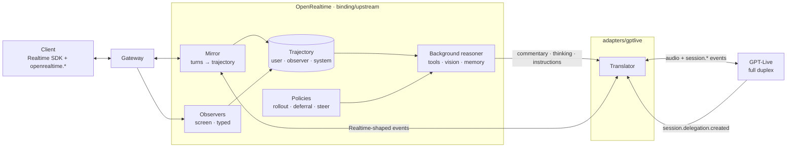

# GPT-Live on OpenRealtime

An analysis of OpenAI's GPT-Live API as an integration target: how it differs
from the Realtime API in shape rather than in detail, why OpenRealtime's
`upstream` binding fits it more naturally than it fits Realtime, how the
integration is built, and what the real endpoint turned out to do that its
specification does not say. It is written for someone deciding whether to put
a product behind GPT-Live and for someone maintaining this integration; it
does not repeat the vendor's documentation, which is linked where it matters.

Everything measured here was measured against the real endpoint with the code
in this repository. Where a claim rests only on the specification and a fake
built from it, the text says so.

## 1. The two APIs are different shapes, not versions

It is tempting to read GPT-Live as Realtime with new event names. The
migration guide's rename table encourages that reading, and it is wrong in the
way that matters. The Realtime API is **one model** that hears, reasons, calls
tools, and speaks, driven by a **turn loop**: the client commits an input
buffer, requests a response, and the server produces one response with a
beginning and an end. GPT-Live is **two parts by design**: a voice layer that
listens and speaks at the same time and decides *when* to ask for help, and a
backend that does the reasoning and tool use. The seam between them is called
delegation. There is no turn loop, and - the fact that shapes every design
decision below - **no event marks the end of anything**.

| | Realtime API (`v1/realtime`) | GPT-Live (`v1/live/sessions`) |
| --- | --- | --- |
| Model of computation | One model: perception, reasoning, tools, voice | Voice layer + a backend it delegates to |
| Duplex | Half: the model speaks or listens | Full: listens while speaking |
| Turn control | `input_audio_buffer.commit`, `response.create`, VAD config | None. Audio streams continuously; the model decides when to speak |
| End of a spoken response | `response.output_audio.done`, `response.done` | **No equivalent event** |
| Transcripts | Per item, with item ids and a `completed` event | Fragments with `start_ms`/`end_ms`; explicitly "do not define complete turns" |
| Reasoning | The model's own | Delegated: `session.delegation.created` carries an id and an offset, **not the task** |
| Tools | The model calls them; the client returns results as items | Only through a delegated Responses backend; in client delegation there are no tool events on the wire at all |
| Text input | Structured content parts in `conversation.item.create` | Three append channels, plain strings, 500 tokens each; typed values are meant for the backend |
| Vision | Images as content parts | None. "The Live audio frontend does not accept images directly." |
| Session mutation | `session.update` for most fields | Model, instruction, voice, format, delegation fixed at start; appends only, never overwrite |
| Audio | PCM16 24 kHz (or G.711); per-response bursts | PCM16 24/16 kHz or G.711 8 kHz; output is a **continuous carrier** |
| Billing | Tokens | Voice by the second (`$0.05/min`), backend separately |
| Event count | ~66 wire names | 32: 11 client + 21 server, all handled here |

The clearest single illustration is what each does when there is nothing to
say. Realtime is silent. GPT-Live sends a 100 ms frame of digital silence
every 100 ms for the life of the session - in one measured 45-second session,
427 of 438 output frames were silence. That is not a quirk; it is what a
full-duplex audio track *is*, and any integration that treats output audio as
"the assistant is speaking" will get it wrong.

## 2. Why the `upstream` binding fits GPT-Live better than it fits Realtime

OpenRealtime's `upstream` binding puts a remote voice behind the engine's
background reasoner. It mirrors the remote's conversation into the shared
trajectory, runs the reasoner over it, and hands answers back for the remote to
say. On a Realtime endpoint that is a graft: the remote is a complete agent
that would rather answer by itself, and the binding's whole arrangement - never
giving the remote tool authority, reasoning alongside it - is a discipline
imposed on a model that did not ask for it.

On GPT-Live it is the arrangement the vendor documents. GPT-Live does not
reason; it delegates. With `delegation.type: "client"` it asks *this process*
for help and keeps talking while it waits. OpenRealtime's reasoner is not
bolted to the side of the voice; it is the backend the voice was built to call.

Two correspondences make the integration small.

**A delegation is an escalation.** The interaction layer already has
`Cause.Escalated`, whose comment reads: *"set when the fast turn handed the
work on… It is why slow does not run on every observation."* That is
`session.delegation.created`, word for word. GPT-Live is the fast turn;
delegating is handing the work on. So the reasoner runs on a delegation through
the signal the rollout already understands, and no new policy was written.

**The trajectory's three authorities are GPT-Live's three push channels.**
OpenRealtime labels every item by what its text is *permitted to do*, and the
vendor draws the same line at the wire, for the same reason: text that came
from the world must never be promoted to a command.

| Trajectory authority | GPT-Live channel | What the voice does with it |
| --- | --- | --- |
| `user` → the reasoner's answer | `session.commentary.append`, against the open delegation | Says it, paraphrased |
| `observer` — a screen, a typed field, a client's system message | `session.thinking.append`, `delegation_id: null` | Knows it; does not announce it |
| `system` — a guardrail, a standing instruction, a stop | `session.instructions.append`, `delegation_id: null` | Changes behaviour; can interrupt speech |

Routing by authority keeps that guarantee end to end with no second policy. It
also answers the question a form-filling agent raises immediately - *how does
the voice learn that the user typed into a field, if that is not a delegation
and not an answer?* - with the vendor's own mechanism: an unsolicited
`thinking` append built from application state, with no model call.

## 3. Architecture



The client never learns which vendor is behind the voice; it speaks the
Realtime protocol and the OpenRealtime extensions as before. GPT-Live *pulls*
help through a delegation and OpenRealtime *pushes* answers, evidence, and
steering through the three append channels. Both ride the same Realtime-shaped
contract between the binding and the translator that Gemini Live already uses,
which is what keeps this one runtime, one mirror, and one policy set rather
than a second binding.

### 3.1 The translator (`adapters/gptlive`)

The translator presents GPT-Live as a Realtime endpoint. Its job divides into
four parts, three of which exist because of a real-endpoint finding.

**Handshake.** Everything that matters about a Live session is fixed in
`session.start` and settable nowhere else, so the handshake is deferred until
the caller's first `session.update` arrives, and traffic before `session.started`
is held rather than dropped - the vendor forbids sending before it. A later
`session.update` is reduced to what changed; a change that does not fit the
500-token append cap is refused with an error the client sees.

**The frame clock.** A Live session runs on a real-time audio clock. With no
input frames arriving it accepts an append, never injects it, never
acknowledges it, never speaks, and reports no error. A hand-off sent into a
silent session produced nothing for seventy-five seconds; the same hand-off
sent while silence was streaming was spoken in about a second. A caller
speaking the Realtime protocol stops sending audio whenever the user is quiet,
so the translator fills the gaps itself - one frame of silence per interval
the caller supplied nothing - as a gap filler, never as padding.

**The carrier.** Output audio is a continuous track. Only *audible* frames
extend an utterance; silent ones are forwarded while an utterance is open
(they are the pause between two words) and dropped outside one (they would
report an assistant that never stops speaking). Without this the utterance gap
was re-armed ten times a second and no assistant turn ever ended.

**Turn synthesis.** The mirror needs turns; the protocol has none. Two signals
close a user turn, and the difference between them is the honest part:
`session.delegation.created` is the endpoint's own judgement that the request
is complete, and it arrives exactly when the reasoner should start; silence
after the last fragment is the fallback, for turns the voice handles by itself,
so the reasoner is never later asked to continue a conversation with holes in
it. The gap is a guess, is configurable, and never preempts a delegation.

### 3.2 The binding (`binding/upstream`)

The binding's behaviours are decided by dialect, not by probing the connection.

| Behaviour | Realtime endpoints | GPT-Live |
| --- | --- | --- |
| When the reasoner runs | Every user turn | On a delegation (`-upstream-delegation-gating auto`), plus typed input, which the voice never sees |
| The spoken hand-off | `conversation.item.create` + `response.create` | Same pair; the translator turns it into a commentary append against the open delegation |
| The silent hand-off | `conversation.item.create` alone | `session.thinking.append` |
| Steering, cancel | `conversation.item.create` role system; `response.cancel` | `session.instructions.append`; cancel becomes an instruction to stop |
| Typed text | Forwarded as an item (and now also committed) | Committed for the reasoner; the voice is told the user typed |
| Images | Dropped | Retained for a vision-capable reasoner; never to the voice |
| Video | Unsupported | This side's observer narrates; narration is pushed as thinking |
| `ManualTurns` | Forwarded | Refused: there is no commit to drive |
| Timeline | Arrival time | The vendor's `end_ms`, translated onto this side's clock |
| Idle | None | Closed after 15 minutes without user speech, because the frame clock keeps the meter running |

Three consequences are worth stating plainly. The reasoner no longer answers
"hello" on GPT-Live - the voice did, and a second answer is a second voice
with a bill attached. Evidence reaches the voice with no model call, which is
both cheaper and lower-latency than asking the reasoner to summarise a state
the application already holds. And typed input was never reaching the
trajectory on *any* upstream endpoint - it was forwarded and assumed echoed,
and no endpoint echoes - which this work fixed for all of them.

### 3.3 The internal contract

The translator keeps speaking the Realtime protocol to the binding. Three
OpenRealtime-internal events cover what the base protocol cannot say; no
Realtime endpoint ever sees them, because the binding translates them itself
before an ordinary client, and only a translator receives them by name.

| Binding sends | GPT-Live receives | Realtime endpoint receives |
| --- | --- | --- |
| `session.update` (first) | `session.start` — model, instruction, voice, format, `delegation: client` | `session.update` |
| `input_audio_buffer.append` | `session.input_audio.append`; the caller's audio is the clock | unchanged |
| `conversation.item.create` + `response.create` | `session.commentary.append` against the open delegation, split at the cap | unchanged |
| `openrealtime.upstream.context` | `session.thinking.append` | `conversation.item.create`, no response |
| `openrealtime.upstream.steer` | `session.instructions.append` | `conversation.item.create` role system |
| `openrealtime.upstream.mute` | `session.input_audio.mute` / `unmute` | dropped |
| `response.cancel` | `session.instructions.append` "stop" | unchanged |
| `input_audio_buffer.commit`, `conversation.item.truncate` | dropped — no turn loop exists | unchanged |

| GPT-Live sends | Binding receives | Mirror does |
| --- | --- | --- |
| `session.started` | `session.created` | records the vendor's id, expiry, and the epoch of its timeline |
| `session.input_transcript.delta` | `…input_audio_transcription.delta`, then `speech_started`/`speech_stopped`/`…completed` at the boundary | captions; commits the turn; runs standing-instruction extraction |
| `session.output_transcript.delta`, audible audio | `…output_audio_transcript.delta`, `…output_audio.delta`, then `…done` + `response.done` after the gap | forwards; commits the utterance as evidence |
| `session.delegation.created` | `openrealtime.upstream.delegation` | submits `SignalEscalated`; opens the delegation |
| `session.usage.updated` | `openrealtime.upstream.usage` | `Status().Remote`, debug, the context-ratio throttle |
| `*.appended`, `muted`, `unmuted`, `updated` | `openrealtime.upstream.ack` | debug — the only proof an append was injected |
| `error` | `error`, after committing any open utterance | reports it; a refused `store` restarts the session unstored |
| `session.closed` | stream ends; a reason other than `close_requested` is an error | session record |

## 4. What the real endpoint taught us

Every one of these was invisible in the specification and found only by
running the code against the vendor. Each is now a test.

1. **Nothing happens without frame progress.** Described above. The
   translator's frame clock exists because of it.
2. **Output is a carrier.** 427 of 438 frames silent. The utterance gap is
   driven by audible audio only.
3. **The delegation round trip works end to end.** A spoken request synthesised
   through the vendor's speech API, streamed at microphone pace:

   ```text
   transcript   "Hi there. Could you check the status of my order number 4217"
   delegation   item_ENF83gCZI0WJMh5xH6iSo  target=client  offset_ms=7600
   hand-off     acknowledged as session.commentary.appended
   the voice    "Sure. Checking that right now. Alright, order 4217 shipped
                 yesterday, and it's due to arrive tomorrow before noon."
   ```

   Note the first sentence: the voice acknowledged and kept the floor *before*
   the answer arrived. That is full duplex doing what it is for.
4. **Cancel interrupts.** An instruction to stop cut a long answer at "Here is
   the full" and was acknowledged; `response.done` followed.
5. **All four channels are acknowledged**, with `start_ms`/`end_ms` on the
   acknowledgement describing where in the timeline the injection landed.
6. **The vendor hangs up after finalising.** `session.closed` is followed by
   the socket closing; a close handshake against a gone peer fails, and that is
   not a failed close.
7. **A µ-law session works.** Opened in G.711 at 8 kHz, a hand-off was spoken
   and 33 frames of audio expanded to audible PCM (peak 10 876).
8. **Storage is a project setting.** `session_storage_not_allowed: "Stored
   sessions require a project that permits data persistence."` refuses the
   *whole* session start, not just the flag. The translator now restarts the
   session unstored and reports `storage_refused`, so a deployment that asks
   for storage on a project without persistence gets a working session rather
   than none.
9. **The sideband is not for WebSocket primaries.** Attaching to a session
   whose primary connection is a WebSocket returns 404. The vendor offers the
   sideband for WebRTC and SIP sessions, whose primary is elsewhere.
10. **Usage arrives roughly every ten seconds**, which is the only regular
    heartbeat the endpoint sends and is what the stall watchdog counts.

## 4a. What a second live agent found

Section 4 lists what a one-shot live test could reach. It could not reach
interruption, because interruption needs somebody to interrupt: a recorded
conversation that talks over the agent mid-sentence. The project already had
that - `bench/fdb`, Full-Duplex-Bench v1.5, 498 recordings in four categories -
and because the harness drives a *running server over the Realtime protocol*,
it needed no new machinery to point at GPT-Live. It streams 20 ms frames paced
to wall clock, which is what a full-duplex endpoint must be given.

One recording (`user_interruption/1`: the caller asks how to save money, the
agent begins answering, the caller cuts in with "Actually, what are some
financial goals I should set?") found a defect no code review had:

| configuration | yield latency | passes |
| --- | --- | --- |
| as first shipped | 16 430 ms | no |
| stream corruption fixed, nothing else | **2 817 ms** | no |
| plus relay-side barge-in override | **260 ms** | yes |

**The 16 seconds was this side's fault.** The frame clock that keeps a Live
session advancing through a caller's pauses asked, every 20 ms, "did anything
arrive since my last tick?" A caller streaming its own 20 ms frames runs a
clock that drifts against this one, so the answer was sometimes "no" in the
middle of a sentence - and silence was cut into the user's speech. What
reached the endpoint was chopped and stretched past real time. A model that
handles interruption natively cannot hear an interruption in that. Filling
only gaps genuinely longer than a streaming caller's jitter removed it, and the
model's own yield improved 5.8× with nothing else helping.

What remains is a real property, not a defect: GPT-Live takes about 2.8 s to
stop, and Full-Duplex-Bench allows one. A deployment that must hold that bound
can turn on `-upstream-barge-in on`, which acts where the model cannot - the
instruction channel stops the model, slowly, while holding the audio at this
relay stops what the person hears at once, which is where the vendor says to
block output. It is off by default: taking the decision away from a model that
is good at it is a choice to make deliberately, not one to inherit.

The lesson generalises past this endpoint. A one-shot test - speak once, check
the transcript - cannot see any of this. Testing a live agent needs another
live agent.

## 5. Turn boundaries, honestly

The weakest part of any GPT-Live integration is deciding where a turn ends,
because the protocol declines to. This integration's position:

- A **delegation** ends a user turn with the endpoint's own judgement. Every
  delegated turn is bounded correctly and starts the reasoner at the right
  moment. Under the delegation-gated rollout, this is the only boundary that
  decides when the reasoner runs.
- **Silence** ends the turns the voice handled alone, so the trajectory is
  complete. The default gap is 900 ms after the last fragment. It can split a
  slow sentence into two mirrored observations, and the reasoner - which reads
  the whole trajectory when asked - tolerates that far better than a gap short
  enough to be right about pauses.
- The **assistant's utterance** ends 1.2 s after the last audible frame. The
  transcript alone would end it too early: the samples that speak the end of a
  sentence are still arriving after the words are reported.

User and assistant intervals overlap under full duplex, and the duplex state
tracks both independently. The vendor's timeline milliseconds are carried onto
each observation's source time, so latency evidence on this binding measures
the vendor's clock rather than arrival - the research record here already
found another provider's timestamps leading their audio by up to 1.46 s.

## 6. What the pair can do that the voice cannot

GPT-Live has no vision, no tools, and treats typed values as backend data. The
pair - GPT-Live plus OpenRealtime - has all three:

- **Vision.** A screen frame goes to OpenRealtime's own narrator, never to the
  voice; the narration is pushed as thinking. The voice "sees" through a text
  it is told, which is exactly the vendor's recommended architecture.
- **Tools.** The reasoner calls them, with the same proposal-versus-execute
  boundary every OpenRealtime binding holds. In client delegation the wire
  carries no tool events at all; the voice is never given authority it cannot
  have.
- **Typed input and images.** Committed to the trajectory for the reasoner;
  the voice is told the user typed and is otherwise left to the audio.

The trajectory, not the voice's context window, is the source of truth.
GPT-Live compacts its own context at 90% and may drop older detail; the
binding suppresses context pushes past that point and keeps everything
locally, which is the vendor's own advice.

## 7. Verification

The order was fake first, then the vendor, then break the checks. The fake is
built from the specification and proves the code does what the specification
was read to say; the vendor run found the ten facts in §4; the mutation sweep
- deliberately breaking each behaviour and confirming a test fails - found
three tests in the first draft that could not fail, and was repeated for every
phase (35 mutations, 35 caught).

| Verified against the real endpoint | Verified against the fake only, and why |
| --- | --- |
| Handshake, frame clock, carrier handling, turn synthesis | Fork-on-drop and explicit fork — the project refuses storage |
| Interruption, through Full-Duplex-Bench (§4a) | — |
| Delegation round trip with synthesised speech | Recording download — same |
| All four push channels acknowledged | Sideband attach — offered only to WebRTC/SIP sessions |
| Cancel interrupts; close finalised; usage heartbeat | Telephony `transport.*` events — no SIP leg here |
| G.711 µ-law session speaks | A-law (same code path; µ-law proved live) |

The real-endpoint suite is `adapters/gptlive/live_e2e_test.go`. It runs only
with `OPENREALTIME_LIVE_E2E=1` and a credential, costs a few cents, and skips
with the vendor's reason where this project cannot go. The offline gate stays
offline.

```sh
OPENREALTIME_LIVE_E2E=1 OPENAI_API_KEY=... go test ./adapters/gptlive/ -run Live -v
openrealtime providers -role upstream -probe openai-live

# A second live agent, talking over the first. Needs the dataset
# (scripts/prepare-fdb15.sh) and a server running on this endpoint.
openrealtime serve -binding upstream -upstream-provider openai-live -slow-provider google
openrealtime bench fdb -endpoint ws://127.0.0.1:8765/v1/realtime -categories user_interruption
```

## 8. Operating it

```sh
openrealtime serve -binding upstream -upstream-provider openai-live -slow-provider google
```

| Flag | Meaning | Default |
| --- | --- | --- |
| `-upstream-delegation-gating` | `auto` runs the reasoner on delegations only, on GPT-Live; `on`/`off` force it | `auto` |
| `-upstream-idle-timeout` | close a session with no user speech, since the frame clock keeps billing alive | 15 m on GPT-Live |
| `-upstream-greeting` | an instruction sent once the session starts, for a voice that speaks first | none |
| `-upstream-audio-format` | `pcm`, `pcmu`, `pcma`; the G.711 laws are for a telephone leg | `pcm` |
| `-upstream-store` | ask for a resumable recording; refused starts degrade to unstored | off |
| `-upstream-max-sessions` | refuse the tier's n+1th session here | unbounded |
| `-observers video` | run the screen narrator behind the voice | off |

What a client sees: an ordinary Realtime session, with `video.input` and
`observations` negotiated when an observer is configured and `ManualTurns`
absent. `Status().Remote` carries the vendor's session id, expiry, billed
seconds, context ratio, and the open delegation; the debug stream carries every
acknowledgement, usage snapshot, delegation, reconnect, and transport event.

The cost model follows the vendor's: voice by the second whether or not anyone
speaks, backend only when the voice delegates. The idle timeout is the
safeguard the first half makes necessary.

## 9. Limits and non-goals

- **Responses delegation is supported but not the point.** The binding's
  reasoner is the backend, and that is what client delegation is for; naming a
  Responses model (`ResponsesModel`) hands the backend job to the vendor's
  managed loop instead, with OpenRealtime still mirroring the conversation,
  running observers, and holding the floor. The two are exclusive and fixed at
  session start. It exists because it is half the endpoint's surface: without
  it `response.item.create` and `response.event` would be unreachable, and the
  integration would cover 30 of 32 events rather than all of them.
- **The engine cannot own the floor.** GPT-Live has no commit and no detector
  to switch off; `-floor engine` is refused with a message rather than accepted
  and ignored.
- **Commentary is paraphrased.** Identifiers in a handed-off answer may be
  altered in speech. The spelled-identifier benchmark cases should be run on
  this binding before any claim about them; the research record here already
  names spelling reassembly as its own failure mode.
- **Append-only context.** Nothing can be retracted at the vendor. Pushes are
  written as state transitions, secrets never enter any channel, and the
  trajectory keeps the truth.
- **Two topologies are designed and not run.** A browser talking to the
  endpoint directly over WebRTC with OpenRealtime attached as a sideband would
  lower voice latency and remove this process from the audio path; a telephone
  call the vendor answers over SIP would reach here the same way. Both need the
  sideband, which this environment cannot exercise.

## 10. Where the code is

| What | Where |
| --- | --- |
| Translator: handshake, frame clock, carrier, turns, appends, fork, sideband, recording | `adapters/gptlive/` |
| Binding: gating, silent hand-off, typed text, video, steering, timeline, cap, idle | `binding/upstream/` |
| Catalogue entry and dialect | `providers/upstream.go` |
| G.711 codec | `pcm/g711.go` |
| Flags | `cmd/openrealtime/serve.go` |
| Binding guide | [bindings/upstream.md](bindings/upstream.md#behind-gpt-live) |
| Provider catalogue | [providers.md](providers.md#gpt-live) |
